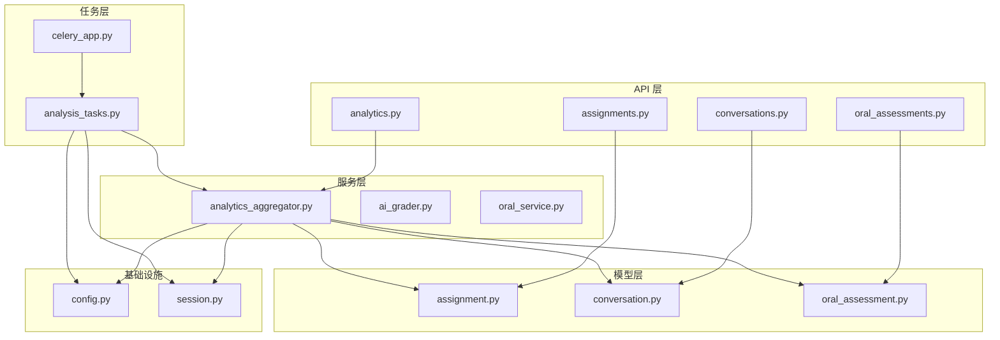
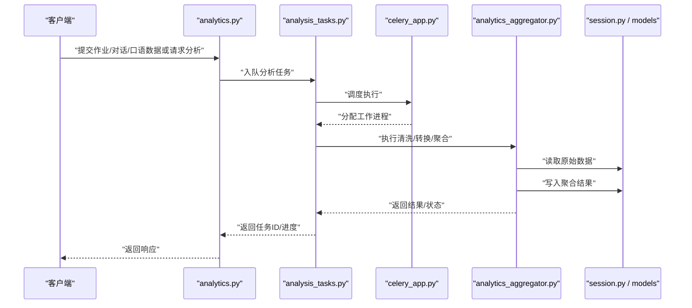
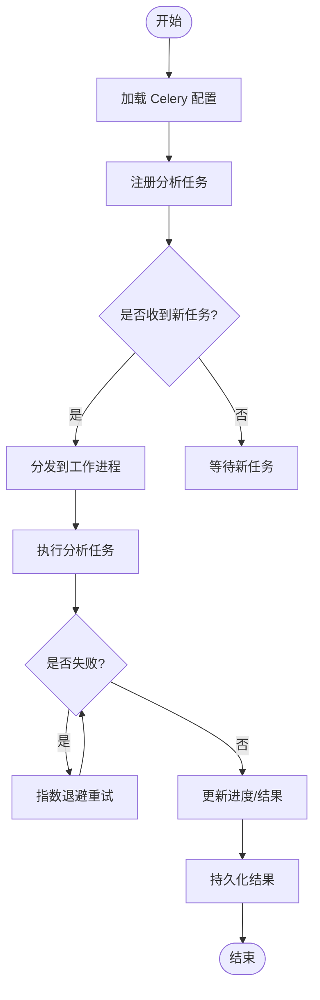
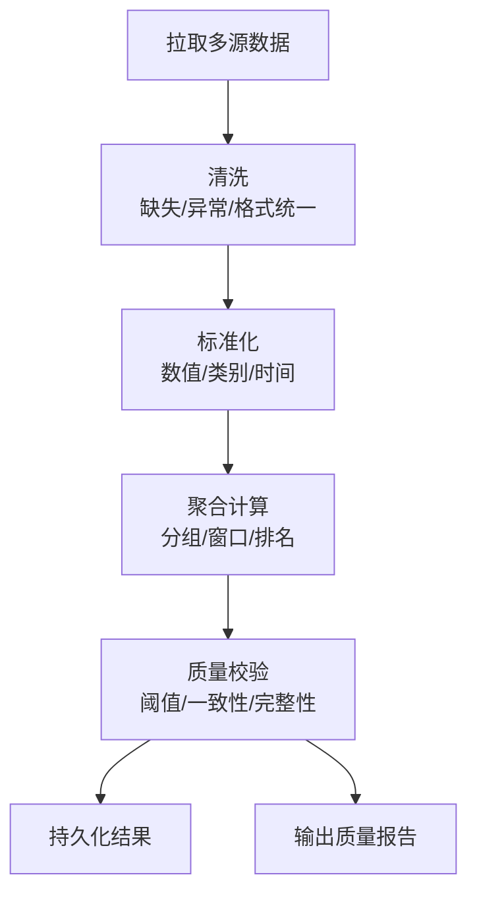
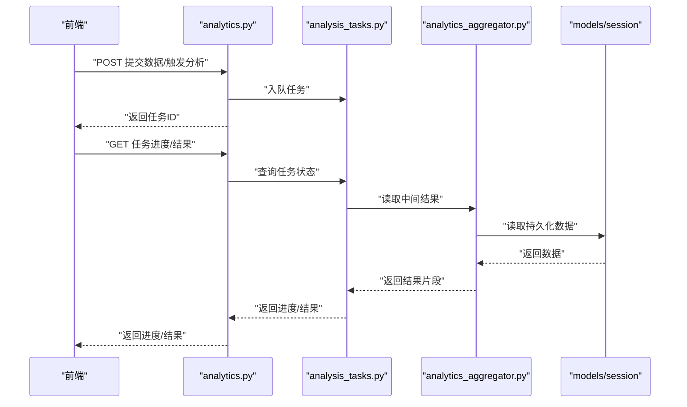
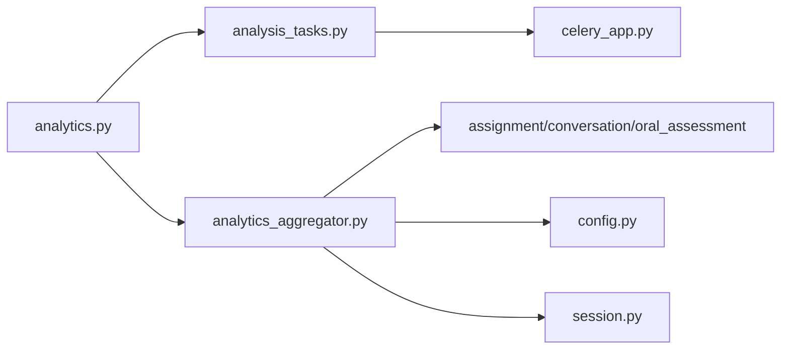
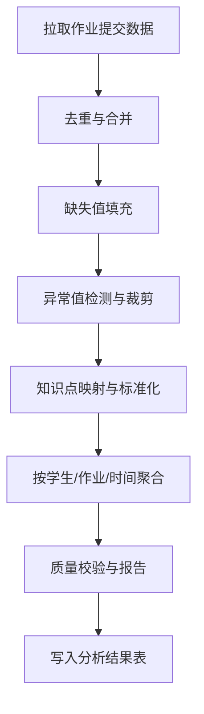

# 数据采集与处理

<cite>
**本文引用的文件**   
- [backend/app/tasks/celery_app.py](file://backend/app/tasks/celery_app.py)
- [backend/app/tasks/analysis_tasks.py](file://backend/app/tasks/analysis_tasks.py)
- [backend/app/services/analytics_aggregator.py](file://backend/app/services/analytics_aggregator.py)
- [backend/app/api/v1/analytics.py](file://backend/app/api/v1/analytics.py)
- [backend/app/models/assignment.py](file://backend/app/models/assignment.py)
- [backend/app/models/conversation.py](file://backend/app/models/conversation.py)
- [backend/app/models/oral_assessment.py](file://backend/app/models/oral_assessment.py)
- [backend/app/schemas/analytics.py](file://backend/app/schemas/analytics.py)
- [backend/app/core/config.py](file://backend/app/core/config.py)
- [backend/app/db/session.py](file://backend/app/db/session.py)
</cite>

## 目录
1. [简介](#简介)
2. [项目结构](#项目结构)
3. [核心组件](#核心组件)
4. [架构总览](#架构总览)
5. [详细组件分析](#详细组件分析)
6. [依赖关系分析](#依赖关系分析)
7. [性能考虑](#性能考虑)
8. [故障排查指南](#故障排查指南)
9. [结论](#结论)
10. [附录](#附录)

## 简介
本文件面向学习分析平台的数据采集与处理模块，聚焦以下目标：
- 多源数据（作业提交、AI对话记录、口语评估结果等）的采集策略与接入点
- 数据清洗、转换与聚合流程，包括异常值处理与标准化
- 异步任务队列中的数据分析实现（Celery 调度、错误重试、进度跟踪）
- 数据存储策略与索引优化方案
- 数据质量监控与验证机制
- 性能优化建议与大数据量处理最佳实践

## 项目结构
后端围绕 FastAPI 接口、领域模型、服务层与 Celery 异步任务组织。与数据采集与处理相关的关键路径如下：
- API 层：提供作业、对话、口语评估与分析查询接口
- 模型层：定义作业、对话、口语评估等实体
- 服务层：聚合分析、评分、知识追踪等
- 任务层：Celery 应用与数据分析任务
- 配置与数据库会话：统一配置与连接管理

图表来源
- [backend/app/api/v1/analytics.py](file://backend/app/api/v1/analytics.py)
- [backend/app/services/analytics_aggregator.py](file://backend/app/services/analytics_aggregator.py)
- [backend/app/tasks/celery_app.py](file://backend/app/tasks/celery_app.py)
- [backend/app/tasks/analysis_tasks.py](file://backend/app/tasks/analysis_tasks.py)
- [backend/app/models/assignment.py](file://backend/app/models/assignment.py)
- [backend/app/models/conversation.py](file://backend/app/models/conversation.py)
- [backend/app/models/oral_assessment.py](file://backend/app/models/oral_assessment.py)
- [backend/app/core/config.py](file://backend/app/core/config.py)
- [backend/app/db/session.py](file://backend/app/db/session.py)

章节来源
- [backend/app/api/v1/analytics.py](file://backend/app/api/v1/analytics.py)
- [backend/app/services/analytics_aggregator.py](file://backend/app/services/analytics_aggregator.py)
- [backend/app/tasks/celery_app.py](file://backend/app/tasks/celery_app.py)
- [backend/app/tasks/analysis_tasks.py](file://backend/app/tasks/analysis_tasks.py)
- [backend/app/models/assignment.py](file://backend/app/models/assignment.py)
- [backend/app/models/conversation.py](file://backend/app/models/conversation.py)
- [backend/app/models/oral_assessment.py](file://backend/app/models/oral_assessment.py)
- [backend/app/core/config.py](file://backend/app/core/config.py)
- [backend/app/db/session.py](file://backend/app/db/session.py)

## 核心组件
- 异步任务入口与调度
  - Celery 应用初始化与基础配置
  - 数据分析任务的注册与执行
- 数据分析服务
  - 多源数据聚合（作业、对话、口语评估）
  - 清洗、转换、聚合逻辑
- API 接口
  - 触发分析任务、查询分析结果
- 数据模型
  - 作业提交、对话记录、口语评估等实体定义
- 配置与会话
  - 统一配置项、数据库会话管理

章节来源
- [backend/app/tasks/celery_app.py](file://backend/app/tasks/celery_app.py)
- [backend/app/tasks/analysis_tasks.py](file://backend/app/tasks/analysis_tasks.py)
- [backend/app/services/analytics_aggregator.py](file://backend/app/services/analytics_aggregator.py)
- [backend/app/api/v1/analytics.py](file://backend/app/api/v1/analytics.py)
- [backend/app/models/assignment.py](file://backend/app/models/assignment.py)
- [backend/app/models/conversation.py](file://backend/app/models/conversation.py)
- [backend/app/models/oral_assessment.py](file://backend/app/models/oral_assessment.py)
- [backend/app/core/config.py](file://backend/app/core/config.py)
- [backend/app/db/session.py](file://backend/app/db/session.py)

## 架构总览
整体采用“API 触发 + 异步任务 + 服务聚合 + 持久化”的分层架构。前端或上游系统通过 API 提交数据或触发分析；分析任务在 Celery 中异步执行，调用服务层完成清洗、转换与聚合，最终写入存储并返回结果或状态。

图表来源
- [backend/app/api/v1/analytics.py](file://backend/app/api/v1/analytics.py)
- [backend/app/tasks/analysis_tasks.py](file://backend/app/tasks/analysis_tasks.py)
- [backend/app/tasks/celery_app.py](file://backend/app/tasks/celery_app.py)
- [backend/app/services/analytics_aggregator.py](file://backend/app/services/analytics_aggregator.py)
- [backend/app/db/session.py](file://backend/app/db/session.py)

## 详细组件分析

### 异步任务与调度（Celery）
- 任务入口与配置
  - 初始化 Celery 应用，加载配置（如 Broker、Backend、并发参数等）
  - 注册数据分析任务，支持幂等与可重入
- 任务执行与重试
  - 对失败任务进行指数退避重试，避免瞬时故障导致数据丢失
  - 记录任务日志与中间状态，便于追踪
- 进度跟踪
  - 使用任务 ID 关联进度，供 API 轮询或 SSE 推送
  - 将阶段性结果落库，保证断点续跑与可观测性

图表来源
- [backend/app/tasks/celery_app.py](file://backend/app/tasks/celery_app.py)
- [backend/app/tasks/analysis_tasks.py](file://backend/app/tasks/analysis_tasks.py)

章节来源
- [backend/app/tasks/celery_app.py](file://backend/app/tasks/celery_app.py)
- [backend/app/tasks/analysis_tasks.py](file://backend/app/tasks/analysis_tasks.py)

### 数据分析服务（清洗、转换、聚合）
- 多源数据接入
  - 作业提交数据：按作业、学生维度聚合正确率、耗时分布、知识点掌握度
  - AI 对话记录：统计交互频次、问题类型、意图分类、用户满意度指标
  - 口语评估结果：分数归一化、维度得分聚合、趋势分析
- 数据清洗与标准化
  - 缺失值填充、异常值检测与裁剪、时间戳与时区统一、文本规范化
  - 数值型字段标准化（如 Z-score、Min-Max），类别字段编码
- 聚合计算
  - 窗口聚合（日/周/月）、分组统计（班级/年级/知识点）、排名与分位
  - 增量聚合与全量重建双模式，兼顾时效性与一致性

图表来源
- [backend/app/services/analytics_aggregator.py](file://backend/app/services/analytics_aggregator.py)
- [backend/app/models/assignment.py](file://backend/app/models/assignment.py)
- [backend/app/models/conversation.py](file://backend/app/models/conversation.py)
- [backend/app/models/oral_assessment.py](file://backend/app/models/oral_assessment.py)

章节来源
- [backend/app/services/analytics_aggregator.py](file://backend/app/services/analytics_aggregator.py)
- [backend/app/models/assignment.py](file://backend/app/models/assignment.py)
- [backend/app/models/conversation.py](file://backend/app/models/conversation.py)
- [backend/app/models/oral_assessment.py](file://backend/app/models/oral_assessment.py)

### API 接口（触发与查询）
- 触发分析任务
  - 接收作业/对话/口语数据或分析请求，入队 Celery 任务
  - 返回任务 ID，供前端轮询或事件订阅
- 查询分析结果
  - 按时间范围、维度（学生/班级/知识点）筛选
  - 分页与排序，支持导出
- 进度与状态
  - 基于任务 ID 获取阶段进度与最终结果

图表来源
- [backend/app/api/v1/analytics.py](file://backend/app/api/v1/analytics.py)
- [backend/app/tasks/analysis_tasks.py](file://backend/app/tasks/analysis_tasks.py)
- [backend/app/services/analytics_aggregator.py](file://backend/app/services/analytics_aggregator.py)
- [backend/app/db/session.py](file://backend/app/db/session.py)

章节来源
- [backend/app/api/v1/analytics.py](file://backend/app/api/v1/analytics.py)
- [backend/app/tasks/analysis_tasks.py](file://backend/app/tasks/analysis_tasks.py)
- [backend/app/services/analytics_aggregator.py](file://backend/app/services/analytics_aggregator.py)
- [backend/app/db/session.py](file://backend/app/db/session.py)

### 数据模型与存储
- 实体模型
  - 作业提交：包含题目、答案、得分、时间戳、知识点标签等
  - 对话记录：包含用户消息、AI 回复、时间戳、上下文标识等
  - 口语评估：包含音频元信息、评分维度、总分、评估时间等
- 存储策略
  - 结构化数据：关系型数据库（主键、外键、唯一约束）
  - 分析结果：宽表或物化视图，减少实时聚合开销
  - 大对象与附件：对象存储（音频、图片），数据库仅存引用
- 索引优化
  - 高频查询列建立索引（时间、学生ID、作业ID、知识点）
  - 复合索引覆盖常见过滤条件（时间+维度）
  - 分区策略：按时间分区，提升历史数据查询效率

章节来源
- [backend/app/models/assignment.py](file://backend/app/models/assignment.py)
- [backend/app/models/conversation.py](file://backend/app/models/conversation.py)
- [backend/app/models/oral_assessment.py](file://backend/app/models/oral_assessment.py)

### 配置与会话
- 配置项
  - Celery Broker/Backend、并发数、重试策略、超时与限流
  - 数据库连接池大小、超时、隔离级别
- 会话管理
  - 统一会话创建与关闭，事务边界清晰
  - 读写分离（可选）与只读副本用于分析查询

章节来源
- [backend/app/core/config.py](file://backend/app/core/config.py)
- [backend/app/db/session.py](file://backend/app/db/session.py)

## 依赖关系分析
- 组件耦合
  - API 层依赖任务层与服务层，低耦合高内聚
  - 服务层依赖模型层与配置，数据访问集中管理
  - 任务层依赖 Celery 与应用配置，具备可插拔性
- 外部依赖
  - 消息队列（Broker）与结果后端（Backend）
  - 数据库驱动与连接池
  - 对象存储（可选）

图表来源
- [backend/app/api/v1/analytics.py](file://backend/app/api/v1/analytics.py)
- [backend/app/tasks/analysis_tasks.py](file://backend/app/tasks/analysis_tasks.py)
- [backend/app/tasks/celery_app.py](file://backend/app/tasks/celery_app.py)
- [backend/app/services/analytics_aggregator.py](file://backend/app/services/analytics_aggregator.py)
- [backend/app/models/assignment.py](file://backend/app/models/assignment.py)
- [backend/app/models/conversation.py](file://backend/app/models/conversation.py)
- [backend/app/models/oral_assessment.py](file://backend/app/models/oral_assessment.py)
- [backend/app/core/config.py](file://backend/app/core/config.py)
- [backend/app/db/session.py](file://backend/app/db/session.py)

章节来源
- [backend/app/api/v1/analytics.py](file://backend/app/api/v1/analytics.py)
- [backend/app/tasks/analysis_tasks.py](file://backend/app/tasks/analysis_tasks.py)
- [backend/app/tasks/celery_app.py](file://backend/app/tasks/celery_app.py)
- [backend/app/services/analytics_aggregator.py](file://backend/app/services/analytics_aggregator.py)
- [backend/app/models/assignment.py](file://backend/app/models/assignment.py)
- [backend/app/models/conversation.py](file://backend/app/models/conversation.py)
- [backend/app/models/oral_assessment.py](file://backend/app/models/oral_assessment.py)
- [backend/app/core/config.py](file://backend/app/core/config.py)
- [backend/app/db/session.py](file://backend/app/db/session.py)

## 性能考虑
- 批量与分页
  - 大批量写入采用批量插入与事务合并，减少 IO 次数
  - 查询分页与游标分页结合，避免深分页性能问题
- 索引与查询优化
  - 针对热点查询构建复合索引，定期分析慢查询
  - 使用覆盖索引减少回表
- 缓存与预计算
  - 热点指标缓存（Redis），设置合理过期策略
  - 预计算常用聚合结果，定时刷新
- 异步与并行
  - 分析任务拆分子任务并行执行，降低端到端延迟
  - 控制并发度，避免资源争用
- 存储分层
  - 热数据放内存/近线存储，冷数据归档至低成本存储
  - 对象存储承载多媒体，数据库仅保留元数据

[本节为通用指导，不直接分析具体文件]

## 故障排查指南
- 任务失败与重试
  - 检查 Celery Worker 日志与 Broker/Backend 连通性
  - 确认重试策略与最大重试次数，避免无限重试
- 数据质量问题
  - 核对清洗规则与阈值，定位异常值来源
  - 对比前后版本聚合口径，确保一致性
- 性能瓶颈
  - 查看数据库慢查询与锁等待，优化 SQL 与索引
  - 监控 CPU/内存/IO，调整并发与批大小
- 进度与状态
  - 通过任务 ID 查询中间状态，定位卡住的任务阶段
  - 必要时重启 Worker 或清理死锁任务

章节来源
- [backend/app/tasks/celery_app.py](file://backend/app/tasks/celery_app.py)
- [backend/app/tasks/analysis_tasks.py](file://backend/app/tasks/analysis_tasks.py)
- [backend/app/services/analytics_aggregator.py](file://backend/app/services/analytics_aggregator.py)
- [backend/app/db/session.py](file://backend/app/db/session.py)

## 结论
本模块以 Celery 异步任务为核心，串联 API 触发、服务聚合与持久化存储，形成稳定可扩展的数据采集与处理链路。通过严格的清洗、标准化与质量校验，保障分析结果的准确性与一致性；借助索引优化、缓存与预计算，满足大规模数据的时效性与吞吐要求。后续可在数据血缘、可观测性与自动化回归方面持续增强。

[本节为总结性内容，不直接分析具体文件]

## 附录

### 数据质量监控与验证机制
- 输入校验
  - 必填字段、类型与范围校验，拒绝非法数据
  - 语义校验（如时间顺序、关联外键存在性）
- 过程校验
  - 清洗前后数据量对比、空值比例、异常值占比
  - 聚合结果合理性检查（如总分不超过上限）
- 输出校验
  - 与基准数据比对，误差阈值告警
  - 周期性抽样人工复核
- 告警与报表
  - 关键指标阈值告警（延迟、失败率、数据缺口）
  - 生成质量报告，纳入发布门禁

章节来源
- [backend/app/services/analytics_aggregator.py](file://backend/app/services/analytics_aggregator.py)
- [backend/app/schemas/analytics.py](file://backend/app/schemas/analytics.py)

### 示例：作业提交数据聚合流程

图表来源
- [backend/app/services/analytics_aggregator.py](file://backend/app/services/analytics_aggregator.py)
- [backend/app/models/assignment.py](file://backend/app/models/assignment.py)