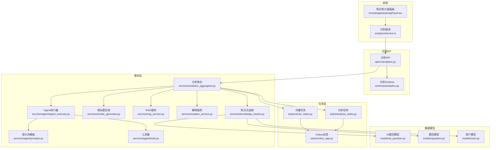
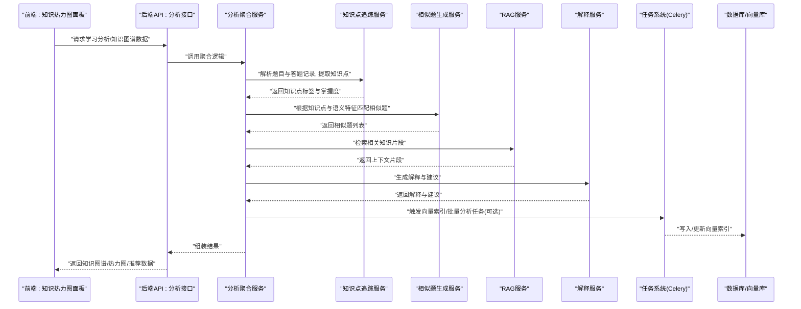
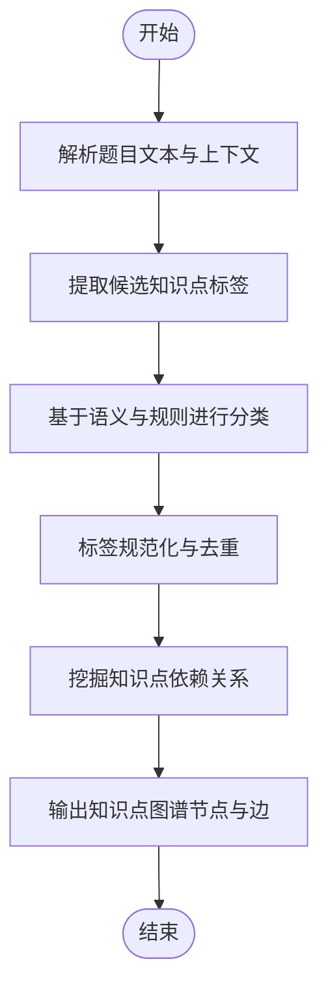
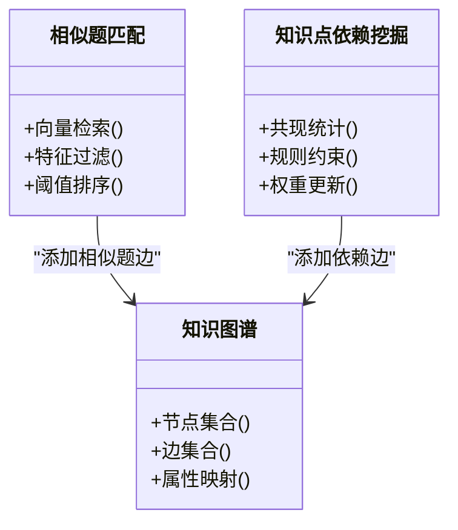
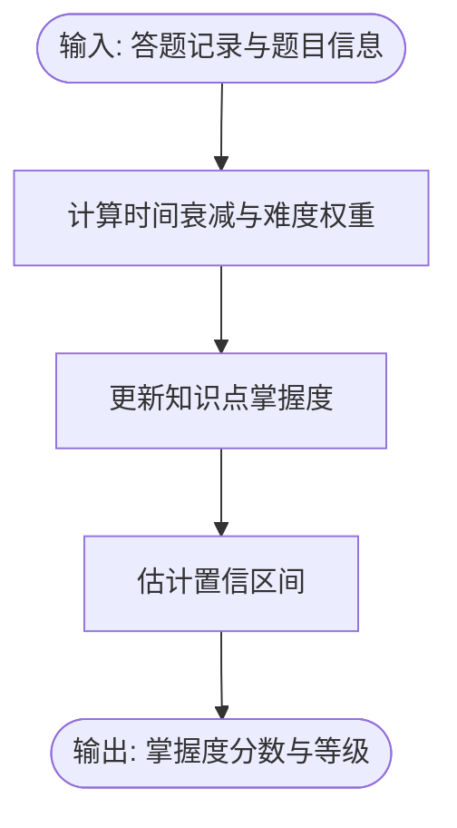
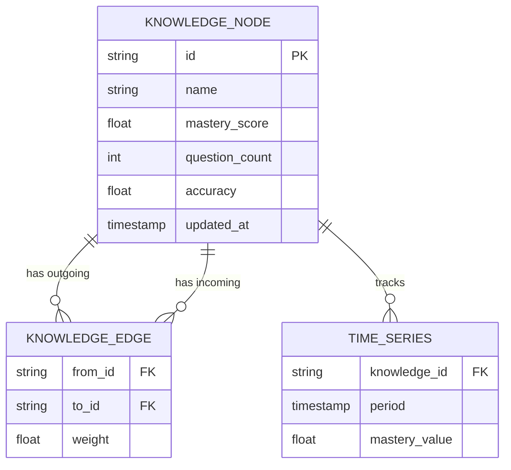
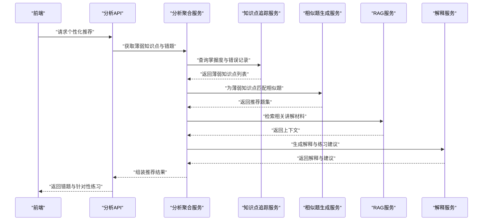
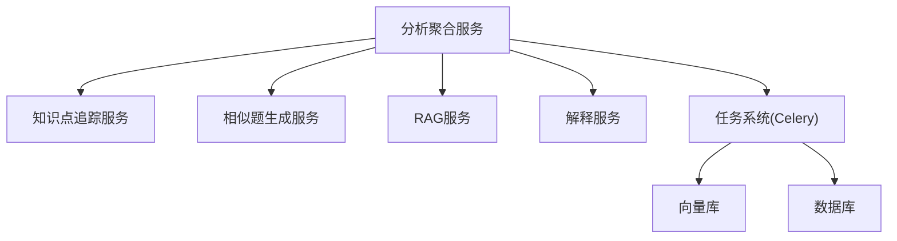

# 知识图谱构建

<cite>
**本文引用的文件**   
- [knowledge_tracker.py](file://backend/app/services/knowledge_tracker.py)
- [similar_generator.py](file://backend/app/services/similar_generator.py)
- [analytics_aggregator.py](file://backend/app/services/analytics_aggregator.py)
- [analytics.py](file://backend/app/api/v1/analytics.py)
- [analytics.py](file://backend/app/schemas/analytics.py)
- [vector_tasks.py](file://backend/app/tasks/vector_tasks.py)
- [analysis_tasks.py](file://backend/app/tasks/analysis_tasks.py)
- [celery_app.py](file://backend/app/tasks/celery_app.py)
- [ai_question.py](file://backend/app/models/ai_question.py)
- [question.py](file://backend/app/models/question.py)
- [user.py](file://backend/app/models/user.py)
- [rag_service.py](file://backend/app/services/rag_service.py)
- [explain_service.py](file://backend/app/services/explain_service.py)
- [agent_executor.py](file://backend/app/services/agent/agent_executor.py)
- [prompts.py](file://backend/app/services/agent/prompts.py)
- [tools.py](file://backend/app/services/agent/tools.py)
- [KnowledgeHeatmapPanel.tsx](file://frontend/src/pages/LearningAnalytics/KnowledgeHeatmapPanel.tsx)
- [analyticsService.ts](file://frontend/src/services/analyticsService.ts)
</cite>

## 目录
1. [简介](#简介)
2. [项目结构](#项目结构)
3. [核心组件](#核心组件)
4. [架构总览](#架构总览)
5. [详细组件分析](#详细组件分析)
6. [依赖关系分析](#依赖关系分析)
7. [性能考虑](#性能考虑)
8. [故障排查指南](#故障排查指南)
9. [结论](#结论)
10. [附录](#附录)

## 简介
本文件面向学习分析平台的知识图谱构建模块，系统性说明知识点识别与分类、知识关联建立、掌握度计算模型、知识热力图生成与可视化数据结构、个性化推荐（错题推送与针对性练习）机制，以及知识图谱扩展与自定义知识体系的配置方法。文档同时给出算法效果评估与优化策略建议，帮助读者从整体到细节理解并落地实现。

## 项目结构
围绕知识图谱构建，后端主要涉及：
- 服务层：知识点追踪、相似题生成、分析聚合、RAG与解释服务、Agent执行器与工具集
- 任务层：向量索引与异步分析任务
- API与Schema：对外暴露的分析接口与数据契约
- 前端：知识热力图面板与分析服务调用

图表来源
- [analytics.py](file://backend/app/api/v1/analytics.py)
- [analytics.py](file://backend/app/schemas/analytics.py)
- [knowledge_tracker.py](file://backend/app/services/knowledge_tracker.py)
- [similar_generator.py](file://backend/app/services/similar_generator.py)
- [analytics_aggregator.py](file://backend/app/services/analytics_aggregator.py)
- [rag_service.py](file://backend/app/services/rag_service.py)
- [explain_service.py](file://backend/app/services/explain_service.py)
- [agent_executor.py](file://backend/app/services/agent/agent_executor.py)
- [prompts.py](file://backend/app/services/agent/prompts.py)
- [tools.py](file://backend/app/services/agent/tools.py)
- [vector_tasks.py](file://backend/app/tasks/vector_tasks.py)
- [analysis_tasks.py](file://backend/app/tasks/analysis_tasks.py)
- [celery_app.py](file://backend/app/tasks/celery_app.py)
- [ai_question.py](file://backend/app/models/ai_question.py)
- [question.py](file://backend/app/models/question.py)
- [user.py](file://backend/app/models/user.py)
- [KnowledgeHeatmapPanel.tsx](file://frontend/src/pages/LearningAnalytics/KnowledgeHeatmapPanel.tsx)
- [analyticsService.ts](file://frontend/src/services/analyticsService.ts)

章节来源
- [analytics.py](file://backend/app/api/v1/analytics.py)
- [analytics.py](file://backend/app/schemas/analytics.py)
- [knowledge_tracker.py](file://backend/app/services/knowledge_tracker.py)
- [similar_generator.py](file://backend/app/services/similar_generator.py)
- [analytics_aggregator.py](file://backend/app/services/analytics_aggregator.py)
- [rag_service.py](file://backend/app/services/rag_service.py)
- [explain_service.py](file://backend/app/services/explain_service.py)
- [agent_executor.py](file://backend/app/services/agent/agent_executor.py)
- [prompts.py](file://backend/app/services/agent/prompts.py)
- [tools.py](file://backend/app/services/agent/tools.py)
- [vector_tasks.py](file://backend/app/tasks/vector_tasks.py)
- [analysis_tasks.py](file://backend/app/tasks/analysis_tasks.py)
- [celery_app.py](file://backend/app/tasks/celery_app.py)
- [ai_question.py](file://backend/app/models/ai_question.py)
- [question.py](file://backend/app/models/question.py)
- [user.py](file://backend/app/models/user.py)
- [KnowledgeHeatmapPanel.tsx](file://frontend/src/pages/LearningAnalytics/KnowledgeHeatmapPanel.tsx)
- [analyticsService.ts](file://frontend/src/services/analyticsService.ts)

## 核心组件
- 知识点追踪服务：负责将题目内容与用户答题记录映射到知识点，维护知识点标签与掌握度指标。
- 相似题生成服务：基于语义相似度与结构化特征进行题目匹配，支撑“举一反三”的练习推荐。
- 分析聚合服务：整合知识点追踪、相似题、RAG与解释能力，输出学习分析与知识图谱相关的数据。
- 任务系统：通过Celery异步处理向量索引与大规模分析任务，保障高并发与可扩展性。
- Agent与工具集：以提示词驱动的智能体编排，结合检索与工具调用完成复杂推理与内容生成。
- 前端可视化：知识热力图面板展示知识点掌握度分布与趋势，辅助教学决策。

章节来源
- [knowledge_tracker.py](file://backend/app/services/knowledge_tracker.py)
- [similar_generator.py](file://backend/app/services/similar_generator.py)
- [analytics_aggregator.py](file://backend/app/services/analytics_aggregator.py)
- [vector_tasks.py](file://backend/app/tasks/vector_tasks.py)
- [analysis_tasks.py](file://backend/app/tasks/analysis_tasks.py)
- [celery_app.py](file://backend/app/tasks/celery_app.py)
- [agent_executor.py](file://backend/app/services/agent/agent_executor.py)
- [prompts.py](file://backend/app/services/agent/prompts.py)
- [tools.py](file://backend/app/services/agent/tools.py)
- [KnowledgeHeatmapPanel.tsx](file://frontend/src/pages/LearningAnalytics/KnowledgeHeatmapPanel.tsx)

## 架构总览
知识图谱构建的整体流程如下：
- 输入：题目文本、答案、用户历史答题记录、领域知识体系配置
- 处理：
  - 知识点识别与分类：对题目内容进行语义分析，提取知识标签
  - 知识关联建立：相似题目匹配、知识点依赖关系挖掘
  - 掌握度计算：基于历史答题记录的加权评估
  - 向量化与索引：为题目与知识点建立向量表示，支持高效检索
  - 智能体增强：利用RAG与解释服务生成可解释的学习反馈
- 输出：知识点图谱、掌握度指标、相似题推荐、知识热力图数据

图表来源
- [analytics.py](file://backend/app/api/v1/analytics.py)
- [analytics_aggregator.py](file://backend/app/services/analytics_aggregator.py)
- [knowledge_tracker.py](file://backend/app/services/knowledge_tracker.py)
- [similar_generator.py](file://backend/app/services/similar_generator.py)
- [rag_service.py](file://backend/app/services/rag_service.py)
- [explain_service.py](file://backend/app/services/explain_service.py)
- [vector_tasks.py](file://backend/app/tasks/vector_tasks.py)
- [analysis_tasks.py](file://backend/app/tasks/analysis_tasks.py)
- [celery_app.py](file://backend/app/tasks/celery_app.py)

## 详细组件分析

### 知识点识别与分类算法
- 语义分析：对题目文本进行分词与语义表征，结合领域词典与规则抽取候选知识点。
- 标签提取：使用提示词驱动的Agent与工具集，从题目上下文中识别知识标签，并进行规范化与去重。
- 分类策略：基于向量相似度与规则阈值进行多级分类，确保细粒度与稳定性。
- 依赖关系挖掘：依据知识点共现与题型结构推断依赖边，形成有向无环图或层次化结构。

图表来源
- [knowledge_tracker.py](file://backend/app/services/knowledge_tracker.py)
- [agent_executor.py](file://backend/app/services/agent/agent_executor.py)
- [prompts.py](file://backend/app/services/agent/prompts.py)
- [tools.py](file://backend/app/services/agent/tools.py)

章节来源
- [knowledge_tracker.py](file://backend/app/services/knowledge_tracker.py)
- [agent_executor.py](file://backend/app/services/agent/agent_executor.py)
- [prompts.py](file://backend/app/services/agent/prompts.py)
- [tools.py](file://backend/app/services/agent/tools.py)

### 知识关联关系建立机制
- 相似题目匹配：
  - 语义相似度：使用向量检索在题目向量空间中查找相近题目
  - 结构化特征：结合题型、难度、知识点标签等特征进行二次筛选
  - 阈值与排序：设定相似度阈值与多目标排序策略，保证推荐质量
- 知识点依赖关系：
  - 共现统计：基于大量题目的知识点共现频率推断强依赖
  - 规则约束：引入学科先验规则避免不合理依赖
  - 动态更新：随新题目与答题数据增量更新依赖边权重

图表来源
- [similar_generator.py](file://backend/app/services/similar_generator.py)
- [knowledge_tracker.py](file://backend/app/services/knowledge_tracker.py)

章节来源
- [similar_generator.py](file://backend/app/services/similar_generator.py)
- [knowledge_tracker.py](file://backend/app/services/knowledge_tracker.py)

### 知识掌握度计算模型
- 输入：用户历史答题记录（正确/错误、耗时、重试次数）、题目难度、知识点标签
- 模型：
  - 时间衰减：近期表现权重更高
  - 难度加权：高难度题目正确贡献更大
  - 稳定度：连续正确提升掌握度，连续错误降低
  - 置信区间：基于样本量与方差估计不确定性
- 输出：知识点掌握度分数与等级，用于热力图渲染与推荐策略

图表来源
- [knowledge_tracker.py](file://backend/app/services/knowledge_tracker.py)
- [analytics_aggregator.py](file://backend/app/services/analytics_aggregator.py)

章节来源
- [knowledge_tracker.py](file://backend/app/services/knowledge_tracker.py)
- [analytics_aggregator.py](file://backend/app/services/analytics_aggregator.py)

### 知识热力图生成逻辑与可视化数据结构
- 数据源：知识点掌握度、题目数量、正确率、趋势变化
- 聚合维度：按知识点、时间段、班级/个人维度聚合
- 可视化结构：
  - 节点：知识点名称、掌握度分数、颜色映射
  - 边：依赖关系强度
  - 时间序列：掌握度随时间的变化曲线
- 前端渲染：热力图面板读取分析服务返回的结构化数据，进行颜色映射与交互

图表来源
- [analytics_aggregator.py](file://backend/app/services/analytics_aggregator.py)
- [analytics.py](file://backend/app/schemas/analytics.py)
- [KnowledgeHeatmapPanel.tsx](file://frontend/src/pages/LearningAnalytics/KnowledgeHeatmapPanel.tsx)

章节来源
- [analytics_aggregator.py](file://backend/app/services/analytics_aggregator.py)
- [analytics.py](file://backend/app/schemas/analytics.py)
- [KnowledgeHeatmapPanel.tsx](file://frontend/src/pages/LearningAnalytics/KnowledgeHeatmapPanel.tsx)

### 个性化推荐算法（错题推送与针对性练习）
- 错题推送：
  - 筛选条件：知识点掌握度低于阈值、最近错误率高、未巩固的题目
  - 多样性控制：跨知识点覆盖，避免单一主题过度集中
  - 难度适配：根据当前掌握度选择略高于能力的题目，促进提升
- 针对性练习：
  - 相似题推荐：基于语义与结构特征的相似题集合
  - 渐进式路径：由易到难的练习序列，配合解释与反馈
  - 动态调整：根据练习结果实时更新推荐队列

图表来源
- [analytics.py](file://backend/app/api/v1/analytics.py)
- [analytics_aggregator.py](file://backend/app/services/analytics_aggregator.py)
- [knowledge_tracker.py](file://backend/app/services/knowledge_tracker.py)
- [similar_generator.py](file://backend/app/services/similar_generator.py)
- [rag_service.py](file://backend/app/services/rag_service.py)
- [explain_service.py](file://backend/app/services/explain_service.py)

章节来源
- [analytics.py](file://backend/app/api/v1/analytics.py)
- [analytics_aggregator.py](file://backend/app/services/analytics_aggregator.py)
- [knowledge_tracker.py](file://backend/app/services/knowledge_tracker.py)
- [similar_generator.py](file://backend/app/services/similar_generator.py)
- [rag_service.py](file://backend/app/services/rag_service.py)
- [explain_service.py](file://backend/app/services/explain_service.py)

### 知识图谱扩展与自定义知识体系配置
- 自定义知识体系：
  - 定义知识点层级与命名规范
  - 配置知识点属性（难度、前置要求、关联题型）
  - 导入外部知识标准（如课程标准、教材目录）
- 扩展机制：
  - 新增知识点：通过Agent与工具集自动标注与校验
  - 依赖关系编辑：人工审核与规则约束相结合
  - 版本管理：支持知识体系版本迭代与回滚
- 集成点：
  - 与题目入库流程联动，确保新题目自动纳入知识体系
  - 与推荐引擎对接，动态调整推荐策略

章节来源
- [knowledge_tracker.py](file://backend/app/services/knowledge_tracker.py)
- [agent_executor.py](file://backend/app/services/agent/agent_executor.py)
- [prompts.py](file://backend/app/services/agent/prompts.py)
- [tools.py](file://backend/app/services/agent/tools.py)

### 算法效果评估与优化策略
- 评估指标：
  - 知识点识别准确率与召回率
  - 相似题匹配的相关性与多样性
  - 掌握度预测与实际表现的拟合度
  - 推荐点击率与练习完成率
- 优化策略：
  - 向量模型微调：针对学科语料进行预训练与继续训练
  - 规则与阈值调优：基于A/B测试与离线评估
  - 增量更新：流式处理新数据，保持图谱时效性
  - 可解释性增强：提供推荐理由与证据片段，提升信任度

章节来源
- [analytics_aggregator.py](file://backend/app/services/analytics_aggregator.py)
- [similar_generator.py](file://backend/app/services/similar_generator.py)
- [knowledge_tracker.py](file://backend/app/services/knowledge_tracker.py)

## 依赖关系分析
- 组件耦合：
  - 分析聚合服务作为协调者，依赖知识点追踪、相似题生成、RAG与解释服务
  - 任务系统与Celery解耦，承担向量索引与批量分析
- 外部依赖：
  - 向量库与数据库：存储题目、知识点、用户记录与向量索引
  - Agent与提示词：驱动智能体完成复杂推理与内容生成

图表来源
- [analytics_aggregator.py](file://backend/app/services/analytics_aggregator.py)
- [knowledge_tracker.py](file://backend/app/services/knowledge_tracker.py)
- [similar_generator.py](file://backend/app/services/similar_generator.py)
- [rag_service.py](file://backend/app/services/rag_service.py)
- [explain_service.py](file://backend/app/services/explain_service.py)
- [vector_tasks.py](file://backend/app/tasks/vector_tasks.py)
- [analysis_tasks.py](file://backend/app/tasks/analysis_tasks.py)
- [celery_app.py](file://backend/app/tasks/celery_app.py)

章节来源
- [analytics_aggregator.py](file://backend/app/services/analytics_aggregator.py)
- [knowledge_tracker.py](file://backend/app/services/knowledge_tracker.py)
- [similar_generator.py](file://backend/app/services/similar_generator.py)
- [rag_service.py](file://backend/app/services/rag_service.py)
- [explain_service.py](file://backend/app/services/explain_service.py)
- [vector_tasks.py](file://backend/app/tasks/vector_tasks.py)
- [analysis_tasks.py](file://backend/app/tasks/analysis_tasks.py)
- [celery_app.py](file://backend/app/tasks/celery_app.py)

## 性能考虑
- 向量检索优化：采用近似最近邻搜索与索引分片，降低延迟
- 批处理与异步：大规模分析任务通过Celery队列分发，避免阻塞主线程
- 缓存策略：热点知识点与相似题结果缓存，减少重复计算
- 增量更新：新题目与答题记录增量入图，避免全量重建

[本节为通用指导，不直接分析具体文件]

## 故障排查指南
- 常见问题：
  - 知识点识别不稳定：检查提示词模板与工具集配置，验证领域词典完整性
  - 相似题推荐相关性低：调整相似度阈值与特征权重，增加负样本校准
  - 掌握度波动异常：核查时间衰减参数与难度权重设置
  - 任务堆积：监控Celery队列长度与工作进程数，扩容或优化任务粒度
- 定位方法：
  - 查看任务日志与错误堆栈
  - 检查向量库索引状态与一致性
  - 对比前后端数据结构契约是否一致

章节来源
- [vector_tasks.py](file://backend/app/tasks/vector_tasks.py)
- [analysis_tasks.py](file://backend/app/tasks/analysis_tasks.py)
- [celery_app.py](file://backend/app/tasks/celery_app.py)
- [prompts.py](file://backend/app/services/agent/prompts.py)
- [tools.py](file://backend/app/services/agent/tools.py)

## 结论
本模块通过语义分析、向量检索与智能体编排，构建了可扩展的知识图谱与个性化推荐体系。掌握度模型与知识热力图为教学决策提供了直观依据。后续可通过模型微调、规则调优与增量更新进一步提升效果与性能。

[本节为总结性内容，不直接分析具体文件]

## 附录
- 数据模型参考：
  - AI题目模型：[ai_question.py](file://backend/app/models/ai_question.py)
  - 题目模型：[question.py](file://backend/app/models/question.py)
  - 用户模型：[user.py](file://backend/app/models/user.py)
- 前端服务参考：
  - 分析服务：[analyticsService.ts](file://frontend/src/services/analyticsService.ts)
  - 知识热力图面板：[KnowledgeHeatmapPanel.tsx](file://frontend/src/pages/LearningAnalytics/KnowledgeHeatmapPanel.tsx)

章节来源
- [ai_question.py](file://backend/app/models/ai_question.py)
- [question.py](file://backend/app/models/question.py)
- [user.py](file://backend/app/models/user.py)
- [analyticsService.ts](file://frontend/src/services/analyticsService.ts)
- [KnowledgeHeatmapPanel.tsx](file://frontend/src/pages/LearningAnalytics/KnowledgeHeatmapPanel.tsx)