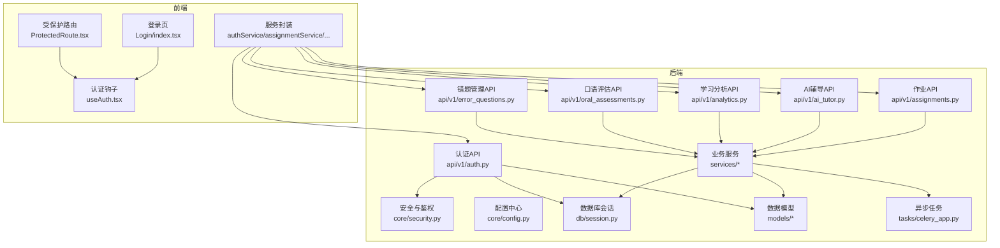
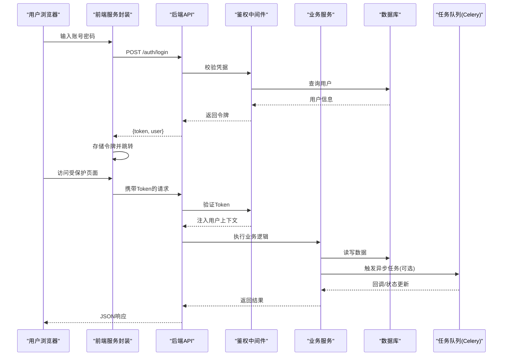
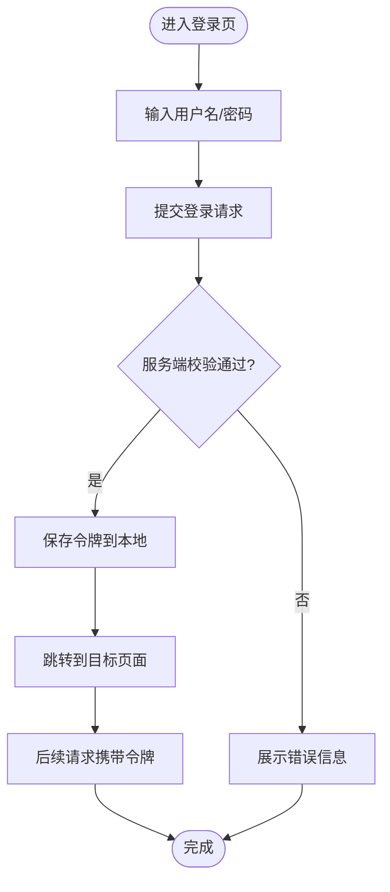
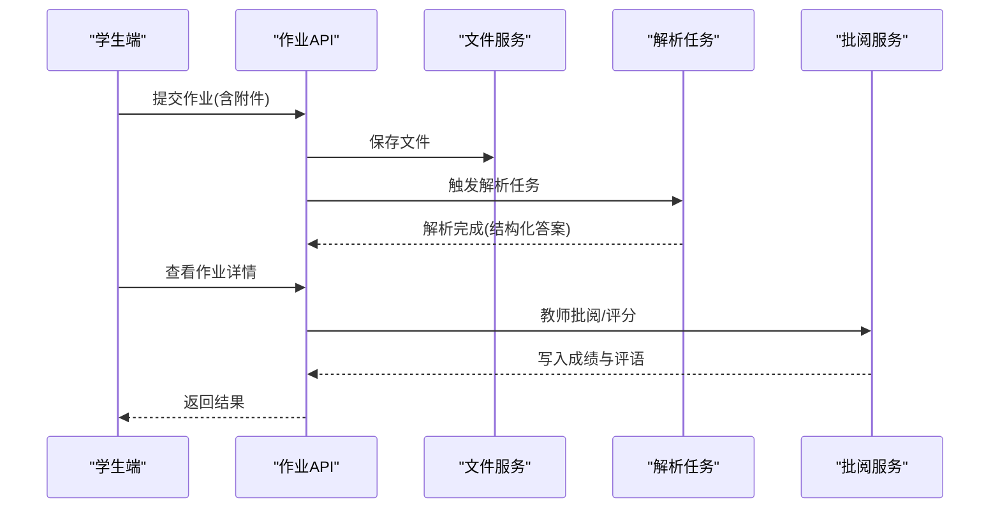
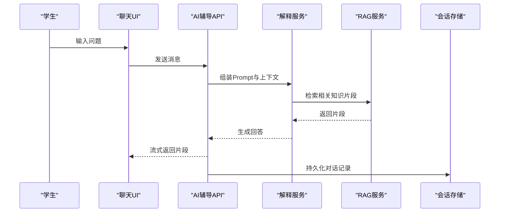
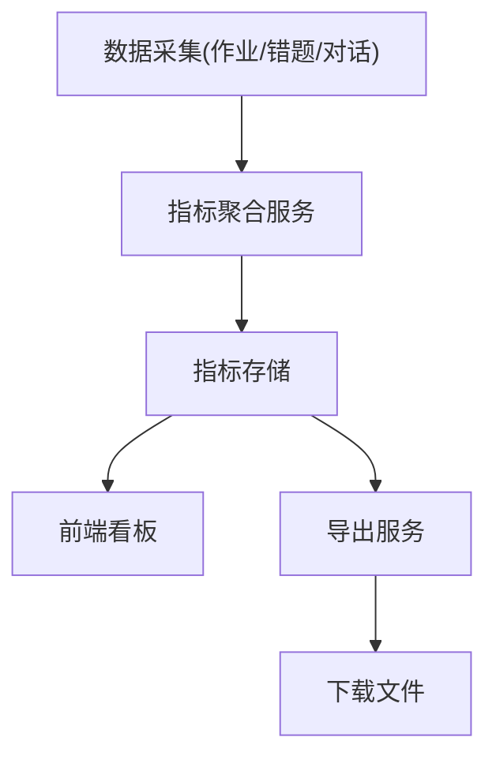
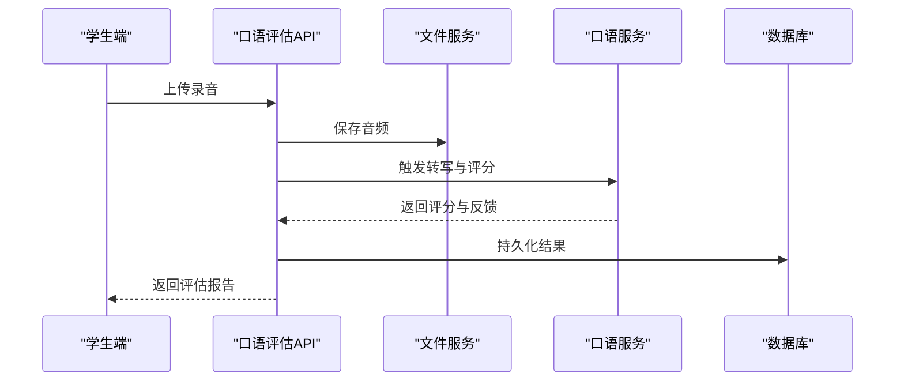
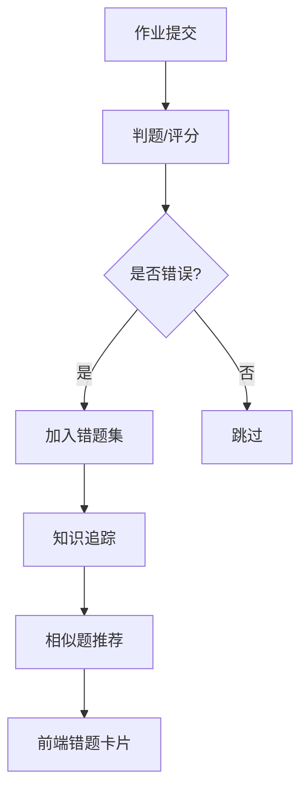
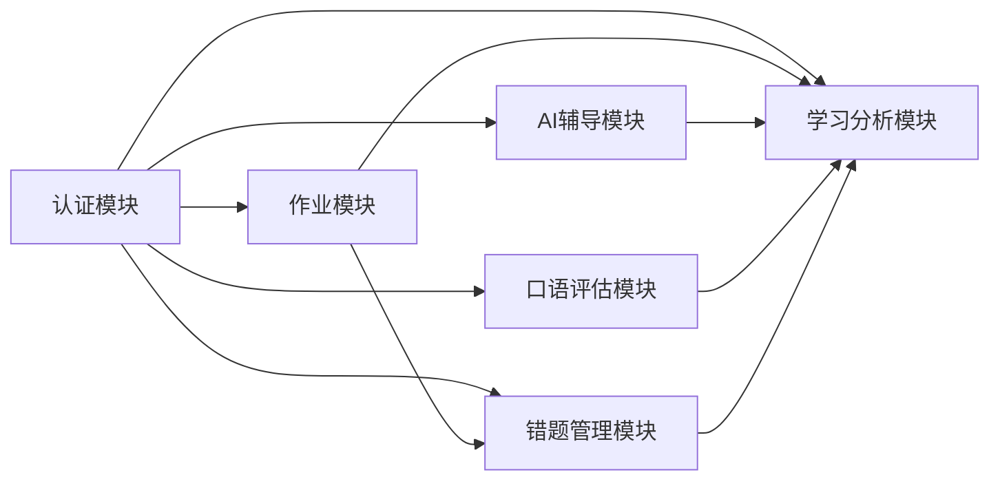

# 核心功能模块

<cite>
**本文引用的文件**   
- [backend/app/api/v1/auth.py](file://backend/app/api/v1/auth.py)
- [backend/app/api/v1/assignments.py](file://backend/app/api/v1/assignments.py)
- [backend/app/api/v1/ai_tutor.py](file://backend/app/api/v1/ai_tutor.py)
- [backend/app/api/v1/analytics.py](file://backend/app/api/v1/analytics.py)
- [backend/app/api/v1/oral_assessments.py](file://backend/app/api/v1/oral_assessments.py)
- [backend/app/api/v1/error_questions.py](file://backend/app/api/v1/error_questions.py)
- [backend/app/core/security.py](file://backend/app/core/security.py)
- [backend/app/core/config.py](file://backend/app/core/config.py)
- [backend/app/db/session.py](file://backend/app/db/session.py)
- [backend/app/models/user.py](file://backend/app/models/user.py)
- [backend/app/models/assignment.py](file://backend/app/models/assignment.py)
- [backend/app/schemas/user.py](file://backend/app/schemas/user.py)
- [backend/app/schemas/assignment.py](file://backend/app/schemas/assignment.py)
- [backend/app/services/file_upload.py](file://backend/app/services/file_upload.py)
- [backend/app/services/explain_service.py](file://backend/app/services/explain_service.py)
- [backend/app/services/rag_service.py](file://backend/app/services/rag_service.py)
- [backend/app/services/oral_service.py](file://backend/app/services/oral_service.py)
- [backend/app/services/knowledge_tracker.py](file://backend/app/services/knowledge_tracker.py)
- [backend/app/tasks/celery_app.py](file://backend/app/tasks/celery_app.py)
- [frontend/src/pages/Login/index.tsx](file://frontend/src/pages/Login/index.tsx)
- [frontend/src/components/ProtectedRoute.tsx](file://frontend/src/components/ProtectedRoute.tsx)
- [frontend/src/hooks/useAuth.tsx](file://frontend/src/hooks/useAuth.tsx)
- [frontend/src/services/authService.ts](file://frontend/src/services/authService.ts)
- [frontend/src/services/assignmentService.ts](file://frontend/src/services/assignmentService.ts)
- [frontend/src/services/aiTutorService.ts](file://frontend/src/services/aiTutorService.ts)
- [frontend/src/services/analyticsService.ts](file://frontend/src/services/analyticsService.ts)
- [frontend/src/services/oralService.ts](file://frontend/src/services/oralService.ts)
- [frontend/src/services/errorQuestionService.ts](file://frontend/src/services/errorQuestionService.ts)
</cite>

## 目录
1. [简介](#简介)
2. [项目结构](#项目结构)
3. [核心组件](#核心组件)
4. [架构总览](#架构总览)
5. [详细组件分析](#详细组件分析)
6. [依赖关系分析](#依赖关系分析)
7. [性能考虑](#性能考虑)
8. [故障排查指南](#故障排查指南)
9. [结论](#结论)
10. [附录](#附录)

## 简介
本文件面向教师与学生用户以及开发者，系统化梳理AI助教系统的六大核心功能：用户认证与权限管理、作业管理系统、AI辅导助手、学习分析平台、口语评估系统、错题管理。文档覆盖业务逻辑、API接口设计、数据流转、用户交互流程、模块间协作机制、配置项与扩展点、性能优化建议，并提供使用场景与最佳实践案例。

## 项目结构
后端采用分层架构：API层（路由）、服务层（业务逻辑）、模型层（ORM）、数据库会话、任务队列；前端基于React+TypeScript，按页面与能力域组织，提供统一的服务封装与鉴权守卫。

图表来源
- [backend/app/api/v1/auth.py](file://backend/app/api/v1/auth.py)
- [backend/app/api/v1/assignments.py](file://backend/app/api/v1/assignments.py)
- [backend/app/api/v1/ai_tutor.py](file://backend/app/api/v1/ai_tutor.py)
- [backend/app/api/v1/analytics.py](file://backend/app/api/v1/analytics.py)
- [backend/app/api/v1/oral_assessments.py](file://backend/app/api/v1/oral_assessments.py)
- [backend/app/api/v1/error_questions.py](file://backend/app/api/v1/error_questions.py)
- [backend/app/core/security.py](file://backend/app/core/security.py)
- [backend/app/core/config.py](file://backend/app/core/config.py)
- [backend/app/db/session.py](file://backend/app/db/session.py)
- [backend/app/models/user.py](file://backend/app/models/user.py)
- [backend/app/models/assignment.py](file://backend/app/models/assignment.py)
- [backend/app/services/file_upload.py](file://backend/app/services/file_upload.py)
- [backend/app/services/explain_service.py](file://backend/app/services/explain_service.py)
- [backend/app/services/rag_service.py](file://backend/app/services/rag_service.py)
- [backend/app/services/oral_service.py](file://backend/app/services/oral_service.py)
- [backend/app/services/knowledge_tracker.py](file://backend/app/services/knowledge_tracker.py)
- [backend/app/tasks/celery_app.py](file://backend/app/tasks/celery_app.py)
- [frontend/src/pages/Login/index.tsx](file://frontend/src/pages/Login/index.tsx)
- [frontend/src/components/ProtectedRoute.tsx](file://frontend/src/components/ProtectedRoute.tsx)
- [frontend/src/hooks/useAuth.tsx](file://frontend/src/hooks/useAuth.tsx)
- [frontend/src/services/authService.ts](file://frontend/src/services/authService.ts)
- [frontend/src/services/assignmentService.ts](file://frontend/src/services/assignmentService.ts)
- [frontend/src/services/aiTutorService.ts](file://frontend/src/services/aiTutorService.ts)
- [frontend/src/services/analyticsService.ts](file://frontend/src/services/analyticsService.ts)
- [frontend/src/services/oralService.ts](file://frontend/src/services/oralService.ts)
- [frontend/src/services/errorQuestionService.ts](file://frontend/src/services/errorQuestionService.ts)

章节来源
- [backend/app/core/config.py](file://backend/app/core/config.py)
- [backend/app/db/session.py](file://backend/app/db/session.py)
- [backend/app/core/security.py](file://backend/app/core/security.py)
- [backend/app/models/user.py](file://backend/app/models/user.py)
- [backend/app/models/assignment.py](file://backend/app/models/assignment.py)
- [backend/app/schemas/user.py](file://backend/app/schemas/user.py)
- [backend/app/schemas/assignment.py](file://backend/app/schemas/assignment.py)
- [backend/app/api/v1/auth.py](file://backend/app/api/v1/auth.py)
- [backend/app/api/v1/assignments.py](file://backend/app/api/v1/assignments.py)
- [backend/app/api/v1/ai_tutor.py](file://backend/app/api/v1/ai_tutor.py)
- [backend/app/api/v1/analytics.py](file://backend/app/api/v1/analytics.py)
- [backend/app/api/v1/oral_assessments.py](file://backend/app/api/v1/oral_assessments.py)
- [backend/app/api/v1/error_questions.py](file://backend/app/api/v1/error_questions.py)
- [frontend/src/pages/Login/index.tsx](file://frontend/src/pages/Login/index.tsx)
- [frontend/src/components/ProtectedRoute.tsx](file://frontend/src/components/ProtectedRoute.tsx)
- [frontend/src/hooks/useAuth.tsx](file://frontend/src/hooks/useAuth.tsx)
- [frontend/src/services/authService.ts](file://frontend/src/services/authService.ts)
- [frontend/src/services/assignmentService.ts](file://frontend/src/services/assignmentService.ts)
- [frontend/src/services/aiTutorService.ts](file://frontend/src/services/aiTutorService.ts)
- [frontend/src/services/analyticsService.ts](file://frontend/src/services/analyticsService.ts)
- [frontend/src/services/oralService.ts](file://frontend/src/services/oralService.ts)
- [frontend/src/services/errorQuestionService.ts](file://frontend/src/services/errorQuestionService.ts)

## 核心组件
- 用户认证与权限管理：负责注册、登录、令牌签发与校验、角色/权限控制，前后端协同实现受保护路由与会话保持。
- 作业管理系统：支持作业创建、上传、提交、批改与结果查看，结合文件上传与异步处理提升吞吐。
- AI辅导助手：基于提示词与工具链的对话式辅导，支持多轮问答、知识检索与解释生成。
- 学习分析平台：聚合作业、错题、知识点掌握度等指标，提供可视化统计与导出。
- 口语评估系统：采集音频、转写文本、评分与反馈，支持批量分析与报告生成。
- 错题管理：收集错误题目、错因标签、相似题推荐与重做跟踪，形成闭环学习路径。

章节来源
- [backend/app/api/v1/auth.py](file://backend/app/api/v1/auth.py)
- [backend/app/api/v1/assignments.py](file://backend/app/api/v1/assignments.py)
- [backend/app/api/v1/ai_tutor.py](file://backend/app/api/v1/ai_tutor.py)
- [backend/app/api/v1/analytics.py](file://backend/app/api/v1/analytics.py)
- [backend/app/api/v1/oral_assessments.py](file://backend/app/api/v1/oral_assessments.py)
- [backend/app/api/v1/error_questions.py](file://backend/app/api/v1/error_questions.py)

## 架构总览
系统以“前端页面/服务 -> 后端API -> 服务层 -> 数据层/外部服务”为主干，关键特性包括：
- 统一鉴权：JWT令牌在请求头传递，服务端校验后注入当前用户上下文。
- 异步任务：耗时操作（如分析、向量入库）通过Celery执行，避免阻塞HTTP。
- 可配置化：核心参数集中管理，便于环境切换与灰度发布。
- 可扩展：服务层以独立模块承载AI能力，便于替换或升级。

图表来源
- [backend/app/api/v1/auth.py](file://backend/app/api/v1/auth.py)
- [backend/app/core/security.py](file://backend/app/core/security.py)
- [backend/app/db/session.py](file://backend/app/db/session.py)
- [backend/app/tasks/celery_app.py](file://backend/app/tasks/celery_app.py)
- [frontend/src/services/authService.ts](file://frontend/src/services/authService.ts)
- [frontend/src/components/ProtectedRoute.tsx](file://frontend/src/components/ProtectedRoute.tsx)

## 详细组件分析

### 用户认证与权限管理
- 业务逻辑
  - 用户注册/登录：校验用户名与密码，签发短期有效令牌，刷新令牌策略由配置决定。
  - 权限控制：基于角色的访问控制（RBAC），对敏感接口进行拦截与校验。
  - 会话保持：前端持久化令牌并在请求头自动附加。
- API接口设计
  - 登录：POST /api/v1/auth/login，入参包含用户名与密码，返回令牌与基础用户信息。
  - 登出：POST /api/v1/auth/logout，清除服务端黑名单或本地令牌。
  - 获取当前用户：GET /api/v1/auth/me，需携带有效令牌。
- 数据流转
  - 前端调用登录接口，成功后将令牌写入本地存储；后续请求通过拦截器附加Authorization头。
  - 服务端鉴权中间件解析令牌，加载用户上下文，供下游服务使用。
- 用户交互流程
  - 登录页输入凭据 -> 显示加载态 -> 成功跳转首页或上次访问页 -> 失败展示错误信息。
- 配置与扩展
  - 令牌有效期、刷新策略、密码强度规则等在配置中心定义。
  - 可扩展第三方登录（如企业SSO），通过适配器模式接入。
- 性能与安全
  - 防暴力破解：登录失败计数与冷却时间。
  - 最小权限原则：默认低权限，按需授予。
  - 传输加密：强制HTTPS，敏感字段不落盘。

图表来源
- [backend/app/api/v1/auth.py](file://backend/app/api/v1/auth.py)
- [backend/app/core/security.py](file://backend/app/core/security.py)
- [backend/app/models/user.py](file://backend/app/models/user.py)
- [backend/app/schemas/user.py](file://backend/app/schemas/user.py)
- [frontend/src/pages/Login/index.tsx](file://frontend/src/pages/Login/index.tsx)
- [frontend/src/hooks/useAuth.tsx](file://frontend/src/hooks/useAuth.tsx)
- [frontend/src/services/authService.ts](file://frontend/src/services/authService.ts)

章节来源
- [backend/app/api/v1/auth.py](file://backend/app/api/v1/auth.py)
- [backend/app/core/security.py](file://backend/app/core/security.py)
- [backend/app/models/user.py](file://backend/app/models/user.py)
- [backend/app/schemas/user.py](file://backend/app/schemas/user.py)
- [frontend/src/pages/Login/index.tsx](file://frontend/src/pages/Login/index.tsx)
- [frontend/src/components/ProtectedRoute.tsx](file://frontend/src/components/ProtectedRoute.tsx)
- [frontend/src/hooks/useAuth.tsx](file://frontend/src/hooks/useAuth.tsx)
- [frontend/src/services/authService.ts](file://frontend/src/services/authService.ts)

### 作业管理系统
- 业务逻辑
  - 作业生命周期：创建、发布、提交、批改、归档。
  - 文件上传：支持PDF/图片等多格式，后台进行OCR与内容解析。
  - 成绩与反馈：结构化评分与评语，支持批量导出。
- API接口设计
  - 作业列表/详情：GET /api/v1/assignments/{id}
  - 创建作业：POST /api/v1/assignments
  - 提交作业：POST /api/v1/assignments/{id}/submissions
  - 上传附件：POST /api/v1/assignments/{id}/upload
  - 批改与评分：PUT /api/v1/assignments/{id}/submissions/{sid}/grade
- 数据流转
  - 学生上传作业 -> 文件服务落盘 -> 触发解析任务 -> 生成结构化答案 -> 教师在线批改 -> 结果回写。
- 用户交互流程
  - 教师：创建作业 -> 设置规则 -> 发布 -> 查看提交 -> 批阅 -> 导出报表。
  - 学生：查看作业 -> 上传作答 -> 查看成绩与评语 -> 申请复核。
- 配置与扩展
  - 文件大小限制、允许格式、解析引擎开关、批阅模板等均可配置。
  - 扩展点：自定义解析插件、评分规则引擎、通知渠道。
- 性能优化
  - 分片上传与大文件断点续传。
  - 解析与渲染走异步任务队列，前端轮询进度。

图表来源
- [backend/app/api/v1/assignments.py](file://backend/app/api/v1/assignments.py)
- [backend/app/services/file_upload.py](file://backend/app/services/file_upload.py)
- [backend/app/tasks/celery_app.py](file://backend/app/tasks/celery_app.py)
- [backend/app/models/assignment.py](file://backend/app/models/assignment.py)
- [backend/app/schemas/assignment.py](file://backend/app/schemas/assignment.py)
- [frontend/src/services/assignmentService.ts](file://frontend/src/services/assignmentService.ts)

章节来源
- [backend/app/api/v1/assignments.py](file://backend/app/api/v1/assignments.py)
- [backend/app/services/file_upload.py](file://backend/app/services/file_upload.py)
- [backend/app/tasks/celery_app.py](file://backend/app/tasks/celery_app.py)
- [backend/app/models/assignment.py](file://backend/app/models/assignment.py)
- [backend/app/schemas/assignment.py](file://backend/app/schemas/assignment.py)
- [frontend/src/services/assignmentService.ts](file://frontend/src/services/assignmentService.ts)

### AI辅导助手
- 业务逻辑
  - 多轮对话：维护会话上下文，支持追问与澄清。
  - 知识增强：RAG检索课程资料与题库，生成个性化解释。
  - 工具调用：计算器、公式渲染、代码执行等工具按需启用。
- API接口设计
  - 发起对话：POST /api/v1/ai-tutor/conversations
  - 发送消息：POST /api/v1/ai-tutor/conversations/{cid}/messages
  - 历史与摘要：GET /api/v1/ai-tutor/conversations/{cid}
- 数据流转
  - 用户提问 -> 构建Prompt -> RAG检索相关片段 -> LLM生成回答 -> 流式返回或缓存。
- 用户交互流程
  - 悬浮按钮唤起聊天面板 -> 输入问题 -> 实时流式输出 -> 一键收藏/导出。
- 配置与扩展
  - 模型选择、温度、最大长度、检索阈值、工具白名单等。
  - 扩展点：新增Prompt模板、自定义工具、知识库源。
- 性能优化
  - 流式输出降低首字延迟。
  - 热点答案缓存与去重。
  - 检索结果分页与截断。

图表来源
- [backend/app/api/v1/ai_tutor.py](file://backend/app/api/v1/ai_tutor.py)
- [backend/app/services/explain_service.py](file://backend/app/services/explain_service.py)
- [backend/app/services/rag_service.py](file://backend/app/services/rag_service.py)
- [frontend/src/services/aiTutorService.ts](file://frontend/src/services/aiTutorService.ts)

章节来源
- [backend/app/api/v1/ai_tutor.py](file://backend/app/api/v1/ai_tutor.py)
- [backend/app/services/explain_service.py](file://backend/app/services/explain_service.py)
- [backend/app/services/rag_service.py](file://backend/app/services/rag_service.py)
- [frontend/src/services/aiTutorService.ts](file://frontend/src/services/aiTutorService.ts)

### 学习分析平台
- 业务逻辑
  - 指标聚合：作业正确率、知识点热力图、班级排名、趋势分析。
  - 报告生成：个人/班级报告，支持导出Excel/PDF。
  - 定时任务：每日/每周汇总，增量更新。
- API接口设计
  - 概览数据：GET /api/v1/analytics/dashboard
  - 维度筛选：GET /api/v1/analytics?class_id=&date_range=
  - 导出任务：POST /api/v1/analytics/export
- 数据流转
  - 作业/错题/对话日志 -> 聚合服务 -> 指标表 -> 前端图表渲染。
- 用户交互流程
  - 教师：选择班级/日期范围 -> 查看看板 -> 下载报告 -> 分享链接。
  - 学生：查看个人薄弱点 -> 跳转错题与练习。
- 配置与扩展
  - 指标口径、聚合粒度、保留周期、导出模板。
  - 扩展点：新增指标、对接BI系统。
- 性能优化
  - 预计算与物化视图。
  - 分页与懒加载。
  - 异步导出与下载队列。

图表来源
- [backend/app/api/v1/analytics.py](file://backend/app/api/v1/analytics.py)
- [backend/app/services/analytics_aggregator.py](file://backend/app/services/analytics_aggregator.py)
- [backend/app/tasks/celery_app.py](file://backend/app/tasks/celery_app.py)
- [frontend/src/services/analyticsService.ts](file://frontend/src/services/analyticsService.ts)

章节来源
- [backend/app/api/v1/analytics.py](file://backend/app/api/v1/analytics.py)
- [backend/app/services/analytics_aggregator.py](file://backend/app/services/analytics_aggregator.py)
- [backend/app/tasks/celery_app.py](file://backend/app/tasks/celery_app.py)
- [frontend/src/services/analyticsService.ts](file://frontend/src/services/analyticsService.ts)

### 口语评估系统
- 业务逻辑
  - 音频采集与上传：支持录音与文件上传。
  - 语音转写与打分：ASR转写 + 多维度评分（流利度、准确度、发音）。
  - 反馈与建议：逐句点评、改进建议、对比历史。
- API接口设计
  - 提交录音：POST /api/v1/oral-assessments
  - 查询评估结果：GET /api/v1/oral-assessments/{id}
  - 批量分析：POST /api/v1/oral-assessments/batch-analyze
- 数据流转
  - 录音上传 -> 转写与特征提取 -> 评分模型推理 -> 结果入库 -> 前端展示。
- 用户交互流程
  - 学生：点击录音 -> 朗读材料 -> 等待评估 -> 查看分数与反馈。
  - 教师：查看班级整体表现 -> 定位共性问题 -> 推送针对性练习。
- 配置与扩展
  - ASR引擎、评分权重、语言包、评测标准。
  - 扩展点：新增评分维度、接入新ASR/评分模型。
- 性能优化
  - 分块上传与并发处理。
  - 异步批处理与结果缓存。
  - 流式转写与增量评分。

图表来源
- [backend/app/api/v1/oral_assessments.py](file://backend/app/api/v1/oral_assessments.py)
- [backend/app/services/oral_service.py](file://backend/app/services/oral_service.py)
- [backend/app/services/file_upload.py](file://backend/app/services/file_upload.py)
- [frontend/src/services/oralService.ts](file://frontend/src/services/oralService.ts)

章节来源
- [backend/app/api/v1/oral_assessments.py](file://backend/app/api/v1/oral_assessments.py)
- [backend/app/services/oral_service.py](file://backend/app/services/oral_service.py)
- [backend/app/services/file_upload.py](file://backend/app/services/file_upload.py)
- [frontend/src/services/oralService.ts](file://frontend/src/services/oralService.ts)

### 错题管理
- 业务逻辑
  - 错题收集：从作业与测验中自动抽取错误题目，支持手动添加。
  - 错因标注：知识点、题型、难度、常见误区。
  - 相似题推荐：基于语义相似度与知识点匹配，生成巩固练习。
  - 重做跟踪：记录重做次数与正确率变化，形成学习曲线。
- API接口设计
  - 错题列表：GET /api/v1/error-questions
  - 新增错题：POST /api/v1/error-questions
  - 删除错题：DELETE /api/v1/error-questions/{id}
  - 相似题推荐：GET /api/v1/error-questions/{id}/similar
- 数据流转
  - 作业提交 -> 判题 -> 错误入库 -> 知识追踪 -> 相似题生成 -> 前端卡片展示。
- 用户交互流程
  - 学生：查看错题集 -> 点击讲解 -> 练习相似题 -> 标记已掌握。
  - 教师：导出错题清单 -> 布置专项训练 -> 跟踪掌握情况。
- 配置与扩展
  - 相似度阈值、推荐数量、讲解模板、导出格式。
  - 扩展点：接入更多题库源、自定义讲解策略。
- 性能优化
  - 向量化索引加速相似题检索。
  - 增量更新错题集。
  - 前端虚拟列表与分页。

图表来源
- [backend/app/api/v1/error_questions.py](file://backend/app/api/v1/error_questions.py)
- [backend/app/services/knowledge_tracker.py](file://backend/app/services/knowledge_tracker.py)
- [backend/app/services/similar_generator.py](file://backend/app/services/similar_generator.py)
- [frontend/src/services/errorQuestionService.ts](file://frontend/src/services/errorQuestionService.ts)

章节来源
- [backend/app/api/v1/error_questions.py](file://backend/app/api/v1/error_questions.py)
- [backend/app/services/knowledge_tracker.py](file://backend/app/services/knowledge_tracker.py)
- [backend/app/services/similar_generator.py](file://backend/app/services/similar_generator.py)
- [frontend/src/services/errorQuestionService.ts](file://frontend/src/services/errorQuestionService.ts)

## 依赖关系分析
- 模块耦合
  - 认证为所有受保护接口的公共前置条件。
  - 作业系统与错题管理共享“提交-判题-入库”链路。
  - AI辅导与学习分析共享“对话/讲解”产出作为分析素材。
- 外部依赖
  - 文件存储、ASR/LLM服务、向量检索库、任务队列。
- 潜在循环依赖
  - 服务层应避免直接反向引用API层，通过事件或任务解耦。
- 接口契约
  - 统一的错误码与响应结构，便于前端一致化处理。

图表来源
- [backend/app/api/v1/auth.py](file://backend/app/api/v1/auth.py)
- [backend/app/api/v1/assignments.py](file://backend/app/api/v1/assignments.py)
- [backend/app/api/v1/ai_tutor.py](file://backend/app/api/v1/ai_tutor.py)
- [backend/app/api/v1/analytics.py](file://backend/app/api/v1/analytics.py)
- [backend/app/api/v1/oral_assessments.py](file://backend/app/api/v1/oral_assessments.py)
- [backend/app/api/v1/error_questions.py](file://backend/app/api/v1/error_questions.py)

章节来源
- [backend/app/api/v1/auth.py](file://backend/app/api/v1/auth.py)
- [backend/app/api/v1/assignments.py](file://backend/app/api/v1/assignments.py)
- [backend/app/api/v1/ai_tutor.py](file://backend/app/api/v1/ai_tutor.py)
- [backend/app/api/v1/analytics.py](file://backend/app/api/v1/analytics.py)
- [backend/app/api/v1/oral_assessments.py](file://backend/app/api/v1/oral_assessments.py)
- [backend/app/api/v1/error_questions.py](file://backend/app/api/v1/error_questions.py)

## 性能考虑
- 通用优化
  - 连接池与缓存：数据库连接复用、热点数据Redis缓存。
  - 限流与熔断：对AI与ASR接口实施速率限制与降级策略。
  - 异步化：大文件解析、报告生成、向量入库全部走任务队列。
- 前端优化
  - 路由懒加载、组件级分包、图片与静态资源CDN。
  - 长列表虚拟化、分页与增量加载。
- 监控与可观测性
  - 关键接口埋点、错误告警、慢查询分析。
  - 任务队列消费延迟监控与重试策略。

[本节为通用指导，不直接分析具体文件]

## 故障排查指南
- 认证失败
  - 检查令牌是否过期、跨域与Cookie策略、服务端时钟同步。
- 作业上传失败
  - 确认文件大小与格式限制、对象存储连通性、解析任务是否堆积。
- AI辅导无响应
  - 检查模型服务健康、RAG索引可用性、Prompt模板配置。
- 口语评估异常
  - 验证音频编码、ASR配额、评分模型版本兼容性。
- 分析报表为空
  - 核对聚合任务是否执行、数据保留策略、时间窗口过滤。

章节来源
- [backend/app/core/security.py](file://backend/app/core/security.py)
- [backend/app/services/file_upload.py](file://backend/app/services/file_upload.py)
- [backend/app/services/rag_service.py](file://backend/app/services/rag_service.py)
- [backend/app/services/oral_service.py](file://backend/app/services/oral_service.py)
- [backend/app/tasks/celery_app.py](file://backend/app/tasks/celery_app.py)

## 结论
本系统围绕“教-学-评-管”闭环构建，六大核心模块相互协作，既满足师生日常教学需求，也为持续迭代与生态扩展预留空间。建议在上线前完善监控与压测，逐步引入更丰富的AI能力与数据洞察，持续提升教学质量与学习效率。

[本节为总结性内容，不直接分析具体文件]

## 附录
- 使用场景与最佳实践
  - 教师：课前发布作业 -> 课中答疑(AI辅导) -> 课后分析(学习分析) -> 针对错题布置巩固。
  - 学生：自主练习 -> 即时求助(AI辅导) -> 复盘错题 -> 口语打卡与反馈。
- 集成与扩展指引
  - 新增能力优先在服务层实现，暴露清晰接口，API层仅做路由与校验。
  - 通过配置中心切换模型与阈值，灰度发布新功能。
  - 前端统一错误处理与重试策略，保障用户体验。

[本节为补充说明，不直接分析具体文件]