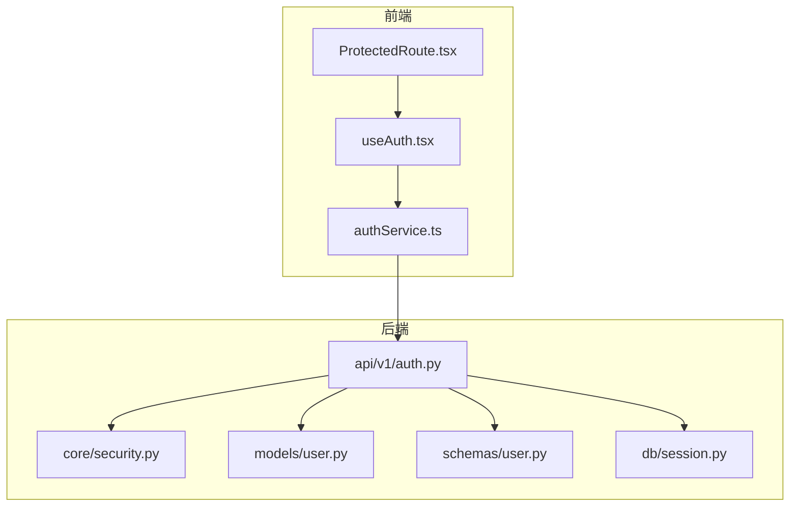
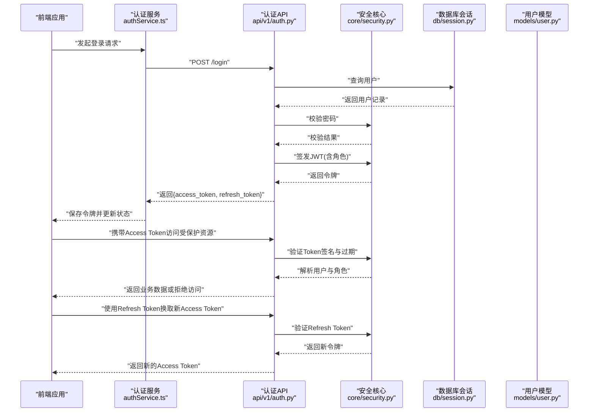
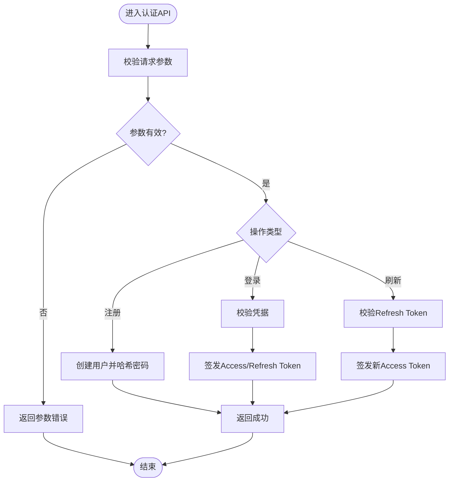
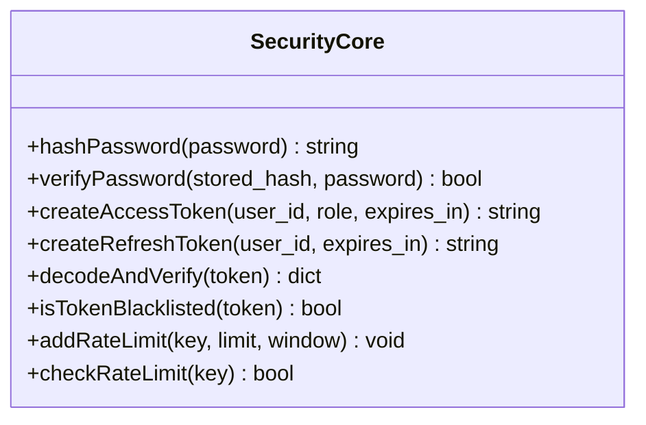
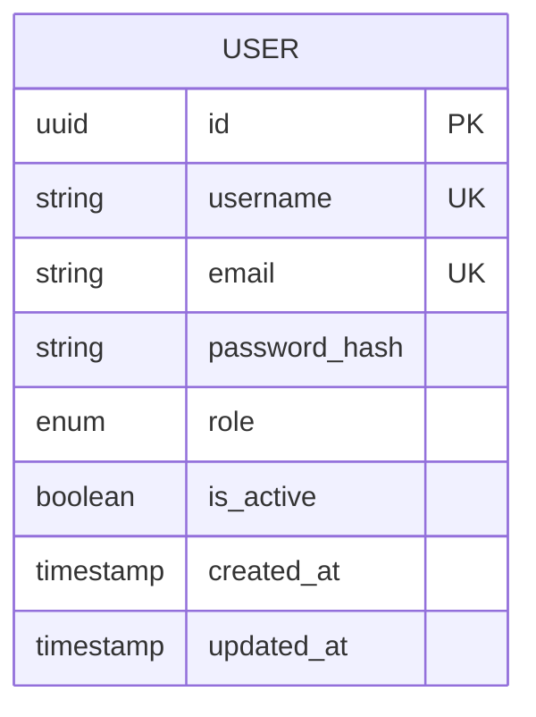
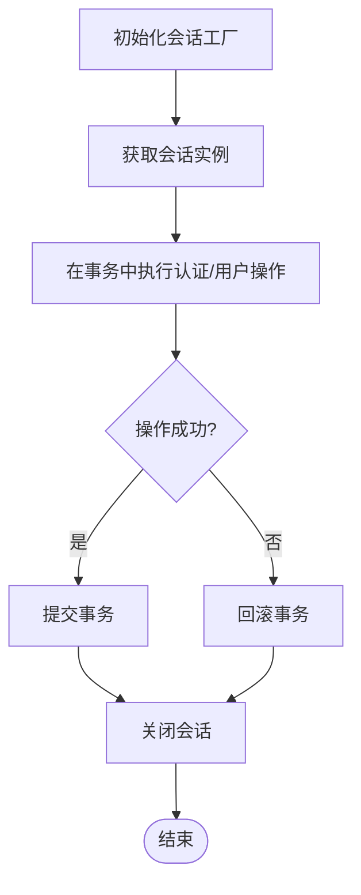
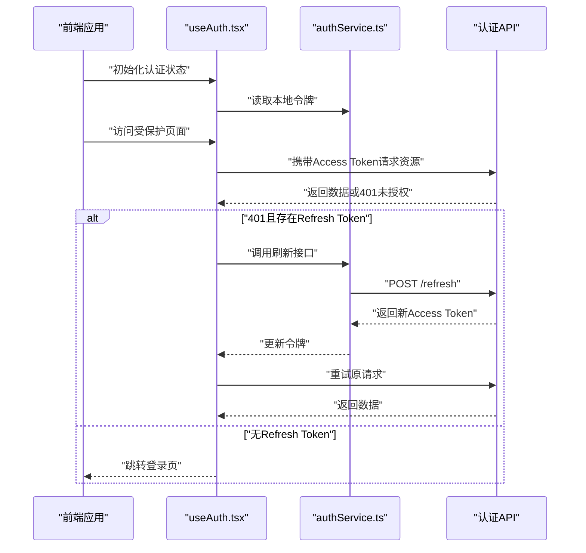
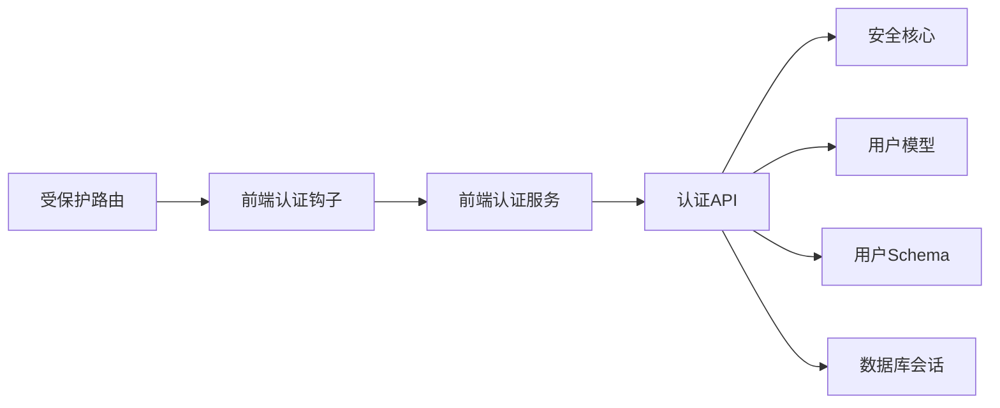

# 用户认证与权限管理

<cite>
**本文引用的文件**   
- [backend/app/api/v1/auth.py](file://backend/app/api/v1/auth.py)
- [backend/app/core/security.py](file://backend/app/core/security.py)
- [backend/app/models/user.py](file://backend/app/models/user.py)
- [backend/app/schemas/user.py](file://backend/app/schemas/user.py)
- [backend/app/db/session.py](file://backend/app/db/session.py)
- [frontend/src/services/authService.ts](file://frontend/src/services/authService.ts)
- [frontend/src/hooks/useAuth.tsx](file://frontend/src/hooks/useAuth.tsx)
- [frontend/src/components/ProtectedRoute.tsx](file://frontend/src/components/ProtectedRoute.tsx)
</cite>

## 目录
1. [简介](#简介)
2. [项目结构](#项目结构)
3. [核心组件](#核心组件)
4. [架构总览](#架构总览)
5. [详细组件分析](#详细组件分析)
6. [依赖关系分析](#依赖关系分析)
7. [性能与安全考量](#性能与安全考量)
8. [故障排查指南](#故障排查指南)
9. [结论](#结论)
10. [附录](#附录)

## 简介
本文件面向开发者，系统化阐述用户认证与权限管理的实现方案。重点覆盖：
- JWT 令牌认证机制（生成、验证、刷新）
- 用户角色体系（教师、学生、管理员）与访问授权策略
- 用户注册、登录、密码管理等核心功能的技术实现
- 安全最佳实践（密码加密存储、会话管理、防暴力破解）
- API 接口使用示例与前端集成指南
- 用户状态管理与会话持久化方案
- 扩展自定义认证方式的指导

## 项目结构
后端采用分层设计：API 层负责路由与请求处理；核心安全模块提供 JWT 与密码工具；数据模型与 Schema 定义用户实体与校验规则；数据库会话管理连接持久化层。前端通过服务层封装认证相关 API，结合 React Hook 与受保护路由完成鉴权流程。

图表来源
- [backend/app/api/v1/auth.py](file://backend/app/api/v1/auth.py)
- [backend/app/core/security.py](file://backend/app/core/security.py)
- [backend/app/models/user.py](file://backend/app/models/user.py)
- [backend/app/schemas/user.py](file://backend/app/schemas/user.py)
- [backend/app/db/session.py](file://backend/app/db/session.py)
- [frontend/src/services/authService.ts](file://frontend/src/services/authService.ts)
- [frontend/src/hooks/useAuth.tsx](file://frontend/src/hooks/useAuth.tsx)
- [frontend/src/components/ProtectedRoute.tsx](file://frontend/src/components/ProtectedRoute.tsx)

章节来源
- [backend/app/api/v1/auth.py](file://backend/app/api/v1/auth.py)
- [backend/app/core/security.py](file://backend/app/core/security.py)
- [backend/app/models/user.py](file://backend/app/models/user.py)
- [backend/app/schemas/user.py](file://backend/app/schemas/user.py)
- [backend/app/db/session.py](file://backend/app/db/session.py)
- [frontend/src/services/authService.ts](file://frontend/src/services/authService.ts)
- [frontend/src/hooks/useAuth.tsx](file://frontend/src/hooks/useAuth.tsx)
- [frontend/src/components/ProtectedRoute.tsx](file://frontend/src/components/ProtectedRoute.tsx)

## 核心组件
- 认证 API 层：提供注册、登录、令牌刷新等端点，统一输入输出校验与错误响应。
- 安全核心：JWT 签发与校验、密码哈希与校验、可选的速率限制与黑名单管理。
- 用户模型与模式：用户实体字段、角色枚举、密码字段及校验规则。
- 数据库会话：异步会话工厂与事务上下文，支撑用户查询与更新。
- 前端服务与钩子：封装认证 API 调用、本地令牌存储、全局认证状态与自动刷新逻辑。
- 受保护路由：基于当前用户角色与资源权限进行页面级访问控制。

章节来源
- [backend/app/api/v1/auth.py](file://backend/app/api/v1/auth.py)
- [backend/app/core/security.py](file://backend/app/core/security.py)
- [backend/app/models/user.py](file://backend/app/models/user.py)
- [backend/app/schemas/user.py](file://backend/app/schemas/user.py)
- [backend/app/db/session.py](file://backend/app/db/session.py)
- [frontend/src/services/authService.ts](file://frontend/src/services/authService.ts)
- [frontend/src/hooks/useAuth.tsx](file://frontend/src/hooks/useAuth.tsx)
- [frontend/src/components/ProtectedRoute.tsx](file://frontend/src/components/ProtectedRoute.tsx)

## 架构总览
下图展示从前端到后端的认证与授权关键路径，包括登录、令牌签发、资源访问与刷新流程。

图表来源
- [backend/app/api/v1/auth.py](file://backend/app/api/v1/auth.py)
- [backend/app/core/security.py](file://backend/app/core/security.py)
- [backend/app/models/user.py](file://backend/app/models/user.py)
- [backend/app/db/session.py](file://backend/app/db/session.py)
- [frontend/src/services/authService.ts](file://frontend/src/services/authService.ts)

## 详细组件分析

### 认证 API（注册、登录、刷新）
- 注册流程
  - 接收用户名、邮箱、密码等输入，执行 Schema 校验。
  - 检查用户唯一性（用户名/邮箱）。
  - 使用安全核心对密码进行哈希存储。
  - 创建用户记录并返回成功响应。
- 登录流程
  - 校验凭据（用户名/邮箱 + 密码）。
  - 签发短期 Access Token 与长期 Refresh Token，包含用户标识与角色信息。
  - 返回令牌集合供前端持久化。
- 刷新流程
  - 校验 Refresh Token 有效性（签名、过期、是否被吊销）。
  - 签发新的 Access Token。
  - 支持可选的令牌轮换策略（一次性使用 Refresh Token 并续期）。

图表来源
- [backend/app/api/v1/auth.py](file://backend/app/api/v1/auth.py)
- [backend/app/core/security.py](file://backend/app/core/security.py)
- [backend/app/schemas/user.py](file://backend/app/schemas/user.py)

章节来源
- [backend/app/api/v1/auth.py](file://backend/app/api/v1/auth.py)
- [backend/app/schemas/user.py](file://backend/app/schemas/user.py)

### 安全核心（JWT、密码、速率限制）
- JWT 签发与校验
  - 签发：将用户 ID、角色、过期时间等载荷编码为令牌，使用密钥签名。
  - 校验：验证签名、过期时间、黑名单（如已注销或主动登出）。
- 密码安全
  - 使用强哈希算法对用户密码进行加盐哈希存储。
  - 提供密码校验函数，避免明文比较。
- 速率限制与防暴力破解
  - 针对登录与注册接口实施 IP 或用户维度的频率限制。
  - 失败次数阈值触发临时锁定或验证码挑战。
- 令牌生命周期管理
  - Access Token 短有效期，Refresh Token 较长有效期。
  - 支持令牌吊销列表与滚动续期策略。

图表来源
- [backend/app/core/security.py](file://backend/app/core/security.py)

章节来源
- [backend/app/core/security.py](file://backend/app/core/security.py)

### 用户模型与角色体系
- 用户实体
  - 字段：用户标识、用户名、邮箱、密码哈希、角色、状态、创建/更新时间等。
  - 角色：教师、学生、管理员，用于细粒度权限控制。
- 角色与权限映射
  - 管理员：系统配置、用户管理、数据分析。
  - 教师：作业发布、成绩录入、学习分析查看。
  - 学生：提交作业、查看反馈、个人学习分析。
- 权限校验
  - 在资源访问前解析 JWT 中的角色，匹配资源所需权限。
  - 未授权时返回明确的错误码与提示。

图表来源
- [backend/app/models/user.py](file://backend/app/models/user.py)

章节来源
- [backend/app/models/user.py](file://backend/app/models/user.py)

### 数据库会话与事务
- 会话工厂
  - 提供异步数据库会话实例，确保并发安全与资源释放。
- 事务上下文
  - 在认证与用户管理操作中包裹事务，保证一致性。
- 查询优化
  - 按需加载必要字段，减少冗余 IO。

图表来源
- [backend/app/db/session.py](file://backend/app/db/session.py)

章节来源
- [backend/app/db/session.py](file://backend/app/db/session.py)

### 前端集成（服务、钩子、受保护路由）
- 认证服务
  - 封装登录、注册、刷新等 API 调用。
  - 统一处理错误与重试逻辑。
- 认证钩子
  - 维护全局认证状态（用户信息、角色、令牌）。
  - 监听令牌过期事件，自动刷新并恢复请求。
- 受保护路由
  - 根据当前用户角色与目标页面权限决定是否渲染。
  - 未登录或未授权时重定向至登录页或无权限页。

图表来源
- [frontend/src/services/authService.ts](file://frontend/src/services/authService.ts)
- [frontend/src/hooks/useAuth.tsx](file://frontend/src/hooks/useAuth.tsx)
- [frontend/src/components/ProtectedRoute.tsx](file://frontend/src/components/ProtectedRoute.tsx)
- [backend/app/api/v1/auth.py](file://backend/app/api/v1/auth.py)

章节来源
- [frontend/src/services/authService.ts](file://frontend/src/services/authService.ts)
- [frontend/src/hooks/useAuth.tsx](file://frontend/src/hooks/useAuth.tsx)
- [frontend/src/components/ProtectedRoute.tsx](file://frontend/src/components/ProtectedRoute.tsx)

## 依赖关系分析
- 组件耦合
  - 认证 API 依赖安全核心与用户模型，低耦合高内聚。
  - 前端服务与钩子解耦于具体 API 实现，便于替换与测试。
- 外部依赖
  - JWT 库用于令牌编解码。
  - 密码哈希库用于安全存储。
  - 速率限制中间件用于防暴力破解。
- 潜在循环依赖
  - 通过模块化拆分避免循环导入。

图表来源
- [backend/app/api/v1/auth.py](file://backend/app/api/v1/auth.py)
- [backend/app/core/security.py](file://backend/app/core/security.py)
- [backend/app/models/user.py](file://backend/app/models/user.py)
- [backend/app/schemas/user.py](file://backend/app/schemas/user.py)
- [backend/app/db/session.py](file://backend/app/db/session.py)
- [frontend/src/services/authService.ts](file://frontend/src/services/authService.ts)
- [frontend/src/hooks/useAuth.tsx](file://frontend/src/hooks/useAuth.tsx)
- [frontend/src/components/ProtectedRoute.tsx](file://frontend/src/components/ProtectedRoute.tsx)

章节来源
- [backend/app/api/v1/auth.py](file://backend/app/api/v1/auth.py)
- [backend/app/core/security.py](file://backend/app/core/security.py)
- [backend/app/models/user.py](file://backend/app/models/user.py)
- [backend/app/schemas/user.py](file://backend/app/schemas/user.py)
- [backend/app/db/session.py](file://backend/app/db/session.py)
- [frontend/src/services/authService.ts](file://frontend/src/services/authService.ts)
- [frontend/src/hooks/useAuth.tsx](file://frontend/src/hooks/useAuth.tsx)
- [frontend/src/components/ProtectedRoute.tsx](file://frontend/src/components/ProtectedRoute.tsx)

## 性能与安全考量
- 性能
  - 令牌校验尽量无状态，避免频繁数据库查询。
  - 批量操作与缓存热点数据（如角色权限表）提升吞吐。
  - 合理设置令牌过期时间与刷新策略，降低网络开销。
- 安全
  - 密码必须使用强哈希算法加盐存储。
  - Access Token 短时效，Refresh Token 长时效但可吊销。
  - 启用速率限制与账户锁定策略，防止暴力破解。
  - 传输层强制 HTTPS，避免中间人攻击。
  - 敏感配置（密钥、数据库凭证）使用环境变量管理。
  - 日志脱敏，不记录密码与完整令牌。

[本节为通用指导，无需特定文件引用]

## 故障排查指南
- 常见问题
  - 401 未授权：检查 Access Token 是否过期或被吊销。
  - 403 禁止访问：确认用户角色是否具备目标资源权限。
  - 登录失败：核对用户名/邮箱与密码，检查速率限制是否触发。
  - 刷新失败：确认 Refresh Token 有效且未被吊销。
- 定位步骤
  - 查看服务端日志与错误码，确认异常来源。
  - 检查前端令牌存储与自动刷新逻辑。
  - 验证数据库用户记录与角色配置。
  - 复现最小用例，逐步缩小问题范围。

章节来源
- [backend/app/api/v1/auth.py](file://backend/app/api/v1/auth.py)
- [backend/app/core/security.py](file://backend/app/core/security.py)
- [frontend/src/services/authService.ts](file://frontend/src/services/authService.ts)
- [frontend/src/hooks/useAuth.tsx](file://frontend/src/hooks/useAuth.tsx)

## 结论
本方案以 JWT 为核心，结合角色基访问控制与前端状态管理，实现了可扩展、可维护的用户认证与权限管理体系。通过安全最佳实践与完善的错误处理，系统在安全性与可用性之间取得平衡。未来可按需扩展多因子认证、细粒度权限模型与审计日志。

[本节为总结，无需特定文件引用]

## 附录

### API 接口使用示例（概念说明）
- 注册
  - 方法：POST
  - 路径：/api/v1/auth/register
  - 请求体：用户名、邮箱、密码、角色（可选）
  - 响应：成功或错误信息
- 登录
  - 方法：POST
  - 路径：/api/v1/auth/login
  - 请求体：用户名或邮箱、密码
  - 响应：access_token、refresh_token、过期时间
- 刷新
  - 方法：POST
  - 路径：/api/v1/auth/refresh
  - 请求体：refresh_token
  - 响应：新的 access_token
- 登出
  - 方法：POST
  - 路径：/api/v1/auth/logout
  - 请求体：access_token 或 refresh_token（按实现）
  - 响应：成功或错误信息

[本节为概念性说明，无需特定文件引用]

### 前端集成指南（概念说明）
- 初始化
  - 在应用启动时读取本地令牌并尝试刷新。
  - 注入认证钩子到根组件，提供全局状态。
- 请求拦截
  - 在请求头附加 Access Token。
  - 捕获 401 错误，自动刷新并重试一次。
- 路由守卫
  - 在受保护路由中检查用户角色与页面权限。
  - 未登录或未授权时重定向至登录页或无权限页。
- 用户体验
  - 显示登录态与角色信息。
  - 提供手动登出与切换账号能力。

[本节为概念性说明，无需特定文件引用]

### 扩展自定义认证方式（概念说明）
- 插件化设计
  - 抽象认证提供者接口，支持多种认证源（本地、LDAP、OAuth2）。
- 统一鉴权
  - 将不同认证源的主体映射到统一用户对象与角色。
- 迁移策略
  - 保持现有 API 兼容，逐步引入新认证方式。
- 测试与监控
  - 为每种认证方式编写单元测试与集成测试。
  - 监控认证成功率与失败原因，及时告警。

[本节为概念性说明，无需特定文件引用]