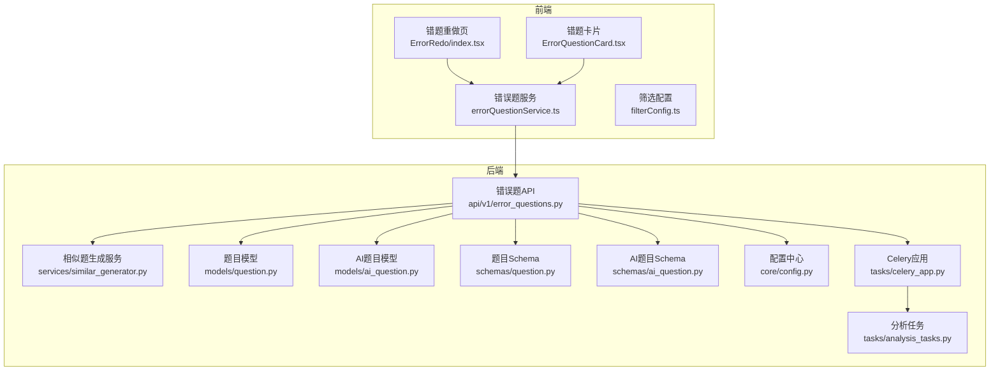
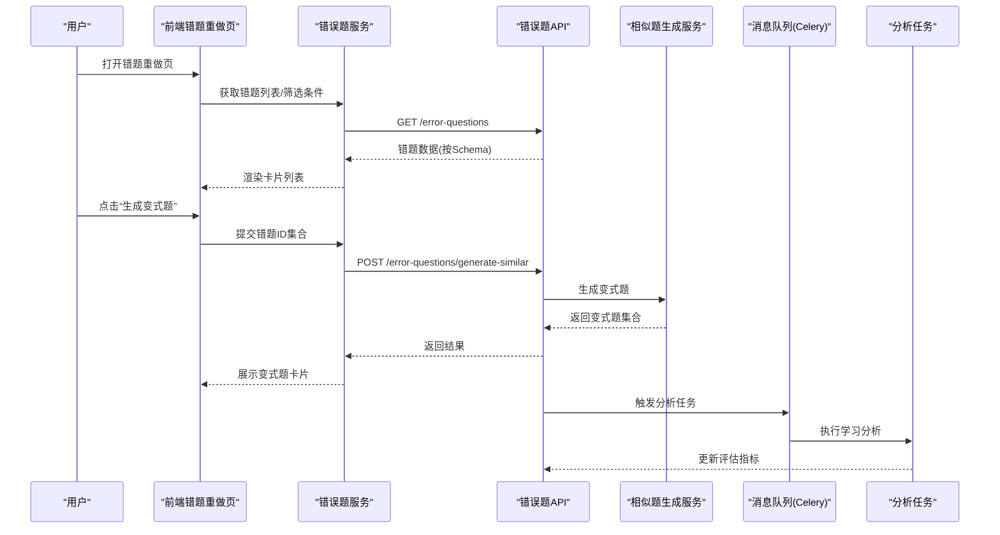
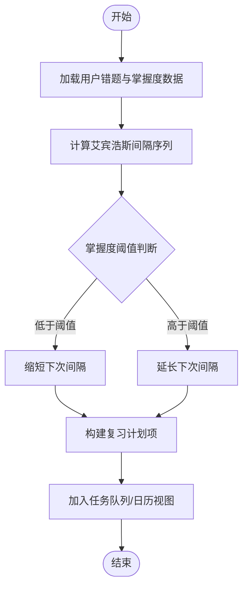
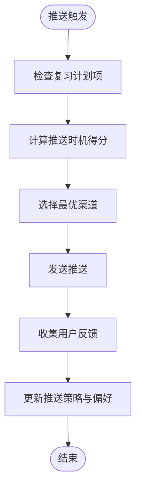
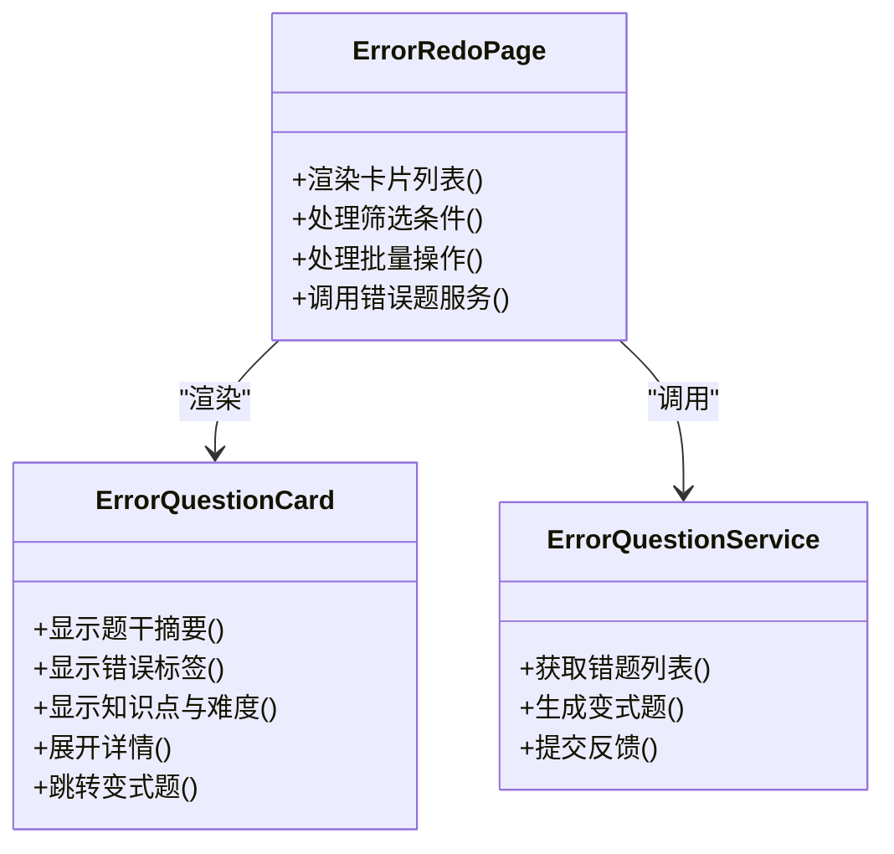
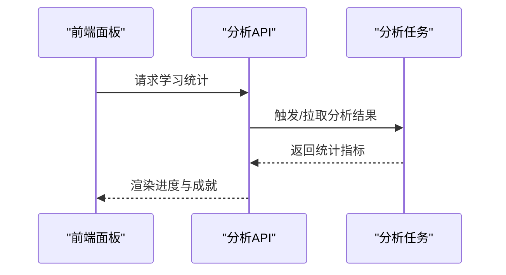
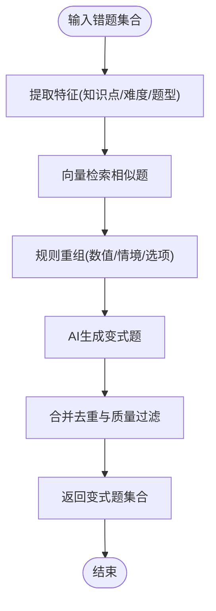
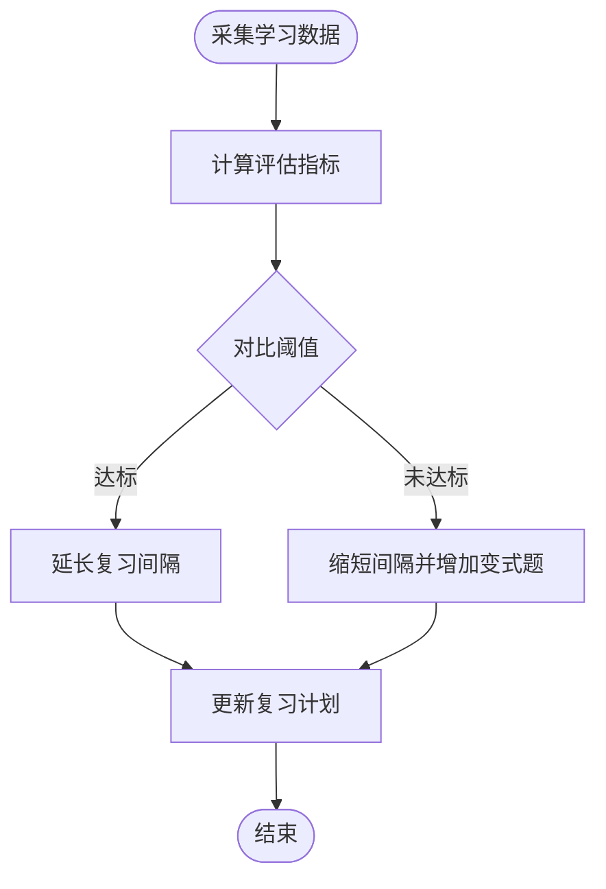
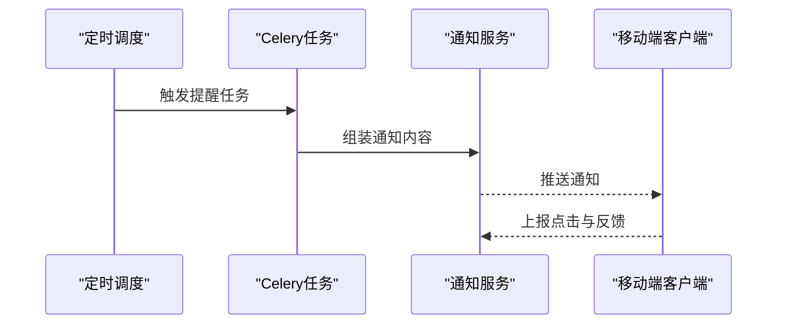
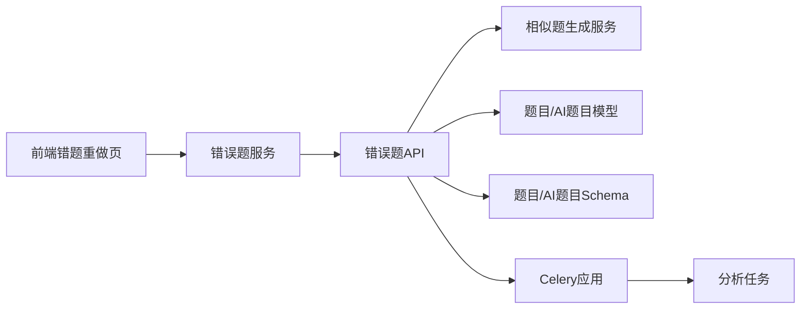

# 复习管理系统

<cite>
**本文引用的文件**   
- [backend/app/api/v1/error_questions.py](file://backend/app/api/v1/error_questions.py)
- [backend/app/services/similar_generator.py](file://backend/app/services/similar_generator.py)
- [backend/app/models/question.py](file://backend/app/models/question.py)
- [backend/app/models/ai_question.py](file://backend/app/models/ai_question.py)
- [backend/app/schemas/question.py](file://backend/app/schemas/question.py)
- [backend/app/schemas/ai_question.py](file://backend/app/schemas/ai_question.py)
- [backend/app/core/config.py](file://backend/app/core/config.py)
- [backend/app/tasks/celery_app.py](file://backend/app/tasks/celery_app.py)
- [backend/app/tasks/analysis_tasks.py](file://backend/app/tasks/analysis_tasks.py)
- [frontend/src/components/ErrorQuestionCard.tsx](file://frontend/src/components/ErrorQuestionCard.tsx)
- [frontend/src/pages/AssignmentManagement/ErrorRedo/index.tsx](file://frontend/src/pages/AssignmentManagement/ErrorRedo/index.tsx)
- [frontend/src/services/errorQuestionService.ts](file://frontend/src/services/errorQuestionService.ts)
- [frontend/src/utils/filterConfig.ts](file://frontend/src/utils/filterConfig.ts)
</cite>

## 目录
1. [简介](#简介)
2. [项目结构](#项目结构)
3. [核心组件](#核心组件)
4. [架构总览](#架构总览)
5. [详细组件分析](#详细组件分析)
6. [依赖分析](#依赖分析)
7. [性能考虑](#性能考虑)
8. [故障排查指南](#故障排查指南)
9. [结论](#结论)
10. [附录](#附录)

## 简介
本文件面向开发者与产品实现团队，系统化阐述“复习管理系统”的关键能力与设计：基于艾宾浩斯遗忘曲线与个性化掌握度的复习计划生成算法、智能推送机制（时机选择、渠道管理、反馈收集）、错题本界面设计（卡片式展示、筛选排序、批量操作）、复习进度跟踪与激励机制（连续打卡、成就系统）、错题重组与变式题生成技术、复习效果评估与计划动态调整、复习提醒通知系统与移动端适配方案，以及扩展新策略与交互模式的开发指引。

## 项目结构
后端采用分层架构：API 层暴露 REST 接口，服务层封装业务逻辑（含相似题生成、知识追踪等），模型与 Schema 定义数据契约，任务队列用于异步处理（如分析与向量任务）。前端以 React + TypeScript 构建，提供错题本页面、卡片组件与服务调用封装，并内置筛选配置工具。

**图表来源** 
- [backend/app/api/v1/error_questions.py](file://backend/app/api/v1/error_questions.py)
- [backend/app/services/similar_generator.py](file://backend/app/services/similar_generator.py)
- [backend/app/models/question.py](file://backend/app/models/question.py)
- [backend/app/models/ai_question.py](file://backend/app/models/ai_question.py)
- [backend/app/schemas/question.py](file://backend/app/schemas/question.py)
- [backend/app/schemas/ai_question.py](file://backend/app/schemas/ai_question.py)
- [backend/app/core/config.py](file://backend/app/core/config.py)
- [backend/app/tasks/celery_app.py](file://backend/app/tasks/celery_app.py)
- [backend/app/tasks/analysis_tasks.py](file://backend/app/tasks/analysis_tasks.py)
- [frontend/src/pages/AssignmentManagement/ErrorRedo/index.tsx](file://frontend/src/pages/AssignmentManagement/ErrorRedo/index.tsx)
- [frontend/src/components/ErrorQuestionCard.tsx](file://frontend/src/components/ErrorQuestionCard.tsx)
- [frontend/src/services/errorQuestionService.ts](file://frontend/src/services/errorQuestionService.ts)
- [frontend/src/utils/filterConfig.ts](file://frontend/src/utils/filterConfig.ts)

**章节来源**
- [backend/app/api/v1/error_questions.py](file://backend/app/api/v1/error_questions.py)
- [backend/app/services/similar_generator.py](file://backend/app/services/similar_generator.py)
- [backend/app/models/question.py](file://backend/app/models/question.py)
- [backend/app/models/ai_question.py](file://backend/app/models/ai_question.py)
- [backend/app/schemas/question.py](file://backend/app/schemas/question.py)
- [backend/app/schemas/ai_question.py](file://backend/app/schemas/ai_question.py)
- [backend/app/core/config.py](file://backend/app/core/config.py)
- [backend/app/tasks/celery_app.py](file://backend/app/tasks/celery_app.py)
- [backend/app/tasks/analysis_tasks.py](file://backend/app/tasks/analysis_tasks.py)
- [frontend/src/pages/AssignmentManagement/ErrorRedo/index.tsx](file://frontend/src/pages/AssignmentManagement/ErrorRedo/index.tsx)
- [frontend/src/components/ErrorQuestionCard.tsx](file://frontend/src/components/ErrorQuestionCard.tsx)
- [frontend/src/services/errorQuestionService.ts](file://frontend/src/services/errorQuestionService.ts)
- [frontend/src/utils/filterConfig.ts](file://frontend/src/utils/filterConfig.ts)

## 核心组件
- 错题本与重做流程：前端通过错误题服务调用后端 API，渲染卡片式错题列表，支持筛选、排序与批量操作；后端聚合错题数据并返回结构化结果。
- 相似题与变式题生成：服务层根据错题特征与知识点标签，调用相似题生成器产出变式题，避免机械重复练习。
- 异步任务与分析：Celery 应用承载分析类任务，结合分析任务模块进行学习行为统计与效果评估。
- 配置与数据契约：统一配置入口与前后端数据 Schema，确保接口稳定与类型安全。

**章节来源**
- [frontend/src/pages/AssignmentManagement/ErrorRedo/index.tsx](file://frontend/src/pages/AssignmentManagement/ErrorRedo/index.tsx)
- [frontend/src/components/ErrorQuestionCard.tsx](file://frontend/src/components/ErrorQuestionCard.tsx)
- [frontend/src/services/errorQuestionService.ts](file://frontend/src/services/errorQuestionService.ts)
- [backend/app/api/v1/error_questions.py](file://backend/app/api/v1/error_questions.py)
- [backend/app/services/similar_generator.py](file://backend/app/services/similar_generator.py)
- [backend/app/tasks/celery_app.py](file://backend/app/tasks/celery_app.py)
- [backend/app/tasks/analysis_tasks.py](file://backend/app/tasks/analysis_tasks.py)
- [backend/app/core/config.py](file://backend/app/core/config.py)
- [backend/app/schemas/question.py](file://backend/app/schemas/question.py)
- [backend/app/schemas/ai_question.py](file://backend/app/schemas/ai_question.py)

## 架构总览
系统由前端页面与组件、后端 API 与服务、数据模型与 Schema、异步任务与配置组成。关键交互包括：前端发起错题查询与变式题生成请求，后端路由到对应服务，读取模型数据并按 Schema 校验返回；分析类任务通过 Celery 异步执行，支撑复习效果评估与计划调整。

**图表来源** 
- [frontend/src/pages/AssignmentManagement/ErrorRedo/index.tsx](file://frontend/src/pages/AssignmentManagement/ErrorRedo/index.tsx)
- [frontend/src/services/errorQuestionService.ts](file://frontend/src/services/errorQuestionService.ts)
- [backend/app/api/v1/error_questions.py](file://backend/app/api/v1/error_questions.py)
- [backend/app/services/similar_generator.py](file://backend/app/services/similar_generator.py)
- [backend/app/tasks/celery_app.py](file://backend/app/tasks/celery_app.py)
- [backend/app/tasks/analysis_tasks.py](file://backend/app/tasks/analysis_tasks.py)

## 详细组件分析

### 复习计划生成算法（基于艾宾浩斯与个性化掌握度）
- 算法要点
  - 遗忘曲线间隔：依据艾宾浩斯曲线设定首次复习间隔与后续递增间隔（例如 1天、2天、4天、7天、15天、30天），可配置化。
  - 个性化掌握度：结合历史答题正确率、用时、错误类型分布等指标计算掌握度权重，动态调整下一次复习时间。
  - 难度自适应：对高难度知识点缩短间隔，低难度延长间隔，平衡记忆巩固与学习效率。
  - 计划生成与调度：将复习任务写入任务队列，按日/周维度批量生成，支持增量更新与冲突消解。
- 数据结构与复杂度
  - 主要实体：用户、知识点、错题记录、复习计划项。
  - 时间复杂度：单次计划生成 O(N log N)（N为待复习题量），批量调度 O(M)（M为批次大小）。
  - 空间复杂度：O(N) 存储计划项与中间状态。
- 优化建议
  - 缓存热点知识点与用户画像，减少重复计算。
  - 使用优先级队列按紧迫度排序，提升用户体验。
  - 引入滑动窗口统计近期表现，平滑波动。

[本节为概念性说明，不直接分析具体文件]

### 智能推送机制（时机选择、渠道管理、用户反馈收集）
- 推送时机选择
  - 基于用户活跃时段、最近学习时长、未完成任务数量与紧迫度评分，选择最佳推送时刻。
  - 结合复习计划项的到期时间与优先级，设置定时任务触发推送。
- 渠道管理
  - 支持站内信、邮件、短信、移动端推送等多渠道；渠道可用性、送达率与用户偏好作为路由决策因子。
- 用户反馈收集
  - 在推送卡片中嵌入“稍后提醒”“不再推送”“已复习”等反馈按钮，回传后端更新用户偏好与推送策略。
- 流程图

[本节为概念性说明，不直接分析具体文件]

### 错题本界面设计（卡片式展示、筛选排序、批量操作）
- 卡片式展示
  - 每个错题卡片包含题干摘要、错误原因标签、知识点、难度、上次作答时间、掌握度趋势等元信息。
  - 支持展开详情、查看解析与变式题入口。
- 筛选与排序
  - 按知识点、难度、错误类型、时间范围筛选；支持按掌握度、错误次数、最后复习时间排序。
  - 筛选配置集中管理，便于复用与扩展。
- 批量操作
  - 多选错题进行批量复习、批量标记已掌握、批量导出或批量生成变式题。
- 组件关系图

**图表来源** 
- [frontend/src/components/ErrorQuestionCard.tsx](file://frontend/src/components/ErrorQuestionCard.tsx)
- [frontend/src/pages/AssignmentManagement/ErrorRedo/index.tsx](file://frontend/src/pages/AssignmentManagement/ErrorRedo/index.tsx)
- [frontend/src/services/errorQuestionService.ts](file://frontend/src/services/errorQuestionService.ts)

**章节来源**
- [frontend/src/components/ErrorQuestionCard.tsx](file://frontend/src/components/ErrorQuestionCard.tsx)
- [frontend/src/pages/AssignmentManagement/ErrorRedo/index.tsx](file://frontend/src/pages/AssignmentManagement/ErrorRedo/index.tsx)
- [frontend/src/services/errorQuestionService.ts](file://frontend/src/services/errorQuestionService.ts)
- [frontend/src/utils/filterConfig.ts](file://frontend/src/utils/filterConfig.ts)

### 复习进度跟踪与激励机制（连续打卡、成就系统）
- 进度跟踪
  - 统计每日完成题量、正确率、平均用时、知识点覆盖度，形成可视化面板。
  - 记录连续打卡天数与中断原因，辅助个性化干预。
- 激励机制
  - 连续打卡奖励：达到里程碑发放徽章或积分。
  - 成就系统：按知识点掌握、变式题完成、错题清零等维度颁发成就。
- 数据流

[本节为概念性说明，不直接分析具体文件]

### 错题重组与变式题生成技术（避免机械重复）
- 技术路径
  - 语义相似度：基于题干与解析的向量表示计算相似度，选取相近但不完全相同的题目。
  - 规则重组：替换数值、情境、选项顺序，保持知识点与难度一致。
  - AI增强：利用大模型生成变式题，注入不同背景或提问方式，提高多样性。
- 服务与模型
  - 相似题生成服务负责组合规则与模型输出，返回符合 Schema 的变式题集合。
  - 模型层维护题目与 AI 题目的关联，支持溯源与版本控制。
- 流程图

**图表来源** 
- [backend/app/services/similar_generator.py](file://backend/app/services/similar_generator.py)
- [backend/app/models/question.py](file://backend/app/models/question.py)
- [backend/app/models/ai_question.py](file://backend/app/models/ai_question.py)
- [backend/app/schemas/question.py](file://backend/app/schemas/question.py)
- [backend/app/schemas/ai_question.py](file://backend/app/schemas/ai_question.py)

**章节来源**
- [backend/app/services/similar_generator.py](file://backend/app/services/similar_generator.py)
- [backend/app/models/question.py](file://backend/app/models/question.py)
- [backend/app/models/ai_question.py](file://backend/app/models/ai_question.py)
- [backend/app/schemas/question.py](file://backend/app/schemas/question.py)
- [backend/app/schemas/ai_question.py](file://backend/app/schemas/ai_question.py)

### 复习效果评估与计划动态调整机制
- 评估指标
  - 短期：当日正确率、用时、错误类型分布。
  - 长期：知识点掌握度趋势、复习间隔有效性、变式题迁移成功率。
- 动态调整
  - 若某知识点连续多次正确且用时下降，则延长间隔；反之缩短间隔并增加变式题比例。
  - 结合用户反馈（如“仍不会”“太简单”）进行策略微调。
- 任务驱动
  - 分析任务定期运行，更新评估指标并触发计划调整。

[本节为概念性说明，不直接分析具体文件]

### 复习提醒通知系统与移动端适配方案
- 提醒系统
  - 基于 Celery 定时任务触发提醒，支持多语言模板与多渠道投递。
  - 提醒内容包含今日任务、紧迫度提示与一键进入复习入口。
- 移动端适配
  - 响应式布局与触摸友好的卡片交互。
  - 离线缓存与弱网重试，保障体验稳定性。
  - 推送通道适配 iOS/Android 平台差异。

**图表来源** 
- [backend/app/tasks/celery_app.py](file://backend/app/tasks/celery_app.py)
- [backend/app/tasks/analysis_tasks.py](file://backend/app/tasks/analysis_tasks.py)

**章节来源**
- [backend/app/tasks/celery_app.py](file://backend/app/tasks/celery_app.py)
- [backend/app/tasks/analysis_tasks.py](file://backend/app/tasks/analysis_tasks.py)

### 扩展新复习策略与用户交互模式（开发者指南）
- 新增复习策略
  - 在服务层注册新的策略函数，定义输入参数（用户画像、错题集合、知识点标签）与输出（复习计划项）。
  - 在计划生成流程中接入策略选择器，支持按用户分组或实验分流。
- 新增交互模式
  - 在前端新增页面或组件，封装服务调用与本地状态管理。
  - 通过统一的筛选配置与卡片组件复用，降低重复开发成本。
- 数据契约与测试
  - 扩展 Schema 并保证向后兼容。
  - 编写单元测试与集成测试，覆盖边界条件与异常路径。

[本节为概念性说明，不直接分析具体文件]

## 依赖分析
- 组件耦合
  - API 层依赖服务层与模型层，服务层依赖相似题生成器与外部 AI 能力。
  - 前端通过服务层与 API 交互，组件间通过 props 与 hooks 传递状态。
- 外部依赖
  - Celery 任务队列用于异步分析。
  - 配置中心统一管理环境变量与功能开关。
- 潜在循环依赖
  - 服务层不应反向导入 API 层；模型与 Schema 仅用于数据契约，避免业务逻辑耦合。

**图表来源** 
- [frontend/src/pages/AssignmentManagement/ErrorRedo/index.tsx](file://frontend/src/pages/AssignmentManagement/ErrorRedo/index.tsx)
- [frontend/src/services/errorQuestionService.ts](file://frontend/src/services/errorQuestionService.ts)
- [backend/app/api/v1/error_questions.py](file://backend/app/api/v1/error_questions.py)
- [backend/app/services/similar_generator.py](file://backend/app/services/similar_generator.py)
- [backend/app/models/question.py](file://backend/app/models/question.py)
- [backend/app/models/ai_question.py](file://backend/app/models/ai_question.py)
- [backend/app/schemas/question.py](file://backend/app/schemas/question.py)
- [backend/app/schemas/ai_question.py](file://backend/app/schemas/ai_question.py)
- [backend/app/tasks/celery_app.py](file://backend/app/tasks/celery_app.py)
- [backend/app/tasks/analysis_tasks.py](file://backend/app/tasks/analysis_tasks.py)

**章节来源**
- [backend/app/api/v1/error_questions.py](file://backend/app/api/v1/error_questions.py)
- [backend/app/services/similar_generator.py](file://backend/app/services/similar_generator.py)
- [backend/app/models/question.py](file://backend/app/models/question.py)
- [backend/app/models/ai_question.py](file://backend/app/models/ai_question.py)
- [backend/app/schemas/question.py](file://backend/app/schemas/question.py)
- [backend/app/schemas/ai_question.py](file://backend/app/schemas/ai_question.py)
- [backend/app/tasks/celery_app.py](file://backend/app/tasks/celery_app.py)
- [backend/app/tasks/analysis_tasks.py](file://backend/app/tasks/analysis_tasks.py)
- [frontend/src/pages/AssignmentManagement/ErrorRedo/index.tsx](file://frontend/src/pages/AssignmentManagement/ErrorRedo/index.tsx)
- [frontend/src/services/errorQuestionService.ts](file://frontend/src/services/errorQuestionService.ts)

## 性能考虑
- 前端
  - 虚拟滚动与分页加载，减少首屏渲染压力。
  - 本地缓存筛选条件与常用变式题结果，降低网络请求。
- 后端
  - 数据库索引优化（知识点、难度、时间戳字段）。
  - 相似题生成服务引入缓存与批处理，避免重复计算。
  - Celery 任务分片与限流，防止高峰期阻塞。
- 网络与推送
  - 压缩传输与增量同步，减少带宽占用。
  - 推送去重与退避重试，避免风暴。

[本节为通用指导，不直接分析具体文件]

## 故障排查指南
- 常见问题
  - 变式题生成失败：检查相似题生成服务日志与外部 AI 调用状态码。
  - 推送未送达：核对渠道配置与用户设备令牌有效性。
  - 计划未更新：确认分析任务是否成功执行与指标写入。
- 定位步骤
  - 前端：查看网络请求与错误提示，确认服务调用链路。
  - 后端：检查 API 日志、Celery Worker 日志与任务结果。
  - 数据：核对模型与 Schema 一致性，验证必填字段与约束。

**章节来源**
- [backend/app/services/similar_generator.py](file://backend/app/services/similar_generator.py)
- [backend/app/tasks/celery_app.py](file://backend/app/tasks/celery_app.py)
- [backend/app/tasks/analysis_tasks.py](file://backend/app/tasks/analysis_tasks.py)
- [backend/app/core/config.py](file://backend/app/core/config.py)

## 结论
本复习管理系统以错题本为核心，结合艾宾浩斯遗忘曲线与个性化掌握度，构建智能复习计划与变式题生成能力。通过 Celery 异步任务与分析评估，实现计划的动态调整与效果量化。前端以卡片式交互与灵活筛选提升用户体验，同时预留扩展点以支持新策略与交互模式。整体架构清晰、职责分离，具备良好的可维护性与可扩展性。

## 附录
- 术语表
  - 艾宾浩斯遗忘曲线：描述人类记忆随时间衰减规律的心理学模型。
  - 变式题：保持知识点与难度不变，改变题干情境或提问方式的题目。
  - 掌握度：综合正确率、用时与错误类型计算的知识点掌握水平指标。
- 参考实现路径
  - 错题重做页与服务调用：[frontend/src/pages/AssignmentManagement/ErrorRedo/index.tsx](file://frontend/src/pages/AssignmentManagement/ErrorRedo/index.tsx)、[frontend/src/services/errorQuestionService.ts](file://frontend/src/services/errorQuestionService.ts)
  - 相似题生成服务：[backend/app/services/similar_generator.py](file://backend/app/services/similar_generator.py)
  - 任务队列与分析任务：[backend/app/tasks/celery_app.py](file://backend/app/tasks/celery_app.py)、[backend/app/tasks/analysis_tasks.py](file://backend/app/tasks/analysis_tasks.py)
  - 配置中心：[backend/app/core/config.py](file://backend/app/core/config.py)