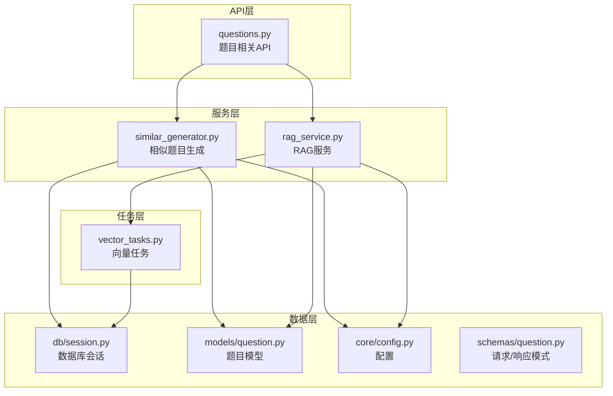
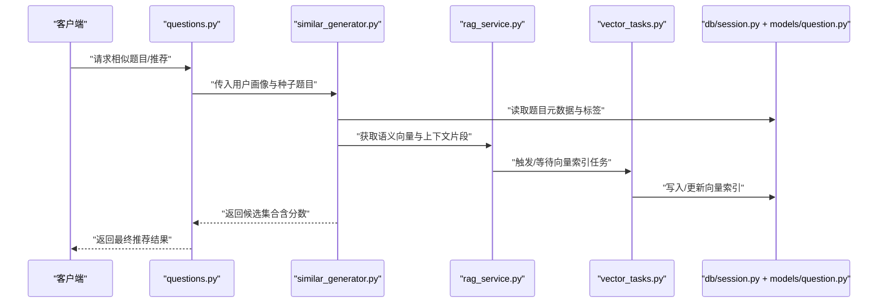
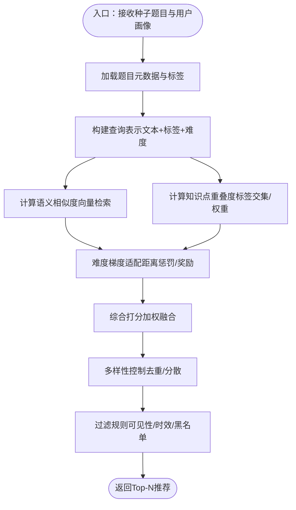
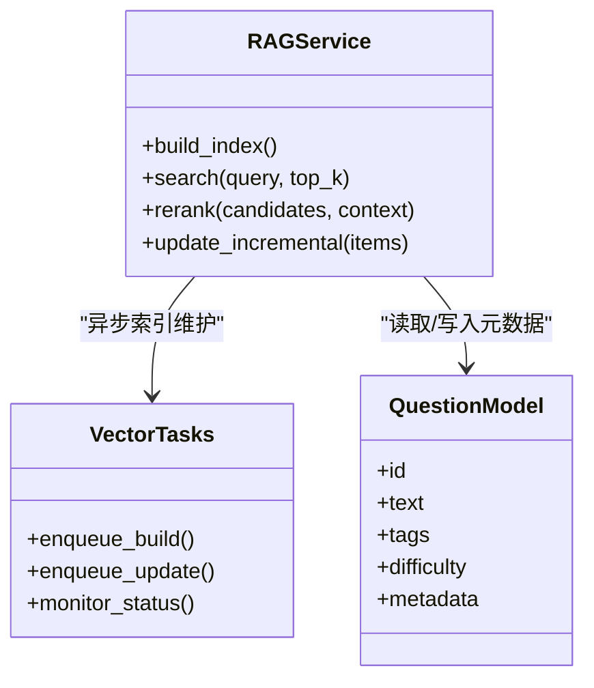
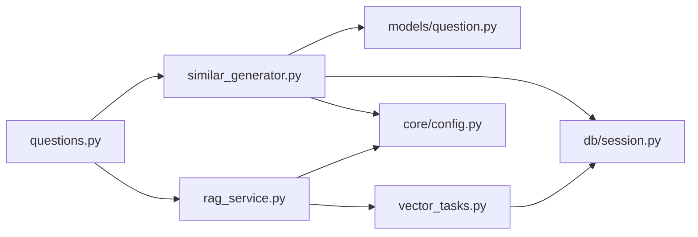

# 智能推荐引擎

<cite>
**本文引用的文件**   
- [backend/app/services/similar_generator.py](file://backend/app/services/similar_generator.py)
- [backend/app/services/rag_service.py](file://backend/app/services/rag_service.py)
- [backend/app/api/v1/questions.py](file://backend/app/api/v1/questions.py)
- [backend/app/models/question.py](file://backend/app/models/question.py)
- [backend/app/tasks/vector_tasks.py](file://backend/app/tasks/vector_tasks.py)
- [backend/app/core/config.py](file://backend/app/core/config.py)
- [backend/app/db/session.py](file://backend/app/db/session.py)
- [backend/app/schemas/question.py](file://backend/app/schemas/question.py)
</cite>

## 目录
1. [简介](#简介)
2. [项目结构](#项目结构)
3. [核心组件](#核心组件)
4. [架构总览](#架构总览)
5. [详细组件分析](#详细组件分析)
6. [依赖关系分析](#依赖关系分析)
7. [性能考量](#性能考量)
8. [故障排查指南](#故障排查指南)
9. [结论](#结论)
10. [附录](#附录)

## 简介
本文件面向开发者与算法工程师，系统化阐述智能推荐引擎的设计与实现，重点覆盖：
- 相似题目匹配算法：语义相似度计算、知识点重叠度分析、难度梯度适配
- 向量检索增强生成（RAG）在题目推荐中的应用：索引构建、查询优化、结果排序
- 多目标推荐策略：平衡知识点覆盖、难度适宜性、新颖性等
- 冷启动问题与新题快速融入机制
- 多样性控制与过滤规则
- 推荐效果评估指标与A/B测试框架
- 在线学习与自适应调整机制
- 集成新算法与优化现有模型的方法

## 项目结构
后端采用分层架构：API层暴露接口，服务层封装业务逻辑，任务层处理异步工作流，数据层通过ORM访问数据库。推荐相关能力集中在服务层与任务层，并通过配置与数据库会话进行外部依赖注入。

图表来源
- [backend/app/api/v1/questions.py](file://backend/app/api/v1/questions.py)
- [backend/app/services/similar_generator.py](file://backend/app/services/similar_generator.py)
- [backend/app/services/rag_service.py](file://backend/app/services/rag_service.py)
- [backend/app/tasks/vector_tasks.py](file://backend/app/tasks/vector_tasks.py)
- [backend/app/db/session.py](file://backend/app/db/session.py)
- [backend/app/models/question.py](file://backend/app/models/question.py)
- [backend/app/core/config.py](file://backend/app/core/config.py)
- [backend/app/schemas/question.py](file://backend/app/schemas/question.py)

章节来源
- [backend/app/api/v1/questions.py](file://backend/app/api/v1/questions.py)
- [backend/app/services/similar_generator.py](file://backend/app/services/similar_generator.py)
- [backend/app/services/rag_service.py](file://backend/app/services/rag_service.py)
- [backend/app/tasks/vector_tasks.py](file://backend/app/tasks/vector_tasks.py)
- [backend/app/db/session.py](file://backend/app/db/session.py)
- [backend/app/models/question.py](file://backend/app/models/question.py)
- [backend/app/core/config.py](file://backend/app/core/config.py)
- [backend/app/schemas/question.py](file://backend/app/schemas/question.py)

## 核心组件
- 相似题目生成器：负责基于语义与知识图谱的混合策略召回候选集，并进行难度梯度适配与多样性筛选。
- RAG服务：将题目文本与元数据进行向量化，提供检索增强能力，用于提升推荐质量与可解释性。
- 向量任务：异步构建与维护向量索引，支持增量更新与批量重建。
- 配置与会话：集中管理外部依赖（如向量库、嵌入模型）与数据库连接。
- 数据模型与模式：定义题目实体结构与API输入输出契约。

章节来源
- [backend/app/services/similar_generator.py](file://backend/app/services/similar_generator.py)
- [backend/app/services/rag_service.py](file://backend/app/services/rag_service.py)
- [backend/app/tasks/vector_tasks.py](file://backend/app/tasks/vector_tasks.py)
- [backend/app/core/config.py](file://backend/app/core/config.py)
- [backend/app/db/session.py](file://backend/app/db/session.py)
- [backend/app/models/question.py](file://backend/app/models/question.py)
- [backend/app/schemas/question.py](file://backend/app/schemas/question.py)

## 架构总览
推荐系统由“召回—排序—重排—过滤”四阶段构成，结合RAG增强上下文，形成端到端推荐链路。

图表来源
- [backend/app/api/v1/questions.py](file://backend/app/api/v1/questions.py)
- [backend/app/services/similar_generator.py](file://backend/app/services/similar_generator.py)
- [backend/app/services/rag_service.py](file://backend/app/services/rag_service.py)
- [backend/app/tasks/vector_tasks.py](file://backend/app/tasks/vector_tasks.py)
- [backend/app/db/session.py](file://backend/app/db/session.py)
- [backend/app/models/question.py](file://backend/app/models/question.py)

## 详细组件分析

### 相似题目匹配算法
该模块实现“语义相似度 + 知识点重叠度 + 难度梯度适配”的混合匹配流程，兼顾相关性、学习路径与个性化。

图表来源
- [backend/app/services/similar_generator.py](file://backend/app/services/similar_generator.py)
- [backend/app/services/rag_service.py](file://backend/app/services/rag_service.py)
- [backend/app/models/question.py](file://backend/app/models/question.py)

章节来源
- [backend/app/services/similar_generator.py](file://backend/app/services/similar_generator.py)
- [backend/app/services/rag_service.py](file://backend/app/services/rag_service.py)
- [backend/app/models/question.py](file://backend/app/models/question.py)

#### 语义相似度计算
- 使用嵌入模型将题目文本与关键描述编码为向量；通过向量检索近似最近邻搜索获得候选。
- 支持多种相似度度量（如余弦相似度），并可根据业务需求引入归一化或阈值截断。
- 与RAG服务协作，从检索到的上下文中抽取支撑片段，增强可解释性与排序稳定性。

章节来源
- [backend/app/services/rag_service.py](file://backend/app/services/rag_service.py)
- [backend/app/tasks/vector_tasks.py](file://backend/app/tasks/vector_tasks.py)

#### 知识点重叠度分析
- 基于题目的知识点标签集合，计算与种子题目或用户掌握图谱的重叠比例与权重。
- 可采用Jaccard、TF-IDF加权或图相似度等方法，结合标签层级结构进行深度匹配。
- 对高频泛化标签降权，对细粒度标签升权，避免“大而全”的标签主导排序。

章节来源
- [backend/app/models/question.py](file://backend/app/models/question.py)
- [backend/app/services/similar_generator.py](file://backend/app/services/similar_generator.py)

#### 难度梯度适配
- 根据用户当前水平与历史表现，计算目标题目难度与用户能力的差距。
- 采用距离函数（如绝对差、相对比例）进行惩罚或奖励，确保推荐符合“最近发展区”。
- 支持动态调节系数，随用户进步逐步提高难度上限。

章节来源
- [backend/app/services/similar_generator.py](file://backend/app/services/similar_generator.py)

### 向量检索增强生成（RAG）在推荐中的应用
RAG将“检索—增强—生成/排序”串联，提升推荐的相关性与可解释性。

图表来源
- [backend/app/services/rag_service.py](file://backend/app/services/rag_service.py)
- [backend/app/tasks/vector_tasks.py](file://backend/app/tasks/vector_tasks.py)
- [backend/app/models/question.py](file://backend/app/models/question.py)

章节来源
- [backend/app/services/rag_service.py](file://backend/app/services/rag_service.py)
- [backend/app/tasks/vector_tasks.py](file://backend/app/tasks/vector_tasks.py)
- [backend/app/models/question.py](file://backend/app/models/question.py)

#### 向量数据库索引
- 将题目文本、摘要与结构化标签拼接为检索单元，生成向量并写入向量库。
- 支持批量导入与增量更新，保证索引新鲜度与一致性。
- 索引字段包含主键、向量、元数据，便于后续过滤与重排。

章节来源
- [backend/app/tasks/vector_tasks.py](file://backend/app/tasks/vector_tasks.py)
- [backend/app/services/rag_service.py](file://backend/app/services/rag_service.py)

#### 查询优化
- 预取用户画像与上下文，减少重复IO。
- 对查询文本进行清洗与关键词提取，提升召回质量。
- 使用多级过滤（知识点、难度区间、时间窗口）缩小候选空间。

章节来源
- [backend/app/services/rag_service.py](file://backend/app/services/rag_service.py)
- [backend/app/api/v1/questions.py](file://backend/app/api/v1/questions.py)

#### 结果排序
- 初筛：向量相似度得分。
- 精排：融合知识点重叠度、难度梯度、新颖性、多样性等特征。
- 重排：基于RAG上下文片段进行可解释性加分与异常抑制。

章节来源
- [backend/app/services/similar_generator.py](file://backend/app/services/similar_generator.py)
- [backend/app/services/rag_service.py](file://backend/app/services/rag_service.py)

### 多目标推荐策略
- 知识点覆盖：优先补充薄弱知识点，同时保持一定广度，避免过度窄化。
- 难度适宜性：依据用户能力估计值，选择难度略高于当前水平的题目。
- 新颖性：降低近期已做过的题目权重，鼓励探索新题型与新情境。
- 多样性：控制主题与标签分布，避免同质化推荐。

章节来源
- [backend/app/services/similar_generator.py](file://backend/app/services/similar_generator.py)

### 冷启动问题与新题快速融入
- 新用户：基于人口统计与初始问卷进行粗粒度画像，先以热门与高信度题目作为冷启动推荐。
- 新题目：入库后触发向量索引增量任务，尽快进入检索池；初期给予较低曝光权重，随反馈逐步提升。
- 快速融入：采用“热插拔”索引更新，保证低延迟上线新题。

章节来源
- [backend/app/tasks/vector_tasks.py](file://backend/app/tasks/vector_tasks.py)
- [backend/app/services/rag_service.py](file://backend/app/services/rag_service.py)

### 多样性控制与过滤规则
- 多样性控制：按标签聚类打散、最大相关最小冗余（MMR）思想、主题分布约束。
- 过滤规则：排除不可见、过期、黑名单题目；限制同一来源/作者占比；控制连续重复标签。

章节来源
- [backend/app/services/similar_generator.py](file://backend/app/services/similar_generator.py)

### 推荐效果评估与A/B测试框架
- 离线指标：NDCG、Recall@K、MRR、覆盖率、多样性指数、平均难度偏差。
- 在线指标：点击率、完成率、停留时长、错误率、复练率。
- A/B测试：分流策略、指标采集、显著性检验、回滚机制。

章节来源
- [backend/app/api/v1/questions.py](file://backend/app/api/v1/questions.py)
- [backend/app/services/similar_generator.py](file://backend/app/services/similar_generator.py)

### 在线学习与自适应调整
- 反馈信号：答题正确率、用时、跳过、收藏、重复练习等行为。
- 模型更新：增量更新用户画像与题目难度参数；定期微调排序权重。
- 自适应：根据实时指标动态调整难度系数与多样性阈值。

章节来源
- [backend/app/services/similar_generator.py](file://backend/app/services/similar_generator.py)

### 集成新算法与优化现有模型
- 插件化接入：在服务层新增策略类，注册到调度器，通过配置开关启用。
- 统一接口：所有算法遵循统一的输入输出契约（候选集、评分、元信息）。
- 灰度发布：按用户ID哈希或实验组分配流量，逐步放量。
- 监控告警：记录关键指标与耗时，异常自动降级至默认策略。

章节来源
- [backend/app/services/similar_generator.py](file://backend/app/services/similar_generator.py)
- [backend/app/core/config.py](file://backend/app/core/config.py)

## 依赖关系分析
推荐系统的关键依赖包括：数据库会话、题目模型、配置中心、向量任务与RAG服务。

图表来源
- [backend/app/api/v1/questions.py](file://backend/app/api/v1/questions.py)
- [backend/app/services/similar_generator.py](file://backend/app/services/similar_generator.py)
- [backend/app/services/rag_service.py](file://backend/app/services/rag_service.py)
- [backend/app/tasks/vector_tasks.py](file://backend/app/tasks/vector_tasks.py)
- [backend/app/db/session.py](file://backend/app/db/session.py)
- [backend/app/models/question.py](file://backend/app/models/question.py)
- [backend/app/core/config.py](file://backend/app/core/config.py)

章节来源
- [backend/app/api/v1/questions.py](file://backend/app/api/v1/questions.py)
- [backend/app/services/similar_generator.py](file://backend/app/services/similar_generator.py)
- [backend/app/services/rag_service.py](file://backend/app/services/rag_service.py)
- [backend/app/tasks/vector_tasks.py](file://backend/app/tasks/vector_tasks.py)
- [backend/app/db/session.py](file://backend/app/db/session.py)
- [backend/app/models/question.py](file://backend/app/models/question.py)
- [backend/app/core/config.py](file://backend/app/core/config.py)

## 性能考量
- 索引构建：批量写入、分片并行、异步队列，避免阻塞在线请求。
- 查询加速：预取上下文、缓存热点向量、多级过滤缩小候选集。
- 内存与I/O：分页拉取、流式处理、合理设置top_k与批大小。
- 容错与降级：索引失败重试、超时熔断、回退到规则推荐。

[本节为通用指导，不直接分析具体文件]

## 故障排查指南
- 常见问题
  - 向量索引未更新：检查向量任务队列状态与幂等性。
  - 推荐结果不稳定：确认相似度阈值与多样性参数是否被频繁变更。
  - 新题未生效：验证增量索引任务是否成功执行。
- 定位方法
  - 查看任务日志与状态表，核对任务生命周期。
  - 对比离线与在线指标差异，定位排序权重漂移。
  - 使用最小复现用例与固定种子题目进行回归测试。

章节来源
- [backend/app/tasks/vector_tasks.py](file://backend/app/tasks/vector_tasks.py)
- [backend/app/services/rag_service.py](file://backend/app/services/rag_service.py)

## 结论
本推荐引擎以“语义+知识+难度”的多维匹配为核心，结合RAG增强与多目标策略，实现了高质量、可解释且可控的推荐体验。通过异步索引与增量更新保障时效性，配合完善的评估与A/B框架，持续迭代优化。未来可在在线学习、因果推断与强化学习方向进一步拓展，以提升长期学习效果与个性化水平。

[本节为总结性内容，不直接分析具体文件]

## 附录
- 术语
  - 语义相似度：基于向量空间的文本相关性度量。
  - 知识点重叠度：两集合间标签重合程度及其权重。
  - 难度梯度适配：根据用户能力调整题目难度距离。
  - RAG：检索增强生成，结合外部知识库提升生成/排序质量。
- 最佳实践
  - 明确指标与目标，避免单一指标优化导致副作用。
  - 小步快跑，灰度发布，及时回滚。
  - 重视数据质量与标注一致性。

[本节为概念性内容，不直接分析具体文件]