# 知识追踪系统

<cite>
**本文引用的文件**   
- [knowledge_tracker.py](file://backend/app/services/knowledge_tracker.py)
- [analytics_aggregator.py](file://backend/app/services/analytics_aggregator.py)
- [analytics.py](file://backend/app/api/v1/analytics.py)
- [analytics.py](file://backend/app/schemas/analytics.py)
- [analysis_tasks.py](file://backend/app/tasks/analysis_tasks.py)
- [assignment.py](file://backend/app/models/assignment.py)
- [question.py](file://backend/app/models/question.py)
- [user.py](file://backend/app/models/user.py)
- [personality.py](file://backend/app/models/personality.py)
- [personality.py](file://backend/app/api/v1/personality.py)
- [KnowledgeHeatmapPanel.tsx](file://frontend/src/pages/LearningAnalytics/KnowledgeHeatmapPanel.tsx)
- [HomeworkStatsPanel.tsx](file://frontend/src/pages/LearningAnalytics/HomeworkStatsPanel.tsx)
- [StudentDashboardPanel.tsx](file://frontend/src/pages/LearningAnalytics/StudentDashboardPanel.tsx)
- [index.tsx](file://frontend/src/pages/LearningAnalytics/index.tsx)
- [analyticsService.ts](file://frontend/src/services/analyticsService.ts)
</cite>

## 目录
1. [简介](#简介)
2. [项目结构](#项目结构)
3. [核心组件](#核心组件)
4. [架构总览](#架构总览)
5. [详细组件分析](#详细组件分析)
6. [依赖关系分析](#依赖关系分析)
7. [性能考虑](#性能考虑)
8. [故障排查指南](#故障排查指南)
9. [结论](#结论)
10. [附录](#附录)

## 简介
本文件面向开发者与教育数据分析师，系统化阐述知识追踪系统的整体设计与实现要点。内容覆盖：
- 知识点图谱构建算法（关联挖掘、层次组织、动态更新）
- 学习薄弱点识别模型（基于历史答题的掌握度评分）
- 个性化学习路径生成（能力画像驱动的练习推荐）
- 知识遗忘曲线应用与复习时机预测
- 学习者画像构建（认知风格、偏好、能力趋势）
- 知识热力图可视化技术实现
- 知识追踪数据的统计分析方法与报告生成机制
- 扩展新知识点分类与分析算法的开发指南

## 项目结构
后端采用分层架构：API 层暴露接口，服务层封装业务逻辑（含知识追踪与分析聚合），任务层处理异步分析，模型层定义数据库实体；前端提供学习分析与可视化页面与服务调用封装。

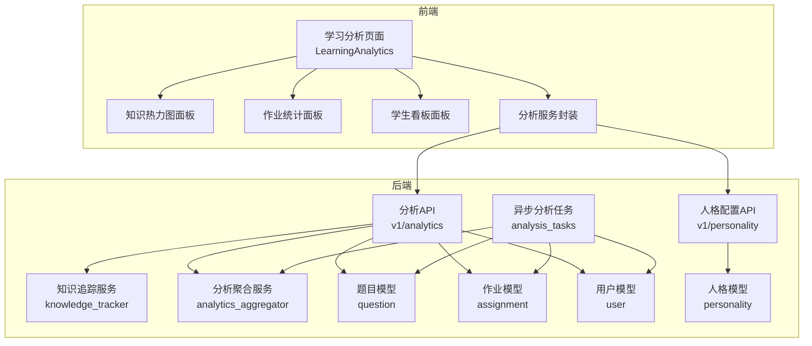

图表来源
- [analytics.py](file://backend/app/api/v1/analytics.py)
- [analytics_aggregator.py](file://backend/app/services/analytics_aggregator.py)
- [knowledge_tracker.py](file://backend/app/services/knowledge_tracker.py)
- [analysis_tasks.py](file://backend/app/tasks/analysis_tasks.py)
- [question.py](file://backend/app/models/question.py)
- [assignment.py](file://backend/app/models/assignment.py)
- [user.py](file://backend/app/models/user.py)
- [personality.py](file://backend/app/models/personality.py)
- [KnowledgeHeatmapPanel.tsx](file://frontend/src/pages/LearningAnalytics/KnowledgeHeatmapPanel.tsx)
- [HomeworkStatsPanel.tsx](file://frontend/src/pages/LearningAnalytics/HomeworkStatsPanel.tsx)
- [StudentDashboardPanel.tsx](file://frontend/src/pages/LearningAnalytics/StudentDashboardPanel.tsx)
- [index.tsx](file://frontend/src/pages/LearningAnalytics/index.tsx)
- [analyticsService.ts](file://frontend/src/services/analyticsService.ts)

章节来源
- [analytics.py](file://backend/app/api/v1/analytics.py)
- [analytics_aggregator.py](file://backend/app/services/analytics_aggregator.py)
- [knowledge_tracker.py](file://backend/app/services/knowledge_tracker.py)
- [analysis_tasks.py](file://backend/app/tasks/analysis_tasks.py)
- [question.py](file://backend/app/models/question.py)
- [assignment.py](file://backend/app/models/assignment.py)
- [user.py](file://backend/app/models/user.py)
- [personality.py](file://backend/app/models/personality.py)
- [KnowledgeHeatmapPanel.tsx](file://frontend/src/pages/LearningAnalytics/KnowledgeHeatmapPanel.tsx)
- [HomeworkStatsPanel.tsx](file://frontend/src/pages/LearningAnalytics/HomeworkStatsPanel.tsx)
- [StudentDashboardPanel.tsx](file://frontend/src/pages/LearningAnalytics/StudentDashboardPanel.tsx)
- [index.tsx](file://frontend/src/pages/LearningAnalytics/index.tsx)
- [analyticsService.ts](file://frontend/src/services/analyticsService.ts)

## 核心组件
- 知识追踪服务：负责将答题事件映射到知识点、计算掌握度、维护时间序列与状态转移。
- 分析聚合服务：汇总多源数据（作业、题目、用户行为）形成可分析的指标集，支持批量与增量聚合。
- 分析API：对外暴露学习分析、薄弱点识别、路径推荐等接口，统一输入输出规范。
- 异步分析任务：在后台执行耗时分析（如全量热力图、路径规划、遗忘曲线拟合）。
- 前端学习分析页面：展示知识热力图、作业统计、学生看板，并调用后端分析服务。

章节来源
- [knowledge_tracker.py](file://backend/app/services/knowledge_tracker.py)
- [analytics_aggregator.py](file://backend/app/services/analytics_aggregator.py)
- [analytics.py](file://backend/app/api/v1/analytics.py)
- [analysis_tasks.py](file://backend/app/tasks/analysis_tasks.py)
- [KnowledgeHeatmapPanel.tsx](file://frontend/src/pages/LearningAnalytics/KnowledgeHeatmapPanel.tsx)
- [HomeworkStatsPanel.tsx](file://frontend/src/pages/LearningAnalytics/HomeworkStatsPanel.tsx)
- [StudentDashboardPanel.tsx](file://frontend/src/pages/LearningAnalytics/StudentDashboardPanel.tsx)
- [index.tsx](file://frontend/src/pages/LearningAnalytics/index.tsx)
- [analyticsService.ts](file://frontend/src/services/analyticsService.ts)

## 架构总览
系统以“事件驱动 + 批流结合”的方式运行：
- 实时/近实时：答题事件进入后，通过知识追踪服务更新掌握度与状态。
- 异步批处理：分析任务定期或触发式执行，产出热力图、路径、遗忘曲线等结果。
- 前端消费：学习分析页面拉取聚合结果进行可视化呈现。

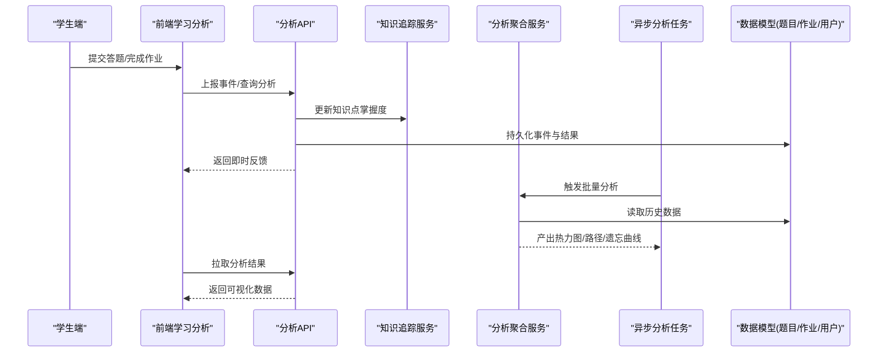

图表来源
- [analytics.py](file://backend/app/api/v1/analytics.py)
- [knowledge_tracker.py](file://backend/app/services/knowledge_tracker.py)
- [analytics_aggregator.py](file://backend/app/services/analytics_aggregator.py)
- [analysis_tasks.py](file://backend/app/tasks/analysis_tasks.py)
- [question.py](file://backend/app/models/question.py)
- [assignment.py](file://backend/app/models/assignment.py)
- [user.py](file://backend/app/models/user.py)

## 详细组件分析

### 知识点图谱构建算法
目标：从题目—知识点标注与答题共现中挖掘关联关系，组织为层次结构，并支持动态更新。

- 关联关系挖掘
  - 共现统计：基于题目与知识点的映射，统计知识点在同一题目或同一学生答题序列中的共现频次。
  - 权重计算：使用频率与置信度加权，得到边权重；可引入时间衰减因子降低过时关联的影响。
  - 阈值过滤：剔除弱关联边，保留强相关子图。
- 层次结构组织
  - 自顶向下：依据知识点标签体系或元数据构建父—子层级。
  - 自底向上：基于聚类或社区发现合并相近节点，形成更粗粒度概念簇。
  - 混合策略：先按标签建层，再用共现强度微调父子关系。
- 动态更新机制
  - 增量更新：新增题目或答题事件后，仅重算受影响节点的关联与权重。
  - 版本快照：对图谱关键版本打快照，便于回溯与对比。
  - 冲突消解：当不同来源的层级不一致时，采用投票或专家规则仲裁。

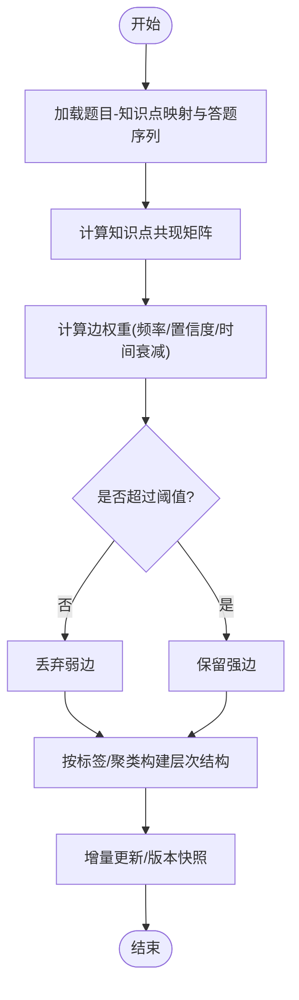

图表来源
- [question.py](file://backend/app/models/question.py)
- [assignment.py](file://backend/app/models/assignment.py)
- [knowledge_tracker.py](file://backend/app/services/knowledge_tracker.py)

章节来源
- [question.py](file://backend/app/models/question.py)
- [assignment.py](file://backend/app/models/assignment.py)
- [knowledge_tracker.py](file://backend/app/services/knowledge_tracker.py)

### 学习薄弱点识别模型
目标：基于历史答题数据计算知识点掌握度评分，识别薄弱点并给出优先级。

- 掌握度评分
  - 基础信号：正确率、作答时长、重试次数、错误类型分布。
  - 时序建模：滑动窗口或指数平滑，反映近期表现与长期趋势。
  - 难度校正：根据题目难度系数对原始得分进行归一化。
- 薄弱点排序
  - 综合得分：将掌握度、遗忘风险、关联重要性融合为单一指标。
  - 阈值策略：低于阈值的知识点标记为薄弱点，并按影响面排序。
- 输出形态
  - 知识点级掌握度向量、薄弱点清单、改进建议摘要。

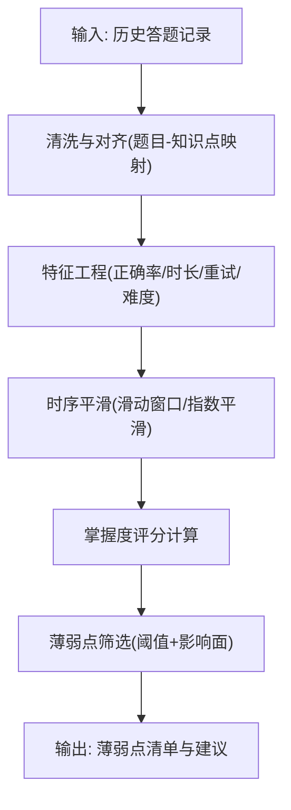

图表来源
- [knowledge_tracker.py](file://backend/app/services/knowledge_tracker.py)
- [analytics_aggregator.py](file://backend/app/services/analytics_aggregator.py)
- [question.py](file://backend/app/models/question.py)

章节来源
- [knowledge_tracker.py](file://backend/app/services/knowledge_tracker.py)
- [analytics_aggregator.py](file://backend/app/services/analytics_aggregator.py)
- [question.py](file://backend/app/models/question.py)

### 个性化学习路径生成算法
目标：根据学生能力画像与薄弱点，推荐针对性练习序列。

- 能力画像
  - 维度：知识点掌握度、遗忘风险、学习速度、偏好题型。
  - 来源：知识追踪结果、人格配置、历史交互。
- 路径规划
  - 目标函数：最大化短期提升收益，兼顾长期巩固。
  - 约束：前置依赖（图谱边）、每日题量上限、难度区间。
  - 搜索策略：贪心选择、A*启发式或强化学习策略（可扩展）。
- 推荐输出
  - 练习序列、预计用时、预期掌握度变化、风险提示。

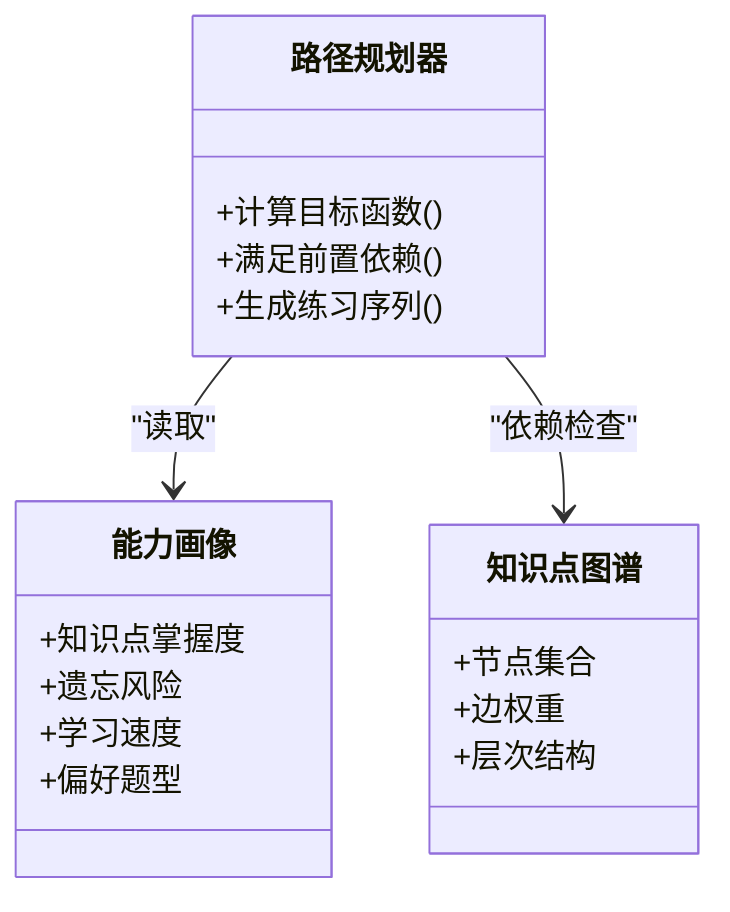

图表来源
- [knowledge_tracker.py](file://backend/app/services/knowledge_tracker.py)
- [personality.py](file://backend/app/models/personality.py)
- [personality.py](file://backend/app/api/v1/personality.py)
- [question.py](file://backend/app/models/question.py)

章节来源
- [knowledge_tracker.py](file://backend/app/services/knowledge_tracker.py)
- [personality.py](file://backend/app/models/personality.py)
- [personality.py](file://backend/app/api/v1/personality.py)
- [question.py](file://backend/app/models/question.py)

### 知识遗忘曲线应用与复习时机预测
目标：利用遗忘曲线模型预测遗忘速率，自动安排复习时机。

- 遗忘曲线模型
  - 经典曲线：Ebbinghaus 指数衰减形式。
  - 参数估计：基于最近一次掌握度与间隔长度拟合。
- 复习时机预测
  - 阈值触发：当预测掌握度低于阈值时触发复习。
  - 间隔重复：按预测遗忘速率调整下次复习间隔。
- 动态校准
  - 在线更新：每次答题后修正遗忘参数。
  - 冷启动：对新知识点采用保守间隔与较高复习频率。

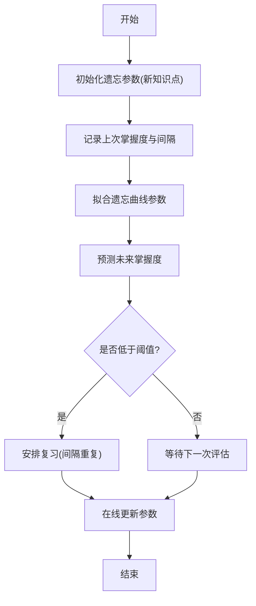

图表来源
- [knowledge_tracker.py](file://backend/app/services/knowledge_tracker.py)
- [analytics_aggregator.py](file://backend/app/services/analytics_aggregator.py)

章节来源
- [knowledge_tracker.py](file://backend/app/services/knowledge_tracker.py)
- [analytics_aggregator.py](file://backend/app/services/analytics_aggregator.py)

### 学习者画像构建
目标：多维度刻画学习者，包括认知风格、学习偏好、能力趋势等。

- 数据来源
  - 人格配置：来自人格模型与人格API。
  - 行为数据：答题时长、重试、错题类型、练习时段。
  - 学业数据：作业成绩、知识点掌握度趋势。
- 维度建模
  - 认知风格：视觉型/听觉型/实践型（可通过问卷或行为推断）。
  - 学习偏好：题型偏好、难度区间、节奏偏好。
  - 能力趋势：短期波动与长期增长斜率。
- 画像更新
  - 增量更新：新行为到来即更新对应维度。
  - 稳定性控制：避免单次异常导致画像剧烈抖动。

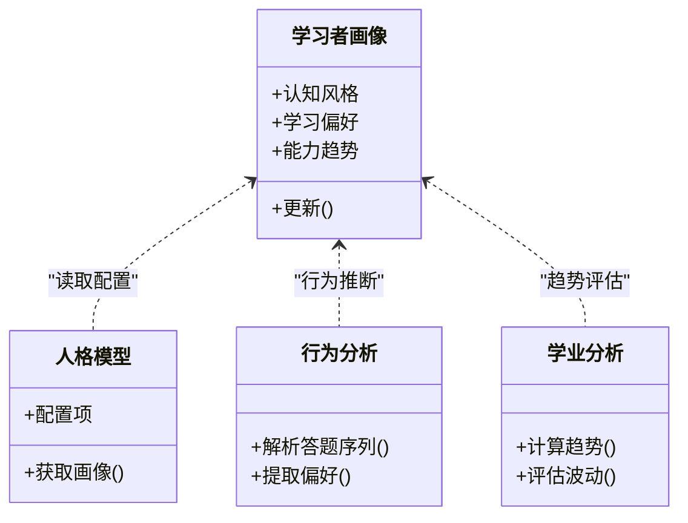

图表来源
- [personality.py](file://backend/app/models/personality.py)
- [personality.py](file://backend/app/api/v1/personality.py)
- [analytics_aggregator.py](file://backend/app/services/analytics_aggregator.py)
- [knowledge_tracker.py](file://backend/app/services/knowledge_tracker.py)

章节来源
- [personality.py](file://backend/app/models/personality.py)
- [personality.py](file://backend/app/api/v1/personality.py)
- [analytics_aggregator.py](file://backend/app/services/analytics_aggregator.py)
- [knowledge_tracker.py](file://backend/app/services/knowledge_tracker.py)

### 知识热力图可视化技术实现
目标：以热力图形式直观展示知识点掌握度与薄弱点分布。

- 数据准备
  - 维度：知识点（行）× 时间窗/作业批次（列）。
  - 值域：掌握度评分或薄弱度评分。
- 渲染流程
  - 前端请求分析服务获取结构化数据。
  - 根据值域映射颜色，支持交互式筛选（按班级/时间段/知识点类别）。
  - 导出与分享：支持截图或导出表格。
- 性能优化
  - 分页与懒加载：大数据量时分页渲染。
  - 缓存：服务端缓存热点聚合结果。

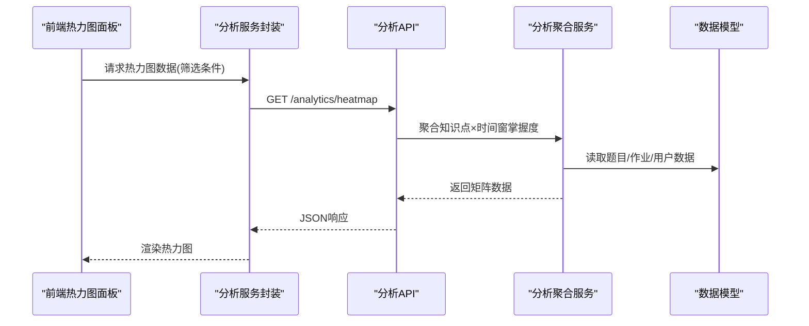

图表来源
- [KnowledgeHeatmapPanel.tsx](file://frontend/src/pages/LearningAnalytics/KnowledgeHeatmapPanel.tsx)
- [analyticsService.ts](file://frontend/src/services/analyticsService.ts)
- [analytics.py](file://backend/app/api/v1/analytics.py)
- [analytics_aggregator.py](file://backend/app/services/analytics_aggregator.py)
- [question.py](file://backend/app/models/question.py)
- [assignment.py](file://backend/app/models/assignment.py)
- [user.py](file://backend/app/models/user.py)

章节来源
- [KnowledgeHeatmapPanel.tsx](file://frontend/src/pages/LearningAnalytics/KnowledgeHeatmapPanel.tsx)
- [analyticsService.ts](file://frontend/src/services/analyticsService.ts)
- [analytics.py](file://backend/app/api/v1/analytics.py)
- [analytics_aggregator.py](file://backend/app/services/analytics_aggregator.py)
- [question.py](file://backend/app/models/question.py)
- [assignment.py](file://backend/app/models/assignment.py)
- [user.py](file://backend/app/models/user.py)

### 知识追踪数据的统计分析方法与报告生成机制
目标：提供统一的统计口径与报告模板，支撑教学决策。

- 统计方法
  - 描述性统计：均值、方差、分位数、分布形态。
  - 趋势分析：移动平均、线性回归斜率、拐点检测。
  - 相关性分析：知识点间掌握度相关性、题目难度与正确率关系。
- 报告生成
  - 模板化：固定字段（总体掌握度、薄弱点TopN、进步显著知识点）。
  - 自动化：定时任务触发，生成PDF/Excel并归档。
  - 可定制：按班级/个人/时间段筛选。

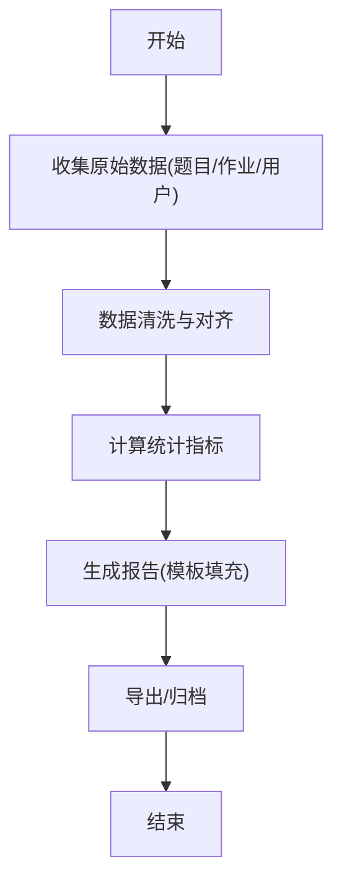

图表来源
- [analytics_aggregator.py](file://backend/app/services/analytics_aggregator.py)
- [analysis_tasks.py](file://backend/app/tasks/analysis_tasks.py)
- [question.py](file://backend/app/models/question.py)
- [assignment.py](file://backend/app/models/assignment.py)
- [user.py](file://backend/app/models/user.py)

章节来源
- [analytics_aggregator.py](file://backend/app/services/analytics_aggregator.py)
- [analysis_tasks.py](file://backend/app/tasks/analysis_tasks.py)
- [question.py](file://backend/app/models/question.py)
- [assignment.py](file://backend/app/models/assignment.py)
- [user.py](file://backend/app/models/user.py)

### 扩展新知识点分类与分析算法
目标：在不破坏现有系统的前提下，新增知识点分类与分析算法。

- 扩展点
  - 分类器注册：新增分类策略并注册到路由/工厂。
  - 分析管道插拔：在分析聚合服务中插入新的计算步骤。
  - 前端适配：新增可视化组件或服务调用。
- 开发步骤
  - 定义输入输出Schema，确保与现有API兼容。
  - 编写单元测试与集成测试，覆盖边界条件。
  - 灰度发布与回滚策略，保障稳定性。

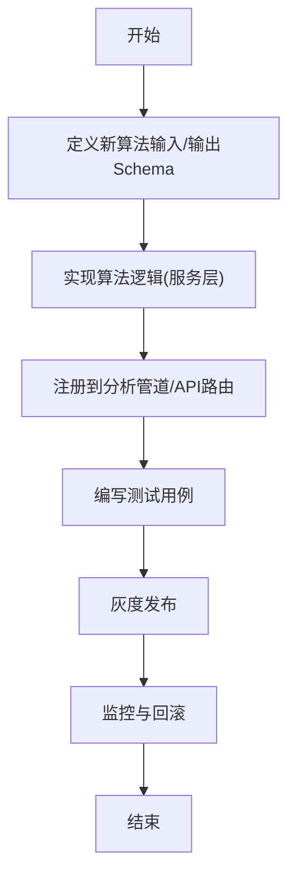

图表来源
- [analytics.py](file://backend/app/api/v1/analytics.py)
- [analytics_aggregator.py](file://backend/app/services/analytics_aggregator.py)
- [analytics.py](file://backend/app/schemas/analytics.py)

章节来源
- [analytics.py](file://backend/app/api/v1/analytics.py)
- [analytics_aggregator.py](file://backend/app/services/analytics_aggregator.py)
- [analytics.py](file://backend/app/schemas/analytics.py)

## 依赖关系分析
- 模块耦合
  - API 层依赖服务层与模型层，保持薄接口职责。
  - 服务层内部高内聚：知识追踪与分析聚合各自独立，通过明确的数据契约交互。
  - 前端通过服务封装访问API，降低页面与后端细节的耦合。
- 外部依赖
  - 数据库模型：题目、作业、用户、人格配置。
  - 任务队列：异步分析任务调度。

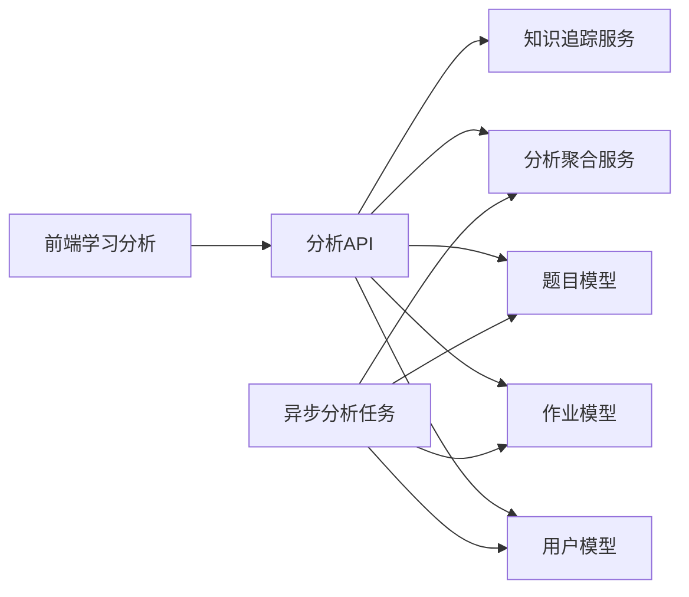

图表来源
- [analytics.py](file://backend/app/api/v1/analytics.py)
- [knowledge_tracker.py](file://backend/app/services/knowledge_tracker.py)
- [analytics_aggregator.py](file://backend/app/services/analytics_aggregator.py)
- [analysis_tasks.py](file://backend/app/tasks/analysis_tasks.py)
- [question.py](file://backend/app/models/question.py)
- [assignment.py](file://backend/app/models/assignment.py)
- [user.py](file://backend/app/models/user.py)

章节来源
- [analytics.py](file://backend/app/api/v1/analytics.py)
- [knowledge_tracker.py](file://backend/app/services/knowledge_tracker.py)
- [analytics_aggregator.py](file://backend/app/services/analytics_aggregator.py)
- [analysis_tasks.py](file://backend/app/tasks/analysis_tasks.py)
- [question.py](file://backend/app/models/question.py)
- [assignment.py](file://backend/app/models/assignment.py)
- [user.py](file://backend/app/models/user.py)

## 性能考虑
- 数据聚合
  - 预聚合与缓存：对热点指标（如热力图矩阵）进行缓存，减少重复计算。
  - 增量更新：仅在新增数据到达时局部重算，避免全量扫描。
- 前端渲染
  - 分页与虚拟滚动：大数据量下按需渲染，降低内存占用。
  - 去抖与节流：频繁交互时减少请求与重绘。
- 异步任务
  - 任务拆分：将大任务拆分为子任务并行执行。
  - 失败重试与幂等：保证任务执行的可靠性与一致性。

[本节为通用指导，不直接分析具体文件]

## 故障排查指南
- 常见问题定位
  - 数据缺失：检查题目—知识点映射是否完整，作业与用户数据是否对齐。
  - 指标异常：核对掌握度计算逻辑与难度校正参数。
  - 渲染问题：确认前端接收的数据结构与热力图面板期望一致。
- 日志与监控
  - 关键路径埋点：API入口、服务层计算、任务执行。
  - 告警阈值：设置错误率、延迟、数据缺失比例等阈值。
- 恢复策略
  - 回滚至上一稳定版本。
  - 重建索引与缓存，必要时重新跑批任务。

章节来源
- [analytics.py](file://backend/app/api/v1/analytics.py)
- [analytics_aggregator.py](file://backend/app/services/analytics_aggregator.py)
- [analysis_tasks.py](file://backend/app/tasks/analysis_tasks.py)
- [KnowledgeHeatmapPanel.tsx](file://frontend/src/pages/LearningAnalytics/KnowledgeHeatmapPanel.tsx)

## 结论
本系统围绕“知识点—掌握度—路径—复习”的主线，构建了从数据采集、图谱构建、薄弱点识别、路径规划到可视化展示的闭环。通过模块化设计与可扩展的分析管道，既能满足当前教学需求，也为后续算法升级与功能拓展提供了良好基础。

[本节为总结性内容，不直接分析具体文件]

## 附录
- 术语表
  - 知识点：教学内容的最小可测单元。
  - 掌握度：对知识点理解与应用能力的量化评分。
  - 薄弱点：掌握度低于阈值且影响较大的知识点。
  - 遗忘曲线：描述记忆随时间衰减的数学模型。
- 参考实现位置
  - 知识追踪服务：[knowledge_tracker.py](file://backend/app/services/knowledge_tracker.py)
  - 分析聚合服务：[analytics_aggregator.py](file://backend/app/services/analytics_aggregator.py)
  - 分析API：[analytics.py](file://backend/app/api/v1/analytics.py)
  - 分析Schema：[analytics.py](file://backend/app/schemas/analytics.py)
  - 异步任务：[analysis_tasks.py](file://backend/app/tasks/analysis_tasks.py)
  - 数据模型：[question.py](file://backend/app/models/question.py)、[assignment.py](file://backend/app/models/assignment.py)、[user.py](file://backend/app/models/user.py)、[personality.py](file://backend/app/models/personality.py)
  - 前端面板：[KnowledgeHeatmapPanel.tsx](file://frontend/src/pages/LearningAnalytics/KnowledgeHeatmapPanel.tsx)、[HomeworkStatsPanel.tsx](file://frontend/src/pages/LearningAnalytics/HomeworkStatsPanel.tsx)、[StudentDashboardPanel.tsx](file://frontend/src/pages/LearningAnalytics/StudentDashboardPanel.tsx)、[index.tsx](file://frontend/src/pages/LearningAnalytics/index.tsx)
  - 前端服务封装：[analyticsService.ts](file://frontend/src/services/analyticsService.ts)