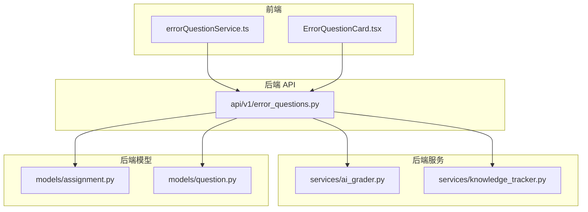
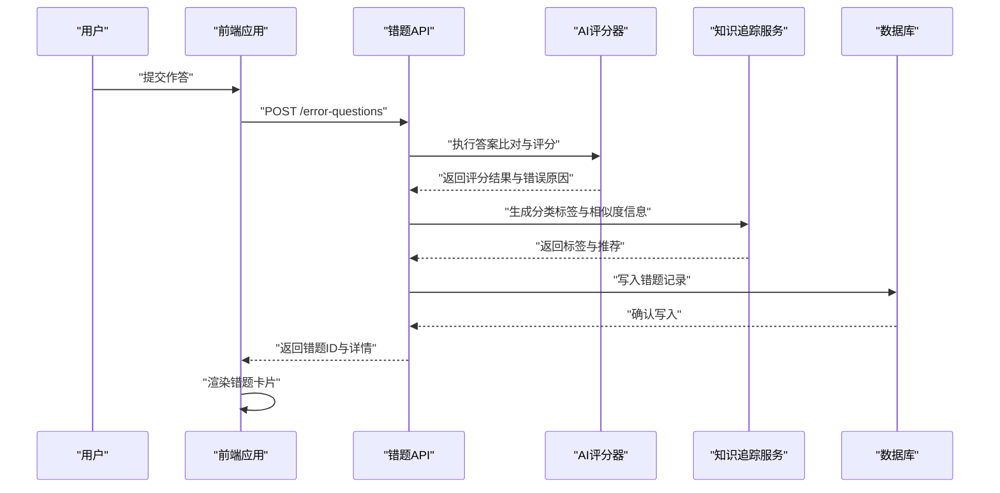
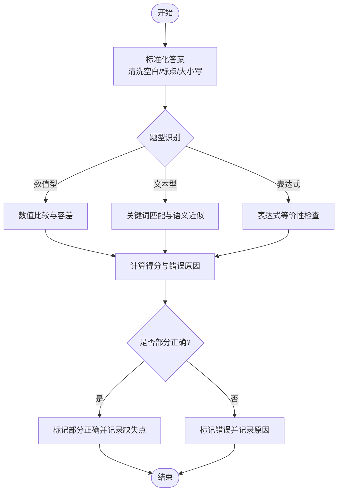
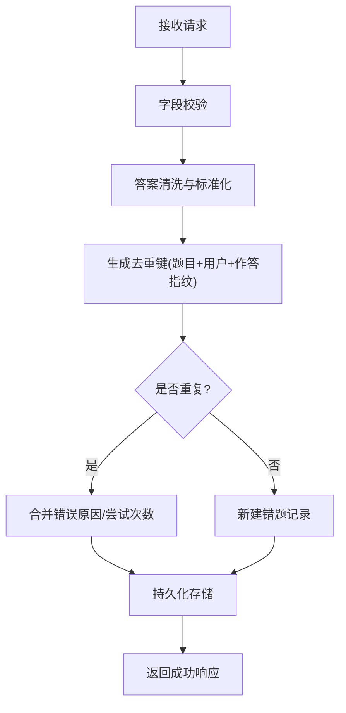
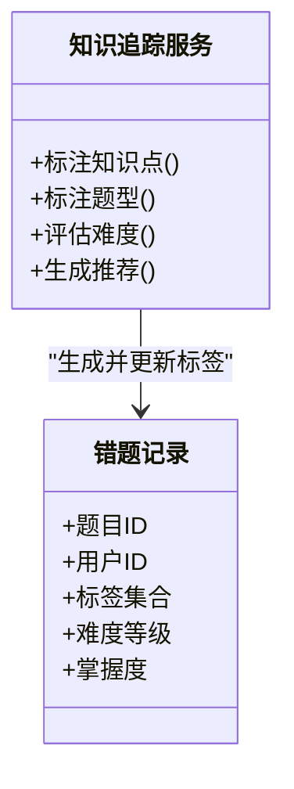
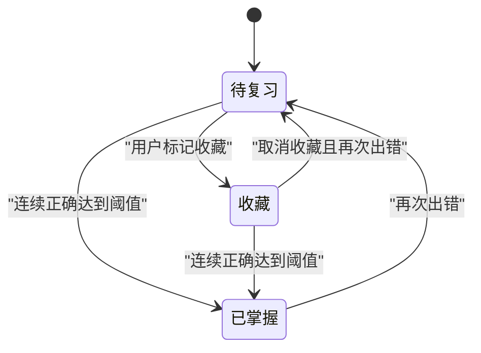
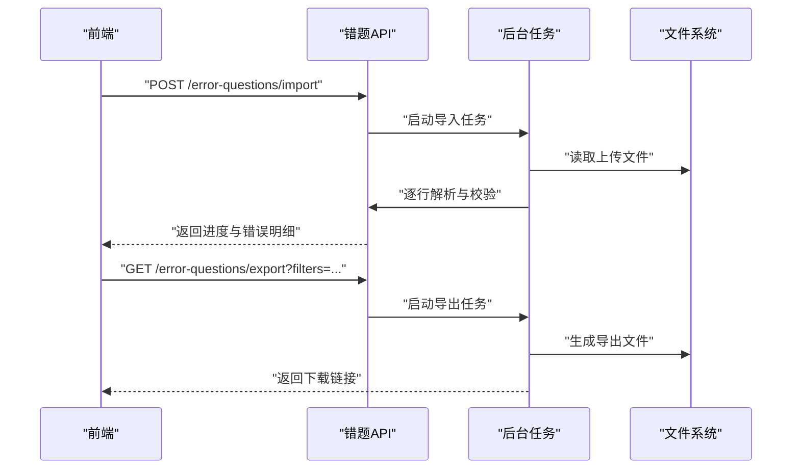
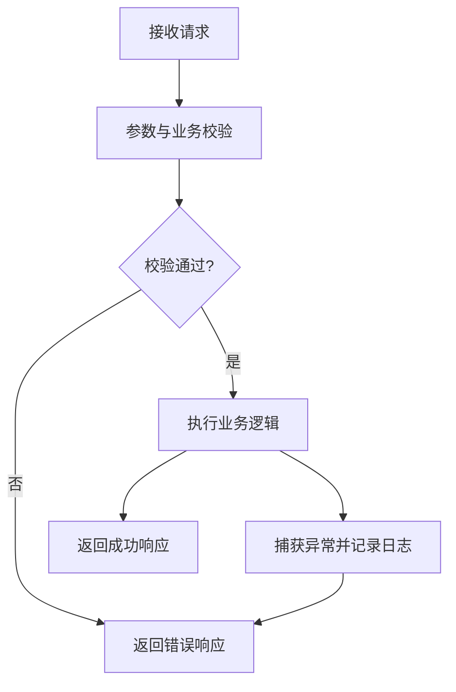
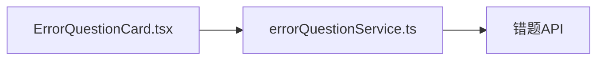
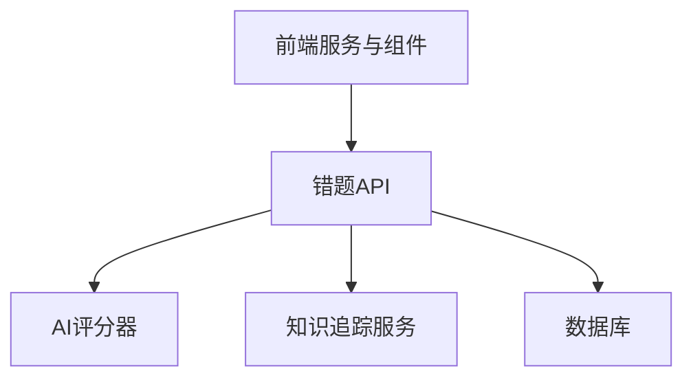

# 错题收集机制

<cite>
**本文引用的文件**   
- [error_questions.py](file://backend/app/api/v1/error_questions.py)
- [ai_grader.py](file://backend/app/services/ai_grader.py)
- [knowledge_tracker.py](file://backend/app/services/knowledge_tracker.py)
- [assignment.py](file://backend/app/models/assignment.py)
- [question.py](file://backend/app/models/question.py)
- [errorQuestionService.ts](file://frontend/src/services/errorQuestionService.ts)
- [ErrorQuestionCard.tsx](file://frontend/src/components/ErrorQuestionCard.tsx)
</cite>

## 目录
1. [简介](#简介)
2. [项目结构](#项目结构)
3. [核心组件](#核心组件)
4. [架构总览](#架构总览)
5. [详细组件分析](#详细组件分析)
6. [依赖关系分析](#依赖关系分析)
7. [性能考虑](#性能考虑)
8. [故障排查指南](#故障排查指南)
9. [结论](#结论)
10. [附录](#附录)

## 简介
本文件面向开发者，系统化阐述“错题收集机制”的设计与实现，覆盖以下关键主题：
- 答题错误检测算法：答案比对逻辑、容错处理、部分正确判断
- 错题入库流程：数据清洗、格式标准化、去重机制
- 分类标签系统：按知识点、题型、难度等多维度自动打标
- 状态管理：待复习、已掌握、收藏等状态的流转
- 批量导入导出：技术实现与接口约定
- 数据验证规则与异常处理
- 扩展指南：新增错误检测规则与分类体系

## 项目结构
围绕错题收集机制，后端主要涉及 API 层、服务层与模型层；前端提供错题卡片展示与服务调用封装。

图表来源
- [error_questions.py](file://backend/app/api/v1/error_questions.py)
- [ai_grader.py](file://backend/app/services/ai_grader.py)
- [knowledge_tracker.py](file://backend/app/services/knowledge_tracker.py)
- [assignment.py](file://backend/app/models/assignment.py)
- [question.py](file://backend/app/models/question.py)
- [errorQuestionService.ts](file://frontend/src/services/errorQuestionService.ts)
- [ErrorQuestionCard.tsx](file://frontend/src/components/ErrorQuestionCard.tsx)

章节来源
- [error_questions.py](file://backend/app/api/v1/error_questions.py)
- [ai_grader.py](file://backend/app/services/ai_grader.py)
- [knowledge_tracker.py](file://backend/app/services/knowledge_tracker.py)
- [assignment.py](file://backend/app/models/assignment.py)
- [question.py](file://backend/app/models/question.py)
- [errorQuestionService.ts](file://frontend/src/services/errorQuestionService.ts)
- [ErrorQuestionCard.tsx](file://frontend/src/components/ErrorQuestionCard.tsx)

## 核心组件
- 错误检测服务（AI 评分器）：负责答案比对、容错与部分正确判定，输出结构化评分与错误原因。
- 知识追踪服务：负责错题分类打标（知识点、题型、难度）、相似题检索与学习路径建议。
- 错题 API：统一暴露错题的创建、查询、更新、批量导入导出等能力。
- 前端错题服务与卡片：封装 API 调用并提供错题列表与详情交互。

章节来源
- [ai_grader.py](file://backend/app/services/ai_grader.py)
- [knowledge_tracker.py](file://backend/app/services/knowledge_tracker.py)
- [error_questions.py](file://backend/app/api/v1/error_questions.py)
- [errorQuestionService.ts](file://frontend/src/services/errorQuestionService.ts)
- [ErrorQuestionCard.tsx](file://frontend/src/components/ErrorQuestionCard.tsx)

## 架构总览
错题收集的整体流程如下：用户提交作答后，后端通过 AI 评分器进行答案比对与容错处理，结合知识追踪服务完成分类打标，最终将错题写入持久化存储并返回给前端展示。

图表来源
- [error_questions.py](file://backend/app/api/v1/error_questions.py)
- [ai_grader.py](file://backend/app/services/ai_grader.py)
- [knowledge_tracker.py](file://backend/app/services/knowledge_tracker.py)
- [assignment.py](file://backend/app/models/assignment.py)
- [question.py](file://backend/app/models/question.py)

## 详细组件分析

### 错误检测算法（答案比对、容错、部分正确）
- 答案比对逻辑
  - 支持多种题型的答案解析与规范化，包括数值、单位、表达式、文本摘要等。
  - 对标准答案进行分词/归一化处理，对用户答案进行清洗与等价转换。
- 容错处理
  - 忽略大小写、空白差异、标点符号差异。
  - 数值容差范围（如浮点误差阈值）。
  - 同义词替换与单位换算。
- 部分正确判断
  - 基于步骤拆解或关键词命中计算得分比例。
  - 根据阈值判定“部分正确”，并记录缺失的关键点。

图表来源
- [ai_grader.py](file://backend/app/services/ai_grader.py)

章节来源
- [ai_grader.py](file://backend/app/services/ai_grader.py)

### 错题入库流程（数据清洗、格式标准化、去重）
- 数据清洗
  - 去除多余空白、转义字符、非法编码。
  - 校验必填字段（题目ID、用户ID、作答内容、时间戳等）。
- 格式标准化
  - 统一时间格式、单位、数值精度。
  - 将多模态答案（文本、图片、语音）转换为结构化描述。
- 去重机制
  - 基于题目ID+用户ID+作答指纹（哈希）进行幂等写入。
  - 若重复则合并错误原因与尝试次数，避免冗余记录。

图表来源
- [error_questions.py](file://backend/app/api/v1/error_questions.py)
- [assignment.py](file://backend/app/models/assignment.py)
- [question.py](file://backend/app/models/question.py)

章节来源
- [error_questions.py](file://backend/app/api/v1/error_questions.py)
- [assignment.py](file://backend/app/models/assignment.py)
- [question.py](file://backend/app/models/question.py)

### 分类标签系统（知识点、题型、难度）
- 自动打标
  - 基于题目元数据与作答上下文提取知识点标签。
  - 依据题型模板映射题型标签。
  - 根据题目难度系数与用户历史表现动态调整难度标签。
- 标签聚合与权重
  - 为每个错题维护多维标签集合，支持按标签筛选与统计。
  - 标签权重随练习次数与掌握度变化。

图表来源
- [knowledge_tracker.py](file://backend/app/services/knowledge_tracker.py)
- [question.py](file://backend/app/models/question.py)

章节来源
- [knowledge_tracker.py](file://backend/app/services/knowledge_tracker.py)
- [question.py](file://backend/app/models/question.py)

### 错题状态管理（待复习、已掌握、收藏）
- 状态定义
  - 待复习：新入库或最近一次未掌握。
  - 已掌握：连续正确达到阈值。
  - 收藏：用户主动标记重点错题。
- 状态流转
  - 从“待复习”到“已掌握”需满足连续正确次数与时间衰减条件。
  - “收藏”为独立标记，不影响掌握度计算但影响优先级排序。

图表来源
- [error_questions.py](file://backend/app/api/v1/error_questions.py)
- [assignment.py](file://backend/app/models/assignment.py)

章节来源
- [error_questions.py](file://backend/app/api/v1/error_questions.py)
- [assignment.py](file://backend/app/models/assignment.py)

### 批量导入导出功能
- 批量导入
  - 支持 CSV/Excel 上传，服务端逐行解析并进行数据校验与清洗。
  - 失败行返回明细错误，支持重试与增量导入。
- 批量导出
  - 按筛选条件（标签、状态、时间范围）导出错题清单。
  - 支持分页与异步任务，避免大文件阻塞。

图表来源
- [error_questions.py](file://backend/app/api/v1/error_questions.py)

章节来源
- [error_questions.py](file://backend/app/api/v1/error_questions.py)

### 数据验证规则与异常处理
- 验证规则
  - 必填字段校验（题目ID、用户ID、作答内容、时间戳）。
  - 类型与长度限制（字符串最大长度、数值范围）。
  - 业务约束（题目存在性、用户权限）。
- 异常处理
  - 输入异常返回明确错误码与提示。
  - 服务异常进行降级与重试策略。
  - 日志记录与告警上报。

图表来源
- [error_questions.py](file://backend/app/api/v1/error_questions.py)

章节来源
- [error_questions.py](file://backend/app/api/v1/error_questions.py)

### 前端集成（服务与卡片）
- 服务封装
  - 统一封装错题相关 API 调用，包含错误重试与加载状态管理。
- 卡片展示
  - 渲染错题基本信息、标签、状态与操作按钮（收藏、重新作答）。

图表来源
- [errorQuestionService.ts](file://frontend/src/services/errorQuestionService.ts)
- [ErrorQuestionCard.tsx](file://frontend/src/components/ErrorQuestionCard.tsx)
- [error_questions.py](file://backend/app/api/v1/error_questions.py)

章节来源
- [errorQuestionService.ts](file://frontend/src/services/errorQuestionService.ts)
- [ErrorQuestionCard.tsx](file://frontend/src/components/ErrorQuestionCard.tsx)
- [error_questions.py](file://backend/app/api/v1/error_questions.py)

## 依赖关系分析
- 模块耦合
  - 错题 API 依赖 AI 评分器与知识追踪服务，形成松耦合的服务间调用。
  - 前端通过服务层间接访问后端 API，降低前后端直接耦合。
- 外部依赖
  - 数据库用于持久化错题记录。
  - 文件系统用于批量导入导出的临时文件处理。

图表来源
- [error_questions.py](file://backend/app/api/v1/error_questions.py)
- [ai_grader.py](file://backend/app/services/ai_grader.py)
- [knowledge_tracker.py](file://backend/app/services/knowledge_tracker.py)
- [assignment.py](file://backend/app/models/assignment.py)
- [question.py](file://backend/app/models/question.py)
- [errorQuestionService.ts](file://frontend/src/services/errorQuestionService.ts)
- [ErrorQuestionCard.tsx](file://frontend/src/components/ErrorQuestionCard.tsx)

章节来源
- [error_questions.py](file://backend/app/api/v1/error_questions.py)
- [ai_grader.py](file://backend/app/services/ai_grader.py)
- [knowledge_tracker.py](file://backend/app/services/knowledge_tracker.py)
- [assignment.py](file://backend/app/models/assignment.py)
- [question.py](file://backend/app/models/question.py)
- [errorQuestionService.ts](file://frontend/src/services/errorQuestionService.ts)
- [ErrorQuestionCard.tsx](file://frontend/src/components/ErrorQuestionCard.tsx)

## 性能考虑
- 答案比对优化
  - 使用缓存减少重复题目的比对开销。
  - 对大规模文本采用分块与索引加速关键词匹配。
- 批量导入导出
  - 采用异步任务与流式读写，避免内存峰值过高。
  - 分页与限流保护后端资源。
- 状态更新
  - 批量更新时采用事务与批处理，减少数据库往返。

## 故障排查指南
- 常见问题
  - 导入失败：检查文件格式与字段映射，查看错误明细行。
  - 状态不更新：核对连续正确计数与时间衰减配置。
  - 标签不准确：检查知识点映射表与难度系数来源。
- 定位方法
  - 查看 API 日志与错误码。
  - 检查 AI 评分器的中间结果与容差配置。
  - 审查知识追踪服务的标签生成逻辑。

章节来源
- [error_questions.py](file://backend/app/api/v1/error_questions.py)
- [ai_grader.py](file://backend/app/services/ai_grader.py)
- [knowledge_tracker.py](file://backend/app/services/knowledge_tracker.py)

## 结论
错题收集机制通过 AI 评分器与知识追踪服务的协同，实现了高效、可扩展的错误检测与分类打标。前端以简洁的卡片与服务封装提升用户体验。整体架构具备良好的可维护性与扩展性，便于后续引入新的检测规则与分类体系。

## 附录
- 扩展指南
  - 新增错误检测规则
    - 在评分器中注册新的题型处理器，定义标准化与比对策略。
    - 提供单元测试覆盖边界情况与容差场景。
  - 扩展分类体系
    - 在知识追踪服务中增加标签映射与权重计算逻辑。
    - 更新前端筛选与展示以支持新标签。
  - 变更状态机
    - 在 API 层定义新的状态与流转条件，确保幂等与一致性。
  - 批量导入导出增强
    - 支持更多文件格式与字段映射配置。
    - 增加数据质量报告与审计日志。