# 错题管理系统

<cite>
**本文引用的文件**   
- [backend/app/api/v1/error_questions.py](file://backend/app/api/v1/error_questions.py)
- [backend/app/models/question.py](file://backend/app/models/question.py)
- [backend/app/schemas/question.py](file://backend/app/schemas/question.py)
- [backend/app/services/knowledge_tracker.py](file://backend/app/services/knowledge_tracker.py)
- [backend/app/services/similar_generator.py](file://backend/app/services/similar_generator.py)
- [backend/app/tasks/vector_tasks.py](file://backend/app/tasks/vector_tasks.py)
- [backend/app/db/session.py](file://backend/app/db/session.py)
- [frontend/src/pages/AssignmentManagement/ErrorRedo/index.tsx](file://frontend/src/pages/AssignmentManagement/ErrorRedo/index.tsx)
- [frontend/src/components/ErrorQuestionCard.tsx](file://frontend/src/components/ErrorQuestionCard.tsx)
- [frontend/src/services/errorQuestionService.ts](file://frontend/src/services/errorQuestionService.ts)
- [frontend/src/utils/exportExcel.ts](file://frontend/src/utils/exportExcel.ts)
</cite>

## 目录
1. [简介](#简介)
2. [项目结构](#项目结构)
3. [核心组件](#核心组件)
4. [架构总览](#架构总览)
5. [详细组件分析](#详细组件分析)
6. [依赖关系分析](#依赖关系分析)
7. [性能考虑](#性能考虑)
8. [故障排查指南](#故障排查指南)
9. [结论](#结论)
10. [附录](#附录)

## 简介
本文件面向开发者与产品实现团队，系统化阐述“错题管理系统”的端到端设计与实现。内容覆盖：
- 错题自动收集机制：答题错误检测、错题入库、分类标签
- 知识点追踪算法与学习薄弱点识别逻辑
- 相似题目推荐算法：语义相似度计算、知识点匹配、难度适配
- 复习计划生成与智能推送机制
- 错题本的CRUD与批量管理
- 错题统计分析：错误率趋势、知识点掌握度等可视化展示
- 错题导出、分享、打印等实用功能
- 扩展指南：新增错题分类与推荐算法

## 项目结构
系统采用前后端分离架构：
- 后端（FastAPI）提供REST API、领域服务、任务队列与数据库访问
- 前端（React + TypeScript）提供错题本、练习、分析与导出等交互界面
- 关键模块围绕“错题”“知识点”“相似题”“统计”展开

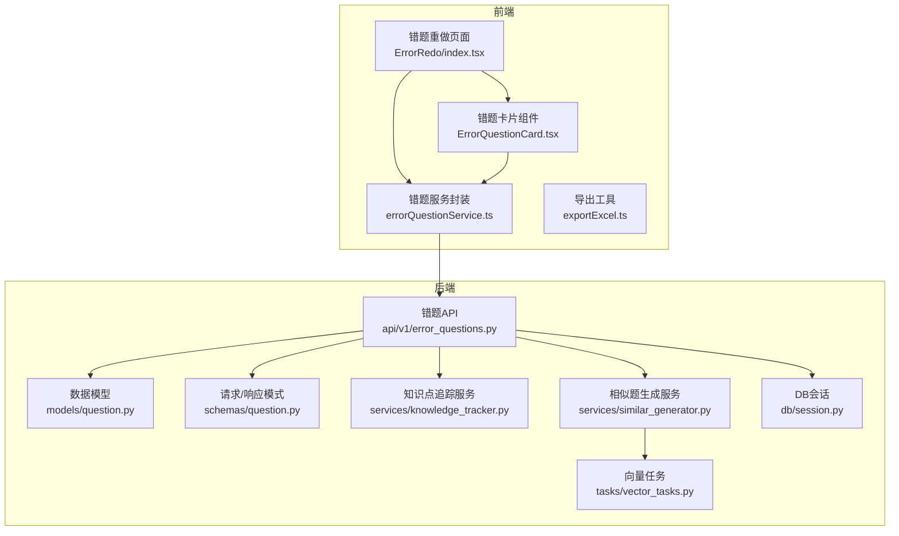

图表来源
- [backend/app/api/v1/error_questions.py](file://backend/app/api/v1/error_questions.py)
- [backend/app/models/question.py](file://backend/app/models/question.py)
- [backend/app/schemas/question.py](file://backend/app/schemas/question.py)
- [backend/app/services/knowledge_tracker.py](file://backend/app/services/knowledge_tracker.py)
- [backend/app/services/similar_generator.py](file://backend/app/services/similar_generator.py)
- [backend/app/tasks/vector_tasks.py](file://backend/app/tasks/vector_tasks.py)
- [backend/app/db/session.py](file://backend/app/db/session.py)
- [frontend/src/pages/AssignmentManagement/ErrorRedo/index.tsx](file://frontend/src/pages/AssignmentManagement/ErrorRedo/index.tsx)
- [frontend/src/components/ErrorQuestionCard.tsx](file://frontend/src/components/ErrorQuestionCard.tsx)
- [frontend/src/services/errorQuestionService.ts](file://frontend/src/services/errorQuestionService.ts)
- [frontend/src/utils/exportExcel.ts](file://frontend/src/utils/exportExcel.ts)

章节来源
- [backend/app/api/v1/error_questions.py](file://backend/app/api/v1/error_questions.py)
- [backend/app/models/question.py](file://backend/app/models/question.py)
- [backend/app/schemas/question.py](file://backend/app/schemas/question.py)
- [backend/app/services/knowledge_tracker.py](file://backend/app/services/knowledge_tracker.py)
- [backend/app/services/similar_generator.py](file://backend/app/services/similar_generator.py)
- [backend/app/tasks/vector_tasks.py](file://backend/app/tasks/vector_tasks.py)
- [backend/app/db/session.py](file://backend/app/db/session.py)
- [frontend/src/pages/AssignmentManagement/ErrorRedo/index.tsx](file://frontend/src/pages/AssignmentManagement/ErrorRedo/index.tsx)
- [frontend/src/components/ErrorQuestionCard.tsx](file://frontend/src/components/ErrorQuestionCard.tsx)
- [frontend/src/services/errorQuestionService.ts](file://frontend/src/services/errorQuestionService.ts)
- [frontend/src/utils/exportExcel.ts](file://frontend/src/utils/exportExcel.ts)

## 核心组件
- 错题API层：负责接收前端请求、校验参数、调用领域服务、返回统一响应
- 数据模型与模式：定义错题、题目、用户、标签等实体及序列化格式
- 知识点追踪服务：维护知识点掌握度、错误频率、薄弱点识别
- 相似题生成服务：基于语义向量与知识图谱进行相似题检索与排序
- 向量任务：异步构建/更新题目向量索引，支撑高效相似度检索
- 前端错题本：错题列表、详情、重做、筛选、批量操作、导出

章节来源
- [backend/app/api/v1/error_questions.py](file://backend/app/api/v1/error_questions.py)
- [backend/app/models/question.py](file://backend/app/models/question.py)
- [backend/app/schemas/question.py](file://backend/app/schemas/question.py)
- [backend/app/services/knowledge_tracker.py](file://backend/app/services/knowledge_tracker.py)
- [backend/app/services/similar_generator.py](file://backend/app/services/similar_generator.py)
- [backend/app/tasks/vector_tasks.py](file://backend/app/tasks/vector_tasks.py)
- [frontend/src/pages/AssignmentManagement/ErrorRedo/index.tsx](file://frontend/src/pages/AssignmentManagement/ErrorRedo/index.tsx)
- [frontend/src/components/ErrorQuestionCard.tsx](file://frontend/src/components/ErrorQuestionCard.tsx)
- [frontend/src/services/errorQuestionService.ts](file://frontend/src/services/errorQuestionService.ts)

## 架构总览
整体流程包括：
- 答题错误检测：作业/练习提交后，比对标准答案与用户作答，判定错误并触发入库
- 错题入库与打标：写入错题记录，关联知识点、难度、题型等标签
- 知识点追踪：根据历史表现更新知识点掌握度，识别薄弱点
- 相似题推荐：通过向量检索与规则过滤，生成个性化推荐
- 复习计划与推送：按遗忘曲线与薄弱点生成复习任务，定时推送
- 错题本管理：支持增删改查、批量导入导出、分享与打印
- 统计分析：聚合错误率、知识点热力图、趋势折线图等

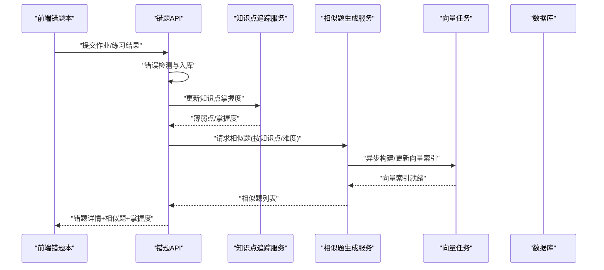

图表来源
- [backend/app/api/v1/error_questions.py](file://backend/app/api/v1/error_questions.py)
- [backend/app/services/knowledge_tracker.py](file://backend/app/services/knowledge_tracker.py)
- [backend/app/services/similar_generator.py](file://backend/app/services/similar_generator.py)
- [backend/app/tasks/vector_tasks.py](file://backend/app/tasks/vector_tasks.py)
- [backend/app/db/session.py](file://backend/app/db/session.py)

## 详细组件分析

### 错题自动收集机制
- 错误检测：在作业/练习提交后，将用户答案与标准答案进行比对，标记错误项
- 错题入库：为每个错误项创建错题记录，包含题目ID、用户ID、错误时间、错误类型、知识点、难度等
- 分类标签：依据题型、知识点、难度、错误原因等多维标签，便于后续筛选与推荐

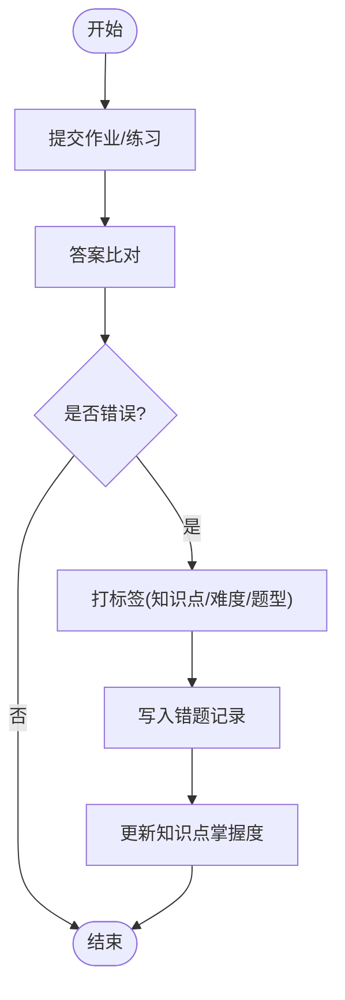

图表来源
- [backend/app/api/v1/error_questions.py](file://backend/app/api/v1/error_questions.py)
- [backend/app/models/question.py](file://backend/app/models/question.py)
- [backend/app/schemas/question.py](file://backend/app/schemas/question.py)
- [backend/app/services/knowledge_tracker.py](file://backend/app/services/knowledge_tracker.py)

章节来源
- [backend/app/api/v1/error_questions.py](file://backend/app/api/v1/error_questions.py)
- [backend/app/models/question.py](file://backend/app/models/question.py)
- [backend/app/schemas/question.py](file://backend/app/schemas/question.py)
- [backend/app/services/knowledge_tracker.py](file://backend/app/services/knowledge_tracker.py)

### 知识点追踪算法与薄弱点识别
- 知识点掌握度：结合正确率、最近一次表现、重复错误次数等指标，动态更新掌握度
- 薄弱点识别：对低掌握度且高频错误的知识点进行标记，作为优先复习目标
- 趋势分析：按时间窗口聚合错误率，识别上升或下降趋势，辅助制定复习策略

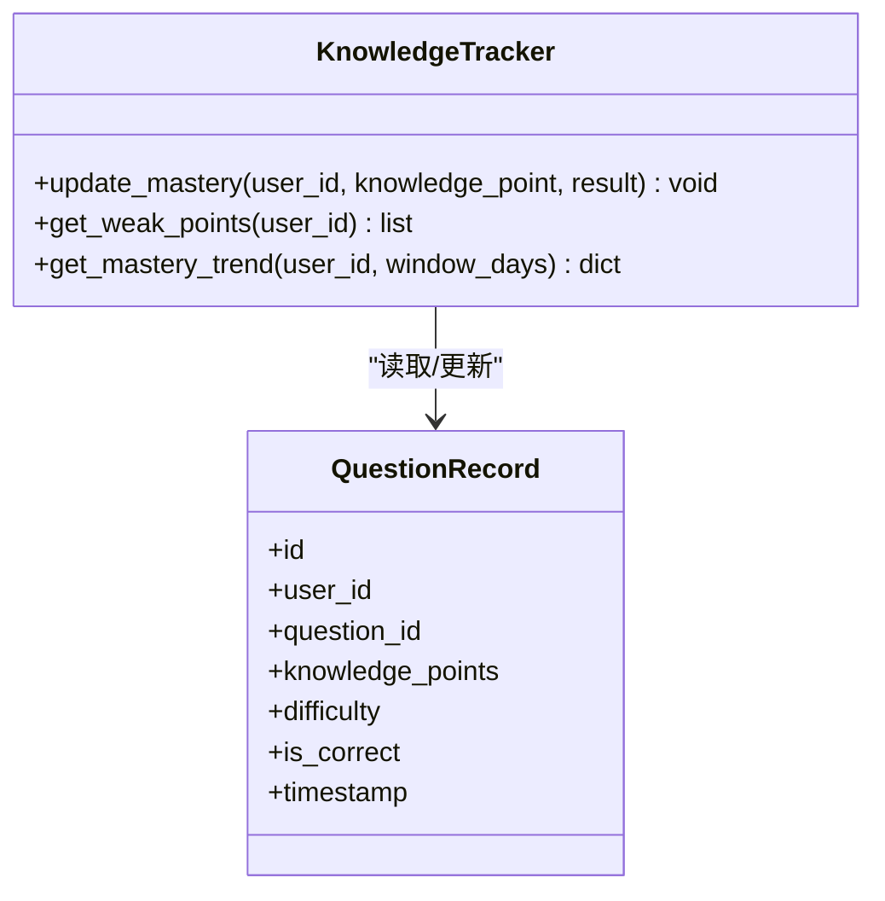

图表来源
- [backend/app/services/knowledge_tracker.py](file://backend/app/services/knowledge_tracker.py)
- [backend/app/models/question.py](file://backend/app/models/question.py)

章节来源
- [backend/app/services/knowledge_tracker.py](file://backend/app/services/knowledge_tracker.py)
- [backend/app/models/question.py](file://backend/app/models/question.py)

### 相似题目推荐算法
- 语义相似度：使用向量嵌入表示题目文本/题干，计算余弦相似度
- 知识点匹配：确保推荐题与被错题目共享至少一个知识点
- 难度适配：根据用户当前掌握度与目标难度区间，过滤并排序推荐结果
- 异步索引：向量构建与更新通过任务队列完成，避免阻塞主流程

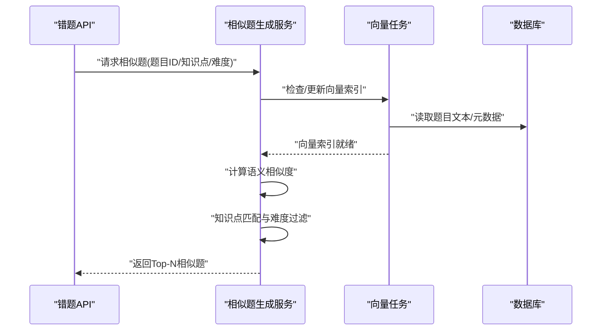

图表来源
- [backend/app/services/similar_generator.py](file://backend/app/services/similar_generator.py)
- [backend/app/tasks/vector_tasks.py](file://backend/app/tasks/vector_tasks.py)
- [backend/app/api/v1/error_questions.py](file://backend/app/api/v1/error_questions.py)

章节来源
- [backend/app/services/similar_generator.py](file://backend/app/services/similar_generator.py)
- [backend/app/tasks/vector_tasks.py](file://backend/app/tasks/vector_tasks.py)
- [backend/app/api/v1/error_questions.py](file://backend/app/api/v1/error_questions.py)

### 复习计划生成与智能推送
- 复习计划：基于薄弱点与遗忘曲线，生成短期/中期复习任务清单
- 智能推送：按用户活跃时段与优先级，推送待复习错题与相似题
- 反馈闭环：用户完成复习后再次评估掌握度，调整后续计划

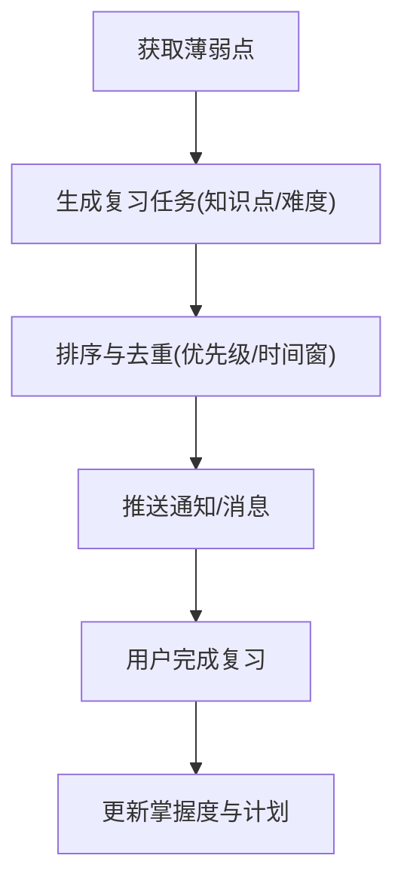

[此图为概念流程图，不直接映射具体源码文件]

### 错题本CRUD与批量管理
- 单条操作：新增、查看、编辑、删除错题记录
- 批量操作：批量导入错题、批量删除、批量打标签
- 筛选与搜索：按知识点、难度、时间范围、错误类型筛选
- 状态管理：已掌握、未掌握、复习中、待确认等状态流转

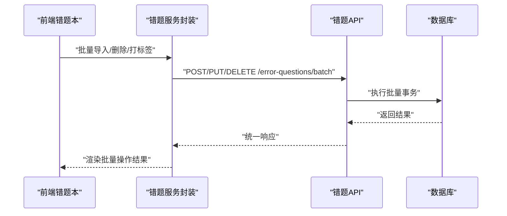

图表来源
- [frontend/src/services/errorQuestionService.ts](file://frontend/src/services/errorQuestionService.ts)
- [backend/app/api/v1/error_questions.py](file://backend/app/api/v1/error_questions.py)
- [backend/app/db/session.py](file://backend/app/db/session.py)

章节来源
- [frontend/src/services/errorQuestionService.ts](file://frontend/src/services/errorQuestionService.ts)
- [backend/app/api/v1/error_questions.py](file://backend/app/api/v1/error_questions.py)
- [backend/app/db/session.py](file://backend/app/db/session.py)

### 错题统计分析
- 错误率趋势：按日/周/月聚合错误率，绘制折线图
- 知识点掌握度：以热力图或柱状图展示各知识点掌握情况
- 薄弱点排行：按错误频次与掌握度综合排序，输出TOP N薄弱点

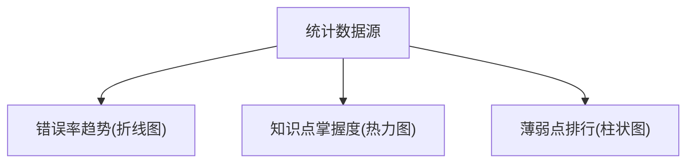

[此图为概念流程图，不直接映射具体源码文件]

### 错题导出、分享、打印
- 导出：支持Excel/CSV导出，包含错题详情、知识点、难度、错误时间等字段
- 分享：生成分享链接或PDF，便于教师/家长查看
- 打印：格式化打印错题本，支持分页与页眉页脚

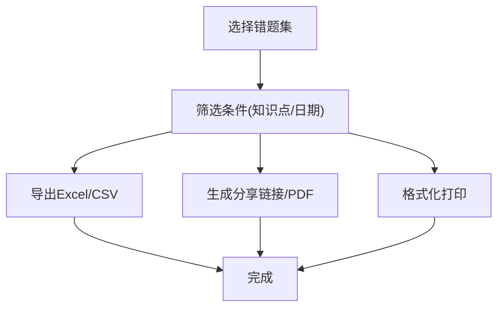

图表来源
- [frontend/src/utils/exportExcel.ts](file://frontend/src/utils/exportExcel.ts)
- [frontend/src/pages/AssignmentManagement/ErrorRedo/index.tsx](file://frontend/src/pages/AssignmentManagement/ErrorRedo/index.tsx)

章节来源
- [frontend/src/utils/exportExcel.ts](file://frontend/src/utils/exportExcel.ts)
- [frontend/src/pages/AssignmentManagement/ErrorRedo/index.tsx](file://frontend/src/pages/AssignmentManagement/ErrorRedo/index.tsx)

### 前端错题本交互
- 错题列表与卡片：展示错题摘要、知识点标签、难度、错误时间
- 详情与解析：点击打开详情，显示题目、答案、解析、相似题
- 重做与反馈：支持在线重做，提交后更新掌握度与错题状态

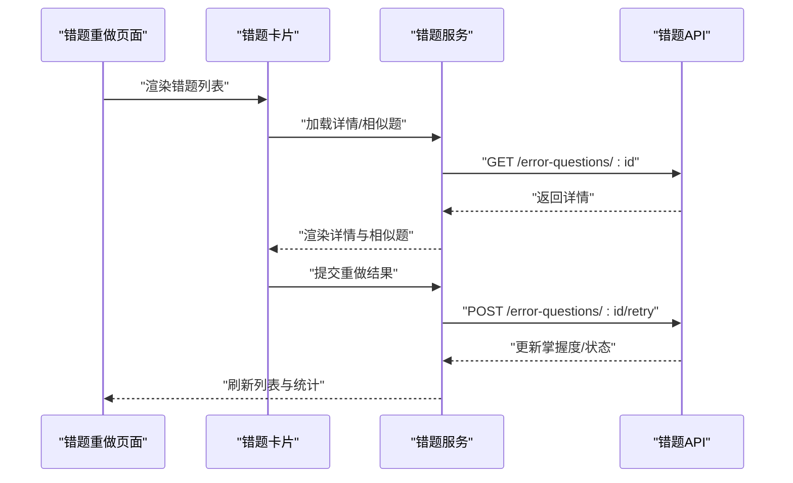

图表来源
- [frontend/src/pages/AssignmentManagement/ErrorRedo/index.tsx](file://frontend/src/pages/AssignmentManagement/ErrorRedo/index.tsx)
- [frontend/src/components/ErrorQuestionCard.tsx](file://frontend/src/components/ErrorQuestionCard.tsx)
- [frontend/src/services/errorQuestionService.ts](file://frontend/src/services/errorQuestionService.ts)
- [backend/app/api/v1/error_questions.py](file://backend/app/api/v1/error_questions.py)

章节来源
- [frontend/src/pages/AssignmentManagement/ErrorRedo/index.tsx](file://frontend/src/pages/AssignmentManagement/ErrorRedo/index.tsx)
- [frontend/src/components/ErrorQuestionCard.tsx](file://frontend/src/components/ErrorQuestionCard.tsx)
- [frontend/src/services/errorQuestionService.ts](file://frontend/src/services/errorQuestionService.ts)
- [backend/app/api/v1/error_questions.py](file://backend/app/api/v1/error_questions.py)

## 依赖关系分析
- 模块耦合：API层依赖模型与模式；服务层依赖知识库与向量任务；前端依赖服务封装
- 外部集成：数据库会话、向量索引任务、可能的第三方导出库
- 潜在循环：应避免API与服务之间相互引用，保持单向依赖

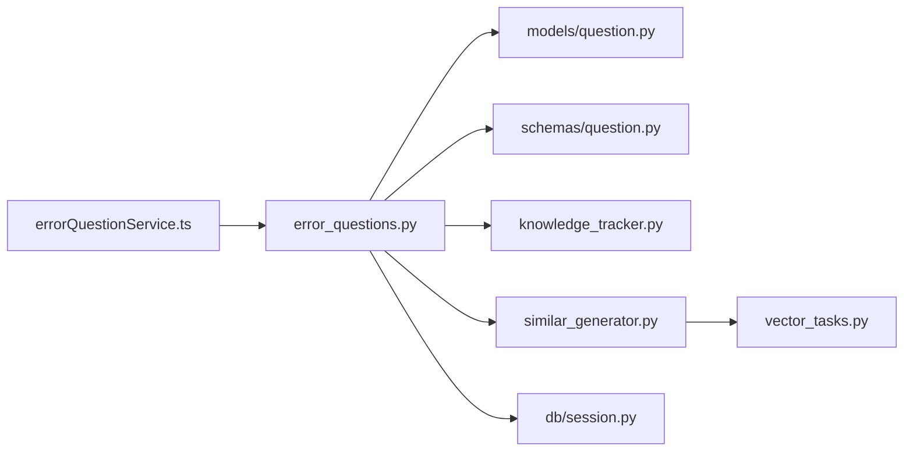

图表来源
- [frontend/src/services/errorQuestionService.ts](file://frontend/src/services/errorQuestionService.ts)
- [backend/app/api/v1/error_questions.py](file://backend/app/api/v1/error_questions.py)
- [backend/app/models/question.py](file://backend/app/models/question.py)
- [backend/app/schemas/question.py](file://backend/app/schemas/question.py)
- [backend/app/services/knowledge_tracker.py](file://backend/app/services/knowledge_tracker.py)
- [backend/app/services/similar_generator.py](file://backend/app/services/similar_generator.py)
- [backend/app/tasks/vector_tasks.py](file://backend/app/tasks/vector_tasks.py)
- [backend/app/db/session.py](file://backend/app/db/session.py)

章节来源
- [frontend/src/services/errorQuestionService.ts](file://frontend/src/services/errorQuestionService.ts)
- [backend/app/api/v1/error_questions.py](file://backend/app/api/v1/error_questions.py)
- [backend/app/models/question.py](file://backend/app/models/question.py)
- [backend/app/schemas/question.py](file://backend/app/schemas/question.py)
- [backend/app/services/knowledge_tracker.py](file://backend/app/services/knowledge_tracker.py)
- [backend/app/services/similar_generator.py](file://backend/app/services/similar_generator.py)
- [backend/app/tasks/vector_tasks.py](file://backend/app/tasks/vector_tasks.py)
- [backend/app/db/session.py](file://backend/app/db/session.py)

## 性能考虑
- 向量索引：大规模题目需异步构建与增量更新，避免同步阻塞
- 缓存策略：热点错题与相似题结果可短期缓存，降低重复计算
- 批量操作：导入/删除采用事务与分批处理，减少锁竞争
- 查询优化：按用户ID、知识点、时间范围建立索引，提升筛选效率

[本节为通用指导，不直接分析具体文件]

## 故障排查指南
- 常见错误
  - 向量索引未就绪：检查向量任务是否成功执行与索引路径配置
  - 知识点缺失：确认题目元数据与知识点映射是否正确
  - 批量导入失败：检查文件格式、必填字段与唯一性约束
- 定位方法
  - 查看API日志与错误码
  - 核对数据库记录与索引状态
  - 复现步骤并缩小问题范围

[本节为通用指导，不直接分析具体文件]

## 结论
本系统围绕“错题”构建了从采集、入库、追踪到推荐与复习的完整闭环。通过知识点追踪与向量检索，实现了个性化推荐与薄弱点强化；借助批量管理与统计分析，提升了教学与管理效率。未来可扩展更多分类维度与推荐策略，持续优化用户体验与学习效果。

[本节为总结性内容，不直接分析具体文件]

## 附录
- 扩展错题分类
  - 在模型与模式中新增分类字段与校验规则
  - 在服务层增加分类相关的过滤与统计逻辑
  - 在前端增加分类筛选与展示
- 扩展推荐算法
  - 在相似题服务中接入新算法（如关键词匹配、主题模型）
  - 在向量任务中支持多模态特征（题干、选项、解析）
  - 增加A/B测试与效果评估接口

[本节为扩展指南，不直接分析具体文件]