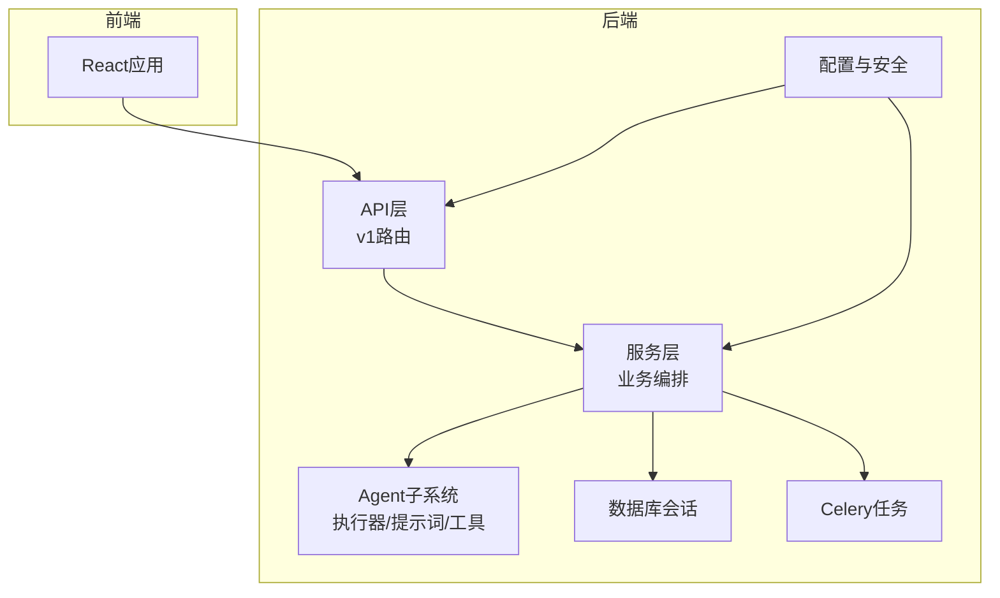
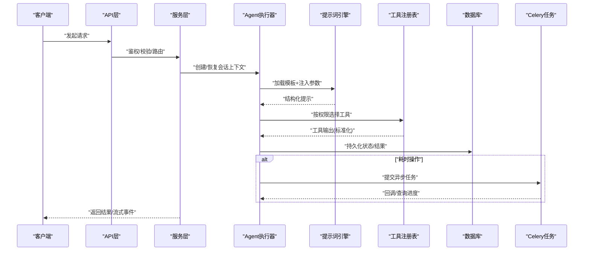
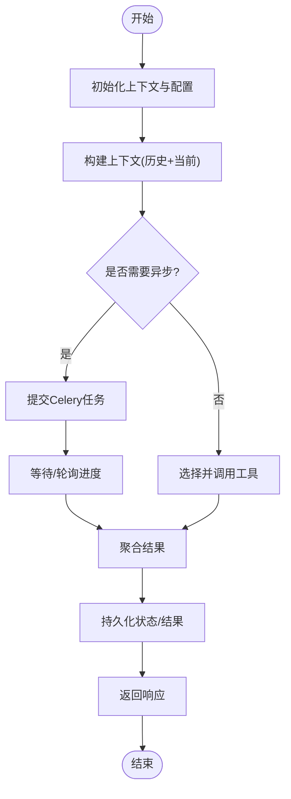
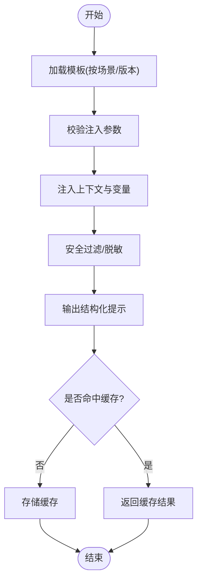
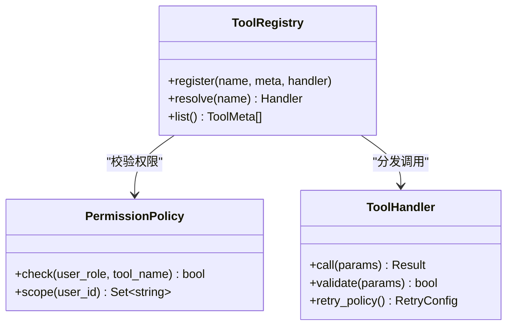
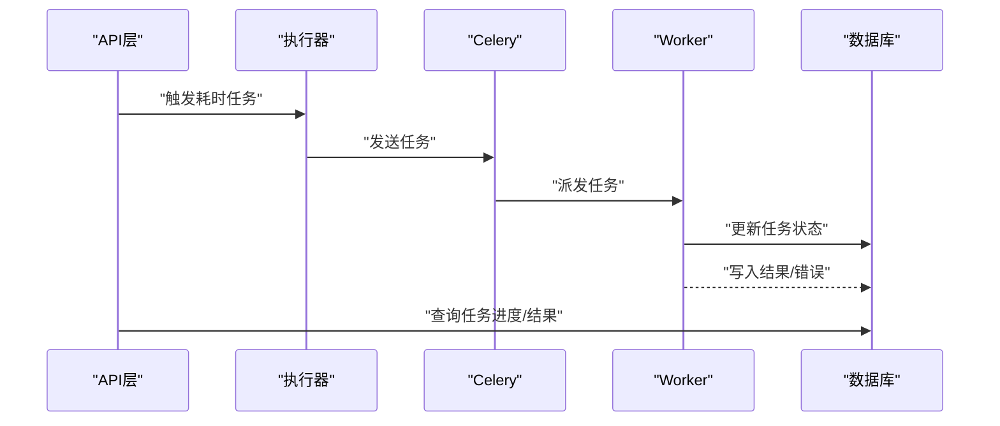
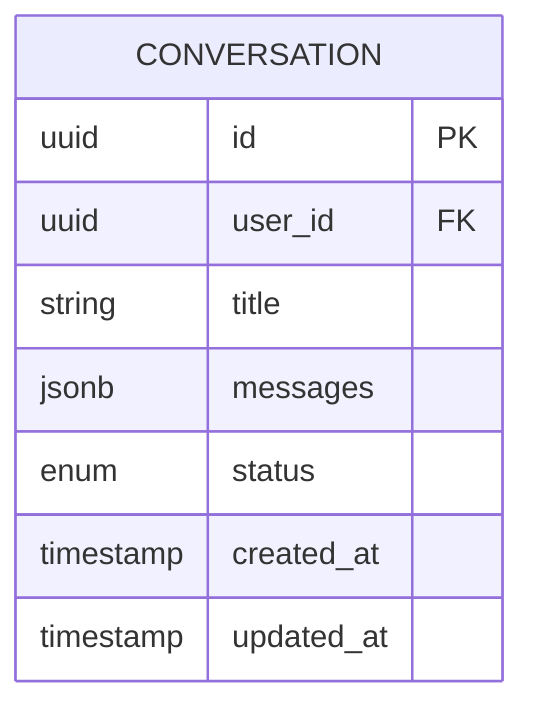
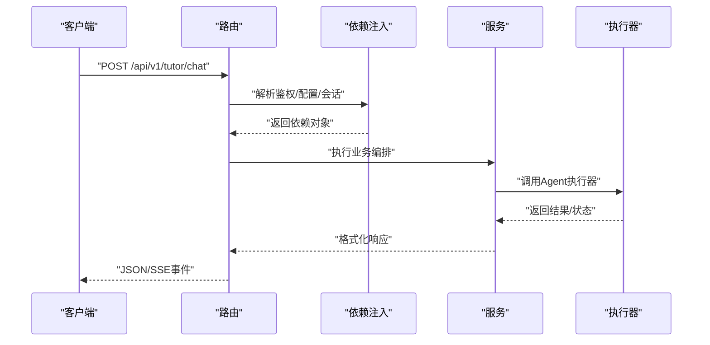
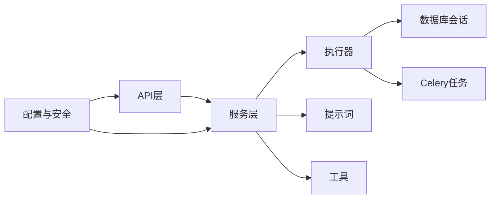

# AI Agent架构

<cite>
**本文引用的文件**   
- [backend/app/services/agent/agent_executor.py](file://backend/app/services/agent/agent_executor.py)
- [backend/app/services/agent/prompts.py](file://backend/app/services/agent/prompts.py)
- [backend/app/services/agent/tools.py](file://backend/app/services/agent/tools.py)
- [backend/app/api/v1/ai_tutor.py](file://backend/app/api/v1/ai_tutor.py)
- [backend/app/core/config.py](file://backend/app/core/config.py)
- [backend/app/core/deps.py](file://backend/app/core/deps.py)
- [backend/app/db/session.py](file://backend/app/db/session.py)
- [backend/app/models/conversation.py](file://backend/app/models/conversation.py)
- [backend/app/schemas/conversation.py](file://backend/app/schemas/conversation.py)
- [backend/app/tasks/celery_app.py](file://backend/app/tasks/celery_app.py)
- [backend/app/tasks/analysis_tasks.py](file://backend/app/tasks/analysis_tasks.py)
- [backend/app/main.py](file://backend/app/main.py)
</cite>

## 目录
1. [简介](#简介)
2. [项目结构](#项目结构)
3. [核心组件](#核心组件)
4. [架构总览](#架构总览)
5. [详细组件分析](#详细组件分析)
6. [依赖关系分析](#依赖关系分析)
7. [性能考量](#性能考量)
8. [故障排查指南](#故障排查指南)
9. [结论](#结论)
10. [附录](#附录)

## 简介
本技术文档面向AI Agent系统，聚焦于Agent执行器的核心架构与工程化实现。内容覆盖任务调度、状态管理、错误处理机制；提示词工程（Prompt模板设计、动态参数注入、上下文管理）；工具链扩展（注册、权限控制、调用协议）；多Agent协作模式、负载均衡与容错策略；以及Agent生命周期管理、性能监控与调试工具使用。同时提供自定义Agent开发指南与最佳实践，帮助开发者快速构建可扩展、可观测、高可用的AI Agent服务。

## 项目结构
后端采用分层架构：API层暴露REST接口，服务层封装业务逻辑，Agent子系统位于services/agent下，包含执行器、提示词与工具模块；数据访问通过db与models完成；异步任务由Celery驱动；配置与安全在core中集中管理。前端为独立React应用，通过HTTP/SSE与后端交互。

图表来源
- [backend/app/main.py](file://backend/app/main.py)
- [backend/app/api/v1/ai_tutor.py](file://backend/app/api/v1/ai_tutor.py)
- [backend/app/services/agent/agent_executor.py](file://backend/app/services/agent/agent_executor.py)
- [backend/app/services/agent/prompts.py](file://backend/app/services/agent/prompts.py)
- [backend/app/services/agent/tools.py](file://backend/app/services/agent/tools.py)
- [backend/app/db/session.py](file://backend/app/db/session.py)
- [backend/app/tasks/celery_app.py](file://backend/app/tasks/celery_app.py)
- [backend/app/core/config.py](file://backend/app/core/config.py)

章节来源
- [backend/app/main.py](file://backend/app/main.py)
- [backend/app/api/v1/ai_tutor.py](file://backend/app/api/v1/ai_tutor.py)
- [backend/app/services/agent/agent_executor.py](file://backend/app/services/agent/agent_executor.py)
- [backend/app/services/agent/prompts.py](file://backend/app/services/agent/prompts.py)
- [backend/app/services/agent/tools.py](file://backend/app/services/agent/tools.py)
- [backend/app/db/session.py](file://backend/app/db/session.py)
- [backend/app/tasks/celery_app.py](file://backend/app/tasks/celery_app.py)
- [backend/app/core/config.py](file://backend/app/core/config.py)

## 核心组件
- Agent执行器：负责解析请求、组装上下文、选择并执行工具、维护对话状态、持久化结果与异常信息。
- 提示词工程：提供模板管理与动态参数注入，支持按场景切换模板与上下文裁剪。
- 工具链：统一注册表、权限校验、调用协议与结果归一化，便于扩展新能力。
- 任务调度：基于Celery的异步任务队列，承载耗时分析与批处理任务。
- 数据模型与Schema：对话、问题、作业等实体的ORM定义与Pydantic校验。
- 配置与安全：环境变量、密钥、外部服务接入点与鉴权中间件。

章节来源
- [backend/app/services/agent/agent_executor.py](file://backend/app/services/agent/agent_executor.py)
- [backend/app/services/agent/prompts.py](file://backend/app/services/agent/prompts.py)
- [backend/app/services/agent/tools.py](file://backend/app/services/agent/tools.py)
- [backend/app/tasks/celery_app.py](file://backend/app/tasks/celery_app.py)
- [backend/app/models/conversation.py](file://backend/app/models/conversation.py)
- [backend/app/schemas/conversation.py](file://backend/app/schemas/conversation.py)
- [backend/app/core/config.py](file://backend/app/core/config.py)
- [backend/app/core/deps.py](file://backend/app/core/deps.py)

## 架构总览
整体流程从API入口进入，服务层进行鉴权与参数校验后，交由Agent执行器编排。执行器根据意图选择工具集，调用提示词模板生成结构化输入，执行工具并聚合结果，更新对话状态并落库。长耗时任务通过Celery异步执行，前端通过轮询或SSE获取进度与结果。

图表来源
- [backend/app/api/v1/ai_tutor.py](file://backend/app/api/v1/ai_tutor.py)
- [backend/app/services/agent/agent_executor.py](file://backend/app/services/agent/agent_executor.py)
- [backend/app/services/agent/prompts.py](file://backend/app/services/agent/prompts.py)
- [backend/app/services/agent/tools.py](file://backend/app/services/agent/tools.py)
- [backend/app/db/session.py](file://backend/app/db/session.py)
- [backend/app/tasks/celery_app.py](file://backend/app/tasks/celery_app.py)

## 详细组件分析

### Agent执行器
职责
- 会话上下文管理：加载历史、合并当前输入、维护状态机。
- 任务调度：同步/异步分支，超时与重试策略。
- 工具编排：按权限与能力匹配工具，聚合结果。
- 错误处理：捕获异常、降级策略、记录诊断信息。
- 结果持久化：写入对话与审计日志。

关键流程
- 初始化：读取配置、连接数据库、加载提示词与工具。
- 执行：解析输入→构造上下文→选择工具→执行→聚合→落库→返回。
- 异步：将复杂任务入队，提供进度查询与回调。

图表来源
- [backend/app/services/agent/agent_executor.py](file://backend/app/services/agent/agent_executor.py)
- [backend/app/tasks/celery_app.py](file://backend/app/tasks/celery_app.py)
- [backend/app/db/session.py](file://backend/app/db/session.py)

章节来源
- [backend/app/services/agent/agent_executor.py](file://backend/app/services/agent/agent_executor.py)
- [backend/app/tasks/celery_app.py](file://backend/app/tasks/celery_app.py)
- [backend/app/db/session.py](file://backend/app/db/session.py)

### 提示词工程系统
职责
- 模板管理：按场景/角色/难度选择模板。
- 动态注入：变量替换、上下文裁剪、安全过滤。
- 版本兼容：模板版本化与回滚策略。
- 评估与回归：A/B测试与指标采集。

关键流程
- 加载模板→参数校验→注入上下文→输出结构化提示→缓存命中优化。

图表来源
- [backend/app/services/agent/prompts.py](file://backend/app/services/agent/prompts.py)

章节来源
- [backend/app/services/agent/prompts.py](file://backend/app/services/agent/prompts.py)

### 工具链扩展机制
职责
- 统一注册：声明式注册工具元数据与实现。
- 权限控制：基于角色/范围的工具访问控制。
- 调用协议：输入/输出规范、错误码与重试语义。
- 可观测性：调用链路追踪与指标上报。

关键流程
- 注册工具→权限校验→参数序列化→执行→结果归一化→记录指标。

图表来源
- [backend/app/services/agent/tools.py](file://backend/app/services/agent/tools.py)

章节来源
- [backend/app/services/agent/tools.py](file://backend/app/services/agent/tools.py)

### 任务调度与异步处理
职责
- 任务入队：将耗时计算放入队列。
- 消费者：独立进程消费任务，失败重试与死信队列。
- 进度与结果：持久化任务状态，供API查询。

图表来源
- [backend/app/tasks/celery_app.py](file://backend/app/tasks/celery_app.py)
- [backend/app/tasks/analysis_tasks.py](file://backend/app/tasks/analysis_tasks.py)
- [backend/app/db/session.py](file://backend/app/db/session.py)

章节来源
- [backend/app/tasks/celery_app.py](file://backend/app/tasks/celery_app.py)
- [backend/app/tasks/analysis_tasks.py](file://backend/app/tasks/analysis_tasks.py)
- [backend/app/db/session.py](file://backend/app/db/session.py)

### 数据模型与Schema
- 对话实体：会话ID、用户ID、消息列表、状态、时间戳等。
- Schema校验：对输入输出进行严格类型与约束校验，提升健壮性。

图表来源
- [backend/app/models/conversation.py](file://backend/app/models/conversation.py)
- [backend/app/schemas/conversation.py](file://backend/app/schemas/conversation.py)

章节来源
- [backend/app/models/conversation.py](file://backend/app/models/conversation.py)
- [backend/app/schemas/conversation.py](file://backend/app/schemas/conversation.py)

### API与服务编排
- 路由组织：按功能域划分v1接口。
- 依赖注入：统一获取配置、数据库会话、认证信息等。
- 错误映射：统一错误码与消息格式。

图表来源
- [backend/app/api/v1/ai_tutor.py](file://backend/app/api/v1/ai_tutor.py)
- [backend/app/core/deps.py](file://backend/app/core/deps.py)
- [backend/app/services/agent/agent_executor.py](file://backend/app/services/agent/agent_executor.py)

章节来源
- [backend/app/api/v1/ai_tutor.py](file://backend/app/api/v1/ai_tutor.py)
- [backend/app/core/deps.py](file://backend/app/core/deps.py)
- [backend/app/services/agent/agent_executor.py](file://backend/app/services/agent/agent_executor.py)

## 依赖关系分析
- 低耦合：API仅依赖服务层，服务层依赖执行器、提示词与工具，避免跨层直接调用。
- 外部依赖：数据库会话、Celery任务、配置与安全模块。
- 潜在循环：确保执行器不反向依赖API层，保持单向依赖。

图表来源
- [backend/app/api/v1/ai_tutor.py](file://backend/app/api/v1/ai_tutor.py)
- [backend/app/services/agent/agent_executor.py](file://backend/app/services/agent/agent_executor.py)
- [backend/app/services/agent/prompts.py](file://backend/app/services/agent/prompts.py)
- [backend/app/services/agent/tools.py](file://backend/app/services/agent/tools.py)
- [backend/app/db/session.py](file://backend/app/db/session.py)
- [backend/app/tasks/celery_app.py](file://backend/app/tasks/celery_app.py)
- [backend/app/core/config.py](file://backend/app/core/config.py)

章节来源
- [backend/app/api/v1/ai_tutor.py](file://backend/app/api/v1/ai_tutor.py)
- [backend/app/services/agent/agent_executor.py](file://backend/app/services/agent/agent_executor.py)
- [backend/app/services/agent/prompts.py](file://backend/app/services/agent/prompts.py)
- [backend/app/services/agent/tools.py](file://backend/app/services/agent/tools.py)
- [backend/app/db/session.py](file://backend/app/db/session.py)
- [backend/app/tasks/celery_app.py](file://backend/app/tasks/celery_app.py)
- [backend/app/core/config.py](file://backend/app/core/config.py)

## 性能考量
- 提示词缓存：对稳定模板与参数组合进行缓存，减少重复计算。
- 工具去重与批量：合并相似工具调用，降低外部依赖开销。
- 异步优先：将耗时任务迁移至Celery，缩短API响应时间。
- 连接池与会话复用：数据库与外部服务连接复用，避免频繁握手。
- 限流与熔断：对工具与外部LLM调用设置速率限制与熔断保护。
- 指标与追踪：记录延迟、吞吐、错误率与资源占用，定位瓶颈。

[本节为通用指导，无需代码引用]

## 故障排查指南
- 常见错误分类
  - 参数校验失败：检查Schema与输入边界。
  - 工具调用失败：查看权限、网络、超时与重试策略。
  - 数据库异常：检查连接池、事务与索引。
  - 任务失败：查看Celery日志、重试次数与死信队列。
- 定位步骤
  - 启用详细日志与Trace ID，关联请求到任务。
  - 检查配置项与环境变量是否正确注入。
  - 复现最小用例，隔离问题域。
- 恢复策略
  - 幂等重试与补偿逻辑。
  - 降级到默认模板或简化工具链。
  - 快速回滚模板版本与工具实现。

章节来源
- [backend/app/core/config.py](file://backend/app/core/config.py)
- [backend/app/db/session.py](file://backend/app/db/session.py)
- [backend/app/tasks/celery_app.py](file://backend/app/tasks/celery_app.py)

## 结论
本架构以“执行器为中心”的Agent体系，结合提示词工程与工具链扩展，实现了灵活、可扩展且可观测的AI能力编排。通过Celery异步任务与统一错误处理，系统在稳定性与性能上具备良好基础。建议在生产环境完善指标采集、灰度发布与容量规划，持续提升可靠性与用户体验。

[本节为总结，无需代码引用]

## 附录

### 自定义Agent开发指南
- 新增工具
  - 在工具注册表中声明元数据与实现，配置权限与重试策略。
  - 编写单元测试，覆盖正常路径与异常分支。
- 新增提示词模板
  - 定义模板版本与占位符，提供参数校验与脱敏规则。
  - 建立回归测试集，验证不同上下文下的输出质量。
- 集成执行器
  - 在编排层引入新工具与模板，调整上下文裁剪策略。
  - 添加指标埋点与日志字段，便于追踪。
- 最佳实践
  - 单一职责：每个工具只解决一个问题。
  - 幂等设计：保证重试安全。
  - 可观测性：全链路Trace与关键指标上报。
  - 渐进式演进：先灰度再全量，保留回滚能力。

[本节为通用指导，无需代码引用]