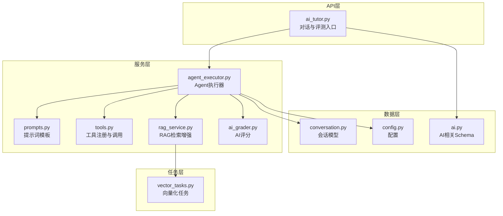
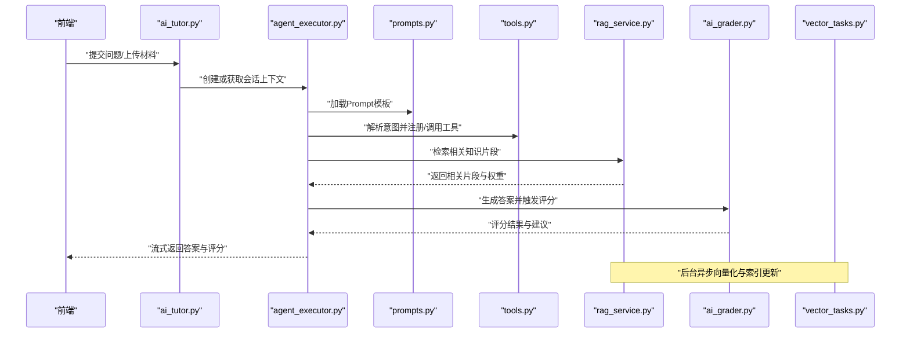
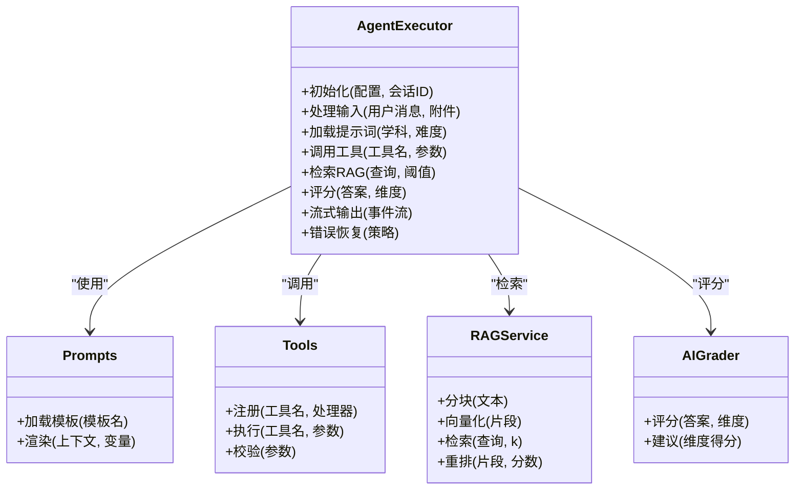
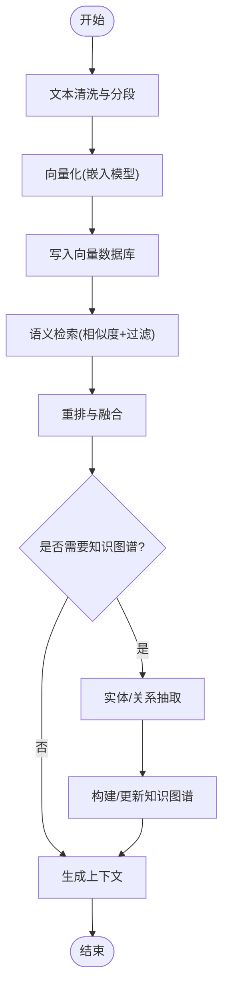
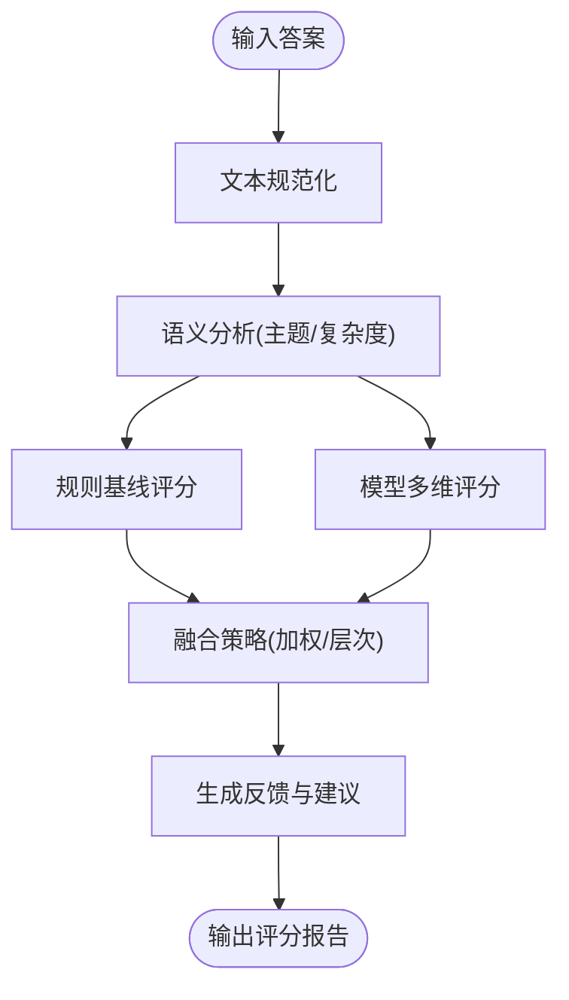
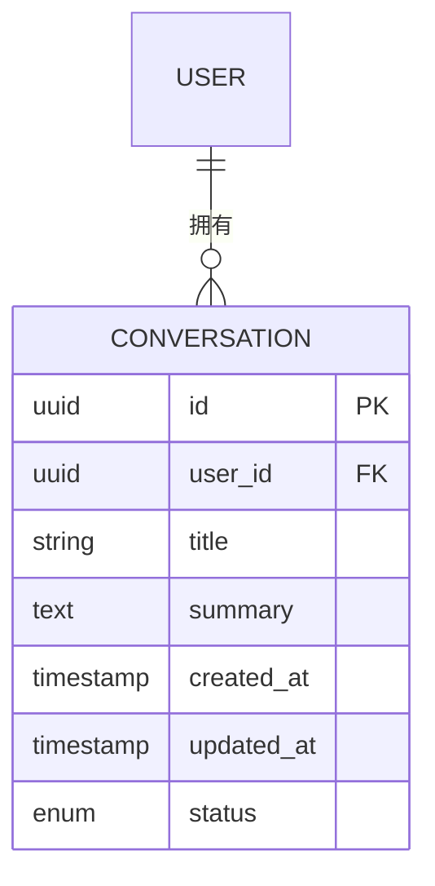
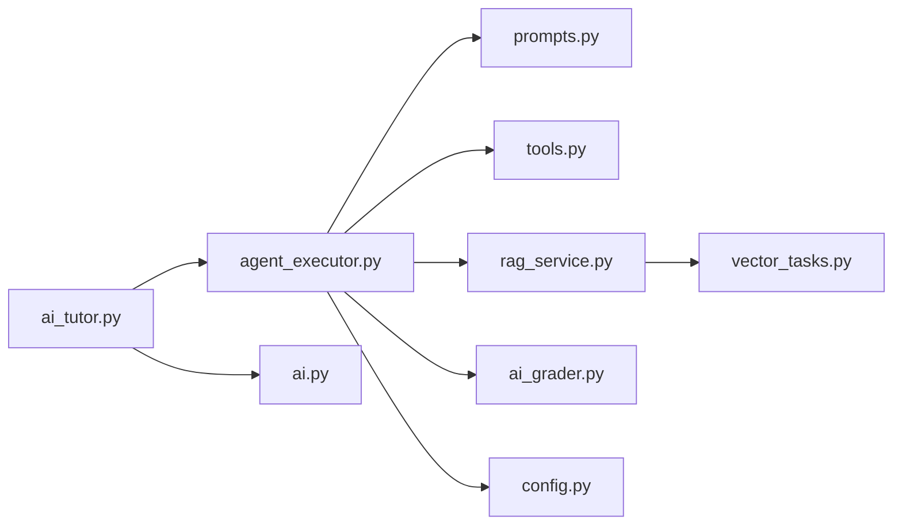

# AI系统架构

<cite>
**本文引用的文件**   
- [backend/app/services/agent/agent_executor.py](file://backend/app/services/agent/agent_executor.py)
- [backend/app/services/agent/prompts.py](file://backend/app/services/agent/prompts.py)
- [backend/app/services/agent/tools.py](file://backend/app/services/agent/tools.py)
- [backend/app/services/rag_service.py](file://backend/app/services/rag_service.py)
- [backend/app/services/ai_grader.py](file://backend/app/services/ai_grader.py)
- [backend/app/api/v1/ai_tutor.py](file://backend/app/api/v1/ai_tutor.py)
- [backend/app/core/config.py](file://backend/app/core/config.py)
- [backend/app/tasks/vector_tasks.py](file://backend/app/tasks/vector_tasks.py)
- [backend/app/models/conversation.py](file://backend/app/models/conversation.py)
- [backend/app/schemas/ai.py](file://backend/app/schemas/ai.py)
</cite>

## 目录
1. [简介](#简介)
2. [项目结构](#项目结构)
3. [核心组件](#核心组件)
4. [架构总览](#架构总览)
5. [详细组件分析](#详细组件分析)
6. [依赖关系分析](#依赖关系分析)
7. [性能与并发](#性能与并发)
8. [故障排查指南](#故障排查指南)
9. [结论](#结论)
10. [附录](#附录)

## 简介
本技术文档面向AI助教系统的AI架构，聚焦以下目标：
- Agent执行器架构：提示词工程、工具链扩展、多模态处理能力
- RAG检索增强生成：向量数据库集成、语义搜索、知识图谱构建
- AI评分算法与自然语言处理流程、上下文管理机制
- 大模型集成策略、缓存优化、并发处理
- Prompt模板管理、动态工具注册、错误恢复机制
- AI服务监控、性能调优、成本控制策略

## 项目结构
后端采用分层架构：API层负责路由与请求校验，服务层封装业务逻辑（Agent、RAG、评分等），任务层承载异步与批处理（如向量化任务），数据层通过ORM模型持久化。前端通过HTTP/SSE与后端交互。

图表来源
- [backend/app/api/v1/ai_tutor.py](file://backend/app/api/v1/ai_tutor.py)
- [backend/app/services/agent/agent_executor.py](file://backend/app/services/agent/agent_executor.py)
- [backend/app/services/agent/prompts.py](file://backend/app/services/agent/prompts.py)
- [backend/app/services/agent/tools.py](file://backend/app/services/agent/tools.py)
- [backend/app/services/rag_service.py](file://backend/app/services/rag_service.py)
- [backend/app/services/ai_grader.py](file://backend/app/services/ai_grader.py)
- [backend/app/tasks/vector_tasks.py](file://backend/app/tasks/vector_tasks.py)
- [backend/app/models/conversation.py](file://backend/app/models/conversation.py)
- [backend/app/core/config.py](file://backend/app/core/config.py)
- [backend/app/schemas/ai.py](file://backend/app/schemas/ai.py)

章节来源
- [backend/app/api/v1/ai_tutor.py](file://backend/app/api/v1/ai_tutor.py)
- [backend/app/services/agent/agent_executor.py](file://backend/app/services/agent/agent_executor.py)
- [backend/app/services/rag_service.py](file://backend/app/services/rag_service.py)
- [backend/app/services/ai_grader.py](file://backend/app/services/ai_grader.py)
- [backend/app/tasks/vector_tasks.py](file://backend/app/tasks/vector_tasks.py)
- [backend/app/models/conversation.py](file://backend/app/models/conversation.py)
- [backend/app/core/config.py](file://backend/app/core/config.py)
- [backend/app/schemas/ai.py](file://backend/app/schemas/ai.py)

## 核心组件
- Agent执行器：编排提示词、工具调用、RAG检索与评分，维护会话上下文并支持流式输出。
- 提示词工程：集中化管理Prompt模板，支持按场景与学科动态选择。
- 工具链扩展：可插拔工具注册机制，统一参数校验与结果归一化。
- RAG服务：文本分块、向量化入库、语义检索、重排与摘要融合。
- AI评分：基于规则与大模型的复合评分，提供维度化反馈与改进建议。
- 任务队列：异步向量化与批量索引更新，避免阻塞主线程。
- 配置与Schema：统一配置项与数据结构定义，保障前后端契约一致。

章节来源
- [backend/app/services/agent/agent_executor.py](file://backend/app/services/agent/agent_executor.py)
- [backend/app/services/agent/prompts.py](file://backend/app/services/agent/prompts.py)
- [backend/app/services/agent/tools.py](file://backend/app/services/agent/tools.py)
- [backend/app/services/rag_service.py](file://backend/app/services/rag_service.py)
- [backend/app/services/ai_grader.py](file://backend/app/services/ai_grader.py)
- [backend/app/tasks/vector_tasks.py](file://backend/app/tasks/vector_tasks.py)
- [backend/app/core/config.py](file://backend/app/core/config.py)
- [backend/app/schemas/ai.py](file://backend/app/schemas/ai.py)

## 架构总览
整体采用“API→服务→任务”的分层模式，Agent作为中枢协调提示词、工具、RAG与评分；RAG通过任务队列进行向量化与索引更新；会话状态与配置在数据层统一管理。

图表来源
- [backend/app/api/v1/ai_tutor.py](file://backend/app/api/v1/ai_tutor.py)
- [backend/app/services/agent/agent_executor.py](file://backend/app/services/agent/agent_executor.py)
- [backend/app/services/agent/prompts.py](file://backend/app/services/agent/prompts.py)
- [backend/app/services/agent/tools.py](file://backend/app/services/agent/tools.py)
- [backend/app/services/rag_service.py](file://backend/app/services/rag_service.py)
- [backend/app/services/ai_grader.py](file://backend/app/services/ai_grader.py)
- [backend/app/tasks/vector_tasks.py](file://backend/app/tasks/vector_tasks.py)

## 详细组件分析

### Agent执行器架构
- 职责：接收用户输入，维护会话上下文，调度提示词、工具与RAG，整合评分结果，并以流式方式返回。
- 关键能力：
  - 提示词工程：根据学科、难度、学生画像选择模板，注入上下文与约束。
  - 工具链扩展：动态注册工具，统一参数校验、异常捕获与结果标准化。
  - 多模态处理：支持图片/音频/视频等多模态输入，转换为模型可理解形式后再进入Agent。
  - 上下文管理：会话级记忆、短期窗口与长期摘要结合，控制Token成本与质量平衡。
  - 错误恢复：重试、降级与回退策略，保证可用性。

图表来源
- [backend/app/services/agent/agent_executor.py](file://backend/app/services/agent/agent_executor.py)
- [backend/app/services/agent/prompts.py](file://backend/app/services/agent/prompts.py)
- [backend/app/services/agent/tools.py](file://backend/app/services/agent/tools.py)
- [backend/app/services/rag_service.py](file://backend/app/services/rag_service.py)
- [backend/app/services/ai_grader.py](file://backend/app/services/ai_grader.py)

章节来源
- [backend/app/services/agent/agent_executor.py](file://backend/app/services/agent/agent_executor.py)
- [backend/app/services/agent/prompts.py](file://backend/app/services/agent/prompts.py)
- [backend/app/services/agent/tools.py](file://backend/app/services/agent/tools.py)
- [backend/app/services/rag_service.py](file://backend/app/services/rag_service.py)
- [backend/app/services/ai_grader.py](file://backend/app/services/ai_grader.py)

### RAG检索增强生成系统
- 实现要点：
  - 文本预处理：清洗、分段、去噪，保留结构化信息（标题、段落）。
  - 向量化：使用嵌入模型将片段转为向量，写入向量数据库。
  - 语义检索：基于查询的向量相似度检索，结合关键词过滤提升召回率。
  - 重排与融合：对候选片段进行相关性重排，合并为最终上下文。
  - 知识图谱构建：从文档抽取实体与关系，形成图结构用于推理与解释。
  - 异步任务：通过任务队列进行批量向量化与索引更新，避免阻塞。

图表来源
- [backend/app/services/rag_service.py](file://backend/app/services/rag_service.py)
- [backend/app/tasks/vector_tasks.py](file://backend/app/tasks/vector_tasks.py)

章节来源
- [backend/app/services/rag_service.py](file://backend/app/services/rag_service.py)
- [backend/app/tasks/vector_tasks.py](file://backend/app/tasks/vector_tasks.py)

### AI评分算法与NLP流程
- 评分维度：准确性、完整性、逻辑性、表达清晰度、创新性等。
- 算法策略：
  - 规则基线：关键词匹配、结构检查、长度与格式约束。
  - 模型打分：基于大模型的多维评分与评语生成。
  - 融合策略：加权平均或层次评估，输出总分与分项得分。
- NLP流程：
  - 文本规范化：去除噪声、统一标点与大小写。
  - 语义分析：主题识别、情感倾向、复杂度估计。
  - 对比参考：与参考答案或标准进行相似度计算。
  - 反馈生成：针对薄弱维度给出改进建议。

图表来源
- [backend/app/services/ai_grader.py](file://backend/app/services/ai_grader.py)

章节来源
- [backend/app/services/ai_grader.py](file://backend/app/services/ai_grader.py)

### 上下文管理与会话机制
- 会话模型：记录用户、题目、历史消息、元数据与状态。
- 上下文窗口：滑动窗口与摘要压缩相结合，控制Token消耗。
- 长期记忆：跨会话的知识点与错题集，支持个性化推荐。
- 状态同步：通过SSE推送进度与中间结果，提升用户体验。

图表来源
- [backend/app/models/conversation.py](file://backend/app/models/conversation.py)

章节来源
- [backend/app/models/conversation.py](file://backend/app/models/conversation.py)

### 大模型集成策略与缓存优化
- 集成策略：
  - 统一接口抽象：屏蔽不同厂商差异，支持热切换。
  - 参数调优：温度、Top-p、最大生成长度、频率惩罚等。
  - 安全与合规：内容过滤、敏感词检测、审计日志。
- 缓存优化：
  - 请求级缓存：相同输入命中缓存直接返回。
  - 片段级缓存：RAG检索结果缓存，减少重复计算。
  - 结果级缓存：评分与反馈缓存，降低模型调用成本。
- 成本控制：
  - Token预算：限制上下文长度与输出长度。
  - 降级策略：高负载时切换到轻量模型或规则方案。
  - 配额与限流：按用户或租户设置配额与速率限制。

章节来源
- [backend/app/core/config.py](file://backend/app/core/config.py)
- [backend/app/schemas/ai.py](file://backend/app/schemas/ai.py)

### Prompt模板管理系统
- 模板组织：按学科、题型、难度分级管理，支持版本控制。
- 动态渲染：注入上下文、学生画像、历史表现与约束条件。
- 质量控制：模板校验、A/B测试与效果评估。
- 扩展机制：插件式模板加载器，支持外部仓库与在线更新。

章节来源
- [backend/app/services/agent/prompts.py](file://backend/app/services/agent/prompts.py)

### 动态工具注册与多模态处理
- 工具注册：运行时注册工具处理器，统一签名与返回值。
- 参数校验：类型检查、必填字段验证、边界值处理。
- 多模态：图片OCR、语音转文本、视频帧采样与描述生成。
- 错误恢复：超时重试、熔断与回退到默认行为。

章节来源
- [backend/app/services/agent/tools.py](file://backend/app/services/agent/tools.py)

### API与服务编排
- 入口设计：RESTful接口，支持分页、过滤与排序。
- 流式响应：SSE推送中间结果与进度。
- 鉴权与权限：JWT令牌、角色与资源访问控制。
- 监控指标：QPS、延迟、错误率、Token消耗与成本统计。

章节来源
- [backend/app/api/v1/ai_tutor.py](file://backend/app/api/v1/ai_tutor.py)

## 依赖关系分析
- 模块耦合：
  - API层仅依赖服务层接口，保持松耦合。
  - Agent执行器聚合提示词、工具、RAG与评分，承担编排职责。
  - 任务层独立于主线程，避免阻塞。
- 外部依赖：
  - 向量数据库：存储与检索片段向量。
  - 大模型API：生成与评分。
  - 任务队列：Celery或类似框架。
- 循环依赖：
  - 通过接口抽象与依赖注入避免循环引用。

图表来源
- [backend/app/api/v1/ai_tutor.py](file://backend/app/api/v1/ai_tutor.py)
- [backend/app/services/agent/agent_executor.py](file://backend/app/services/agent/agent_executor.py)
- [backend/app/services/agent/prompts.py](file://backend/app/services/agent/prompts.py)
- [backend/app/services/agent/tools.py](file://backend/app/services/agent/tools.py)
- [backend/app/services/rag_service.py](file://backend/app/services/rag_service.py)
- [backend/app/services/ai_grader.py](file://backend/app/services/ai_grader.py)
- [backend/app/tasks/vector_tasks.py](file://backend/app/tasks/vector_tasks.py)
- [backend/app/core/config.py](file://backend/app/core/config.py)
- [backend/app/schemas/ai.py](file://backend/app/schemas/ai.py)

章节来源
- [backend/app/api/v1/ai_tutor.py](file://backend/app/api/v1/ai_tutor.py)
- [backend/app/services/agent/agent_executor.py](file://backend/app/services/agent/agent_executor.py)
- [backend/app/services/rag_service.py](file://backend/app/services/rag_service.py)
- [backend/app/services/ai_grader.py](file://backend/app/services/ai_grader.py)
- [backend/app/tasks/vector_tasks.py](file://backend/app/tasks/vector_tasks.py)
- [backend/app/core/config.py](file://backend/app/core/config.py)
- [backend/app/schemas/ai.py](file://backend/app/schemas/ai.py)

## 性能与并发
- 并发策略：
  - 异步I/O：非阻塞网络与文件IO。
  - 任务队列：向量化与批量处理走后台任务。
  - 连接池：数据库与向量库连接复用。
- 缓存策略：
  - 多级缓存：内存→Redis→持久化。
  - 失效策略：TTL与变更通知。
- 监控与告警：
  - 指标采集：延迟、吞吐、错误率、Token用量。
  - 链路追踪：请求ID贯穿全链路。
  - 告警阈值：CPU、内存、队列积压与模型超时。

[本节为通用指导，不直接分析具体文件]

## 故障排查指南
- 常见问题：
  - 模型调用失败：检查密钥、配额与网络连通性。
  - 向量检索低质：调整分块策略与相似度阈值。
  - 评分不稳定：固定随机种子与温度参数。
  - 任务堆积：扩容Worker与优化批大小。
- 诊断步骤：
  - 查看日志与链路追踪。
  - 复现最小用例并隔离问题域。
  - 逐步禁用功能定位根因。
- 恢复策略：
  - 重试与退避。
  - 降级到规则或轻量模型。
  - 熔断保护与快速失败。

章节来源
- [backend/app/services/agent/agent_executor.py](file://backend/app/services/agent/agent_executor.py)
- [backend/app/services/rag_service.py](file://backend/app/services/rag_service.py)
- [backend/app/services/ai_grader.py](file://backend/app/services/ai_grader.py)
- [backend/app/tasks/vector_tasks.py](file://backend/app/tasks/vector_tasks.py)

## 结论
本架构以Agent为核心，整合提示词工程、工具链、RAG与评分，形成可扩展、可观测、可运维的AI助教系统。通过分层设计与异步任务，兼顾性能与稳定性；通过缓存与成本控制策略，确保规模化可用。后续可在知识图谱深度推理、个性化学习路径与多模态深度融合方面持续演进。

[本节为总结性内容，不直接分析具体文件]

## 附录
- 术语表：
  - RAG：检索增强生成
  - SSE：服务器发送事件
  - JWT：JSON Web Token
- 最佳实践：
  - 模板与代码分离，便于迭代与评审。
  - 工具注册遵循单一职责与幂等原则。
  - 评分维度与反馈需可解释与可追溯。

[本节为补充信息，不直接分析具体文件]