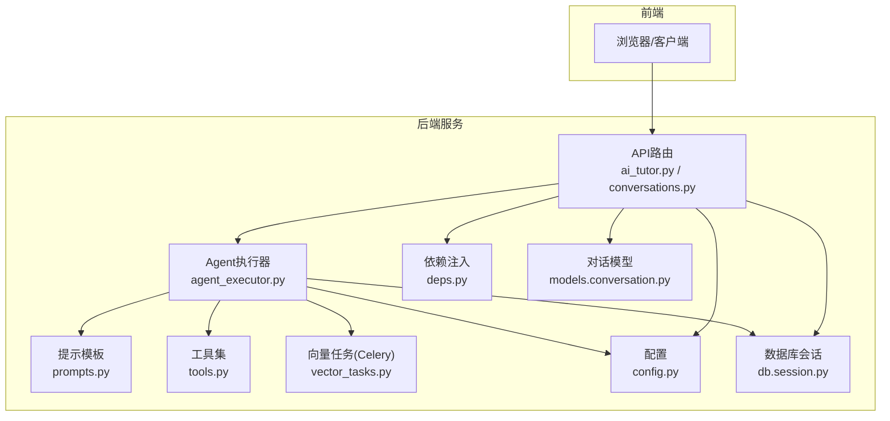
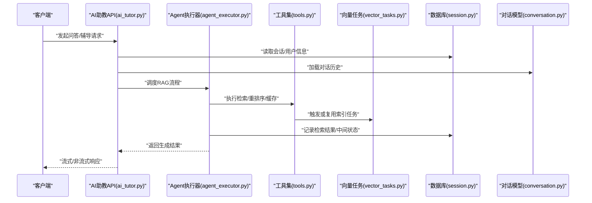
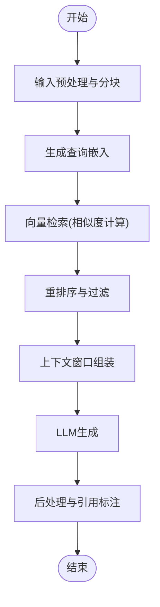
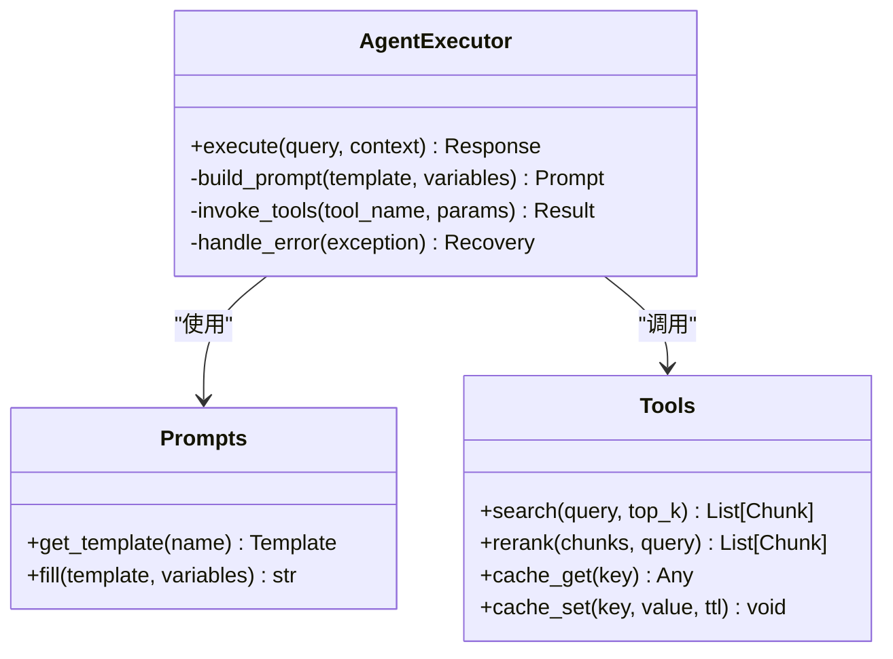
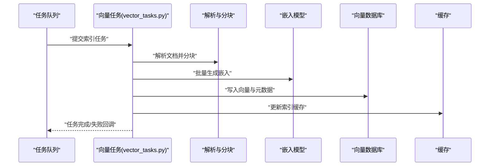
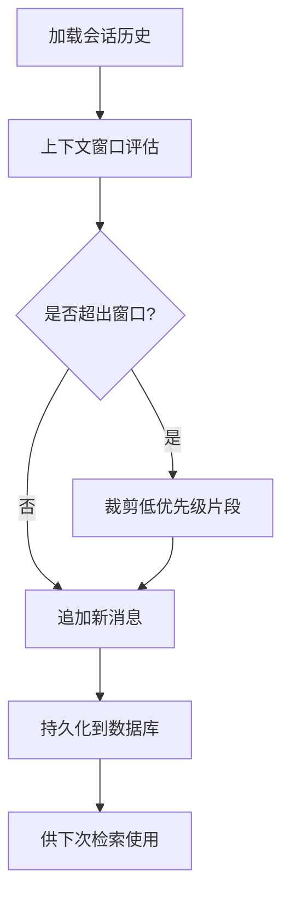
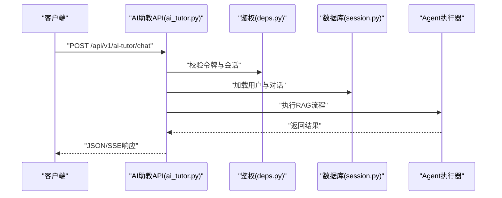
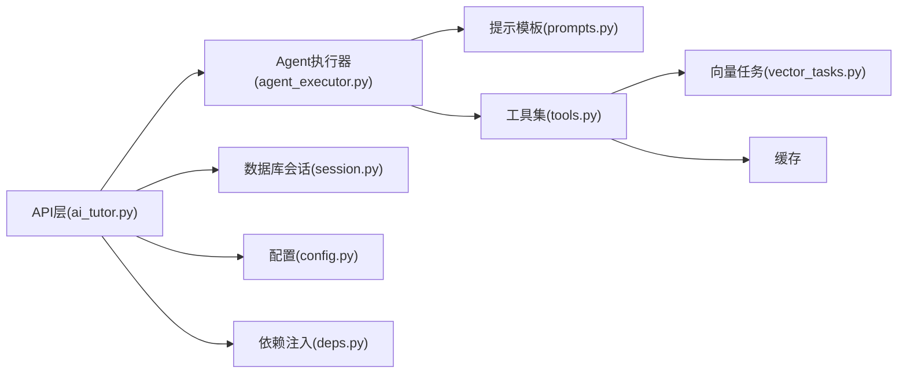

# RAG检索增强系统

<cite>
**本文引用的文件**   
- [rag_service.py](file://backend/app/services/rag_service.py)
- [vector_tasks.py](file://backend/app/tasks/vector_tasks.py)
- [agent_executor.py](file://backend/app/services/agent/agent_executor.py)
- [prompts.py](file://backend/app/services/agent/prompts.py)
- [tools.py](file://backend/app/services/agent/tools.py)
- [ai_tutor.py](file://backend/app/api/v1/ai_tutor.py)
- [conversations.py](file://backend/app/api/v1/conversations.py)
- [config.py](file://backend/app/core/config.py)
- [deps.py](file://backend/app/core/deps.py)
- [session.py](file://backend/app/db/session.py)
- [conversation.py](file://backend/app/models/conversation.py)
</cite>

## 目录
1. [简介](#简介)
2. [项目结构](#项目结构)
3. [核心组件](#核心组件)
4. [架构总览](#架构总览)
5. [详细组件分析](#详细组件分析)
6. [依赖关系分析](#依赖关系分析)
7. [性能考量](#性能考量)
8. [故障排查指南](#故障排查指南)
9. [结论](#结论)
10. [附录](#附录)

## 简介
本技术文档面向RAG（检索增强生成）系统，围绕向量数据库集成、知识图谱构建、检索策略优化、上下文窗口与长文本处理、多轮对话记忆、嵌入模型选择与批量优化、增量更新策略以及系统调优与监控等方面展开。文档基于仓库中后端服务代码进行梳理，重点覆盖以下模块：
- 检索与生成链路：API层到Agent执行器与提示工程
- 向量任务与异步索引：Celery任务驱动的向量化与索引更新
- 会话与记忆：对话状态管理与历史上下文维护
- 配置与依赖注入：外部服务接入与运行时参数管理

## 项目结构
本项目采用前后端分离架构，RAG相关能力集中在后端Python服务中，前端通过REST API调用。RAG关键路径涉及API路由、Agent执行器、向量任务、配置与数据库会话等模块。

图表来源
- [ai_tutor.py](file://backend/app/api/v1/ai_tutor.py)
- [conversations.py](file://backend/app/api/v1/conversations.py)
- [agent_executor.py](file://backend/app/services/agent/agent_executor.py)
- [prompts.py](file://backend/app/services/agent/prompts.py)
- [tools.py](file://backend/app/services/agent/tools.py)
- [vector_tasks.py](file://backend/app/tasks/vector_tasks.py)
- [config.py](file://backend/app/core/config.py)
- [deps.py](file://backend/app/core/deps.py)
- [session.py](file://backend/app/db/session.py)
- [conversation.py](file://backend/app/models/conversation.py)

章节来源
- [ai_tutor.py](file://backend/app/api/v1/ai_tutor.py)
- [conversations.py](file://backend/app/api/v1/conversations.py)
- [agent_executor.py](file://backend/app/services/agent/agent_executor.py)
- [prompts.py](file://backend/app/services/agent/prompts.py)
- [tools.py](file://backend/app/services/agent/tools.py)
- [vector_tasks.py](file://backend/app/tasks/vector_tasks.py)
- [config.py](file://backend/app/core/config.py)
- [deps.py](file://backend/app/core/deps.py)
- [session.py](file://backend/app/db/session.py)
- [conversation.py](file://backend/app/models/conversation.py)

## 核心组件
- 检索与生成服务：封装RAG检索流程与LLM生成逻辑，负责将用户查询转换为语义搜索请求，召回候选片段，组装上下文并驱动生成。
- Agent执行器：统一编排提示词、工具调用与外部服务交互，协调检索、重排序与生成步骤。
- 向量任务：基于Celery的异步任务，负责批量向量化、索引写入与增量更新。
- 配置与依赖注入：集中管理外部服务连接、模型参数、缓存与向量库配置。
- 会话与记忆：持久化对话历史，支持多轮上下文拼接与记忆裁剪。

章节来源
- [rag_service.py](file://backend/app/services/rag_service.py)
- [agent_executor.py](file://backend/app/services/agent/agent_executor.py)
- [vector_tasks.py](file://backend/app/tasks/vector_tasks.py)
- [config.py](file://backend/app/core/config.py)
- [deps.py](file://backend/app/core/deps.py)
- [session.py](file://backend/app/db/session.py)
- [conversation.py](file://backend/app/models/conversation.py)

## 架构总览
下图展示从用户请求到RAG生成的端到端流程，包括检索、重排序、上下文组装与生成。

图表来源
- [ai_tutor.py](file://backend/app/api/v1/ai_tutor.py)
- [agent_executor.py](file://backend/app/services/agent/agent_executor.py)
- [tools.py](file://backend/app/services/agent/tools.py)
- [vector_tasks.py](file://backend/app/tasks/vector_tasks.py)
- [session.py](file://backend/app/db/session.py)
- [conversation.py](file://backend/app/models/conversation.py)

## 详细组件分析

### 检索与生成服务（RAG Service）
职责概述
- 接收用户查询，结合会话上下文，构造检索请求
- 调用向量检索接口，获取候选片段
- 可选重排序与过滤，提升相关性
- 组装Prompt上下文，驱动LLM生成答案
- 记录检索日志与命中片段，便于分析与回溯

关键流程
- 输入预处理：清洗与分块策略（按段落/句子/固定长度）
- 语义检索：使用嵌入向量在向量库中进行相似度匹配
- 重排序：对候选片段进行二次打分（关键词匹配、位置权重、领域规则）
- 上下文窗口管理：控制最大Token数，优先保留高相关片段
- 生成与后处理：约束输出格式，去噪与引用标注

章节来源
- [rag_service.py](file://backend/app/services/rag_service.py)

### Agent执行器与提示工程
职责概述
- 统一编排RAG流程：检索、重排序、生成
- 管理工具调用：向量检索、缓存、统计
- 维护提示模板与动态变量注入
- 错误恢复与重试策略

类与方法关系
- Agent执行器作为控制器，协调提示模板与工具集
- 提示模板提供结构化上下文与指令
- 工具集封装外部服务调用（如向量库、缓存、任务队列）

图表来源
- [agent_executor.py](file://backend/app/services/agent/agent_executor.py)
- [prompts.py](file://backend/app/services/agent/prompts.py)
- [tools.py](file://backend/app/services/agent/tools.py)

章节来源
- [agent_executor.py](file://backend/app/services/agent/agent_executor.py)
- [prompts.py](file://backend/app/services/agent/prompts.py)
- [tools.py](file://backend/app/services/agent/tools.py)

### 向量任务与索引更新
职责概述
- 批量文档切分与向量化
- 写入向量数据库，建立索引
- 增量更新：检测变更文档，仅更新受影响片段
- 任务调度与失败重试

章节来源
- [vector_tasks.py](file://backend/app/tasks/vector_tasks.py)

### 会话与记忆管理
职责概述
- 持久化对话历史，支持多轮上下文
- 记忆裁剪：根据窗口大小与重要性评分保留关键片段
- 会话状态同步：跨请求保持上下文一致性

章节来源
- [conversations.py](file://backend/app/api/v1/conversations.py)
- [session.py](file://backend/app/db/session.py)
- [conversation.py](file://backend/app/models/conversation.py)

### API层与外部集成
职责概述
- 暴露RAG相关API：问答、辅导、检索测试
- 鉴权与会话绑定：确保上下文隔离
- 错误码与日志：统一异常处理与追踪

图表来源
- [ai_tutor.py](file://backend/app/api/v1/ai_tutor.py)
- [deps.py](file://backend/app/core/deps.py)
- [session.py](file://backend/app/db/session.py)
- [agent_executor.py](file://backend/app/services/agent/agent_executor.py)

章节来源
- [ai_tutor.py](file://backend/app/api/v1/ai_tutor.py)
- [deps.py](file://backend/app/core/deps.py)
- [session.py](file://backend/app/db/session.py)

## 依赖关系分析
RAG系统的依赖关系如下：
- API层依赖Agent执行器与数据库会话
- Agent执行器依赖提示模板与工具集
- 工具集依赖向量任务、缓存与外部服务
- 配置与依赖注入贯穿各层，提供运行时参数

图表来源
- [ai_tutor.py](file://backend/app/api/v1/ai_tutor.py)
- [agent_executor.py](file://backend/app/services/agent/agent_executor.py)
- [prompts.py](file://backend/app/services/agent/prompts.py)
- [tools.py](file://backend/app/services/agent/tools.py)
- [vector_tasks.py](file://backend/app/tasks/vector_tasks.py)
- [config.py](file://backend/app/core/config.py)
- [deps.py](file://backend/app/core/deps.py)
- [session.py](file://backend/app/db/session.py)

章节来源
- [ai_tutor.py](file://backend/app/api/v1/ai_tutor.py)
- [agent_executor.py](file://backend/app/services/agent/agent_executor.py)
- [prompts.py](file://backend/app/services/agent/prompts.py)
- [tools.py](file://backend/app/services/agent/tools.py)
- [vector_tasks.py](file://backend/app/tasks/vector_tasks.py)
- [config.py](file://backend/app/core/config.py)
- [deps.py](file://backend/app/core/deps.py)
- [session.py](file://backend/app/db/session.py)

## 性能考量
- 向量检索优化
  - 使用近似最近邻（ANN）索引，平衡召回率与延迟
  - 批量嵌入与索引写入，减少I/O开销
  - 预取热门片段至缓存，降低重复检索成本
- 重排序算法
  - 结合关键词匹配与语义相似度，提升Top-K质量
  - 引入位置权重与领域规则，避免噪声干扰
- 上下文窗口管理
  - 动态裁剪低相关片段，保证LLM输入长度可控
  - 分段生成与合并，避免单次过长导致质量下降
- 并发与异步
  - 使用Celery异步任务处理耗时操作（向量化、索引）
  - API层采用流式响应，提升用户体验
- 资源监控
  - 跟踪向量库QPS、延迟与内存占用
  - 监控LLM调用次数、Token消耗与错误率
  - 设置告警阈值，自动扩容或降级

## 故障排查指南
- 常见问题
  - 检索结果为空：检查向量索引是否完整，确认分块策略与嵌入模型一致
  - 生成质量差：调整重排序权重，优化提示模板与上下文窗口
  - 延迟过高：启用缓存，增加向量库副本，优化批量大小
- 日志与追踪
  - 记录检索命中率、重排序分数分布与生成Token数
  - 关联会话ID与任务ID，便于问题定位
- 回滚与恢复
  - 索引版本化管理，支持快速回滚
  - 任务失败重试与死信队列，保障数据一致性

## 结论
本RAG系统通过模块化设计实现了检索、重排序与生成的解耦，结合异步任务与缓存机制提升了整体性能。建议在生产环境中持续监控关键指标，并根据业务反馈迭代检索策略与提示模板，以获得更稳定与高质量的回答效果。

## 附录
- 术语表
  - RAG：检索增强生成
  - ANN：近似最近邻
  - Top-K：前K个最相关结果
  - SSE：服务器发送事件
- 参考实现路径
  - 检索服务：[rag_service.py](file://backend/app/services/rag_service.py)
  - Agent执行器：[agent_executor.py](file://backend/app/services/agent/agent_executor.py)
  - 向量任务：[vector_tasks.py](file://backend/app/tasks/vector_tasks.py)
  - API路由：[ai_tutor.py](file://backend/app/api/v1/ai_tutor.py)
  - 会话管理：[conversations.py](file://backend/app/api/v1/conversations.py)
  - 配置与依赖：[config.py](file://backend/app/core/config.py), [deps.py](file://backend/app/core/deps.py)
  - 数据库与会话：[session.py](file://backend/app/db/session.py), [conversation.py](file://backend/app/models/conversation.py)