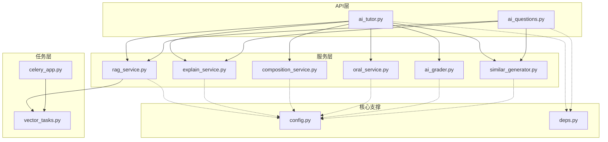
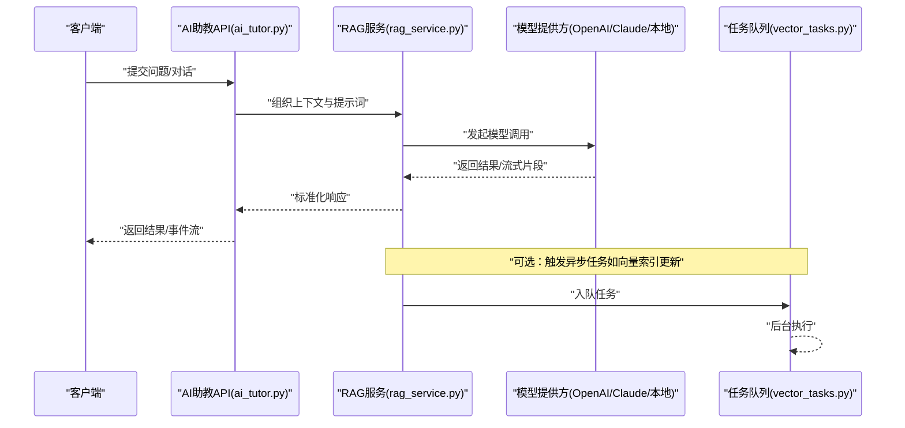
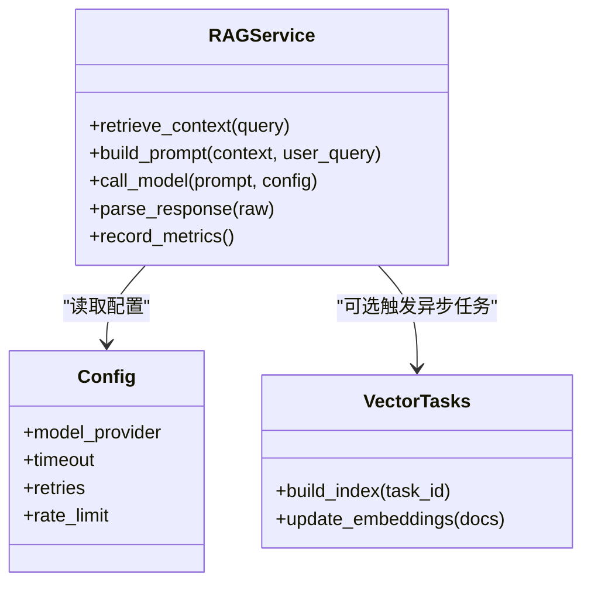
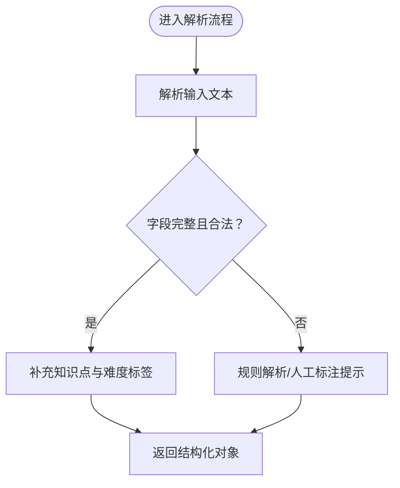
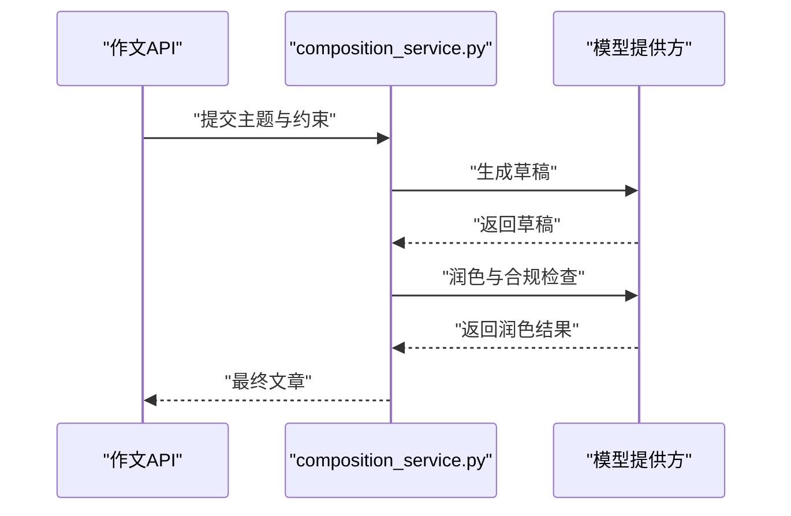
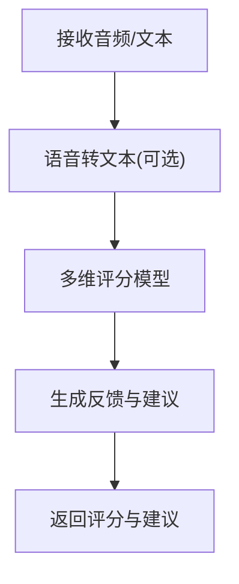
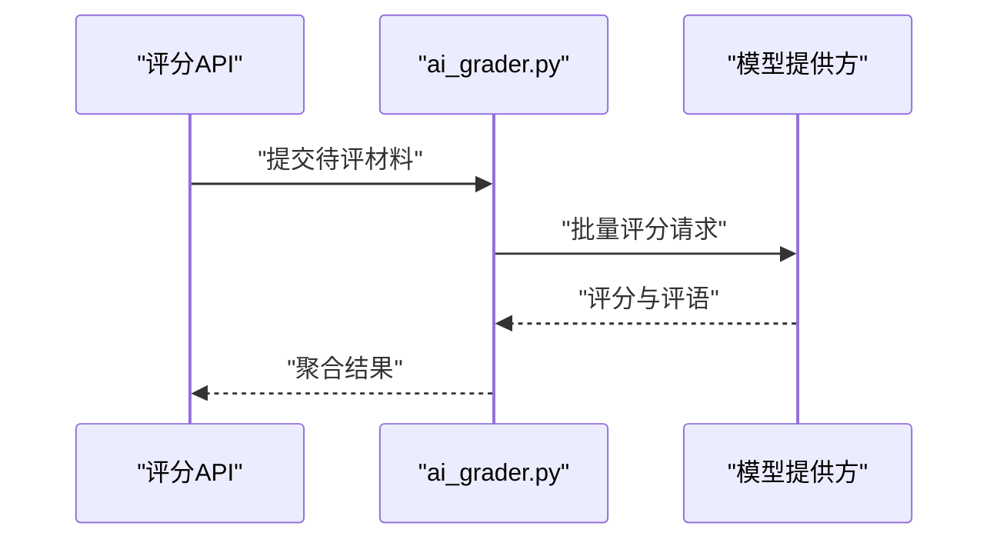
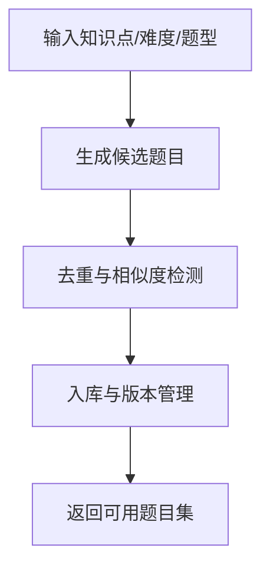
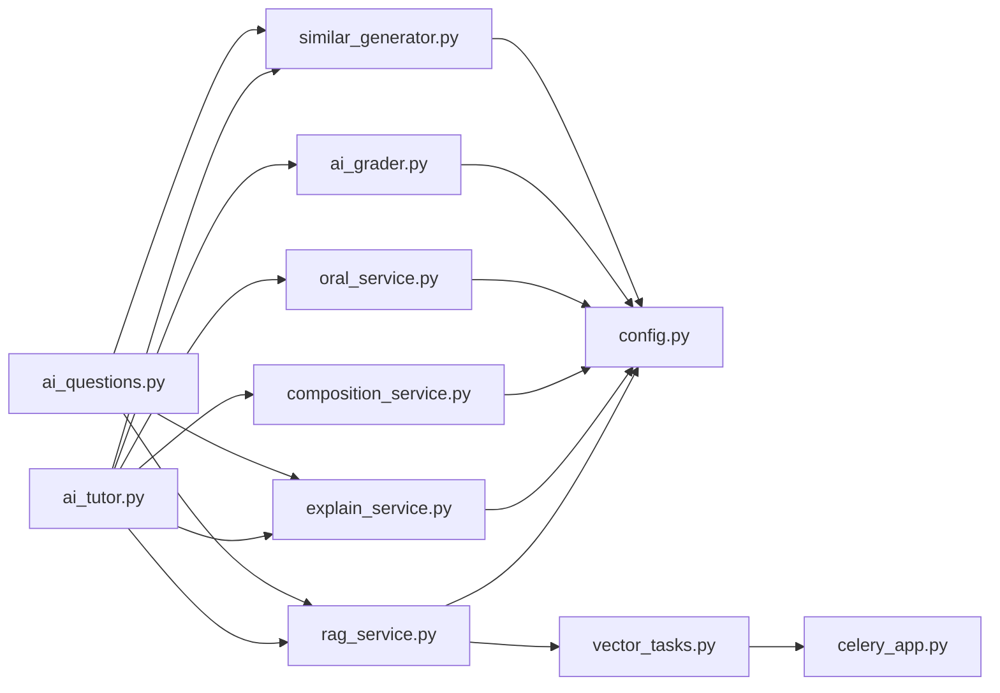

# 大模型集成层

<cite>
**本文引用的文件**   
- [backend/app/services/rag_service.py](file://backend/app/services/rag_service.py)
- [backend/app/services/explain_service.py](file://backend/app/services/explain_service.py)
- [backend/app/services/composition_service.py](file://backend/app/services/composition_service.py)
- [backend/app/services/oral_service.py](file://backend/app/services/oral_service.py)
- [backend/app/services/ai_grader.py](file://backend/app/services/ai_grader.py)
- [backend/app/services/similar_generator.py](file://backend/app/services/similar_generator.py)
- [backend/app/api/v1/ai_tutor.py](file://backend/app/api/v1/ai_tutor.py)
- [backend/app/api/v1/ai_questions.py](file://backend/app/api/v1/ai_questions.py)
- [backend/app/core/config.py](file://backend/app/core/config.py)
- [backend/app/core/deps.py](file://backend/app/core/deps.py)
- [backend/app/tasks/celery_app.py](file://backend/app/tasks/celery_app.py)
- [backend/app/tasks/vector_tasks.py](file://backend/app/tasks/vector_tasks.py)
</cite>

## 目录
1. [简介](#简介)
2. [项目结构](#项目结构)
3. [核心组件](#核心组件)
4. [架构总览](#架构总览)
5. [详细组件分析](#详细组件分析)
6. [依赖关系分析](#依赖关系分析)
7. [性能与容量规划](#性能与容量规划)
8. [故障排查指南](#故障排查指南)
9. [结论](#结论)
10. [附录：新模型接入与调优实践](#附录新模型接入与调优实践)

## 简介
本技术文档面向“大模型集成层”，围绕多模型支持（OpenAI、Claude、本地模型）、模型路由策略（负载均衡、故障转移、成本优化）、API调用管理（请求封装、响应解析、错误重试）、缓存策略（结果缓存、中间态缓存、热点数据缓存）、并发控制与限流保护、资源监控，以及新模型接入与性能调优最佳实践进行系统化说明。文档以现有后端服务中的AI相关模块为切入点，结合任务队列与配置依赖，给出可落地的架构设计与实现建议。

## 项目结构
本项目采用前后端分离的模块化结构。与大模型集成相关的核心代码集中在后端服务的 services、api、tasks、core 等目录中：
- services：封装各类AI能力（RAG检索增强、题目解析、作文生成、口语评估、评分、相似题生成等）
- api：对外暴露REST接口，编排业务逻辑并调用services
- tasks：基于Celery的任务调度，承载耗时或异步处理（如向量索引构建）
- core：配置与依赖注入，集中管理密钥、模型参数、外部服务连接

图表来源
- [backend/app/api/v1/ai_tutor.py](file://backend/app/api/v1/ai_tutor.py)
- [backend/app/api/v1/ai_questions.py](file://backend/app/api/v1/ai_questions.py)
- [backend/app/services/rag_service.py](file://backend/app/services/rag_service.py)
- [backend/app/services/explain_service.py](file://backend/app/services/explain_service.py)
- [backend/app/services/composition_service.py](file://backend/app/services/composition_service.py)
- [backend/app/services/oral_service.py](file://backend/app/services/oral_service.py)
- [backend/app/services/ai_grader.py](file://backend/app/services/ai_grader.py)
- [backend/app/services/similar_generator.py](file://backend/app/services/similar_generator.py)
- [backend/app/tasks/celery_app.py](file://backend/app/tasks/celery_app.py)
- [backend/app/tasks/vector_tasks.py](file://backend/app/tasks/vector_tasks.py)
- [backend/app/core/config.py](file://backend/app/core/config.py)
- [backend/app/core/deps.py](file://backend/app/core/deps.py)

章节来源
- [backend/app/api/v1/ai_tutor.py](file://backend/app/api/v1/ai_tutor.py)
- [backend/app/api/v1/ai_questions.py](file://backend/app/api/v1/ai_questions.py)
- [backend/app/services/rag_service.py](file://backend/app/services/rag_service.py)
- [backend/app/services/explain_service.py](file://backend/app/services/explain_service.py)
- [backend/app/services/composition_service.py](file://backend/app/services/composition_service.py)
- [backend/app/services/oral_service.py](file://backend/app/services/oral_service.py)
- [backend/app/services/ai_grader.py](file://backend/app/services/ai_grader.py)
- [backend/app/services/similar_generator.py](file://backend/app/services/similar_generator.py)
- [backend/app/tasks/celery_app.py](file://backend/app/tasks/celery_app.py)
- [backend/app/tasks/vector_tasks.py](file://backend/app/tasks/vector_tasks.py)
- [backend/app/core/config.py](file://backend/app/core/config.py)
- [backend/app/core/deps.py](file://backend/app/core/deps.py)

## 核心组件
- RAG检索增强服务：负责知识库检索、上下文组装、提示词构造与模型调用，是问答与讲解类能力的核心入口。
- 题目解析服务：将用户输入的题目结构化，提取关键信息，驱动后续讲解与练习生成。
- 作文生成服务：根据主题与约束条件生成文章草稿，支持风格与长度控制。
- 口语评估服务：对接语音转文本与评分模型，输出维度化评价与建议。
- AI评分服务：对作业或答案进行多维度打分与评语生成。
- 相似题生成服务：基于知识点与难度生成同类题型，用于巩固训练。
- 任务队列：通过Celery执行耗时任务（如向量索引构建），避免阻塞HTTP请求。
- 配置与依赖：集中管理模型提供商密钥、超时、重试、并发限制等全局参数。

章节来源
- [backend/app/services/rag_service.py](file://backend/app/services/rag_service.py)
- [backend/app/services/explain_service.py](file://backend/app/services/explain_service.py)
- [backend/app/services/composition_service.py](file://backend/app/services/composition_service.py)
- [backend/app/services/oral_service.py](file://backend/app/services/oral_service.py)
- [backend/app/services/ai_grader.py](file://backend/app/services/ai_grader.py)
- [backend/app/services/similar_generator.py](file://backend/app/services/similar_generator.py)
- [backend/app/tasks/celery_app.py](file://backend/app/tasks/celery_app.py)
- [backend/app/tasks/vector_tasks.py](file://backend/app/tasks/vector_tasks.py)
- [backend/app/core/config.py](file://backend/app/core/config.py)
- [backend/app/core/deps.py](file://backend/app/core/deps.py)

## 架构总览
整体采用“API编排 + 服务抽象 + 任务队列”的分层架构。API层接收请求并进行基础校验，随后委派给具体服务；服务层封装不同模型的调用细节，统一返回标准化结果；任务队列承担离线或长耗时操作，降低主链路延迟。

图表来源
- [backend/app/api/v1/ai_tutor.py](file://backend/app/api/v1/ai_tutor.py)
- [backend/app/services/rag_service.py](file://backend/app/services/rag_service.py)
- [backend/app/tasks/vector_tasks.py](file://backend/app/tasks/vector_tasks.py)

## 详细组件分析

### 组件A：RAG检索增强服务
职责
- 检索相关知识片段，组装上下文
- 构造提示词并调用模型
- 统一响应格式，支持流式与非流式
- 记录调用指标与错误码，便于监控与重试

图表来源
- [backend/app/services/rag_service.py](file://backend/app/services/rag_service.py)
- [backend/app/core/config.py](file://backend/app/core/config.py)
- [backend/app/tasks/vector_tasks.py](file://backend/app/tasks/vector_tasks.py)

章节来源
- [backend/app/services/rag_service.py](file://backend/app/services/rag_service.py)
- [backend/app/core/config.py](file://backend/app/core/config.py)
- [backend/app/tasks/vector_tasks.py](file://backend/app/tasks/vector_tasks.py)

### 组件B：题目解析服务
职责
- 从自然语言题目中提取结构化字段（题干、选项、答案、知识点）
- 校验与规范化数据，供后续讲解与练习生成使用
- 提供失败回退策略（如降级到规则解析）

章节来源
- [backend/app/services/explain_service.py](file://backend/app/services/explain_service.py)

### 组件C：作文生成服务
职责
- 根据主题、体裁、字数等约束生成文章
- 支持风格控制与内容安全过滤
- 提供多次迭代生成的能力（草稿→润色→定稿）

图表来源
- [backend/app/services/composition_service.py](file://backend/app/services/composition_service.py)

章节来源
- [backend/app/services/composition_service.py](file://backend/app/services/composition_service.py)

### 组件D：口语评估服务
职责
- 语音转文本（可选）
- 发音、流利度、语法、词汇等多维评分
- 生成个性化改进建议

章节来源
- [backend/app/services/oral_service.py](file://backend/app/services/oral_service.py)

### 组件E：AI评分服务
职责
- 对作业或答案进行客观与主观维度评分
- 输出评语与错因分析
- 支持批量评分与结果导出

图表来源
- [backend/app/services/ai_grader.py](file://backend/app/services/ai_grader.py)

章节来源
- [backend/app/services/ai_grader.py](file://backend/app/services/ai_grader.py)

### 组件F：相似题生成服务
职责
- 基于知识点与难度生成同类题型
- 支持模板化与随机化组合
- 与题库系统联动，去重与入库

章节来源
- [backend/app/services/similar_generator.py](file://backend/app/services/similar_generator.py)

## 依赖关系分析
- API层依赖服务层，服务层依赖配置与任务队列
- 服务层之间相对独立，通过统一的配置与依赖注入解耦
- 任务队列与主链路异步解耦，提升吞吐与稳定性

图表来源
- [backend/app/api/v1/ai_tutor.py](file://backend/app/api/v1/ai_tutor.py)
- [backend/app/api/v1/ai_questions.py](file://backend/app/api/v1/ai_questions.py)
- [backend/app/services/rag_service.py](file://backend/app/services/rag_service.py)
- [backend/app/services/explain_service.py](file://backend/app/services/explain_service.py)
- [backend/app/services/composition_service.py](file://backend/app/services/composition_service.py)
- [backend/app/services/oral_service.py](file://backend/app/services/oral_service.py)
- [backend/app/services/ai_grader.py](file://backend/app/services/ai_grader.py)
- [backend/app/services/similar_generator.py](file://backend/app/services/similar_generator.py)
- [backend/app/tasks/celery_app.py](file://backend/app/tasks/celery_app.py)
- [backend/app/tasks/vector_tasks.py](file://backend/app/tasks/vector_tasks.py)
- [backend/app/core/config.py](file://backend/app/core/config.py)

章节来源
- [backend/app/api/v1/ai_tutor.py](file://backend/app/api/v1/ai_tutor.py)
- [backend/app/api/v1/ai_questions.py](file://backend/app/api/v1/ai_questions.py)
- [backend/app/services/rag_service.py](file://backend/app/services/rag_service.py)
- [backend/app/services/explain_service.py](file://backend/app/services/explain_service.py)
- [backend/app/services/composition_service.py](file://backend/app/services/composition_service.py)
- [backend/app/services/oral_service.py](file://backend/app/services/oral_service.py)
- [backend/app/services/ai_grader.py](file://backend/app/services/ai_grader.py)
- [backend/app/services/similar_generator.py](file://backend/app/services/similar_generator.py)
- [backend/app/tasks/celery_app.py](file://backend/app/tasks/celery_app.py)
- [backend/app/tasks/vector_tasks.py](file://backend/app/tasks/vector_tasks.py)
- [backend/app/core/config.py](file://backend/app/core/config.py)

## 性能与容量规划
- 并发控制
  - 在API层与服务层引入令牌桶或漏桶算法，限制单位时间内的请求数
  - 针对模型提供方设置最大并发连接数，避免触发上游限流
- 限流保护
  - 按租户/用户维度进行配额控制，防止单点滥用
  - 对热点接口（如讲解、作文）实施更严格的限流策略
- 资源监控
  - 采集模型调用时延、成功率、错误码分布、Token用量
  - 建立告警阈值，覆盖超时、高错误率、下游不可用等场景
- 缓存策略
  - 结果缓存：对相同查询与上下文的回答进行短期缓存，减少重复调用
  - 中间态缓存：保存检索到的知识片段与提示词，加速二次生成
  - 热点数据缓存：对高频知识点与模板进行预加载与常驻内存
- 成本优化
  - 模型路由：根据任务类型与预算选择性价比更高的模型
  - 降级策略：高峰期自动切换到轻量模型或规则引擎
  - 批处理：合并相似请求，降低总体调用次数

[本节为通用指导，不直接分析具体文件]

## 故障排查指南
- 常见问题定位
  - 模型调用超时：检查网络连通性、上游限流与重试策略
  - 响应解析失败：核对返回结构与字段映射，增加容错与默认值
  - 任务堆积：查看Celery消费者数量与队列深度，调整worker规模
- 日志与追踪
  - 为每次模型调用生成唯一traceId，串联API→服务→模型→任务的完整链路
  - 记录关键指标：请求大小、响应大小、时延分位、错误码
- 快速恢复
  - 启用熔断与快速失败，避免雪崩
  - 提供降级路径（规则引擎/缓存命中/占位回复）

章节来源
- [backend/app/tasks/celery_app.py](file://backend/app/tasks/celery_app.py)
- [backend/app/tasks/vector_tasks.py](file://backend/app/tasks/vector_tasks.py)
- [backend/app/core/deps.py](file://backend/app/core/deps.py)

## 结论
本集成层通过分层架构与统一服务抽象，实现了多模型接入与稳定编排。借助任务队列与配置中心，系统在可扩展性、可观测性与成本控制方面具备良好基础。后续应重点完善模型路由与缓存体系，强化限流与熔断机制，持续优化端到端时延与成本。

[本节为总结性内容，不直接分析具体文件]

## 附录：新模型接入与调优实践

### 新模型接入步骤
- 定义模型适配器接口
  - 统一请求封装、响应解析、错误码映射
  - 支持流式与非流式两种模式
- 注册模型提供者
  - 在配置中心新增模型参数（密钥、端点、超时、重试、并发上限）
  - 在依赖注入中注册对应适配器实例
- 接入路由策略
  - 基于任务类型、预算、可用性选择目标模型
  - 实现健康检查与权重动态调整
- 验证与回归
  - 编写单元测试与集成测试，覆盖成功、失败、超时、限流等场景
  - 压测验证吞吐与时延指标

章节来源
- [backend/app/core/config.py](file://backend/app/core/config.py)
- [backend/app/core/deps.py](file://backend/app/core/deps.py)

### 模型路由策略设计
- 负载均衡
  - 轮询/加权轮询，按模型容量与历史成功率分配流量
- 故障转移
  - 健康检查失败自动切换备用模型，保留部分流量探测
- 成本优化
  - 根据任务复杂度与预算选择不同价位模型
  - 高峰时段优先低成本模型，低峰时段提升质量模型比例

章节来源
- [backend/app/core/config.py](file://backend/app/core/config.py)

### API调用管理
- 请求封装
  - 统一签名、鉴权、超时、重试、幂等键
- 响应解析
  - 严格校验字段，缺失字段提供默认值或回退逻辑
- 错误重试
  - 仅对可重试错误（网络抖动、临时限流）进行指数退避重试
  - 设置最大重试次数与总超时上限

章节来源
- [backend/app/core/deps.py](file://backend/app/core/deps.py)

### 缓存策略设计
- 结果缓存
  - 基于查询指纹与上下文哈希作为键，设置合理TTL
- 中间态缓存
  - 缓存检索片段与提示词，缩短二次生成时延
- 热点数据缓存
  - 预加载高频知识点与模板，常驻内存

章节来源
- [backend/app/services/rag_service.py](file://backend/app/services/rag_service.py)

### 并发控制与限流保护
- 并发控制
  - 令牌桶/信号量限制并发请求数
  - 区分读写路径，提高吞吐
- 限流保护
  - 全局与租户级限流，防止单点过载
  - 针对慢接口单独限流与隔离

章节来源
- [backend/app/core/deps.py](file://backend/app/core/deps.py)

### 资源监控与告警
- 指标采集
  - 调用时延、成功率、错误码、Token用量、缓存命中率
- 告警规则
  - 超时率、错误率、下游不可用、队列积压
- 可视化面板
  - 展示各模型健康状态与成本趋势

章节来源
- [backend/app/tasks/celery_app.py](file://backend/app/tasks/celery_app.py)
- [backend/app/tasks/vector_tasks.py](file://backend/app/tasks/vector_tasks.py)