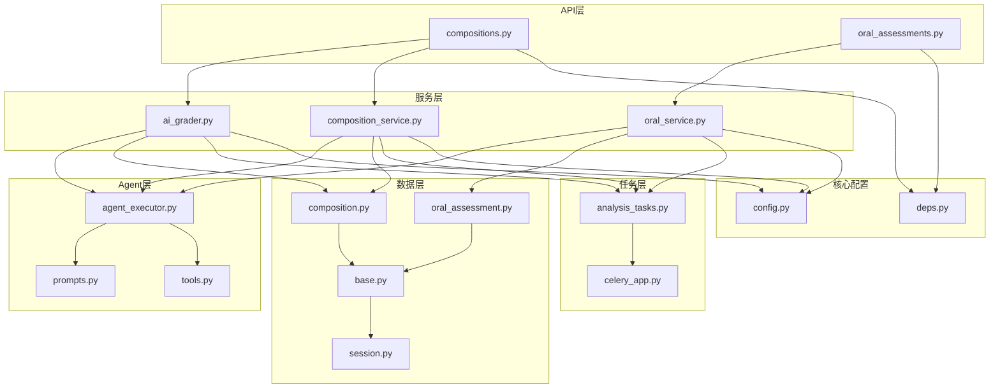
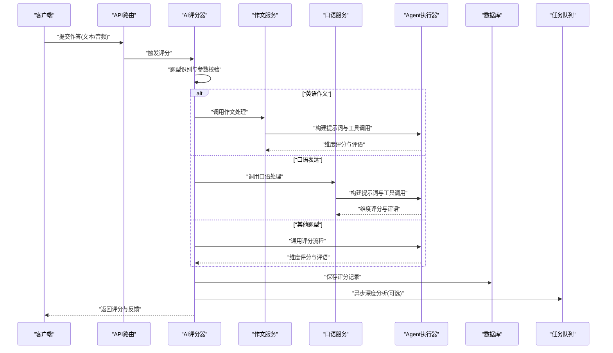
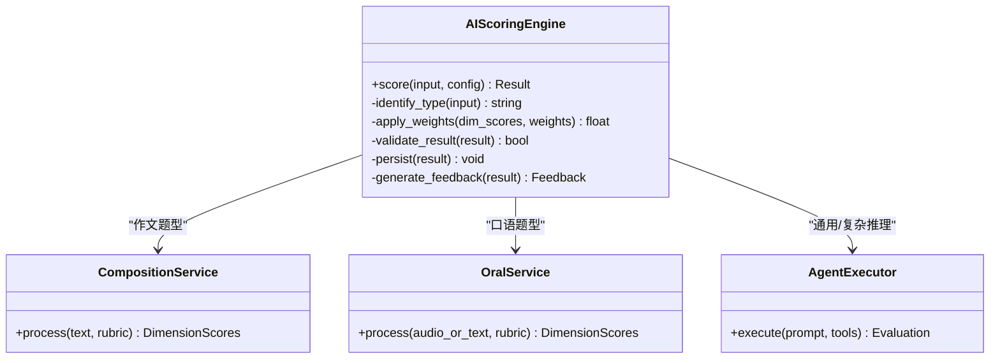
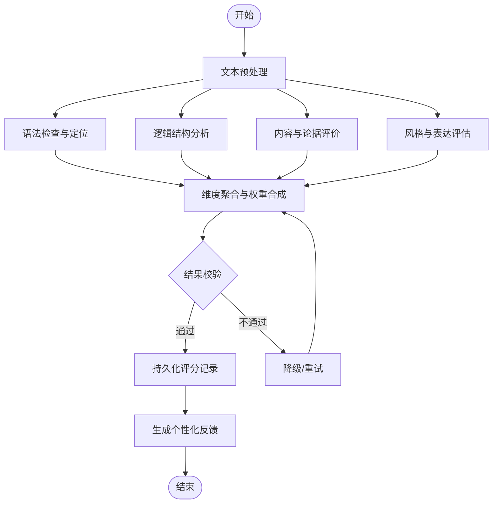
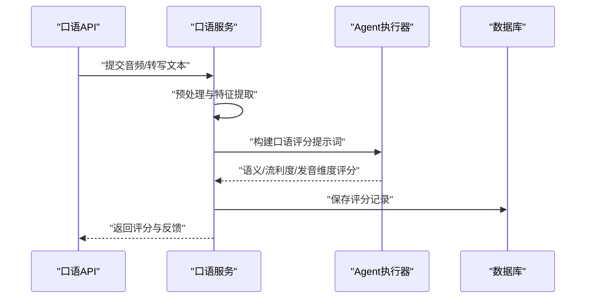
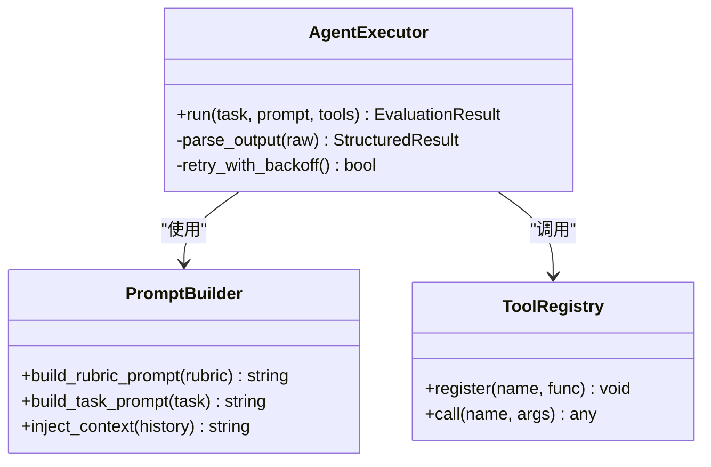
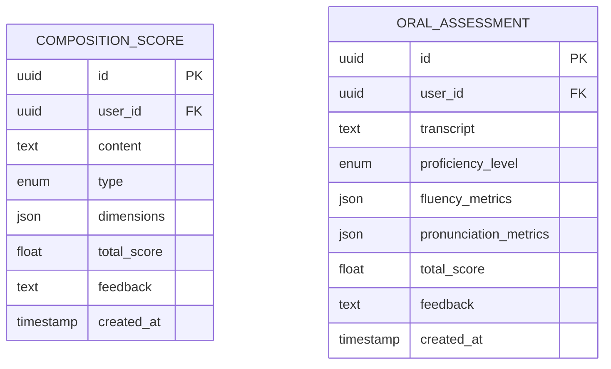
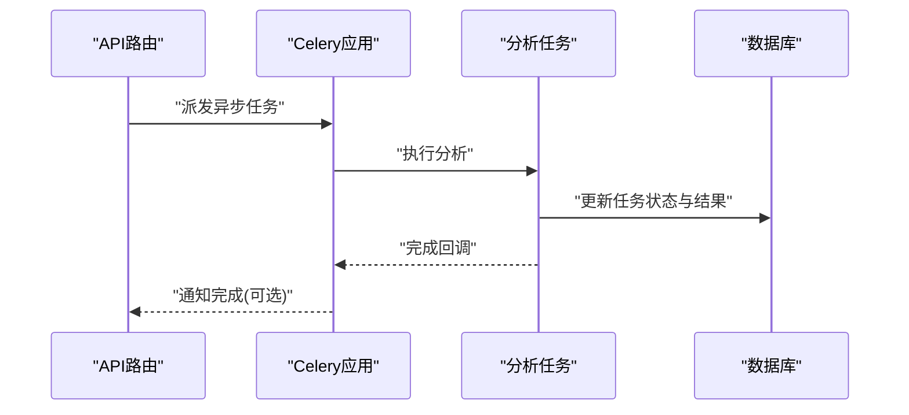
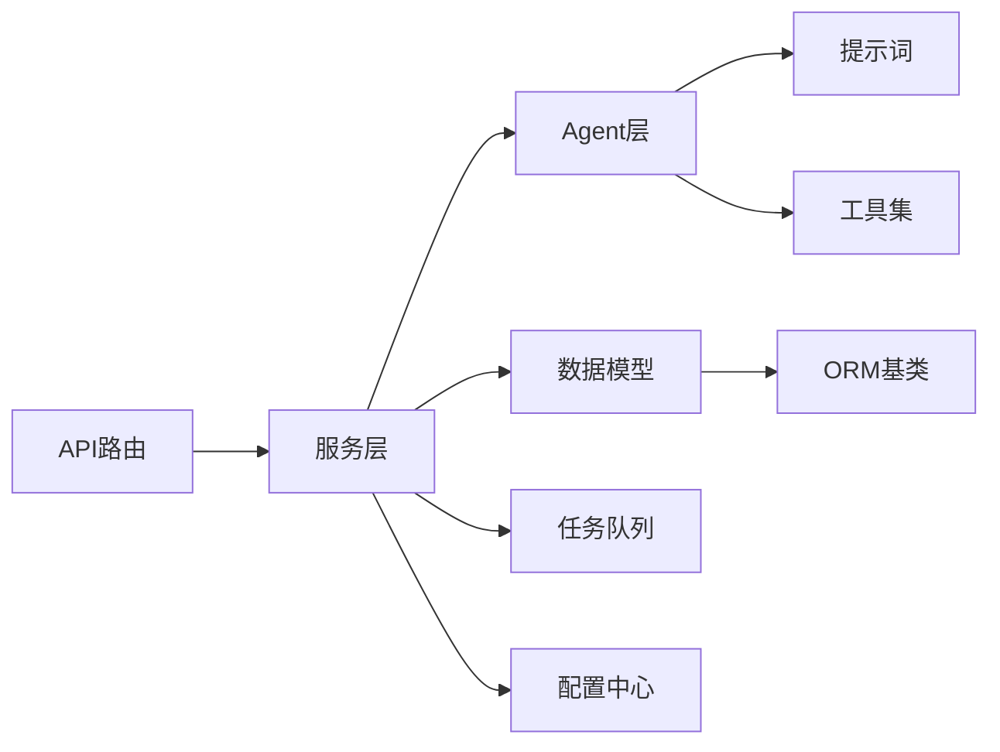

# 智能评分系统

<cite>
**本文引用的文件**   
- [ai_grader.py](file://backend/app/services/ai_grader.py)
- [composition_service.py](file://backend/app/services/composition_service.py)
- [oral_service.py](file://backend/app/services/oral_service.py)
- [agent_executor.py](file://backend/app/services/agent/agent_executor.py)
- [prompts.py](file://backend/app/services/agent/prompts.py)
- [tools.py](file://backend/app/services/agent/tools.py)
- [compositions.py](file://backend/app/api/v1/compositions.py)
- [oral_assessments.py](file://backend/app/api/v1/oral_assessments.py)
- [composition.py](file://backend/app/models/composition.py)
- [oral_assessment.py](file://backend/app/models/oral_assessment.py)
- [config.py](file://backend/app/core/config.py)
- [deps.py](file://backend/app/core/deps.py)
- [session.py](file://backend/app/db/session.py)
- [base.py](file://backend/app/db/base.py)
- [analysis_tasks.py](file://backend/app/tasks/analysis_tasks.py)
- [celery_app.py](file://backend/app/tasks/celery_app.py)
</cite>

## 目录
1. [简介](#简介)
2. [项目结构](#项目结构)
3. [核心组件](#核心组件)
4. [架构总览](#架构总览)
5. [详细组件分析](#详细组件分析)
6. [依赖关系分析](#依赖关系分析)
7. [性能考量](#性能考量)
8. [故障排查指南](#故障排查指南)
9. [结论](#结论)
10. [附录](#附录)

## 简介
本技术文档面向“智能评分系统”，围绕AI评分算法原理、多维度评估指标与权重配置、作文批改流程（语法检查、逻辑分析、内容评价、风格评估）、题型适配机制（数学题、英语作文、口语表达等）、反馈生成系统（个性化建议、错误定位、改进指导）、评分一致性保证、人工复核机制与质量监控体系，以及评分规则定制与扩展开发指南进行系统性阐述。文档以代码仓库中的服务层、API层、模型层、任务调度与Agent工具链为依据，提供从架构到实现的完整说明。

## 项目结构
后端采用分层架构：API路由层负责请求解析与响应封装；服务层承载评分主流程、题型适配与结果聚合；Agent层提供提示词编排与工具调用；数据层通过ORM模型与数据库会话管理持久化；任务层使用Celery执行异步分析与向量任务。前端通过服务接口与后端交互，展示评分结果与学习分析。

图表来源
- [compositions.py](file://backend/app/api/v1/compositions.py)
- [oral_assessments.py](file://backend/app/api/v1/oral_assessments.py)
- [ai_grader.py](file://backend/app/services/ai_grader.py)
- [composition_service.py](file://backend/app/services/composition_service.py)
- [oral_service.py](file://backend/app/services/oral_service.py)
- [agent_executor.py](file://backend/app/services/agent/agent_executor.py)
- [prompts.py](file://backend/app/services/agent/prompts.py)
- [tools.py](file://backend/app/services/agent/tools.py)
- [composition.py](file://backend/app/models/composition.py)
- [oral_assessment.py](file://backend/app/models/oral_assessment.py)
- [base.py](file://backend/app/db/base.py)
- [session.py](file://backend/app/db/session.py)
- [analysis_tasks.py](file://backend/app/tasks/analysis_tasks.py)
- [celery_app.py](file://backend/app/tasks/celery_app.py)
- [config.py](file://backend/app/core/config.py)
- [deps.py](file://backend/app/core/deps.py)

章节来源
- [compositions.py](file://backend/app/api/v1/compositions.py)
- [oral_assessments.py](file://backend/app/api/v1/oral_assessments.py)
- [ai_grader.py](file://backend/app/services/ai_grader.py)
- [composition_service.py](file://backend/app/services/composition_service.py)
- [oral_service.py](file://backend/app/services/oral_service.py)
- [agent_executor.py](file://backend/app/services/agent/agent_executor.py)
- [prompts.py](file://backend/app/services/agent/prompts.py)
- [tools.py](file://backend/app/services/agent/tools.py)
- [composition.py](file://backend/app/models/composition.py)
- [oral_assessment.py](file://backend/app/models/oral_assessment.py)
- [base.py](file://backend/app/db/base.py)
- [session.py](file://backend/app/db/session.py)
- [analysis_tasks.py](file://backend/app/tasks/analysis_tasks.py)
- [celery_app.py](file://backend/app/tasks/celery_app.py)
- [config.py](file://backend/app/core/config.py)
- [deps.py](file://backend/app/core/deps.py)

## 核心组件
- AI评分器（ai_grader）：统一入口，负责题型识别、维度打分、权重合成、结果校验与持久化。
- 作文服务（composition_service）：面向英语作文的专项处理，包含文本预处理、分块、语言特征提取、结构与风格评估。
- 口语服务（oral_service）：面向口语表达的音频转写与语音特征分析，结合语义与流利度、发音准确度等维度。
- Agent执行器（agent_executor）：编排提示词、调用工具、维护上下文与重试策略，支撑复杂推理与多步评测。
- 提示词与工具（prompts, tools）：定义评分标准、约束条件与外部能力（如检索、计算、格式化）。
- API路由（compositions, oral_assessments）：暴露REST接口，接收输入、触发评分、返回结构化结果。
- 数据模型（composition, oral_assessment）：定义评分记录、维度分数、评语与建议的结构。
- 任务调度（analysis_tasks, celery_app）：将耗时评分与分析任务异步化，提升吞吐与稳定性。
- 配置与依赖注入（config, deps）：集中管理环境变量、模型参数与共享资源。

章节来源
- [ai_grader.py](file://backend/app/services/ai_grader.py)
- [composition_service.py](file://backend/app/services/composition_service.py)
- [oral_service.py](file://backend/app/services/oral_service.py)
- [agent_executor.py](file://backend/app/services/agent/agent_executor.py)
- [prompts.py](file://backend/app/services/agent/prompts.py)
- [tools.py](file://backend/app/services/agent/tools.py)
- [compositions.py](file://backend/app/api/v1/compositions.py)
- [oral_assessments.py](file://backend/app/api/v1/oral_assessments.py)
- [composition.py](file://backend/app/models/composition.py)
- [oral_assessment.py](file://backend/app/models/oral_assessment.py)
- [analysis_tasks.py](file://backend/app/tasks/analysis_tasks.py)
- [celery_app.py](file://backend/app/tasks/celery_app.py)
- [config.py](file://backend/app/core/config.py)
- [deps.py](file://backend/app/core/deps.py)

## 架构总览
评分系统采用“API→服务→Agent→数据/任务”的分层架构，支持多题型并行处理与异步任务调度。评分主流程包括：输入校验、题型路由、维度评估、权重合成、结果校验、持久化与反馈生成。

图表来源
- [compositions.py](file://backend/app/api/v1/compositions.py)
- [oral_assessments.py](file://backend/app/api/v1/oral_assessments.py)
- [ai_grader.py](file://backend/app/services/ai_grader.py)
- [composition_service.py](file://backend/app/services/composition_service.py)
- [oral_service.py](file://backend/app/services/oral_service.py)
- [agent_executor.py](file://backend/app/services/agent/agent_executor.py)
- [analysis_tasks.py](file://backend/app/tasks/analysis_tasks.py)
- [composition.py](file://backend/app/models/composition.py)
- [oral_assessment.py](file://backend/app/models/oral_assessment.py)

## 详细组件分析

### AI评分器（ai_grader）
职责与流程
- 统一入口：接收输入、识别题型、选择对应服务或通用流程。
- 维度评估：语法、逻辑、内容、风格（作文）；语义、流利度、发音准确度（口语）。
- 权重合成：按题型与用户配置动态分配权重，计算总分与分项得分。
- 结果校验：范围校验、一致性校验、异常回退与重试。
- 持久化与反馈：写入评分记录，生成个性化建议与错误定位。

关键设计要点
- 可插拔的题型适配器：新增题型只需实现适配接口并注册。
- 配置驱动：权重、阈值、提示词模板由配置中心加载。
- 容错与降级：LLM调用失败时回退至轻量规则引擎或缓存结果。

图表来源
- [ai_grader.py](file://backend/app/services/ai_grader.py)
- [composition_service.py](file://backend/app/services/composition_service.py)
- [oral_service.py](file://backend/app/services/oral_service.py)
- [agent_executor.py](file://backend/app/services/agent/agent_executor.py)

章节来源
- [ai_grader.py](file://backend/app/services/ai_grader.py)

### 作文批改流程（composition_service）
流程步骤
- 文本预处理：清洗、分段、去噪、标准化。
- 语法检查：词汇、句法、标点、拼写错误检测与定位。
- 逻辑分析：段落连贯性、论证结构、因果与转折关系。
- 内容评价：主题契合度、信息完整性、论据充分性。
- 风格评估：用词多样性、句式复杂度、语域匹配。
- 反馈生成：逐点建议、错误高亮、改写示例与练习推荐。

图表来源
- [composition_service.py](file://backend/app/services/composition_service.py)
- [agent_executor.py](file://backend/app/services/agent/agent_executor.py)
- [prompts.py](file://backend/app/services/agent/prompts.py)
- [tools.py](file://backend/app/services/agent/tools.py)

章节来源
- [composition_service.py](file://backend/app/services/composition_service.py)

### 口语表达评分（oral_service）
流程步骤
- 输入处理：音频转写、静音去除、说话人分离。
- 语义理解：关键词抽取、意图识别、主题覆盖度。
- 流利度评估：停顿频率、语速变化、重复与修正。
- 发音准确度：音素级对比、重音与语调分析。
- 综合评分与反馈：给出分项得分、问题定位与训练建议。

图表来源
- [oral_assessments.py](file://backend/app/api/v1/oral_assessments.py)
- [oral_service.py](file://backend/app/services/oral_service.py)
- [agent_executor.py](file://backend/app/services/agent/agent_executor.py)
- [oral_assessment.py](file://backend/app/models/oral_assessment.py)

章节来源
- [oral_service.py](file://backend/app/services/oral_service.py)
- [oral_assessments.py](file://backend/app/api/v1/oral_assessments.py)

### Agent执行器与提示词（agent_executor, prompts, tools）
职责
- 提示词编排：根据题型与评分标准动态组装Prompt，确保约束一致。
- 工具调用：集成检索、计算、格式化、外部校验等工具。
- 上下文管理：维护对话历史、中间结果与重试策略。
- 输出规范化：将LLM输出解析为结构化评分对象。

图表来源
- [agent_executor.py](file://backend/app/services/agent/agent_executor.py)
- [prompts.py](file://backend/app/services/agent/prompts.py)
- [tools.py](file://backend/app/services/agent/tools.py)

章节来源
- [agent_executor.py](file://backend/app/services/agent/agent_executor.py)
- [prompts.py](file://backend/app/services/agent/prompts.py)
- [tools.py](file://backend/app/services/agent/tools.py)

### API路由与数据模型（compositions, oral_assessments, composition, oral_assessment）
职责
- API路由：定义REST端点，接收请求、调用服务、返回JSON。
- 数据模型：定义评分记录、维度分数、评语与建议的字段与约束。
- 依赖注入：获取数据库会话、配置与外部服务实例。

图表来源
- [composition.py](file://backend/app/models/composition.py)
- [oral_assessment.py](file://backend/app/models/oral_assessment.py)
- [compositions.py](file://backend/app/api/v1/compositions.py)
- [oral_assessments.py](file://backend/app/api/v1/oral_assessments.py)

章节来源
- [compositions.py](file://backend/app/api/v1/compositions.py)
- [oral_assessments.py](file://backend/app/api/v1/oral_assessments.py)
- [composition.py](file://backend/app/models/composition.py)
- [oral_assessment.py](file://backend/app/models/oral_assessment.py)

### 任务调度与异步分析（analysis_tasks, celery_app）
职责
- 异步任务：将耗时评分与深度分析放入队列，避免阻塞请求。
- 任务编排：组合多个子任务（如向量检索、相似题生成、知识追踪）。
- 状态跟踪：记录任务进度与结果，供前端轮询或SSE推送。

图表来源
- [analysis_tasks.py](file://backend/app/tasks/analysis_tasks.py)
- [celery_app.py](file://backend/app/tasks/celery_app.py)

章节来源
- [analysis_tasks.py](file://backend/app/tasks/analysis_tasks.py)
- [celery_app.py](file://backend/app/tasks/celery_app.py)

## 依赖关系分析
- 模块耦合
  - API层仅依赖服务层与依赖注入，保持薄控制器。
  - 服务层依赖Agent与数据模型，解耦具体LLM实现。
  - Agent层通过提示词与工具抽象外部能力，降低硬编码。
- 外部依赖
  - 数据库会话与ORM基类用于持久化。
  - 任务队列用于异步处理。
  - 配置中心管理环境变量与评分参数。

图表来源
- [compositions.py](file://backend/app/api/v1/compositions.py)
- [oral_assessments.py](file://backend/app/api/v1/oral_assessments.py)
- [ai_grader.py](file://backend/app/services/ai_grader.py)
- [composition_service.py](file://backend/app/services/composition_service.py)
- [oral_service.py](file://backend/app/services/oral_service.py)
- [agent_executor.py](file://backend/app/services/agent/agent_executor.py)
- [prompts.py](file://backend/app/services/agent/prompts.py)
- [tools.py](file://backend/app/services/agent/tools.py)
- [composition.py](file://backend/app/models/composition.py)
- [oral_assessment.py](file://backend/app/models/oral_assessment.py)
- [base.py](file://backend/app/db/base.py)
- [session.py](file://backend/app/db/session.py)
- [analysis_tasks.py](file://backend/app/tasks/analysis_tasks.py)
- [celery_app.py](file://backend/app/tasks/celery_app.py)
- [config.py](file://backend/app/core/config.py)

章节来源
- [deps.py](file://backend/app/core/deps.py)
- [config.py](file://backend/app/core/config.py)
- [base.py](file://backend/app/db/base.py)
- [session.py](file://backend/app/db/session.py)

## 性能考量
- 异步化：将耗时评分与深度分析放入任务队列，减少请求延迟。
- 批处理：对批量作业进行合并处理，提高吞吐量。
- 缓存：对稳定评分结果与提示词模板进行缓存，降低重复计算。
- 限流与熔断：对LLM调用设置速率限制与熔断策略，保障稳定性。
- 索引优化：对高频查询字段建立索引，提升检索效率。

[本节为通用性能建议，无需特定文件引用]

## 故障排查指南
- 常见错误
  - LLM调用超时或失败：检查网络、配额与重试策略。
  - 输入格式不合法：校验文本长度、编码与必填字段。
  - 权重配置异常：确认权重总和与取值范围。
  - 任务堆积：检查队列消费者数量与任务时长。
- 诊断手段
  - 查看任务状态与日志，定位失败节点。
  - 回放提示词与工具调用，验证输出结构。
  - 对比不同配置的评分差异，定位权重影响。
- 恢复策略
  - 自动重试与指数退避。
  - 降级到规则引擎或缓存结果。
  - 人工复核通道介入，标记待审核记录。

章节来源
- [analysis_tasks.py](file://backend/app/tasks/analysis_tasks.py)
- [agent_executor.py](file://backend/app/services/agent/agent_executor.py)

## 结论
智能评分系统通过分层架构与Agent编排，实现了多题型、多维度的自动化评分与反馈生成。借助配置驱动的权重机制与异步任务调度，系统在可扩展性与稳定性方面具备良好基础。未来可在提示词工程、工具生态与质量监控方面持续优化，进一步提升评分一致性与用户体验。

[本节为总结性内容，无需特定文件引用]

## 附录

### 多维度评估指标与权重配置
- 作文维度
  - 语法：词汇准确性、句法正确性、标点规范。
  - 逻辑：段落连贯、论证结构、因果关系。
  - 内容：主题契合、信息完整、论据充分。
  - 风格：用词多样、句式复杂、语域匹配。
- 口语维度
  - 语义：关键词覆盖、意图识别、主题相关。
  - 流利度：停顿频率、语速变化、重复修正。
  - 发音准确度：音素对比、重音语调。
- 权重分配
  - 按题型与用户偏好动态配置，支持A/B测试与灰度发布。
  - 权重变更需经过版本管理与回归验证。

章节来源
- [ai_grader.py](file://backend/app/services/ai_grader.py)
- [composition_service.py](file://backend/app/services/composition_service.py)
- [oral_service.py](file://backend/app/services/oral_service.py)
- [config.py](file://backend/app/core/config.py)

### 题型适配机制
- 数学题：侧重解题步骤、公式使用、答案正确性与过程严谨性。
- 英语作文：语法、逻辑、内容、风格四维评估，强调结构与表达。
- 口语表达：语义、流利度、发音准确度三维评估，强调沟通效果。
- 适配扩展：新增题型仅需实现适配接口与提示词模板，注册到评分器即可。

章节来源
- [ai_grader.py](file://backend/app/services/ai_grader.py)
- [prompts.py](file://backend/app/services/agent/prompts.py)

### 反馈生成系统
- 个性化建议：基于学生画像与历史表现生成针对性建议。
- 错误定位：在原文中高亮错误位置并提供修改建议。
- 改进指导：提供练习路径、参考范文与知识点链接。

章节来源
- [composition_service.py](file://backend/app/services/composition_service.py)
- [oral_service.py](file://backend/app/services/oral_service.py)
- [agent_executor.py](file://backend/app/services/agent/agent_executor.py)

### 评分一致性保证与人工复核
- 一致性保证
  - 固定随机种子与温度参数，控制输出波动。
  - 提示词版本化与回归测试，确保变更可控。
  - 交叉评分与一致性度量（如Kappa系数）。
- 人工复核
  - 低置信度或争议结果进入人工队列。
  - 复核结果回流训练，持续提升模型稳定性。

章节来源
- [ai_grader.py](file://backend/app/services/ai_grader.py)
- [analysis_tasks.py](file://backend/app/tasks/analysis_tasks.py)

### 质量监控体系
- 指标采集：评分分布、维度均值、异常率、任务成功率。
- 告警策略：阈值告警与趋势预警，联动运维平台。
- 审计日志：记录提示词、工具调用与输出摘要，便于回溯。

章节来源
- [analysis_tasks.py](file://backend/app/tasks/analysis_tasks.py)
- [agent_executor.py](file://backend/app/services/agent/agent_executor.py)

### 评分规则定制与扩展开发指南
- 规则定制
  - 通过配置中心调整权重与阈值，无需改动代码。
  - 新增维度或指标需在模型与服务中扩展字段与计算逻辑。
- 扩展开发
  - 新增题型：实现适配接口、编写提示词模板、注册到评分器。
  - 新增工具：在工具注册表中声明函数签名与权限，供Agent调用。
  - 新增任务：在任务队列中定义新任务类型，编排子任务与回调。

章节来源
- [ai_grader.py](file://backend/app/services/ai_grader.py)
- [agent_executor.py](file://backend/app/services/agent/agent_executor.py)
- [tools.py](file://backend/app/services/agent/tools.py)
- [analysis_tasks.py](file://backend/app/tasks/analysis_tasks.py)
- [config.py](file://backend/app/core/config.py)