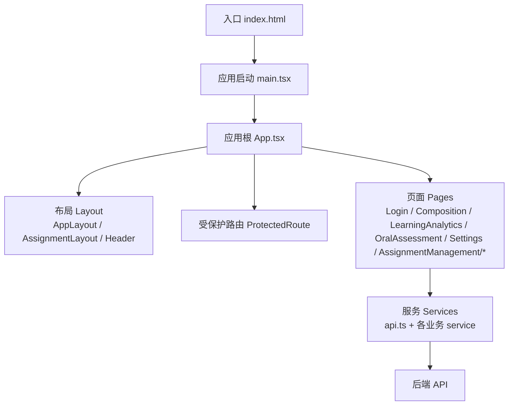
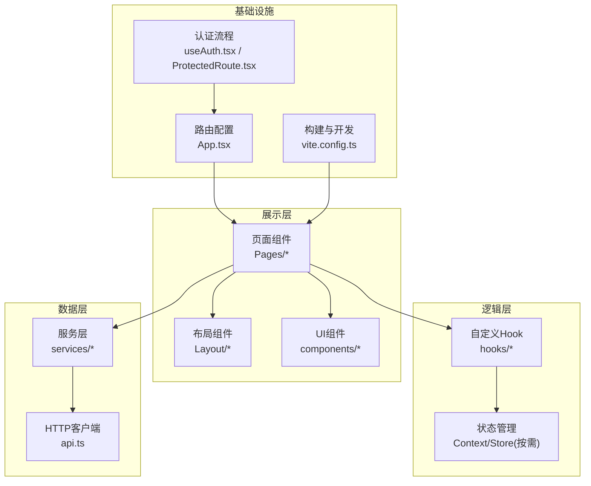
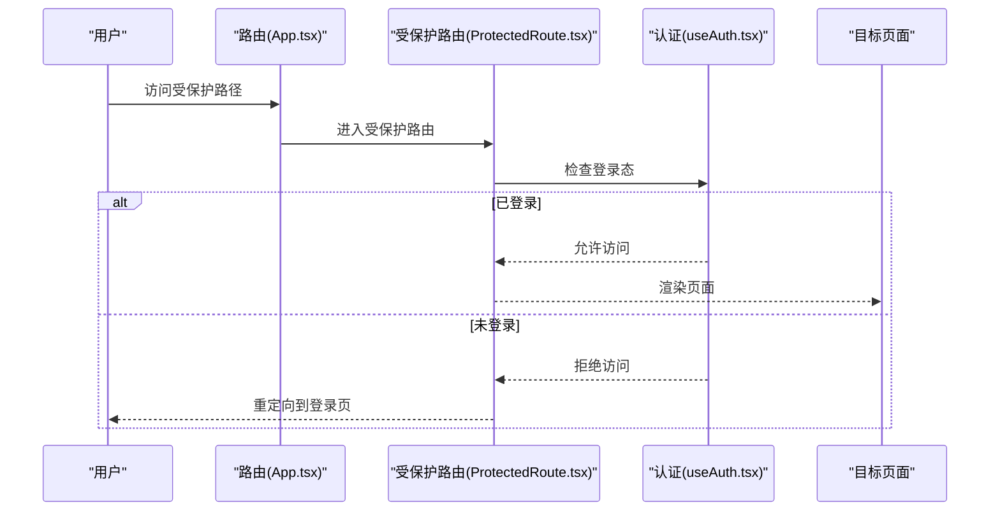
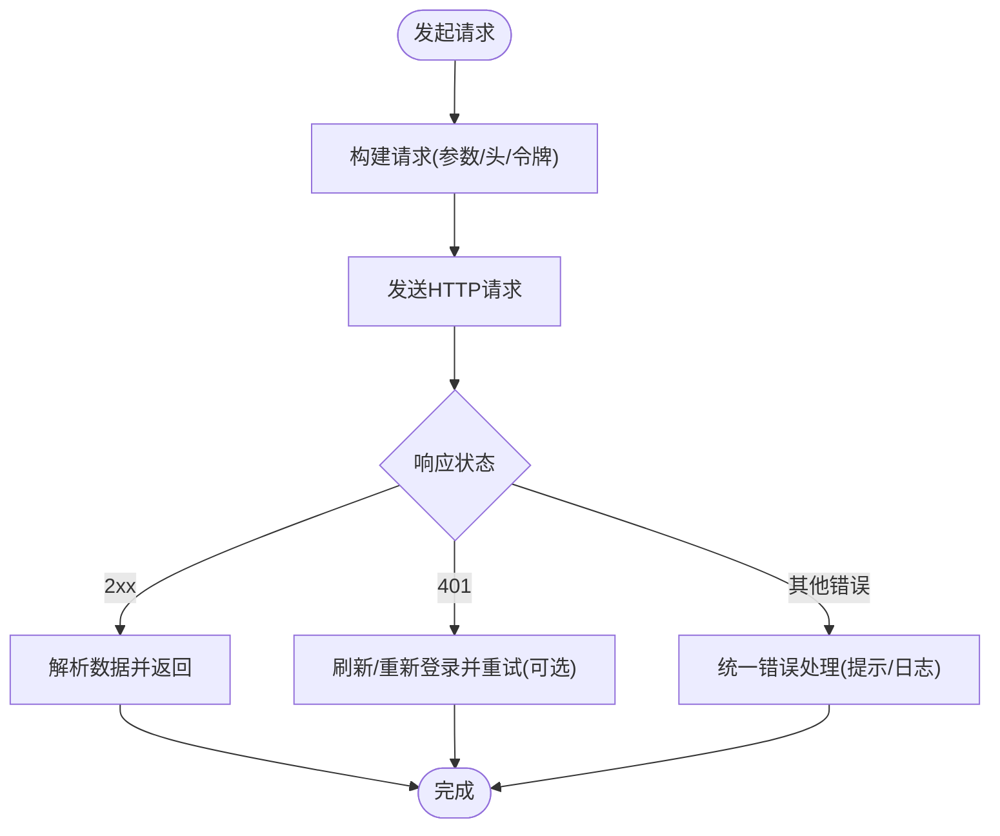
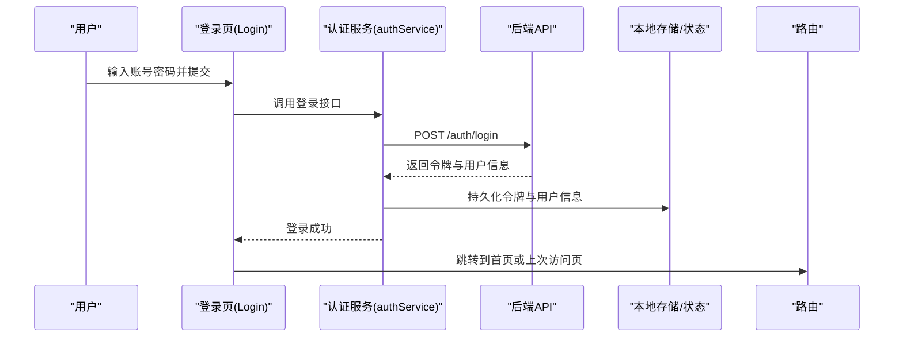
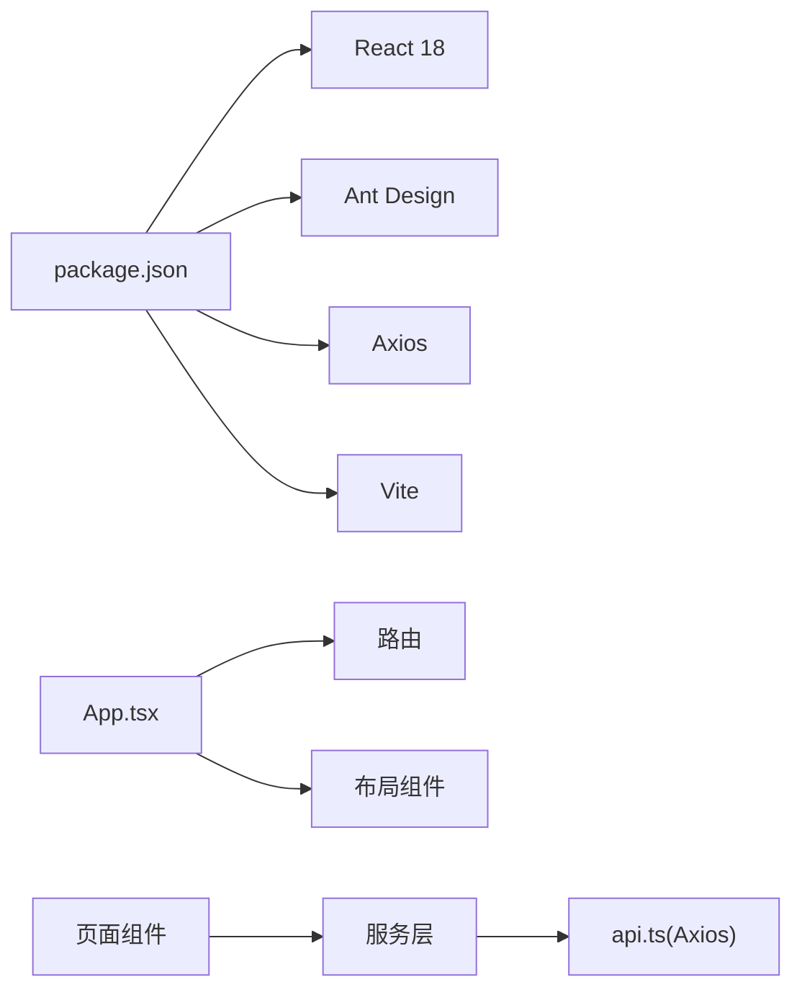

# 前端架构设计

<cite>
**本文引用的文件**   
- [frontend/package.json](file://frontend/package.json)
- [frontend/vite.config.ts](file://frontend/vite.config.ts)
- [frontend/tsconfig.json](file://frontend/tsconfig.json)
- [frontend/index.html](file://frontend/index.html)
- [frontend/src/main.tsx](file://frontend/src/main.tsx)
- [frontend/src/App.tsx](file://frontend/src/App.tsx)
- [frontend/src/components/Layout/AppLayout.tsx](file://frontend/src/components/Layout/AppLayout.tsx)
- [frontend/src/components/Layout/AssignmentLayout.tsx](file://frontend/src/components/Layout/AssignmentLayout.tsx)
- [frontend/src/components/Layout/Header.tsx](file://frontend/src/components/Layout/Header.tsx)
- [frontend/src/components/ProtectedRoute.tsx](file://frontend/src/components/ProtectedRoute.tsx)
- [frontend/src/services/api.ts](file://frontend/src/services/api.ts)
- [frontend/src/hooks/useAuth.tsx](file://frontend/src/hooks/useAuth.tsx)
- [frontend/src/pages/Login/index.tsx](file://frontend/src/pages/Login/index.tsx)
- [frontend/src/pages/Composition/index.tsx](file://frontend/src/pages/Composition/index.tsx)
- [frontend/src/pages/LearningAnalytics/index.tsx](file://frontend/src/pages/LearningAnalytics/index.tsx)
- [frontend/src/pages/OralAssessment/index.tsx](file://frontend/src/pages/OralAssessment/index.tsx)
- [frontend/src/pages/Settings/PersonalityConfig.tsx](file://frontend/src/pages/Settings/PersonalityConfig.tsx)
- [frontend/src/pages/AssignmentManagement/AIChallenge/index.tsx](file://frontend/src/pages/AssignmentManagement/AIChallenge/index.tsx)
- [frontend/src/pages/AssignmentManagement/AssignmentDetail/index.tsx](file://frontend/src/pages/AssignmentManagement/AssignmentDetail/index.tsx)
- [frontend/src/pages/AssignmentManagement/AssignmentRecords/index.tsx](file://frontend/src/pages/AssignmentManagement/AssignmentRecords/index.tsx)
- [frontend/src/pages/AssignmentManagement/ErrorRedo/index.tsx](file://frontend/src/pages/AssignmentManagement/ErrorRedo/index.tsx)
- [frontend/src/pages/AssignmentManagement/UploadAssignment/index.tsx](file://frontend/src/pages/AssignmentManagement/UploadAssignment/index.tsx)
</cite>

## 目录
1. [简介](#简介)
2. [项目结构](#项目结构)
3. [核心组件](#核心组件)
4. [架构总览](#架构总览)
5. [详细组件分析](#详细组件分析)
6. [依赖分析](#依赖分析)
7. [性能考虑](#性能考虑)
8. [故障排查指南](#故障排查指南)
9. [结论](#结论)
10. [附录](#附录)

## 简介
本文件面向AI助教系统的前端工程，基于React 18与TypeScript，采用Vite作为构建工具。文档从整体架构、模块组织、路由与布局、状态管理、前后端通信、错误处理、国际化、响应式设计与兼容性、性能优化、开发环境与调试等方面进行全面说明，帮助读者快速理解并高效扩展前端代码库。

## 项目结构
前端工程位于 frontend 目录下，遵循“按功能域+分层”的组织方式：
- src/components：通用与业务组件（如布局、卡片、弹窗等）
- src/pages：页面级组件，按功能域划分目录
- src/services：API服务层，封装Axios请求与领域接口
- src/hooks：可复用逻辑钩子（认证、上传、SSE等）
- src/utils：常量、工具函数、导出Excel等
- 根配置：package.json、vite.config.ts、tsconfig.json、index.html

图表来源
- [frontend/index.html:1-200](file://frontend/index.html#L1-L200)
- [frontend/src/main.tsx:1-200](file://frontend/src/main.tsx#L1-L200)
- [frontend/src/App.tsx:1-200](file://frontend/src/App.tsx#L1-L200)
- [frontend/src/components/Layout/AppLayout.tsx:1-200](file://frontend/src/components/Layout/AppLayout.tsx#L1-L200)
- [frontend/src/components/Layout/AssignmentLayout.tsx:1-200](file://frontend/src/components/Layout/AssignmentLayout.tsx#L1-L200)
- [frontend/src/components/Layout/Header.tsx:1-200](file://frontend/src/components/Layout/Header.tsx#L1-L200)
- [frontend/src/components/ProtectedRoute.tsx:1-200](file://frontend/src/components/ProtectedRoute.tsx#L1-L200)
- [frontend/src/services/api.ts:1-200](file://frontend/src/services/api.ts#L1-L200)

章节来源
- [frontend/package.json:1-200](file://frontend/package.json#L1-L200)
- [frontend/vite.config.ts:1-200](file://frontend/vite.config.ts#L1-L200)
- [frontend/tsconfig.json:1-200](file://frontend/tsconfig.json#L1-L200)
- [frontend/index.html:1-200](file://frontend/index.html#L1-L200)
- [frontend/src/main.tsx:1-200](file://frontend/src/main.tsx#L1-L200)
- [frontend/src/App.tsx:1-200](file://frontend/src/App.tsx#L1-L200)

## 核心组件
- 应用入口与挂载
  - 入口HTML提供基础DOM与全局样式占位
  - React 18通过createRoot进行渲染，确保并发特性可用
- 应用根与路由
  - App.tsx负责顶层路由与全局上下文（如主题、语言、权限）的装配
  - 使用受保护路由组件对需要鉴权的页面进行访问控制
- 布局体系
  - AppLayout：主应用壳，包含侧边导航、头部、内容区
  - AssignmentLayout：作业相关页面的专用布局
  - Header：顶部信息栏（用户信息、通知、设置入口等）
- 关键页面
  - Login：登录页，触发认证流程
  - Composition：作文练习与提交
  - LearningAnalytics：学习分析与数据看板
  - OralAssessment：口语评估
  - Settings/PersonalityConfig：个性化配置
  - AssignmentManagement/*：作业管理子模块（AI挑战、详情、记录、错题重做、上传）

章节来源
- [frontend/src/main.tsx:1-200](file://frontend/src/main.tsx#L1-L200)
- [frontend/src/App.tsx:1-200](file://frontend/src/App.tsx#L1-L200)
- [frontend/src/components/Layout/AppLayout.tsx:1-200](file://frontend/src/components/Layout/AppLayout.tsx#L1-L200)
- [frontend/src/components/Layout/AssignmentLayout.tsx:1-200](file://frontend/src/components/Layout/AssignmentLayout.tsx#L1-L200)
- [frontend/src/components/Layout/Header.tsx:1-200](file://frontend/src/components/Layout/Header.tsx#L1-L200)
- [frontend/src/components/ProtectedRoute.tsx:1-200](file://frontend/src/components/ProtectedRoute.tsx#L1-L200)
- [frontend/src/pages/Login/index.tsx:1-200](file://frontend/src/pages/Login/index.tsx#L1-L200)
- [frontend/src/pages/Composition/index.tsx:1-200](file://frontend/src/pages/Composition/index.tsx#L1-L200)
- [frontend/src/pages/LearningAnalytics/index.tsx:1-200](file://frontend/src/pages/LearningAnalytics/index.tsx#L1-L200)
- [frontend/src/pages/OralAssessment/index.tsx:1-200](file://frontend/src/pages/OralAssessment/index.tsx#L1-L200)
- [frontend/src/pages/Settings/PersonalityConfig.tsx:1-200](file://frontend/src/pages/Settings/PersonalityConfig.tsx#L1-L200)
- [frontend/src/pages/AssignmentManagement/AIChallenge/index.tsx:1-200](file://frontend/src/pages/AssignmentManagement/AIChallenge/index.tsx#L1-L200)
- [frontend/src/pages/AssignmentManagement/AssignmentDetail/index.tsx:1-200](file://frontend/src/pages/AssignmentManagement/AssignmentDetail/index.tsx#L1-L200)
- [frontend/src/pages/AssignmentManagement/AssignmentRecords/index.tsx:1-200](file://frontend/src/pages/AssignmentManagement/AssignmentRecords/index.tsx#L1-L200)
- [frontend/src/pages/AssignmentManagement/ErrorRedo/index.tsx:1-200](file://frontend/src/pages/AssignmentManagement/ErrorRedo/index.tsx#L1-L200)
- [frontend/src/pages/AssignmentManagement/UploadAssignment/index.tsx:1-200](file://frontend/src/pages/AssignmentManagement/UploadAssignment/index.tsx#L1-L200)

## 架构总览
前端采用“页面-组件-服务-钩子-工具”的分层模式，结合Vite的高性能开发与构建能力，实现模块化、可维护的前端工程。

图表来源
- [frontend/src/App.tsx:1-200](file://frontend/src/App.tsx#L1-L200)
- [frontend/src/components/Layout/AppLayout.tsx:1-200](file://frontend/src/components/Layout/AppLayout.tsx#L1-L200)
- [frontend/src/components/ProtectedRoute.tsx:1-200](file://frontend/src/components/ProtectedRoute.tsx#L1-L200)
- [frontend/src/hooks/useAuth.tsx:1-200](file://frontend/src/hooks/useAuth.tsx#L1-L200)
- [frontend/src/services/api.ts:1-200](file://frontend/src/services/api.ts#L1-L200)
- [frontend/vite.config.ts:1-200](file://frontend/vite.config.ts#L1-L200)

## 详细组件分析

### 路由与布局
- 路由策略
  - 在应用根中集中定义路由表，按功能域划分路径
  - 使用受保护路由组件统一拦截未登录访问，跳转至登录页或提示
- 布局策略
  - AppLayout承载全局导航与内容区域
  - AssignmentLayout针对作业场景定制布局（如侧边任务列表、详情面板）
  - Header提供用户信息与快捷操作

图表来源
- [frontend/src/App.tsx:1-200](file://frontend/src/App.tsx#L1-L200)
- [frontend/src/components/ProtectedRoute.tsx:1-200](file://frontend/src/components/ProtectedRoute.tsx#L1-L200)
- [frontend/src/hooks/useAuth.tsx:1-200](file://frontend/src/hooks/useAuth.tsx#L1-L200)
- [frontend/src/pages/Login/index.tsx:1-200](file://frontend/src/pages/Login/index.tsx#L1-L200)

章节来源
- [frontend/src/App.tsx:1-200](file://frontend/src/App.tsx#L1-L200)
- [frontend/src/components/ProtectedRoute.tsx:1-200](file://frontend/src/components/ProtectedRoute.tsx#L1-L200)
- [frontend/src/components/Layout/AppLayout.tsx:1-200](file://frontend/src/components/Layout/AppLayout.tsx#L1-L200)
- [frontend/src/components/Layout/AssignmentLayout.tsx:1-200](file://frontend/src/components/Layout/AssignmentLayout.tsx#L1-L200)
- [frontend/src/components/Layout/Header.tsx:1-200](file://frontend/src/components/Layout/Header.tsx#L1-L200)

### 前后端通信机制（Axios封装）
- 统一客户端
  - api.ts封装Axios实例，统一配置baseURL、超时、拦截器
- 请求拦截器
  - 自动附加认证令牌（如JWT），注入必要请求头
- 响应拦截器
  - 统一处理成功与失败分支，将业务错误转换为前端友好提示
  - 对401/403等状态码进行会话失效处理与重定向
- 服务层
  - 各业务service按领域拆分，调用api.ts提供的HTTP方法，返回Promise以便上层消费

图表来源
- [frontend/src/services/api.ts:1-200](file://frontend/src/services/api.ts#L1-L200)

章节来源
- [frontend/src/services/api.ts:1-200](file://frontend/src/services/api.ts#L1-L200)

### 认证流程
- useAuth钩子
  - 封装登录、登出、令牌获取与校验、用户信息缓存
- ProtectedRoute组件
  - 在路由层拦截未授权访问，根据认证状态决定渲染或跳转
- 登录页
  - 收集凭据，调用认证服务，成功后更新状态并跳转

图表来源
- [frontend/src/pages/Login/index.tsx:1-200](file://frontend/src/pages/Login/index.tsx#L1-L200)
- [frontend/src/hooks/useAuth.tsx:1-200](file://frontend/src/hooks/useAuth.tsx#L1-L200)
- [frontend/src/components/ProtectedRoute.tsx:1-200](file://frontend/src/components/ProtectedRoute.tsx#L1-L200)

章节来源
- [frontend/src/pages/Login/index.tsx:1-200](file://frontend/src/pages/Login/index.tsx#L1-L200)
- [frontend/src/hooks/useAuth.tsx:1-200](file://frontend/src/hooks/useAuth.tsx#L1-L200)
- [frontend/src/components/ProtectedRoute.tsx:1-200](file://frontend/src/components/ProtectedRoute.tsx#L1-L200)

### 页面与业务模块
- 作文与练习
  - Composition页面负责题目加载、作答、提交与结果展示
- 学习分析
  - LearningAnalytics聚合统计与可视化，支持多维度筛选与导出
- 口语评估
  - OralAssessment集成录音/播放、评分与反馈
- 作业管理
  - AIChallenge：AI出题与挑战
  - AssignmentDetail：作业详情与批注
  - AssignmentRecords：作业记录与历史
  - ErrorRedo：错题重做与巩固
  - UploadAssignment：作业上传与进度跟踪

章节来源
- [frontend/src/pages/Composition/index.tsx:1-200](file://frontend/src/pages/Composition/index.tsx#L1-L200)
- [frontend/src/pages/LearningAnalytics/index.tsx:1-200](file://frontend/src/pages/LearningAnalytics/index.tsx#L1-L200)
- [frontend/src/pages/OralAssessment/index.tsx:1-200](file://frontend/src/pages/OralAssessment/index.tsx#L1-L200)
- [frontend/src/pages/AssignmentManagement/AIChallenge/index.tsx:1-200](file://frontend/src/pages/AssignmentManagement/AIChallenge/index.tsx#L1-L200)
- [frontend/src/pages/AssignmentManagement/AssignmentDetail/index.tsx:1-200](file://frontend/src/pages/AssignmentManagement/AssignmentDetail/index.tsx#L1-L200)
- [frontend/src/pages/AssignmentManagement/AssignmentRecords/index.tsx:1-200](file://frontend/src/pages/AssignmentManagement/AssignmentRecords/index.tsx#L1-L200)
- [frontend/src/pages/AssignmentManagement/ErrorRedo/index.tsx:1-200](file://frontend/src/pages/AssignmentManagement/ErrorRedo/index.tsx#L1-L200)
- [frontend/src/pages/AssignmentManagement/UploadAssignment/index.tsx:1-200](file://frontend/src/pages/AssignmentManagement/UploadAssignment/index.tsx#L1-L200)

### 构建与开发配置（Vite）
- 开发服务器
  - 启用热重载与模块热替换，提升开发体验
- 路径别名
  - 配置@别名指向src，简化导入路径
- 代理与跨域
  - 开发环境配置API代理，避免跨域问题
- 生产构建
  - 开启压缩、Tree Shaking、代码分割与资源优化
- TypeScript
  - tsconfig.json严格类型检查与模块解析策略

章节来源
- [frontend/vite.config.ts:1-200](file://frontend/vite.config.ts#L1-L200)
- [frontend/tsconfig.json:1-200](file://frontend/tsconfig.json#L1-L200)

### UI组件库与主题
- Ant Design集成
  - 通过包管理与Provider注入全局主题与国际化
- 自定义主题
  - 覆盖默认变量（颜色、圆角、间距等），保证品牌一致性
- 按需引入
  - 借助插件实现按需加载，减少打包体积

章节来源
- [frontend/package.json:1-200](file://frontend/package.json#L1-L200)

### 国际化支持
- i18n方案
  - 使用react-i18next或Antd内置i18n，按语言包组织文案
- 动态切换
  - 在Header或设置页提供语言切换入口，实时更新界面文案
- 资源管理
  - 将文案抽离为JSON或TS模块，便于维护与翻译协作

章节来源
- [frontend/src/components/Layout/Header.tsx:1-200](file://frontend/src/components/Layout/Header.tsx#L1-L200)
- [frontend/src/pages/Settings/PersonalityConfig.tsx:1-200](file://frontend/src/pages/Settings/PersonalityConfig.tsx#L1-L200)

### 响应式设计
- 栅格与断点
  - 使用Antd栅格与媒体查询适配不同屏幕尺寸
- 移动端优化
  - 折叠菜单、抽屉式面板、触摸友好的交互元素
- 自适应布局
  - 内容区弹性伸缩，图片与表格横向滚动

章节来源
- [frontend/src/components/Layout/AppLayout.tsx:1-200](file://frontend/src/components/Layout/AppLayout.tsx#L1-L200)
- [frontend/src/components/Layout/AssignmentLayout.tsx:1-200](file://frontend/src/components/Layout/AssignmentLayout.tsx#L1-L200)

### 错误处理策略
- 网络层
  - 统一拦截器捕获超时、网络异常与服务端错误
- 业务层
  - 将错误码映射为用户可读消息，必要时上报监控
- 用户体验
  - 错误边界包裹关键页面，防止白屏；提供重试与反馈入口

章节来源
- [frontend/src/services/api.ts:1-200](file://frontend/src/services/api.ts#L1-L200)

### 浏览器兼容性
- 目标环境
  - 明确target与polyfill策略，平衡兼容性与体积
- 降级方案
  - 对高级API进行特性检测与回退实现
- 测试矩阵
  - 在主流浏览器与移动端内核进行回归验证

章节来源
- [frontend/vite.config.ts:1-200](file://frontend/vite.config.ts#L1-L200)
- [frontend/tsconfig.json:1-200](file://frontend/tsconfig.json#L1-L200)

## 依赖分析
- 运行时依赖
  - React 18、React Router、Ant Design、Axios、i18n库等
- 开发依赖
  - Vite、TypeScript、ESLint、Prettier、测试框架等
- 模块关系
  - pages依赖services与components；components依赖hooks与utils；services依赖api.ts

图表来源
- [frontend/package.json:1-200](file://frontend/package.json#L1-L200)
- [frontend/src/App.tsx:1-200](file://frontend/src/App.tsx#L1-L200)
- [frontend/src/services/api.ts:1-200](file://frontend/src/services/api.ts#L1-L200)

章节来源
- [frontend/package.json:1-200](file://frontend/package.json#L1-L200)

## 性能考虑
- 构建优化
  - 开启压缩、Tree Shaking、分包与懒加载，减少首屏体积
- 资源优化
  - 图片与字体压缩、CDN缓存、预加载关键资源
- 运行时优化
  - 组件懒加载、虚拟列表、防抖节流、Web Worker处理重型计算
- 监控与分析
  - 接入性能埋点与错误上报，持续追踪指标

[本节为通用指导，不直接分析具体文件]

## 故障排查指南
- 常见问题定位
  - 网络请求失败：检查代理配置、CORS、令牌有效性
  - 路由跳转异常：确认路由表与受保护路由逻辑
  - 主题与样式错乱：检查Provider注入与CSS优先级
- 调试技巧
  - 使用浏览器开发者工具Network与Console定位问题
  - 利用Vite HMR快速验证修改效果
  - 使用React DevTools检查组件树与状态变化

章节来源
- [frontend/vite.config.ts:1-200](file://frontend/vite.config.ts#L1-L200)
- [frontend/src/services/api.ts:1-200](file://frontend/src/services/api.ts#L1-L200)
- [frontend/src/components/ProtectedRoute.tsx:1-200](file://frontend/src/components/ProtectedRoute.tsx#L1-L200)

## 结论
本前端架构以React 18为核心，结合Vite的高效构建与TypeScript的类型保障，形成清晰的分层与职责划分。通过统一的Axios封装、受保护路由与认证流程、可扩展的布局与组件体系，以及完善的错误处理与性能优化策略，支撑AI助教系统的稳定迭代与良好用户体验。后续可在状态管理、国际化与监控方面继续深化，进一步提升可维护性与可观测性。

## 附录
- 开发环境配置
  - 安装依赖、启动开发服务器、构建产物输出路径
- 热重载与调试
  - 启用HMR、使用React DevTools与浏览器调试
- 最佳实践
  - 组件拆分原则、命名规范、提交前检查与CI集成

[本节为通用指导，不直接分析具体文件]