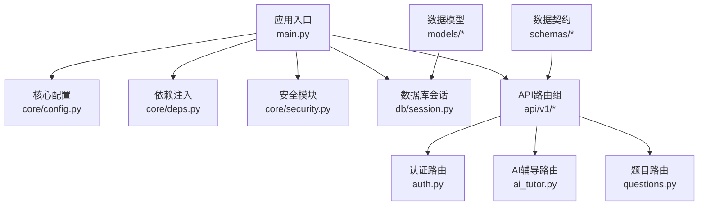
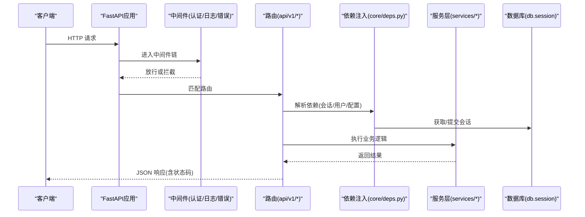
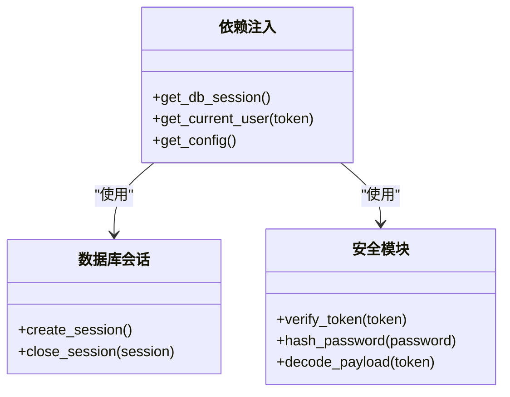
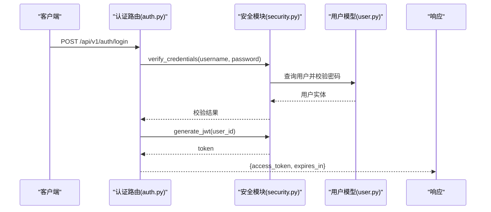
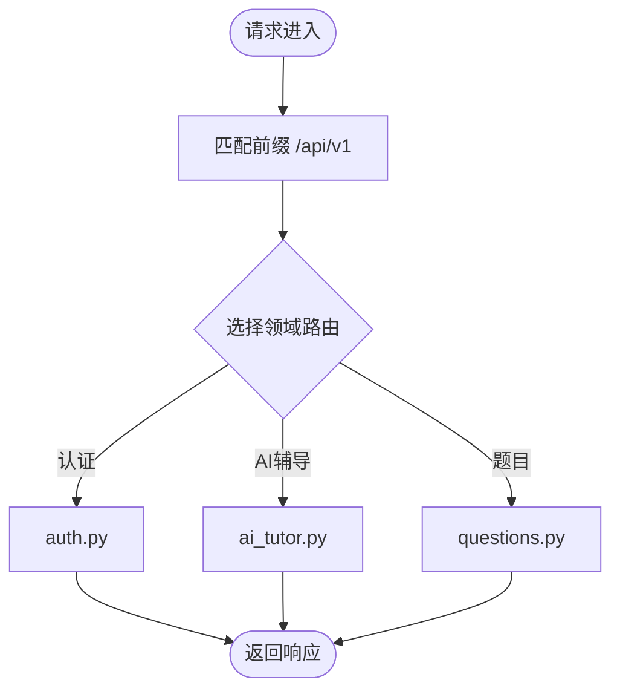
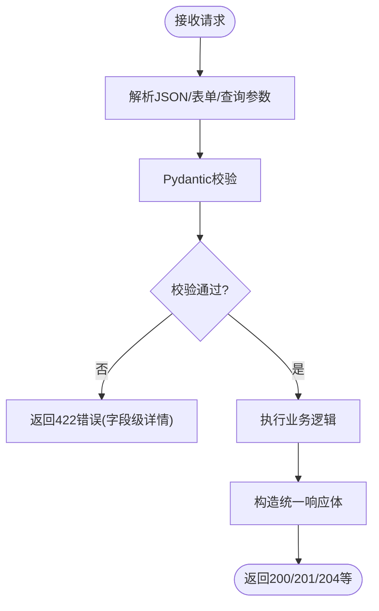
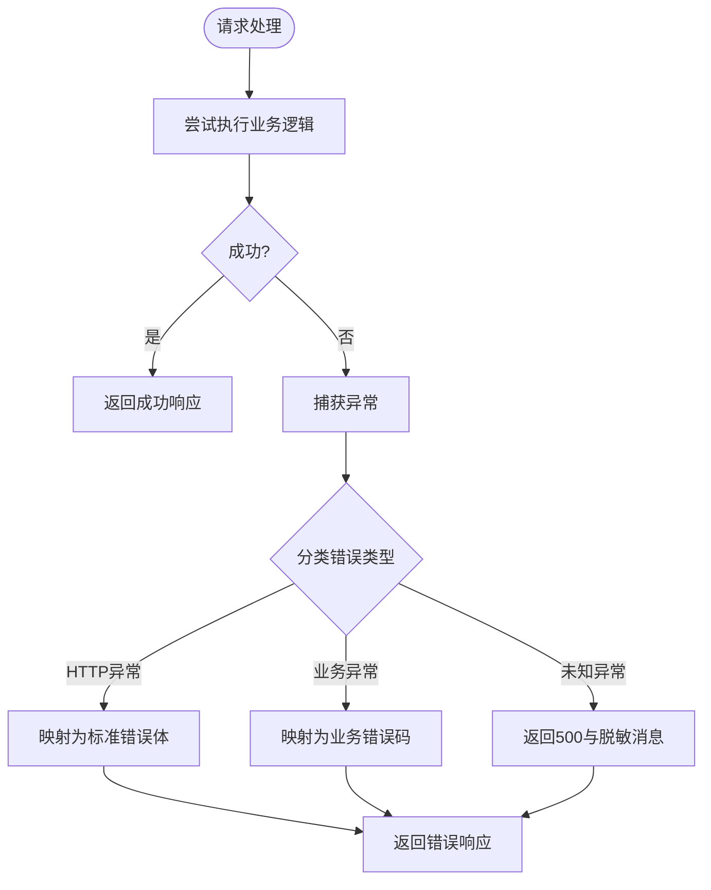
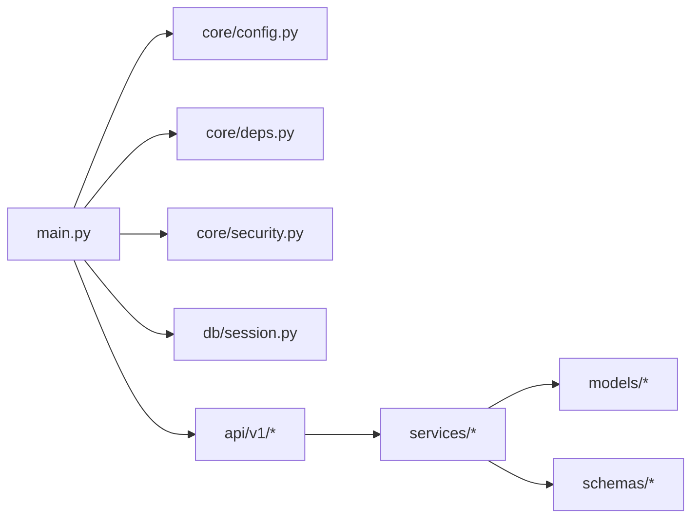

# API设计架构

<cite>
**本文引用的文件**   
- [backend/app/main.py](file://backend/app/main.py)
- [backend/app/core/config.py](file://backend/app/core/config.py)
- [backend/app/core/deps.py](file://backend/app/core/deps.py)
- [backend/app/core/security.py](file://backend/app/core/security.py)
- [backend/app/db/session.py](file://backend/app/db/session.py)
- [backend/app/api/v1/auth.py](file://backend/app/api/v1/auth.py)
- [backend/app/api/v1/ai_tutor.py](file://backend/app/api/v1/ai_tutor.py)
- [backend/app/api/v1/questions.py](file://backend/app/api/v1/questions.py)
- [backend/app/schemas/user.py](file://backend/app/schemas/user.py)
- [backend/app/models/user.py](file://backend/app/models/user.py)
</cite>

## 目录
1. [简介](#简介)
2. [项目结构](#项目结构)
3. [核心组件](#核心组件)
4. [架构总览](#架构总览)
5. [详细组件分析](#详细组件分析)
6. [依赖关系分析](#依赖关系分析)
7. [性能考虑](#性能考虑)
8. [故障排查指南](#故障排查指南)
9. [结论](#结论)
10. [附录](#附录)

## 简介
本文件面向AI助教系统的后端API设计与实现，聚焦于基于FastAPI的RESTful规范、依赖注入、中间件管道、版本控制、请求验证与错误处理等关键主题。文档以“从入口到路由、从依赖到服务、从校验到响应”的层次展开，帮助读者快速理解系统如何组织API、如何管理数据库会话、如何统一错误与日志、以及如何通过OpenAPI自动生成文档。

## 项目结构
后端采用分层与按功能域划分相结合的组织方式：
- 应用入口与全局配置位于 app 根目录
- 核心能力（配置、依赖注入、安全）集中在 core
- 数据访问层在 db，模型在 models，数据契约在 schemas
- 业务逻辑在 services，任务在 tasks
- API路由按版本 v1 组织在 api/v1

图示来源
- [backend/app/main.py](file://backend/app/main.py)
- [backend/app/core/config.py](file://backend/app/core/config.py)
- [backend/app/core/deps.py](file://backend/app/core/deps.py)
- [backend/app/core/security.py](file://backend/app/core/security.py)
- [backend/app/db/session.py](file://backend/app/db/session.py)
- [backend/app/api/v1/auth.py](file://backend/app/api/v1/auth.py)
- [backend/app/api/v1/ai_tutor.py](file://backend/app/api/v1/ai_tutor.py)
- [backend/app/api/v1/questions.py](file://backend/app/api/v1/questions.py)

章节来源
- [backend/app/main.py](file://backend/app/main.py)
- [backend/app/core/config.py](file://backend/app/core/config.py)
- [backend/app/core/deps.py](file://backend/app/core/deps.py)
- [backend/app/core/security.py](file://backend/app/core/security.py)
- [backend/app/db/session.py](file://backend/app/db/session.py)
- [backend/app/api/v1/auth.py](file://backend/app/api/v1/auth.py)
- [backend/app/api/v1/ai_tutor.py](file://backend/app/api/v1/ai_tutor.py)
- [backend/app/api/v1/questions.py](file://backend/app/api/v1/questions.py)

## 核心组件
- 应用入口与生命周期
  - 负责创建FastAPI实例、注册中间件、挂载路由、初始化/释放资源（如数据库引擎、缓存连接等）。
  - 典型职责：读取配置、设置CORS、挂载版本化路由、注册异常处理器、启动事件钩子。
- 配置中心
  - 集中管理环境变量、密钥、外部服务地址、开关项等，提供强类型配置对象供各层使用。
- 依赖注入
  - 定义通用Depends（如数据库会话、当前用户、配置对象），在各路由中声明式获取，避免硬编码和重复初始化。
- 安全与鉴权
  - 提供JWT签发/校验、密码哈希、权限校验工具；配合依赖注入将已认证用户注入到路由。
- 数据访问
  - 封装数据库会话生命周期，确保每个请求拥有独立会话并在请求结束时正确关闭。
- API路由与版本控制
  - 所有对外接口统一挂载在 /api/v1 下，便于后续演进至 v2。
- 请求与响应契约
  - 使用Pydantic模型定义输入输出结构，自动完成参数校验与OpenAPI文档生成。

章节来源
- [backend/app/main.py](file://backend/app/main.py)
- [backend/app/core/config.py](file://backend/app/core/config.py)
- [backend/app/core/deps.py](file://backend/app/core/deps.py)
- [backend/app/core/security.py](file://backend/app/core/security.py)
- [backend/app/db/session.py](file://backend/app/db/session.py)

## 架构总览
下图展示了从客户端请求到业务处理的端到端流程，包括中间件、依赖注入、服务层与数据层的交互。

图示来源
- [backend/app/main.py](file://backend/app/main.py)
- [backend/app/core/deps.py](file://backend/app/core/deps.py)
- [backend/app/db/session.py](file://backend/app/db/session.py)
- [backend/app/api/v1/auth.py](file://backend/app/api/v1/auth.py)
- [backend/app/api/v1/ai_tutor.py](file://backend/app/api/v1/ai_tutor.py)
- [backend/app/api/v1/questions.py](file://backend/app/api/v1/questions.py)

## 详细组件分析

### 应用入口与中间件管道
- 入口职责
  - 构建FastAPI实例并设置应用元信息（名称、版本、描述）。
  - 注册全局中间件：认证、日志、错误处理、CORS等。
  - 挂载版本化路由前缀 /api/v1。
  - 注册异常处理器，统一错误响应格式。
- 中间件顺序建议
  - 日志中间件在最外层，记录请求/响应耗时与上下文。
  - 认证中间件在日志之后，对需要鉴权的端点进行前置校验。
  - 错误处理中间件包裹整个应用，捕获未处理异常并转换为标准错误体。
- 最佳实践
  - 将可复用的中间件封装为函数，并通过依赖注入传入配置。
  - 对长耗时操作启用异步中间件或后台任务，避免阻塞请求线程。

章节来源
- [backend/app/main.py](file://backend/app/main.py)

### 依赖注入系统
- 设计要点
  - 使用FastAPI的Depends机制声明式注入：数据库会话、当前用户、配置对象等。
  - 将易变的外部依赖（如第三方SDK、向量库）抽象为接口，便于测试替换。
- 常见依赖
  - 数据库会话：在每个请求开始时创建，结束后自动关闭，避免连接泄漏。
  - 当前用户：由认证中间件解析Token后注入，供路由与服务层使用。
  - 配置：集中读取环境变量，保证跨模块一致。
- 示例路径
  - 依赖定义与复用：[backend/app/core/deps.py](file://backend/app/core/deps.py)
  - 数据库会话管理：[backend/app/db/session.py](file://backend/app/db/session.py)
  - 安全与用户解析：[backend/app/core/security.py](file://backend/app/core/security.py)

图示来源
- [backend/app/core/deps.py](file://backend/app/core/deps.py)
- [backend/app/db/session.py](file://backend/app/db/session.py)
- [backend/app/core/security.py](file://backend/app/core/security.py)

章节来源
- [backend/app/core/deps.py](file://backend/app/core/deps.py)
- [backend/app/db/session.py](file://backend/app/db/session.py)
- [backend/app/core/security.py](file://backend/app/core/security.py)

### 认证与安全
- 令牌签发与校验
  - 登录成功后签发JWT，包含用户标识与过期时间。
  - 受保护路由通过依赖注入解析Token并获取当前用户。
- 密码存储
  - 使用安全的哈希算法存储密码，禁止明文。
- 权限控制
  - 可在依赖注入层扩展角色/权限检查，或在服务层进行细粒度授权。
- 示例路径
  - 认证路由（登录/刷新）：[backend/app/api/v1/auth.py](file://backend/app/api/v1/auth.py)
  - 安全工具：[backend/app/core/security.py](file://backend/app/core/security.py)

图示来源
- [backend/app/api/v1/auth.py](file://backend/app/api/v1/auth.py)
- [backend/app/core/security.py](file://backend/app/core/security.py)
- [backend/app/models/user.py](file://backend/app/models/user.py)

章节来源
- [backend/app/api/v1/auth.py](file://backend/app/api/v1/auth.py)
- [backend/app/core/security.py](file://backend/app/core/security.py)
- [backend/app/models/user.py](file://backend/app/models/user.py)

### 路由组织与版本控制
- 版本策略
  - 所有对外API统一挂载在 /api/v1，便于未来平滑升级到 /api/v2。
- 路由分组
  - 按领域拆分：认证、AI辅导、题目管理等各自独立文件，保持高内聚低耦合。
- 示例路径
  - AI辅导路由：[backend/app/api/v1/ai_tutor.py](file://backend/app/api/v1/ai_tutor.py)
  - 题目路由：[backend/app/api/v1/questions.py](file://backend/app/api/v1/questions.py)

图示来源
- [backend/app/api/v1/auth.py](file://backend/app/api/v1/auth.py)
- [backend/app/api/v1/ai_tutor.py](file://backend/app/api/v1/ai_tutor.py)
- [backend/app/api/v1/questions.py](file://backend/app/api/v1/questions.py)

章节来源
- [backend/app/api/v1/ai_tutor.py](file://backend/app/api/v1/ai_tutor.py)
- [backend/app/api/v1/questions.py](file://backend/app/api/v1/questions.py)

### 请求验证与响应格式
- 输入校验
  - 使用Pydantic模型定义请求体、查询参数、路径参数，自动完成类型转换与约束校验。
  - 校验失败时返回标准错误体，包含字段级错误信息。
- 输出契约
  - 定义统一的响应包装结构，包含数据、分页信息与错误码。
- 示例路径
  - 用户相关Schema：[backend/app/schemas/user.py](file://backend/app/schemas/user.py)
  - 用户模型：[backend/app/models/user.py](file://backend/app/models/user.py)

图示来源
- [backend/app/schemas/user.py](file://backend/app/schemas/user.py)
- [backend/app/models/user.py](file://backend/app/models/user.py)

章节来源
- [backend/app/schemas/user.py](file://backend/app/schemas/user.py)
- [backend/app/models/user.py](file://backend/app/models/user.py)

### 错误统一处理
- 目标
  - 将所有异常转换为一致的JSON错误体，包含错误码、消息与可选的调试信息。
- 策略
  - 注册全局异常处理器，捕获HTTPException、自定义业务异常与未处理异常。
  - 区分客户端错误（4xx）与服务端错误（5xx），避免泄露敏感信息。
- 示例路径
  - 应用入口（注册异常处理器）：[backend/app/main.py](file://backend/app/main.py)

图示来源
- [backend/app/main.py](file://backend/app/main.py)

章节来源
- [backend/app/main.py](file://backend/app/main.py)

### OpenAPI/Swagger文档
- 自动生成
  - FastAPI基于Pydantic模型与路由注解自动生成OpenAPI规范与Swagger UI。
- 增强建议
  - 为路由添加摘要与描述，为Schema添加字段说明与示例。
  - 在生产环境可选择性禁用交互式文档以提升安全性。
- 示例路径
  - 应用入口（设置文档URL与标题）：[backend/app/main.py](file://backend/app/main.py)

章节来源
- [backend/app/main.py](file://backend/app/main.py)

## 依赖关系分析
- 组件耦合
  - 路由层仅依赖依赖注入提供的会话、用户与配置，不直接持有外部资源。
  - 服务层依赖数据访问与外部工具，但通过接口解耦，便于替换与测试。
- 循环依赖
  - 尽量避免模块间相互导入，必要时使用延迟导入或重构为更小的模块。
- 外部集成点
  - 数据库、缓存、消息队列、向量检索等通过依赖注入接入，便于切换实现。

图示来源
- [backend/app/main.py](file://backend/app/main.py)
- [backend/app/core/config.py](file://backend/app/core/config.py)
- [backend/app/core/deps.py](file://backend/app/core/deps.py)
- [backend/app/core/security.py](file://backend/app/core/security.py)
- [backend/app/db/session.py](file://backend/app/db/session.py)
- [backend/app/api/v1/auth.py](file://backend/app/api/v1/auth.py)
- [backend/app/api/v1/ai_tutor.py](file://backend/app/api/v1/ai_tutor.py)
- [backend/app/api/v1/questions.py](file://backend/app/api/v1/questions.py)

章节来源
- [backend/app/main.py](file://backend/app/main.py)
- [backend/app/core/deps.py](file://backend/app/core/deps.py)
- [backend/app/api/v1/ai_tutor.py](file://backend/app/api/v1/ai_tutor.py)
- [backend/app/api/v1/questions.py](file://backend/app/api/v1/questions.py)

## 性能考虑
- 数据库连接池
  - 合理配置连接池大小与超时，避免连接耗尽导致请求排队。
- 异步与并发
  - 对I/O密集型操作使用异步处理，减少线程占用。
- 缓存策略
  - 热点数据引入缓存层，降低数据库压力。
- 限流与熔断
  - 在网关或中间件层实施限流，保护后端服务。
- 监控与追踪
  - 集成指标采集与分布式追踪，定位慢请求与瓶颈。

## 故障排查指南
- 常见问题
  - 数据库连接泄漏：确认每个请求都正确关闭会话。
  - Token无效或过期：检查签名算法、密钥与过期时间。
  - 校验失败：查看422响应中的字段错误详情。
  - 500错误：检查全局异常处理器是否捕获并记录堆栈。
- 定位步骤
  - 开启详细日志，关注请求ID、耗时与异常堆栈。
  - 使用OpenAPI文档核对入参与出参结构。
  - 逐步缩小范围：先验证路由与依赖注入，再检查服务层与数据层。

章节来源
- [backend/app/main.py](file://backend/app/main.py)
- [backend/app/core/deps.py](file://backend/app/core/deps.py)
- [backend/app/db/session.py](file://backend/app/db/session.py)

## 结论
本架构以FastAPI为核心，结合清晰的依赖注入、严格的请求校验与统一的错误处理，构建了可扩展、可维护且易于文档化的API体系。通过版本化路由与模块化组织，系统具备良好的演进能力。建议在后续迭代中持续完善监控、限流与灰度发布能力，进一步提升稳定性与可观测性。

## 附录
- 常用状态码约定
  - 200：成功
  - 201：创建成功
  - 204：删除成功
  - 400：请求参数错误
  - 401：未认证
  - 403：无权限
  - 404：资源不存在
  - 422：请求校验失败
  - 500：服务端内部错误
- 参考实现路径
  - 应用入口与中间件：[backend/app/main.py](file://backend/app/main.py)
  - 依赖注入与安全：[backend/app/core/deps.py](file://backend/app/core/deps.py)、[backend/app/core/security.py](file://backend/app/core/security.py)
  - 数据库会话：[backend/app/db/session.py](file://backend/app/db/session.py)
  - 路由示例：[backend/app/api/v1/auth.py](file://backend/app/api/v1/auth.py)、[backend/app/api/v1/ai_tutor.py](file://backend/app/api/v1/ai_tutor.py)、[backend/app/api/v1/questions.py](file://backend/app/api/v1/questions.py)
  - Schema与模型：[backend/app/schemas/user.py](file://backend/app/schemas/user.py)、[backend/app/models/user.py](file://backend/app/models/user.py)