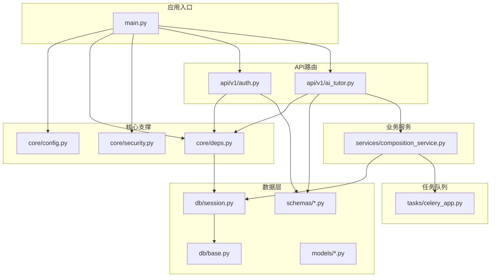
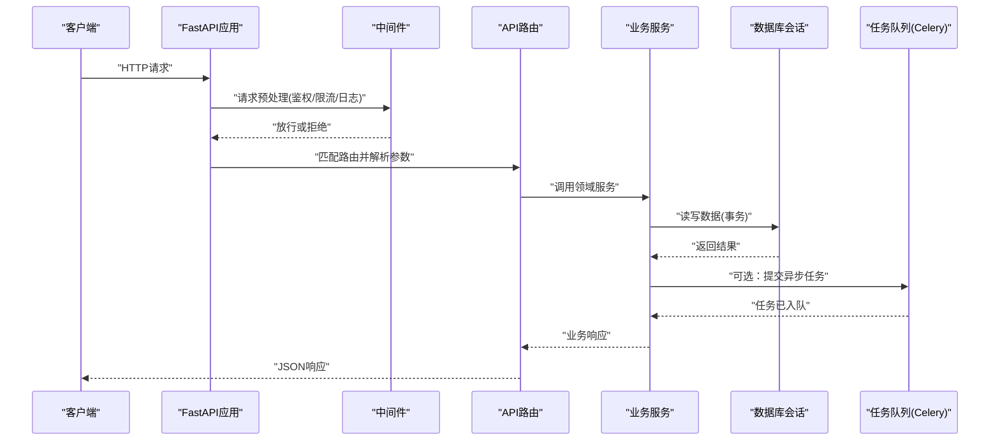
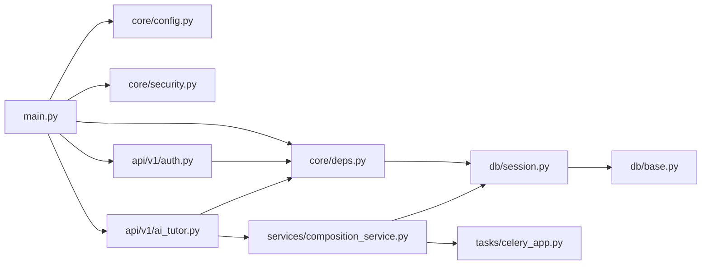

# 后端架构设计

<cite>
**本文引用的文件**   
- [backend/app/main.py](file://backend/app/main.py)
- [backend/app/core/config.py](file://backend/app/core/config.py)
- [backend/app/core/deps.py](file://backend/app/core/deps.py)
- [backend/app/core/security.py](file://backend/app/core/security.py)
- [backend/app/db/base.py](file://backend/app/db/base.py)
- [backend/app/db/session.py](file://backend/app/db/session.py)
- [backend/app/api/v1/auth.py](file://backend/app/api/v1/auth.py)
- [backend/app/api/v1/ai_tutor.py](file://backend/app/api/v1/ai_tutor.py)
- [backend/app/models/user.py](file://backend/app/models/user.py)
- [backend/app/schemas/user.py](file://backend/app/schemas/user.py)
- [backend/app/services/composition_service.py](file://backend/app/services/composition_service.py)
- [backend/app/tasks/celery_app.py](file://backend/app/tasks/celery_app.py)
</cite>

## 目录
1. [简介](#简介)
2. [项目结构](#项目结构)
3. [核心组件](#核心组件)
4. [架构总览](#架构总览)
5. [详细组件分析](#详细组件分析)
6. [依赖关系分析](#依赖关系分析)
7. [性能考量](#性能考量)
8. [故障排查指南](#故障排查指南)
9. [结论](#结论)
10. [附录](#附录)

## 简介
本文件面向AI助教系统的后端架构，围绕基于FastAPI的高性能异步Web框架进行系统化说明。文档覆盖以下关键主题：
- 依赖注入系统、中间件管道与异常处理机制
- 模块化分层：API路由层、业务服务层、数据访问层的职责分离
- 数据库连接池管理、事务处理与SQLAlchemy ORM最佳实践
- 安全认证体系（JWT）、权限控制与请求验证
- 配置管理、环境变量、日志记录与监控指标收集
- API版本管理、错误码规范与文档自动生成方案

## 项目结构
后端采用清晰的分层与模块化组织方式：
- API路由层：按功能域划分在 api/v1 下，每个模块对应一个领域接口集合
- 核心支撑：core 提供配置、依赖注入与安全能力
- 数据访问：db 封装数据库会话与基础模型定义；models 为ORM实体；schemas 为Pydantic校验模型
- 业务服务：services 承载跨接口的领域逻辑，必要时调用外部工具或任务队列
- 任务队列：tasks 使用Celery执行耗时任务（如向量检索、分析聚合）

图表来源
- [backend/app/main.py](file://backend/app/main.py)
- [backend/app/core/config.py](file://backend/app/core/config.py)
- [backend/app/core/deps.py](file://backend/app/core/deps.py)
- [backend/app/core/security.py](file://backend/app/core/security.py)
- [backend/app/db/base.py](file://backend/app/db/base.py)
- [backend/app/db/session.py](file://backend/app/db/session.py)
- [backend/app/api/v1/auth.py](file://backend/app/api/v1/auth.py)
- [backend/app/api/v1/ai_tutor.py](file://backend/app/api/v1/ai_tutor.py)
- [backend/app/services/composition_service.py](file://backend/app/services/composition_service.py)
- [backend/app/tasks/celery_app.py](file://backend/app/tasks/celery_app.py)

章节来源
- [backend/app/main.py](file://backend/app/main.py)
- [backend/app/core/config.py](file://backend/app/core/config.py)
- [backend/app/core/deps.py](file://backend/app/core/deps.py)
- [backend/app/core/security.py](file://backend/app/core/security.py)
- [backend/app/db/base.py](file://backend/app/db/base.py)
- [backend/app/db/session.py](file://backend/app/db/session.py)
- [backend/app/api/v1/auth.py](file://backend/app/api/v1/auth.py)
- [backend/app/api/v1/ai_tutor.py](file://backend/app/api/v1/ai_tutor.py)
- [backend/app/services/composition_service.py](file://backend/app/services/composition_service.py)
- [backend/app/tasks/celery_app.py](file://backend/app/tasks/celery_app.py)

## 核心组件
- 应用入口与生命周期
  - 负责创建FastAPI实例、注册中间件、挂载路由、初始化全局资源（如数据库引擎与会话工厂），并在启动/关闭钩子中完成资源准备与释放。
- 配置与环境变量
  - 集中管理数据库URL、JWT密钥、第三方服务凭据等，支持多环境切换与默认值回退。
- 依赖注入
  - 通过FastAPI的Depends实现数据库会话、用户上下文、配置对象等的按需注入，避免全局状态耦合。
- 安全与鉴权
  - 基于JWT的无状态认证，提供令牌签发、解析与权限校验；结合路径级装饰器或依赖项实现细粒度授权。
- 数据访问
  - 基于SQLAlchemy的异步会话管理，统一连接池参数、事务边界与查询封装。
- 业务服务
  - 将复杂流程编排、外部调用与持久化操作解耦到服务层，保持路由简洁可测试。
- 任务队列
  - 使用Celery执行耗时任务，如批量分析、向量化处理，提升主线程吞吐。

章节来源
- [backend/app/main.py](file://backend/app/main.py)
- [backend/app/core/config.py](file://backend/app/core/config.py)
- [backend/app/core/deps.py](file://backend/app/core/deps.py)
- [backend/app/core/security.py](file://backend/app/core/security.py)
- [backend/app/db/base.py](file://backend/app/db/base.py)
- [backend/app/db/session.py](file://backend/app/db/session.py)
- [backend/app/services/composition_service.py](file://backend/app/services/composition_service.py)
- [backend/app/tasks/celery_app.py](file://backend/app/tasks/celery_app.py)

## 架构总览
下图展示从HTTP请求进入，到鉴权、路由分发、服务编排、数据访问与任务调度的完整链路。

图表来源
- [backend/app/main.py](file://backend/app/main.py)
- [backend/app/api/v1/auth.py](file://backend/app/api/v1/auth.py)
- [backend/app/api/v1/ai_tutor.py](file://backend/app/api/v1/ai_tutor.py)
- [backend/app/services/composition_service.py](file://backend/app/services/composition_service.py)
- [backend/app/db/session.py](file://backend/app/db/session.py)
- [backend/app/tasks/celery_app.py](file://backend/app/tasks/celery_app.py)

## 详细组件分析

### 配置与环境变量
- 职责
  - 集中读取环境变量并提供强类型配置对象，供其他模块按需注入。
- 关键点
  - 敏感信息（如数据库URL、JWT密钥）通过环境变量注入
  - 提供默认值与校验，确保开发/测试/生产一致性
- 建议
  - 使用分层配置（基础+环境覆盖）
  - 对布尔开关、端口、超时等数值型配置做范围校验

章节来源
- [backend/app/core/config.py](file://backend/app/core/config.py)

### 依赖注入系统
- 职责
  - 统一管理数据库会话、当前用户、配置对象等共享资源的创建与销毁。
- 关键点
  - 使用FastAPI的Depends声明式注入
  - 会话生命周期与请求周期绑定，自动提交/回滚与清理
- 建议
  - 将外部服务（如LLM客户端、存储SDK）也通过依赖注入，便于替换与测试

章节来源
- [backend/app/core/deps.py](file://backend/app/core/deps.py)

### 安全认证与权限控制
- 职责
  - 提供JWT签发与校验、用户上下文提取、路径级权限拦截。
- 关键点
  - 登录成功后签发短期有效令牌
  - 在受保护路由中解析并校验令牌，注入当前用户
  - 基于角色或策略的细粒度授权
- 建议
  - 刷新令牌机制与黑名单/灰度发布兼容
  - 敏感接口增加二次确认或风控策略

章节来源
- [backend/app/core/security.py](file://backend/app/core/security.py)
- [backend/app/api/v1/auth.py](file://backend/app/api/v1/auth.py)

### 数据库连接池与事务处理
- 职责
  - 管理SQLAlchemy异步引擎与会话工厂，提供统一的查询与事务边界。
- 关键点
  - 连接池大小、超时、回收策略可调
  - 使用上下文管理器保证事务原子性与异常回滚
- 建议
  - 只读查询走只读副本
  - 大事务拆分为小批次，避免长事务锁表

章节来源
- [backend/app/db/base.py](file://backend/app/db/base.py)
- [backend/app/db/session.py](file://backend/app/db/session.py)

### ORM模型与Schema校验
- 职责
  - models定义数据库表结构与关系；schemas定义请求/响应数据结构与校验规则。
- 关键点
  - 模型与Schema一一对应，避免直接暴露内部模型
  - 使用Pydantic v2特性进行高效校验与序列化
- 建议
  - 对外接口仅暴露最小必要字段
  - 对枚举、时间戳、金额等类型严格约束

章节来源
- [backend/app/models/user.py](file://backend/app/models/user.py)
- [backend/app/schemas/user.py](file://backend/app/schemas/user.py)

### API路由层与服务层协作
- 职责
  - 路由层负责协议适配、参数校验与响应包装；服务层承载领域逻辑与跨模块协作。
- 关键点
  - 路由尽量薄，复杂逻辑下沉至服务
  - 通过依赖注入获取会话、用户、配置等上下文
- 建议
  - 为每个领域建立独立路由模块，便于版本化管理

章节来源
- [backend/app/api/v1/auth.py](file://backend/app/api/v1/auth.py)
- [backend/app/api/v1/ai_tutor.py](file://backend/app/api/v1/ai_tutor.py)
- [backend/app/services/composition_service.py](file://backend/app/services/composition_service.py)

### 任务队列与异步处理
- 职责
  - 将耗时任务（如分析、向量化）卸载到Celery Worker，提高主线程吞吐。
- 关键点
  - 路由或服务层触发任务，返回任务ID供前端轮询或SSE推送
  - 失败重试与死信队列保障可靠性
- 建议
  - 任务幂等设计，避免重复执行副作用
  - 监控任务执行时长与失败率

章节来源
- [backend/app/tasks/celery_app.py](file://backend/app/tasks/celery_app.py)

### 异常处理与错误码规范
- 职责
  - 统一捕获未处理异常，转换为标准JSON错误响应，包含错误码、消息与追踪ID。
- 关键点
  - 区分业务异常与系统异常
  - 记录结构化日志，便于定位问题
- 建议
  - 错误码分域命名，如 AUTH_XXX、DATA_XXX、SYS_XXX
  - 对外仅暴露友好提示，内部保留堆栈

章节来源
- [backend/app/main.py](file://backend/app/main.py)

### 中间件管道
- 职责
  - 横切关注点：CORS、请求日志、速率限制、审计、压缩等。
- 关键点
  - 顺序重要，鉴权应在日志之后、路由之前
  - 对大响应启用压缩，对静态资源缓存
- 建议
  - 自定义中间件遵循单一职责，易于组合与测试

章节来源
- [backend/app/main.py](file://backend/app/main.py)

### 文档自动生成与API版本管理
- 职责
  - 基于OpenAPI/Swagger自动生成交互式文档；通过路由前缀实现API版本隔离。
- 关键点
  - 为每个v1路由组挂载到 /api/v1
  - 开启调试模式时暴露Swagger/ReDoc
- 建议
  - 为每个端点补充描述与示例，提升可读性
  - 版本废弃策略与迁移指南同步更新

章节来源
- [backend/app/api/v1/auth.py](file://backend/app/api/v1/auth.py)
- [backend/app/api/v1/ai_tutor.py](file://backend/app/api/v1/ai_tutor.py)
- [backend/app/main.py](file://backend/app/main.py)

## 依赖关系分析
下图展示核心模块间的依赖方向，强调低耦合与高内聚。

图表来源
- [backend/app/main.py](file://backend/app/main.py)
- [backend/app/core/config.py](file://backend/app/core/config.py)
- [backend/app/core/deps.py](file://backend/app/core/deps.py)
- [backend/app/core/security.py](file://backend/app/core/security.py)
- [backend/app/api/v1/auth.py](file://backend/app/api/v1/auth.py)
- [backend/app/api/v1/ai_tutor.py](file://backend/app/api/v1/ai_tutor.py)
- [backend/app/services/composition_service.py](file://backend/app/services/composition_service.py)
- [backend/app/db/session.py](file://backend/app/db/session.py)
- [backend/app/db/base.py](file://backend/app/db/base.py)
- [backend/app/tasks/celery_app.py](file://backend/app/tasks/celery_app.py)

章节来源
- [backend/app/main.py](file://backend/app/main.py)
- [backend/app/core/deps.py](file://backend/app/core/deps.py)
- [backend/app/db/session.py](file://backend/app/db/session.py)
- [backend/app/api/v1/auth.py](file://backend/app/api/v1/auth.py)
- [backend/app/api/v1/ai_tutor.py](file://backend/app/api/v1/ai_tutor.py)
- [backend/app/services/composition_service.py](file://backend/app/services/composition_service.py)
- [backend/app/tasks/celery_app.py](file://backend/app/tasks/celery_app.py)

## 性能考量
- 异步优先：I/O密集操作使用异步函数，减少线程阻塞
- 连接池调优：根据并发量调整最大连接数与空闲回收时间
- 分页与投影：大数据集查询务必分页与选择性字段
- 缓存策略：热点数据引入内存缓存或分布式缓存
- 任务削峰：将耗时计算放入Celery，配合SSE/轮询反馈进度
- 响应压缩：对大文本响应启用Gzip/Brotli
- 监控指标：暴露QPS、延迟分布、错误率、连接池利用率等指标

[本节为通用指导，不直接分析具体文件]

## 故障排查指南
- 常见问题
  - 数据库连接泄漏：检查会话是否在请求结束时正确关闭
  - JWT失效：核对密钥、过期时间与刷新流程
  - 任务堆积：观察Worker数量、队列长度与重试策略
  - 慢查询：定位Top SQL，优化索引与查询计划
- 诊断手段
  - 结构化日志：记录请求ID、用户ID、关键步骤耗时
  - 指标采集：集成Prometheus导出关键指标
  - 链路追踪：为跨服务调用添加TraceID
- 快速恢复
  - 降级开关：非核心功能可快速关闭
  - 熔断与限流：保护下游服务与数据库

章节来源
- [backend/app/main.py](file://backend/app/main.py)
- [backend/app/core/deps.py](file://backend/app/core/deps.py)
- [backend/app/tasks/celery_app.py](file://backend/app/tasks/celery_app.py)

## 结论
本架构以FastAPI为核心，结合清晰的依赖注入、中间件管道与异常处理，实现了高内聚、低耦合的分层设计。通过JWT认证与权限控制保障安全，借助连接池与事务管理提升数据一致性与性能，并以Celery承担异步负载。配合完善的配置管理、日志与监控，以及自动化的API文档与版本管理，整体具备可扩展、可观测与易维护的工程化能力。

[本节为总结性内容，不直接分析具体文件]

## 附录
- 术语
  - 依赖注入：通过声明式方式在运行时提供依赖对象
  - 中间件：在请求/响应处理前后执行的横切逻辑
  - 连接池：复用数据库连接的池化机制
  - 事务：保证一组操作的原子性、一致性、隔离性与持久性
- 参考
  - FastAPI官方文档
  - SQLAlchemy异步用法
  - Pydantic v2校验与序列化
  - Celery任务队列最佳实践

[本节为概念性内容，不直接分析具体文件]