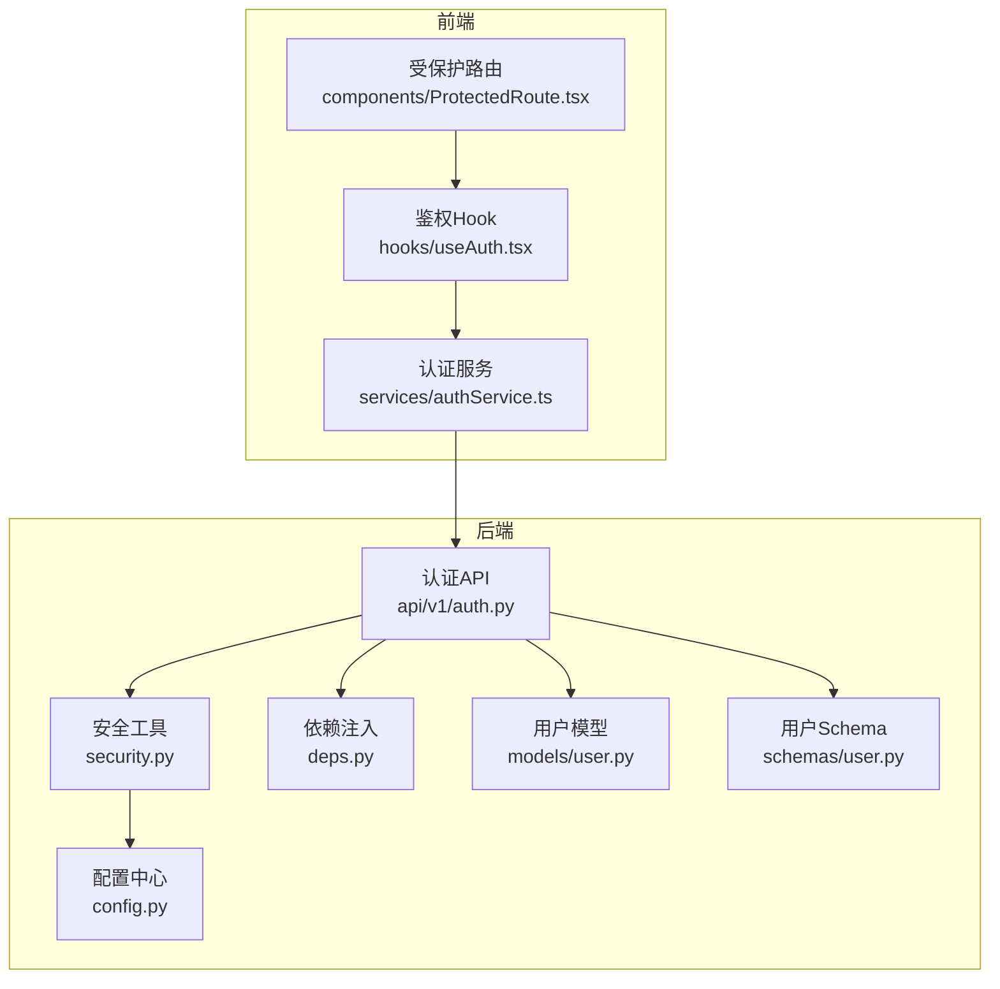
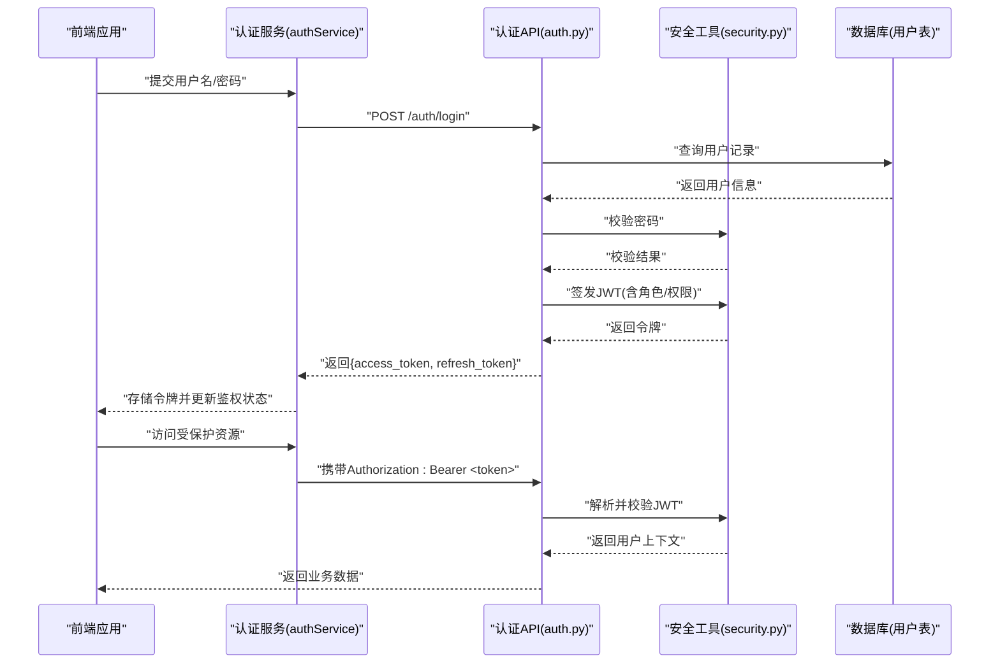
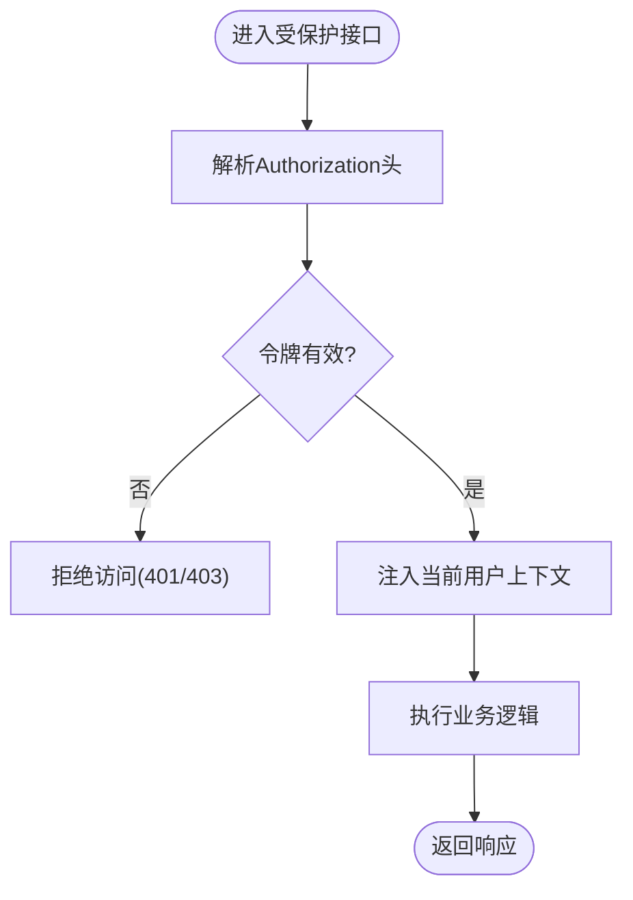
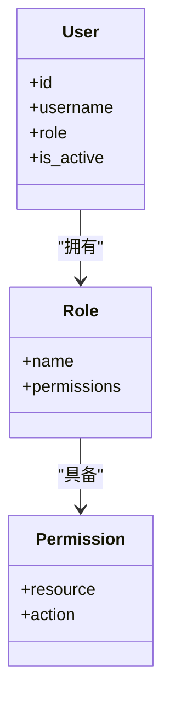
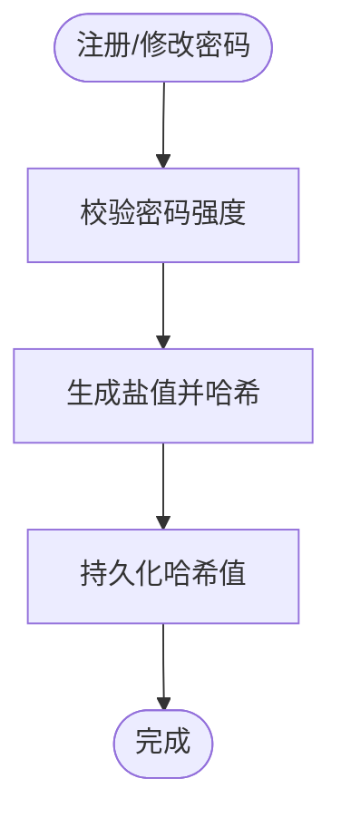
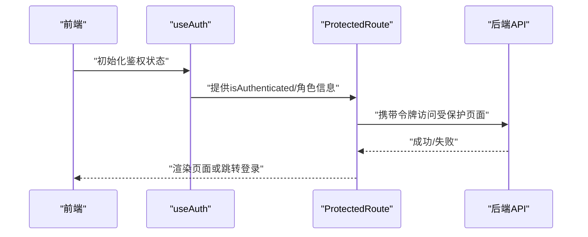
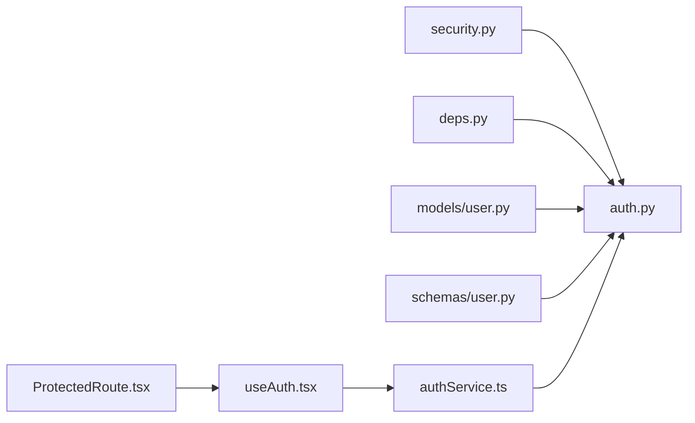

# 安全认证体系

<cite>
**本文引用的文件**   
- [backend/app/core/security.py](file://backend/app/core/security.py)
- [backend/app/api/v1/auth.py](file://backend/app/api/v1/auth.py)
- [backend/app/models/user.py](file://backend/app/models/user.py)
- [backend/app/schemas/user.py](file://backend/app/schemas/user.py)
- [backend/app/core/deps.py](file://backend/app/core/deps.py)
- [backend/app/core/config.py](file://backend/app/core/config.py)
- [frontend/src/services/authService.ts](file://frontend/src/services/authService.ts)
- [frontend/src/hooks/useAuth.tsx](file://frontend/src/hooks/useAuth.tsx)
- [frontend/src/components/ProtectedRoute.tsx](file://frontend/src/components/ProtectedRoute.tsx)
</cite>

## 目录
1. [简介](#简介)
2. [项目结构](#项目结构)
3. [核心组件](#核心组件)
4. [架构总览](#架构总览)
5. [详细组件分析](#详细组件分析)
6. [依赖关系分析](#依赖关系分析)
7. [性能考虑](#性能考虑)
8. [故障排查指南](#故障排查指南)
9. [结论](#结论)
10. [附录](#附录)

## 简介
本文件面向AI助教系统的安全认证体系，聚焦以下方面：
- JWT令牌认证机制：令牌的生成、验证与刷新流程
- 用户权限控制：角色管理、资源访问控制、细粒度权限校验
- 密码安全策略：哈希算法、盐值处理、密码强度校验
- API安全防护：请求频率限制、输入验证、SQL注入防护、XSS防护
- 会话管理与安全配置：会话生命周期、安全头设置、HTTPS建议
- 安全审计与监控：审计日志、异常检测、威胁监控方案

## 项目结构
后端采用分层架构，安全相关能力集中在core层（安全工具、依赖注入、配置），API层暴露认证接口，模型与Schema定义用户数据与校验规则。前端提供登录服务、鉴权Hook与受保护路由。

图表来源
- [backend/app/core/security.py](file://backend/app/core/security.py)
- [backend/app/api/v1/auth.py](file://backend/app/api/v1/auth.py)
- [backend/app/models/user.py](file://backend/app/models/user.py)
- [backend/app/schemas/user.py](file://backend/app/schemas/user.py)
- [backend/app/core/deps.py](file://backend/app/core/deps.py)
- [backend/app/core/config.py](file://backend/app/core/config.py)
- [frontend/src/services/authService.ts](file://frontend/src/services/authService.ts)
- [frontend/src/hooks/useAuth.tsx](file://frontend/src/hooks/useAuth.tsx)
- [frontend/src/components/ProtectedRoute.tsx](file://frontend/src/components/ProtectedRoute.tsx)

章节来源
- [backend/app/core/security.py](file://backend/app/core/security.py)
- [backend/app/api/v1/auth.py](file://backend/app/api/v1/auth.py)
- [backend/app/models/user.py](file://backend/app/models/user.py)
- [backend/app/schemas/user.py](file://backend/app/schemas/user.py)
- [backend/app/core/deps.py](file://backend/app/core/deps.py)
- [backend/app/core/config.py](file://backend/app/core/config.py)
- [frontend/src/services/authService.ts](file://frontend/src/services/authService.ts)
- [frontend/src/hooks/useAuth.tsx](file://frontend/src/hooks/useAuth.tsx)
- [frontend/src/components/ProtectedRoute.tsx](file://frontend/src/components/ProtectedRoute.tsx)

## 核心组件
- 安全工具模块：封装JWT签发、解析、校验、密码哈希与校验等通用能力
- 认证API：提供注册、登录、令牌刷新等端点，串联安全工具与用户模型
- 用户模型与Schema：定义用户字段、角色、状态及输入校验规则
- 依赖注入：在FastAPI中通过依赖项获取当前用户、数据库会话等上下文
- 前端鉴权：统一拦截器携带令牌、本地持久化、路由级保护

章节来源
- [backend/app/core/security.py](file://backend/app/core/security.py)
- [backend/app/api/v1/auth.py](file://backend/app/api/v1/auth.py)
- [backend/app/models/user.py](file://backend/app/models/user.py)
- [backend/app/schemas/user.py](file://backend/app/schemas/user.py)
- [backend/app/core/deps.py](file://backend/app/core/deps.py)
- [frontend/src/services/authService.ts](file://frontend/src/services/authService.ts)
- [frontend/src/hooks/useAuth.tsx](file://frontend/src/hooks/useAuth.tsx)
- [frontend/src/components/ProtectedRoute.tsx](file://frontend/src/components/ProtectedRoute.tsx)

## 架构总览
下图展示从前端发起登录到后端签发JWT、后续受保护请求的完整调用链。

图表来源
- [backend/app/api/v1/auth.py](file://backend/app/api/v1/auth.py)
- [backend/app/core/security.py](file://backend/app/core/security.py)
- [frontend/src/services/authService.ts](file://frontend/src/services/authService.ts)

## 详细组件分析

### JWT令牌认证机制
- 令牌生成
  - 由安全工具负责签发，载荷包含用户标识、角色、过期时间等
  - 使用强随机密钥与合适的签名算法，确保不可伪造
- 令牌验证
  - 在受保护接口前通过依赖注入解析Header中的Bearer令牌
  - 校验签名、有效期、黑名单（可选）后注入当前用户上下文
- 令牌刷新
  - 提供刷新端点，使用refresh_token换取新的access_token
  - 支持一次性使用或短期有效策略，降低泄露风险

图表来源
- [backend/app/core/security.py](file://backend/app/core/security.py)
- [backend/app/core/deps.py](file://backend/app/core/deps.py)
- [backend/app/api/v1/auth.py](file://backend/app/api/v1/auth.py)

章节来源
- [backend/app/core/security.py](file://backend/app/core/security.py)
- [backend/app/core/deps.py](file://backend/app/core/deps.py)
- [backend/app/api/v1/auth.py](file://backend/app/api/v1/auth.py)

### 用户权限控制系统
- 角色管理
  - 用户模型包含角色字段，用于区分管理员、教师、学生等
  - 可在JWT载荷中携带角色以便快速鉴权
- 资源访问控制
  - 基于角色的访问控制（RBAC）：在路由层声明所需角色
  - 结合依赖注入实现统一的权限检查中间件
- 细粒度权限验证
  - 在业务层对资源ID进行归属校验（如仅允许查看自己的作业）
  - 可扩展为基于资源的ACL策略

图表来源
- [backend/app/models/user.py](file://backend/app/models/user.py)

章节来源
- [backend/app/models/user.py](file://backend/app/models/user.py)
- [backend/app/core/deps.py](file://backend/app/core/deps.py)
- [backend/app/api/v1/auth.py](file://backend/app/api/v1/auth.py)

### 密码安全策略
- 哈希算法
  - 使用业界推荐的慢哈希算法（如bcrypt/argon2）对用户密码进行单向哈希
- 盐值处理
  - 每个密码独立生成随机盐值，避免彩虹表攻击
- 密码强度验证
  - 在Schema层对长度、复杂度进行校验，防止弱口令
- 登录校验
  - 将明文输入与数据库中存储的哈希值进行比对，不保存明文

图表来源
- [backend/app/schemas/user.py](file://backend/app/schemas/user.py)
- [backend/app/core/security.py](file://backend/app/core/security.py)
- [backend/app/models/user.py](file://backend/app/models/user.py)

章节来源
- [backend/app/schemas/user.py](file://backend/app/schemas/user.py)
- [backend/app/core/security.py](file://backend/app/core/security.py)
- [backend/app/models/user.py](file://backend/app/models/user.py)

### API安全防护措施
- 请求频率限制
  - 建议在网关或中间件层实现IP/用户维度的限流，防止暴力破解与滥用
- 输入验证
  - 使用Pydantic Schema对所有入参进行严格类型与格式校验
- SQL注入防护
  - 使用ORM参数化查询，禁止拼接SQL字符串
- XSS防护
  - 服务端输出进行HTML转义；前端遵循内容安全策略（CSP）与DOM净化

章节来源
- [backend/app/schemas/user.py](file://backend/app/schemas/user.py)
- [backend/app/api/v1/auth.py](file://backend/app/api/v1/auth.py)

### 会话管理与安全配置
- 会话管理
  - 无状态JWT为主，必要时可引入令牌黑名单或短期刷新令牌
- 安全头设置
  - 建议启用HSTS、X-Content-Type-Options、X-Frame-Options、Referrer-Policy等
- HTTPS配置
  - 强制HTTPS传输，关闭HTTP明文通道，证书定期轮换

章节来源
- [backend/app/core/config.py](file://backend/app/core/config.py)
- [backend/app/core/security.py](file://backend/app/core/security.py)

### 前端鉴权集成
- 认证服务
  - 统一封装登录、刷新、登出，自动附加Authorization头
- 鉴权Hook
  - 维护登录态、令牌过期判断、自动刷新策略
- 受保护路由
  - 未登录或无权限时重定向至登录页

图表来源
- [frontend/src/services/authService.ts](file://frontend/src/services/authService.ts)
- [frontend/src/hooks/useAuth.tsx](file://frontend/src/hooks/useAuth.tsx)
- [frontend/src/components/ProtectedRoute.tsx](file://frontend/src/components/ProtectedRoute.tsx)

章节来源
- [frontend/src/services/authService.ts](file://frontend/src/services/authService.ts)
- [frontend/src/hooks/useAuth.tsx](file://frontend/src/hooks/useAuth.tsx)
- [frontend/src/components/ProtectedRoute.tsx](file://frontend/src/components/ProtectedRoute.tsx)

## 依赖关系分析
- 安全工具被认证API广泛依赖，提供JWT与密码能力
- 依赖注入在路由层组装当前用户与数据库会话
- 前端服务与Hook共同维护令牌生命周期与路由保护

图表来源
- [backend/app/core/security.py](file://backend/app/core/security.py)
- [backend/app/api/v1/auth.py](file://backend/app/api/v1/auth.py)
- [backend/app/core/deps.py](file://backend/app/core/deps.py)
- [backend/app/models/user.py](file://backend/app/models/user.py)
- [backend/app/schemas/user.py](file://backend/app/schemas/user.py)
- [frontend/src/services/authService.ts](file://frontend/src/services/authService.ts)
- [frontend/src/hooks/useAuth.tsx](file://frontend/src/hooks/useAuth.tsx)
- [frontend/src/components/ProtectedRoute.tsx](file://frontend/src/components/ProtectedRoute.tsx)

章节来源
- [backend/app/core/security.py](file://backend/app/core/security.py)
- [backend/app/api/v1/auth.py](file://backend/app/api/v1/auth.py)
- [backend/app/core/deps.py](file://backend/app/core/deps.py)
- [backend/app/models/user.py](file://backend/app/models/user.py)
- [backend/app/schemas/user.py](file://backend/app/schemas/user.py)
- [frontend/src/services/authService.ts](file://frontend/src/services/authService.ts)
- [frontend/src/hooks/useAuth.tsx](file://frontend/src/hooks/useAuth.tsx)
- [frontend/src/components/ProtectedRoute.tsx](file://frontend/src/components/ProtectedRoute.tsx)

## 性能考虑
- JWT解析开销小，适合高并发场景；注意避免在每次请求中进行昂贵的权限计算
- 刷新令牌应短时效且可撤销，减少长期令牌泄露影响
- 密码哈希选择合适成本因子，平衡安全性与CPU消耗
- 限流与缓存结合，降低重复校验与数据库压力

## 故障排查指南
- 常见错误码
  - 401：未认证或令牌无效
  - 403：已认证但无权限
  - 429：请求过于频繁
- 定位步骤
  - 检查Authorization头是否携带正确格式的Bearer令牌
  - 确认令牌未过期且未被加入黑名单
  - 核对用户角色与目标资源所需的权限匹配
  - 审查输入校验失败的具体字段
- 日志与审计
  - 记录登录成功/失败、令牌刷新、权限拒绝事件
  - 关联用户ID、IP、User-Agent、时间戳，便于溯源

章节来源
- [backend/app/api/v1/auth.py](file://backend/app/api/v1/auth.py)
- [backend/app/core/security.py](file://backend/app/core/security.py)

## 结论
本安全认证体系以JWT为核心，结合RBAC与严格的输入校验、安全的密码存储策略，形成端到端的身份与访问控制闭环。通过依赖注入与前端鉴权组件的配合，实现了清晰的职责划分与良好的扩展性。建议在生产环境补充限流、WAF、CSP、审计日志与威胁监控，进一步提升整体安全性与可观测性。

## 附录
- 术语
  - JWT：JSON Web Token，用于无状态身份传递
  - RBAC：基于角色的访问控制
  - CSP：内容安全策略，缓解XSS风险
- 最佳实践清单
  - 强制HTTPS、启用HSTS
  - 最小权限原则与按需授权
  - 定期轮换密钥与证书
  - 全链路审计与告警