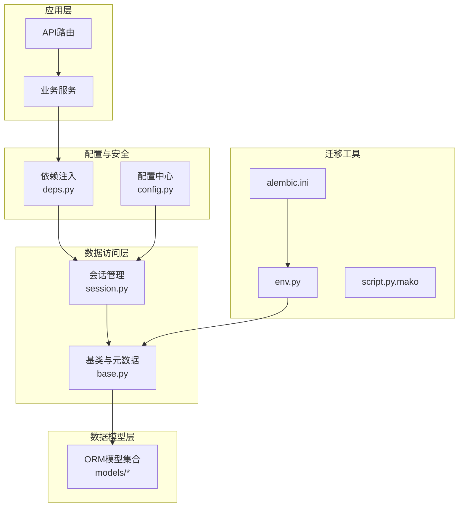
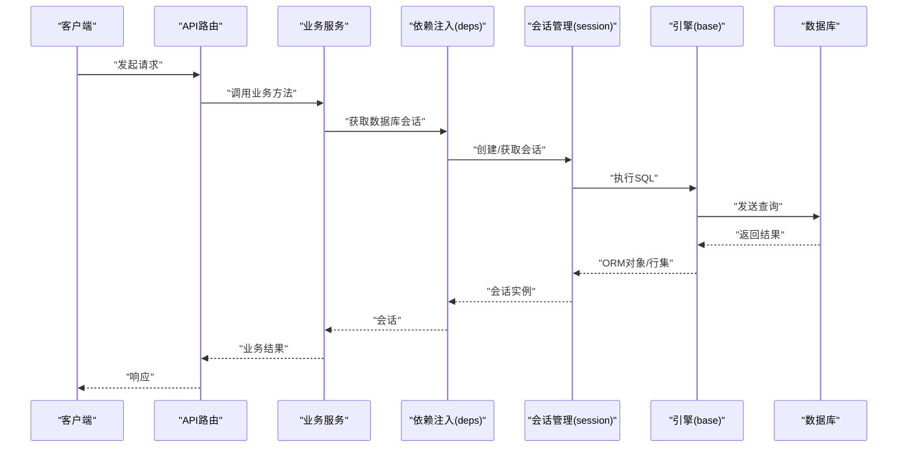
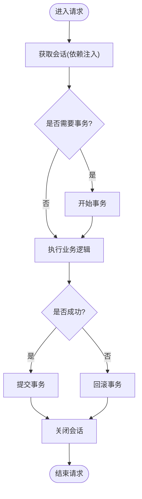
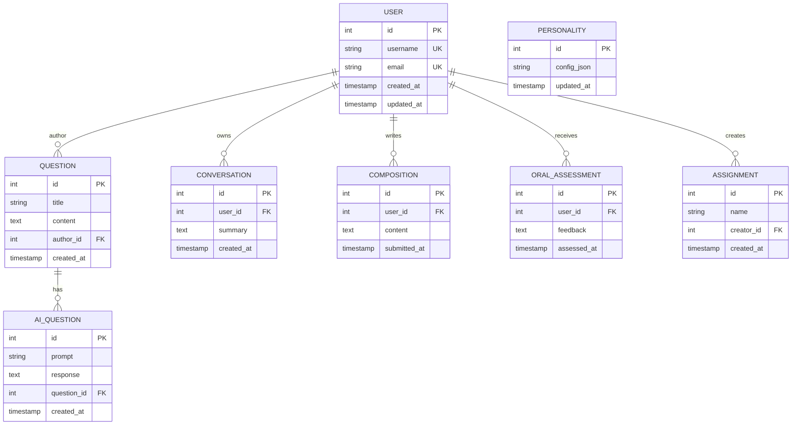
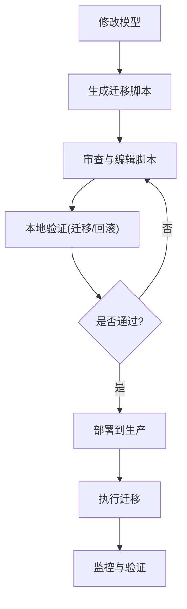
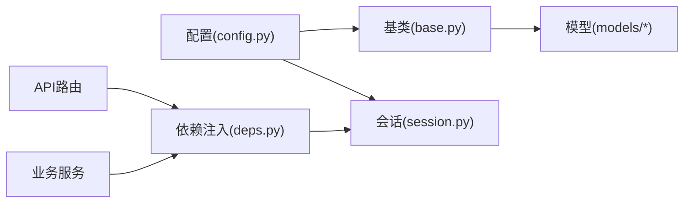

# 数据库架构设计

<cite>
**本文引用的文件**   
- [backend/app/db/base.py](file://backend/app/db/base.py)
- [backend/app/db/session.py](file://backend/app/db/session.py)
- [backend/alembic.ini](file://backend/alembic.ini)
- [backend/alembic/env.py](file://backend/alembic/env.py)
- [backend/alembic/script.py.mako](file://backend/alembic/script.py.mako)
- [backend/app/models/__init__.py](file://backend/app/models/__init__.py)
- [backend/app/models/user.py](file://backend/app/models/user.py)
- [backend/app/models/question.py](file://backend/app/models/question.py)
- [backend/app/models/ai_question.py](file://backend/app/models/ai_question.py)
- [backend/app/models/conversation.py](file://backend/app/models/conversation.py)
- [backend/app/models/composition.py](file://backend/app/models/composition.py)
- [backend/app/models/oral_assessment.py](file://backend/app/models/oral_assessment.py)
- [backend/app/models/personality.py](file://backend/app/models/personality.py)
- [backend/app/models/assignment.py](file://backend/app/models/assignment.py)
- [backend/app/core/config.py](file://backend/app/core/config.py)
- [backend/app/core/deps.py](file://backend/app/core/deps.py)
</cite>

## 目录
1. [简介](#简介)
2. [项目结构](#项目结构)
3. [核心组件](#核心组件)
4. [架构总览](#架构总览)
5. [详细组件分析](#详细组件分析)
6. [依赖关系分析](#依赖关系分析)
7. [性能考虑](#性能考虑)
8. [故障排查指南](#故障排查指南)
9. [结论](#结论)
10. [附录](#附录)

## 简介
本文件面向AI助教系统的数据库架构，聚焦于基于SQLAlchemy ORM的数据访问层设计与实现。文档覆盖连接池与会话生命周期、事务处理机制、数据模型设计原则（实体关系建模、字段类型选择、索引优化）、Alembic迁移工具使用（版本控制、脚本编写、回滚策略）、性能优化（查询优化、缓存策略、读写分离）、数据完整性约束（外键、触发器）、安全配置、备份恢复方案以及监控指标收集的具体落地方式。

## 项目结构
后端采用分层组织：
- 数据访问层：位于 app/db，提供引擎与会话管理
- 数据模型层：位于 app/models，定义ORM实体与关系
- 配置与安全：位于 app/core，包含数据库连接参数与安全相关设置
- 迁移工具：位于 alembic 目录，负责数据库版本管理与迁移脚本生成

图表来源
- [backend/app/db/base.py](file://backend/app/db/base.py)
- [backend/app/db/session.py](file://backend/app/db/session.py)
- [backend/app/core/config.py](file://backend/app/core/config.py)
- [backend/app/core/deps.py](file://backend/app/core/deps.py)
- [backend/alembic.ini](file://backend/alembic.ini)
- [backend/alembic/env.py](file://backend/alembic/env.py)
- [backend/alembic/script.py.mako](file://backend/alembic/script.py.mako)

章节来源
- [backend/app/db/base.py](file://backend/app/db/base.py)
- [backend/app/db/session.py](file://backend/app/db/session.py)
- [backend/app/core/config.py](file://backend/app/core/config.py)
- [backend/app/core/deps.py](file://backend/app/core/deps.py)
- [backend/alembic.ini](file://backend/alembic.ini)
- [backend/alembic/env.py](file://backend/alembic/env.py)
- [backend/alembic/script.py.mako](file://backend/alembic/script.py.mako)

## 核心组件
- 连接与引擎：通过配置加载数据库URL与驱动参数，创建并复用SQLAlchemy引擎，启用连接池与可选的预编译语句缓存。
- 会话管理：提供线程安全的会话工厂，确保每个请求或任务拥有独立会话；在请求结束时自动关闭会话，避免泄漏。
- 事务处理：在业务方法中显式开启事务，成功提交，异常时回滚；支持嵌套事务与保存点以增强容错性。
- 模型注册：集中导入所有模型，确保Alembic能发现表结构变更。
- 依赖注入：在FastAPI等框架中通过依赖项获取会话，保证生命周期与请求绑定。

章节来源
- [backend/app/db/base.py](file://backend/app/db/base.py)
- [backend/app/db/session.py](file://backend/app/db/session.py)
- [backend/app/core/deps.py](file://backend/app/core/deps.py)

## 架构总览
下图展示从API到数据库的调用链路与关键组件交互。

图表来源
- [backend/app/api/v1/auth.py](file://backend/app/api/v1/auth.py)
- [backend/app/core/deps.py](file://backend/app/core/deps.py)
- [backend/app/db/session.py](file://backend/app/db/session.py)
- [backend/app/db/base.py](file://backend/app/db/base.py)

## 详细组件分析

### 数据访问层：连接池与会话生命周期
- 连接池管理
  - 通过配置项指定数据库URL、驱动、最大连接数、最小空闲连接、连接超时等参数，构建引擎。
  - 建议启用连接池与预编译语句缓存以提升吞吐。
- 会话生命周期
  - 使用会话工厂为每次请求或后台任务创建独立会话。
  - 在请求结束或任务完成后关闭会话，释放底层连接。
  - 若发生异常，确保会话清理与连接归还。
- 事务处理
  - 在需要原子性的操作中使用事务上下文，成功提交，失败回滚。
  - 对复杂流程可使用保存点进行局部回滚。

图表来源
- [backend/app/db/session.py](file://backend/app/db/session.py)
- [backend/app/core/deps.py](file://backend/app/core/deps.py)

章节来源
- [backend/app/db/base.py](file://backend/app/db/base.py)
- [backend/app/db/session.py](file://backend/app/db/session.py)
- [backend/app/core/deps.py](file://backend/app/core/deps.py)

### 数据模型设计原则
- 实体关系建模
  - 用户、题目、AI题目、对话、作文、口语评估、人格配置、作业等实体之间通过外键建立一对多或多对一关系。
  - 建议在高频查询字段上建立索引，如用户ID、题目ID、时间戳等。
- 字段类型选择
  - 主键使用自增整数或UUID；文本内容使用长文本类型；布尔值用于状态标记；时间戳使用带时区的时间类型。
- 索引优化策略
  - 针对常用过滤条件、排序字段、关联查询字段建立单列或复合索引。
  - 避免过度索引影响写入性能，定期评估慢查询并调整索引。

图表来源
- [backend/app/models/user.py](file://backend/app/models/user.py)
- [backend/app/models/question.py](file://backend/app/models/question.py)
- [backend/app/models/ai_question.py](file://backend/app/models/ai_question.py)
- [backend/app/models/conversation.py](file://backend/app/models/conversation.py)
- [backend/app/models/composition.py](file://backend/app/models/composition.py)
- [backend/app/models/oral_assessment.py](file://backend/app/models/oral_assessment.py)
- [backend/app/models/personality.py](file://backend/app/models/personality.py)
- [backend/app/models/assignment.py](file://backend/app/models/assignment.py)

章节来源
- [backend/app/models/user.py](file://backend/app/models/user.py)
- [backend/app/models/question.py](file://backend/app/models/question.py)
- [backend/app/models/ai_question.py](file://backend/app/models/ai_question.py)
- [backend/app/models/conversation.py](file://backend/app/models/conversation.py)
- [backend/app/models/composition.py](file://backend/app/models/composition.py)
- [backend/app/models/oral_assessment.py](file://backend/app/models/oral_assessment.py)
- [backend/app/models/personality.py](file://backend/app/models/personality.py)
- [backend/app/models/assignment.py](file://backend/app/models/assignment.py)

### Alembic迁移工具使用
- 版本控制
  - 使用alembic.ini与env.py配置迁移目录与目标元数据。
  - 通过命令生成迁移脚本，记录表结构变更历史。
- 迁移脚本编写
  - 在生成的脚本中编写升级与降级逻辑，确保幂等性与可回滚。
  - 对于大表变更，建议使用分批更新与并发控制。
- 回滚策略
  - 使用降级函数恢复到上一版本；对破坏性变更需准备数据修复脚本。
  - 在生产环境执行前进行充分测试与灰度发布。

图表来源
- [backend/alembic.ini](file://backend/alembic.ini)
- [backend/alembic/env.py](file://backend/alembic/env.py)
- [backend/alembic/script.py.mako](file://backend/alembic/script.py.mako)

章节来源
- [backend/alembic.ini](file://backend/alembic.ini)
- [backend/alembic/env.py](file://backend/alembic/env.py)
- [backend/alembic/script.py.mako](file://backend/alembic/script.py.mako)

### 配置与安全
- 配置中心
  - 集中管理数据库URL、驱动、连接池参数、日志级别等。
  - 支持按环境区分配置（开发、测试、生产）。
- 安全配置
  - 使用环境变量或密钥管理服务存储敏感信息。
  - 限制数据库账户权限，仅授予必要操作。
  - 启用SSL/TLS加密传输，必要时启用连接认证与IP白名单。

章节来源
- [backend/app/core/config.py](file://backend/app/core/config.py)

## 依赖关系分析
- 模块耦合
  - API与服务层依赖依赖注入获取会话，降低与具体实现的耦合。
  - 数据访问层依赖配置中心，模型层依赖基类与元数据。
- 外部依赖
  - SQLAlchemy与Alembic作为核心库，驱动由配置决定（如PostgreSQL、MySQL）。
- 潜在循环依赖
  - 模型间应避免相互导入，使用字符串引用外键关系。

图表来源
- [backend/app/core/config.py](file://backend/app/core/config.py)
- [backend/app/db/base.py](file://backend/app/db/base.py)
- [backend/app/db/session.py](file://backend/app/db/session.py)
- [backend/app/core/deps.py](file://backend/app/core/deps.py)

章节来源
- [backend/app/core/config.py](file://backend/app/core/config.py)
- [backend/app/db/base.py](file://backend/app/db/base.py)
- [backend/app/db/session.py](file://backend/app/db/session.py)
- [backend/app/core/deps.py](file://backend/app/core/deps.py)

## 性能考虑
- 查询优化
  - 使用只读会话进行统计与报表查询，减少锁竞争。
  - 分页与投影查询，避免拉取不必要字段。
  - 合理使用JOIN与子查询，必要时物化视图或汇总表。
- 缓存策略
  - 热点数据使用内存缓存（如Redis）或应用级缓存。
  - 对频繁读取的配置与字典表进行缓存，设置合理过期策略。
- 读写分离
  - 主库写、从库读，通过不同会话工厂指向不同数据库URL。
  - 注意最终一致性与延迟问题，必要时引入消息队列补偿。

[本节为通用指导，不直接分析具体文件]

## 故障排查指南
- 常见问题
  - 连接池耗尽：检查会话是否正确关闭，是否存在长时间未提交的事务。
  - 死锁与锁等待：缩短事务范围，避免跨表大范围更新。
  - 迁移失败：核对降级函数与数据兼容性，先在小规模环境验证。
- 诊断手段
  - 启用SQL日志与慢查询日志，定位瓶颈。
  - 监控连接池使用率、活跃会话数、事务时长分布。
  - 使用数据库自带工具分析执行计划与索引命中率。

章节来源
- [backend/app/db/session.py](file://backend/app/db/session.py)
- [backend/app/db/base.py](file://backend/app/db/base.py)

## 结论
本架构围绕SQLAlchemy与Alembic构建了稳健的数据访问层与迁移体系。通过合理的连接池与会话管理、清晰的事务边界、完善的模型设计与索引策略，系统在可扩展性与稳定性方面具备良好基础。结合缓存、读写分离与监控告警，可进一步提升性能与可观测性。

[本节为总结性内容，不直接分析具体文件]

## 附录
- 数据完整性与约束
  - 外键关系：在模型中声明外键与级联行为，确保引用一致性。
  - 唯一约束：对用户名字段、邮箱等关键属性设置唯一约束。
  - 非空与默认值：为必填字段设置非空约束与合理默认值。
- 触发器使用
  - 在数据库层维护审计字段（如更新时间），或通过ORM事件监听器实现。
- 备份与恢复
  - 定期全量与增量备份，保留多份副本并异地存放。
  - 制定恢复演练计划，确保RTO/RPO满足业务要求。
- 监控指标
  - 连接池大小、活跃连接、等待队列长度。
  - 事务提交/回滚比率、平均事务时长。
  - 慢查询数量与Top SQL列表。

[本节为补充说明，不直接分析具体文件]