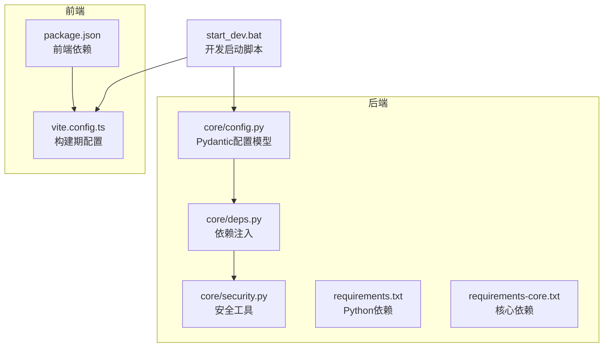
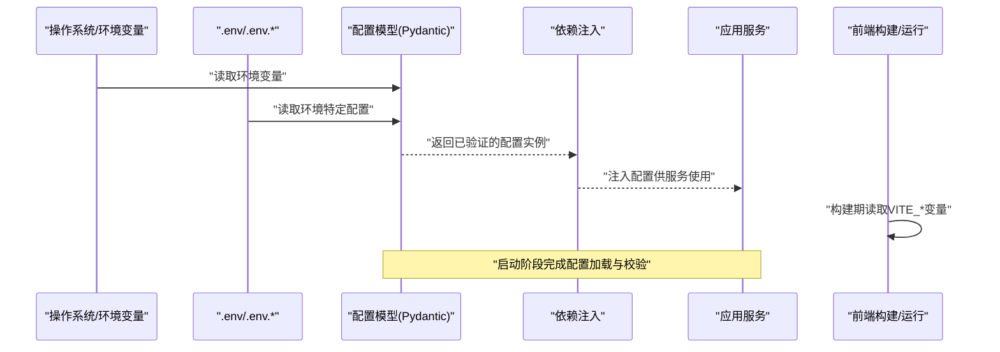
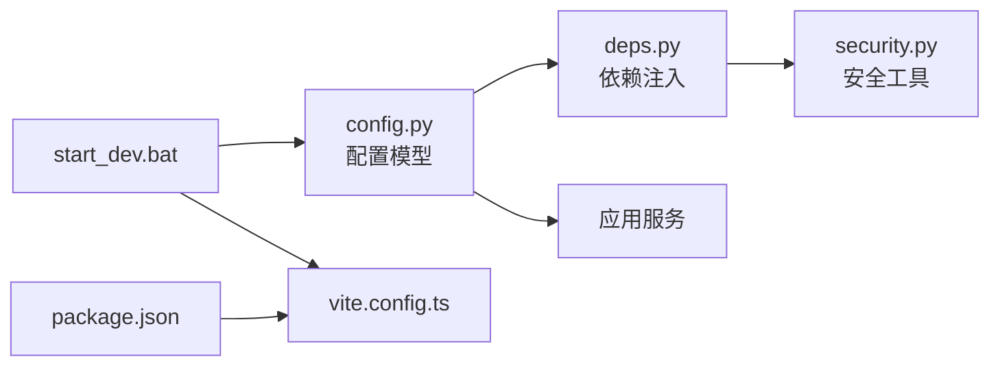

# 配置管理系统

<cite>
**本文引用的文件**   
- [backend/app/core/config.py](file://backend/app/core/config.py)
- [backend/app/core/deps.py](file://backend/app/core/deps.py)
- [backend/app/core/security.py](file://backend/app/core/security.py)
- [backend/requirements.txt](file://backend/requirements.txt)
- [backend/requirements-core.txt](file://backend/requirements-core.txt)
- [frontend/package.json](file://frontend/package.json)
- [frontend/vite.config.ts](file://frontend/vite.config.ts)
- [start_dev.bat](file://start_dev.bat)
</cite>

## 目录
1. [简介](#简介)
2. [项目结构](#项目结构)
3. [核心组件](#核心组件)
4. [架构总览](#架构总览)
5. [详细组件分析](#详细组件分析)
6. [依赖关系分析](#依赖关系分析)
7. [性能考虑](#性能考虑)
8. [故障排查指南](#故障排查指南)
9. [结论](#结论)
10. [附录](#附录)

## 简介
本文件面向AI助教系统的“配置管理系统”，聚焦于后端基于Pydantic的配置管理架构，涵盖环境变量加载、配置验证与默认值处理；多环境差异化策略（开发、测试、生产）；敏感信息管理（密钥存储、配置文件加密、环境变量注入）；依赖管理方案（Python包版本控制、前端依赖管理、容器化配置）；以及配置热重载、变更通知与版本控制的实践建议。文档同时提供最佳实践、安全建议与故障排查指南，帮助团队在本地、CI与生产环境中稳定运行系统。

## 项目结构
本项目采用前后端分离的目录组织方式：
- 后端位于 backend/app，核心配置集中在 core 子模块中，包含配置模型、依赖注入与安全工具。
- 前端位于 frontend，使用Vite构建，依赖通过package.json管理，构建期环境变量由vite.config.ts引入。
- 根目录包含启动脚本与依赖清单，便于快速启动与部署。

图表来源
- [backend/app/core/config.py](file://backend/app/core/config.py)
- [backend/app/core/deps.py](file://backend/app/core/deps.py)
- [backend/app/core/security.py](file://backend/app/core/security.py)
- [backend/requirements.txt](file://backend/requirements.txt)
- [backend/requirements-core.txt](file://backend/requirements-core.txt)
- [frontend/package.json](file://frontend/package.json)
- [frontend/vite.config.ts](file://frontend/vite.config.ts)
- [start_dev.bat](file://start_dev.bat)

章节来源
- [backend/app/core/config.py](file://backend/app/core/config.py)
- [backend/app/core/deps.py](file://backend/app/core/deps.py)
- [backend/app/core/security.py](file://backend/app/core/security.py)
- [backend/requirements.txt](file://backend/requirements.txt)
- [backend/requirements-core.txt](file://backend/requirements-core.txt)
- [frontend/package.json](file://frontend/package.json)
- [frontend/vite.config.ts](file://frontend/vite.config.ts)
- [start_dev.bat](file://start_dev.bat)

## 核心组件
- Pydantic配置模型：集中定义所有配置项的类型、校验规则与默认值，确保应用启动时配置有效且可追踪。
- 环境变量加载：从操作系统环境变量或.env文件中读取配置，支持按环境前缀区分不同环境的配置键。
- 依赖注入：将配置对象以单例形式注入到服务层与API路由，避免全局状态污染。
- 安全工具：封装敏感信息访问、加解密与签名等能力，统一对外暴露接口。
- 依赖清单：后端Python依赖通过requirements系列文件锁定版本；前端依赖通过package.json与锁文件管理。
- 构建期配置：前端通过Vite配置引入构建期环境变量，用于生成静态资源时的行为差异。
- 启动脚本：提供一键启动入口，负责设置必要的环境变量并拉起前后端进程。

章节来源
- [backend/app/core/config.py](file://backend/app/core/config.py)
- [backend/app/core/deps.py](file://backend/app/core/deps.py)
- [backend/app/core/security.py](file://backend/app/core/security.py)
- [backend/requirements.txt](file://backend/requirements.txt)
- [backend/requirements-core.txt](file://backend/requirements-core.txt)
- [frontend/package.json](file://frontend/package.json)
- [frontend/vite.config.ts](file://frontend/vite.config.ts)
- [start_dev.bat](file://start_dev.bat)

## 架构总览
下图展示了配置系统在应用生命周期中的关键流程：启动时加载配置、校验与注入，运行时按需读取，并在需要时触发变更通知与热重载。

图表来源
- [backend/app/core/config.py](file://backend/app/core/config.py)
- [backend/app/core/deps.py](file://backend/app/core/deps.py)
- [frontend/vite.config.ts](file://frontend/vite.config.ts)

## 详细组件分析

### 配置模型与环境变量加载
- 设计要点
  - 使用Pydantic模型对配置进行强类型约束，缺失或非法值在启动时即报错，避免运行时异常扩散。
  - 支持默认值与可选字段，降低新环境接入成本。
  - 支持按环境前缀读取环境变量，实现开发、测试、生产的差异化配置。
  - 支持从.env或.env.{env}文件加载，便于本地调试与CI集成。
- 典型字段类别
  - 数据库连接参数（主机、端口、用户名、密码、库名、池大小等）
  - 缓存与消息队列（Redis、RabbitMQ/Kafka等）
  - 外部服务（LLM API Key、鉴权服务、对象存储等）
  - 应用开关与日志级别
- 加载顺序与优先级
  - 默认值 < .env文件 < .env.{env}文件 < 操作系统环境变量
  - 显式传入的环境变量具有最高优先级
- 校验与错误处理
  - 类型转换失败或缺失必填项抛出明确错误，附带字段名与期望类型，便于定位问题
  - 对敏感字段进行最小可见性暴露，不在日志中打印完整值

章节来源
- [backend/app/core/config.py](file://backend/app/core/config.py)

### 依赖注入与配置访问
- 设计要点
  - 将配置对象作为单例注入到FastAPI依赖中，服务层通过依赖获取配置，避免全局变量
  - 提供统一的配置访问器，屏蔽底层读取细节（如环境变量、加密存储）
- 使用场景
  - 初始化数据库连接、缓存客户端、第三方SDK
  - 在中间件或请求生命周期内动态读取配置（例如A/B开关）

章节来源
- [backend/app/core/deps.py](file://backend/app/core/deps.py)

### 安全工具与敏感信息管理
- 设计要点
  - 提供统一的密钥读取接口，优先从受保护的位置（如KMS、Vault、环境变量）获取
  - 对敏感信息进行脱敏输出，避免泄露
  - 提供加解密与签名工具方法，供业务侧调用
- 最佳实践
  - 禁止将密钥硬编码进代码或提交到仓库
  - 使用环境变量注入密钥，结合CI/CD平台的安全变量管理
  - 对配置文件进行加密存储，仅在运行时解密

章节来源
- [backend/app/core/security.py](file://backend/app/core/security.py)

### 依赖管理与版本控制
- Python依赖
  - requirements.txt与requirements-core.txt分别管理全量与核心依赖，便于镜像分层与最小化安装
  - 建议在CI中固定版本并生成锁文件，保证构建可重现
- 前端依赖
  - package.json声明依赖与脚本，配合lock文件确保一致性
  - 构建期环境变量通过Vite配置注入，影响打包产物行为
- 容器化配置
  - 建议使用多阶段构建，仅将运行时依赖打入最终镜像
  - 将敏感信息通过环境变量注入，不写入镜像层

章节来源
- [backend/requirements.txt](file://backend/requirements.txt)
- [backend/requirements-core.txt](file://backend/requirements-core.txt)
- [frontend/package.json](file://frontend/package.json)
- [frontend/vite.config.ts](file://frontend/vite.config.ts)

### 启动脚本与环境准备
- 作用
  - 统一设置必要的环境变量（如数据库、缓存、外部服务地址与密钥）
  - 并行启动前后端服务，提升本地开发效率
- 注意事项
  - 为不同环境提供独立脚本或参数化入口
  - 在CI中复用同一套脚本，减少环境差异

章节来源
- [start_dev.bat](file://start_dev.bat)

### 配置热重载与变更通知
- 热重载
  - 开发环境可通过监听配置文件或环境变量变化，触发服务重启或局部刷新
  - 生产环境不建议频繁热重载，应通过滚动发布或蓝绿切换更新配置
- 变更通知
  - 配置变更后，向相关服务发送事件（如WebSocket/SSE），驱动前端或微服务刷新
  - 对关键配置变更记录审计日志，便于追溯

[本节为概念性说明，无需列出具体文件来源]

### 配置版本控制
- 建议
  - 将非敏感配置纳入版本控制，敏感配置通过CI/CD注入
  - 对配置变更进行评审与回滚策略，保留历史版本
  - 在制品中包含配置快照，便于问题复现与排障

[本节为概念性说明，无需列出具体文件来源]

## 依赖关系分析
下图展示配置系统与依赖注入、安全工具之间的耦合关系，以及与前后端构建期的交互。

图表来源
- [backend/app/core/config.py](file://backend/app/core/config.py)
- [backend/app/core/deps.py](file://backend/app/core/deps.py)
- [backend/app/core/security.py](file://backend/app/core/security.py)
- [frontend/package.json](file://frontend/package.json)
- [frontend/vite.config.ts](file://frontend/vite.config.ts)
- [start_dev.bat](file://start_dev.bat)

章节来源
- [backend/app/core/config.py](file://backend/app/core/config.py)
- [backend/app/core/deps.py](file://backend/app/core/deps.py)
- [backend/app/core/security.py](file://backend/app/core/security.py)
- [frontend/package.json](file://frontend/package.json)
- [frontend/vite.config.ts](file://frontend/vite.config.ts)
- [start_dev.bat](file://start_dev.bat)

## 性能考虑
- 配置加载
  - 启动时一次性加载并缓存配置，避免重复解析与IO
  - 对大体积配置（如特征表）使用懒加载或增量更新
- 依赖初始化
  - 数据库连接池、缓存客户端等在启动阶段预热，减少首次请求延迟
- 前端构建
  - 合理拆分环境变量，避免不必要的重新构建
  - 使用缓存与增量构建优化CI时间

[本节为通用指导，无需列出具体文件来源]

## 故障排查指南
- 常见症状与定位
  - 启动时报错缺少环境变量或类型不匹配：检查配置模型必填项与默认值
  - 运行时出现鉴权失败或外部服务不可达：核对密钥与网络连通性
  - 前端构建失败：确认构建期环境变量是否注入正确
- 排查步骤
  - 打印配置摘要（脱敏后）确认加载路径与优先级
  - 对比不同环境的配置差异，定位环境特有键
  - 检查依赖清单版本是否与镜像一致
- 恢复策略
  - 回滚到上一个已知可用的配置版本
  - 临时降级功能开关，保障核心链路可用

章节来源
- [backend/app/core/config.py](file://backend/app/core/config.py)
- [backend/app/core/deps.py](file://backend/app/core/deps.py)
- [backend/app/core/security.py](file://backend/app/core/security.py)
- [frontend/vite.config.ts](file://frontend/vite.config.ts)

## 结论
通过基于Pydantic的配置模型、严格的校验与默认值机制、统一的安全工具与依赖注入，AI助教系统实现了高可靠、可维护、可扩展的配置管理。结合多环境策略、敏感信息保护与完善的依赖管理，可在本地、CI与生产环境中保持一致性与安全性。建议持续完善配置热重载与变更通知机制，并建立配置版本控制与审计流程，进一步提升运维效率与稳定性。

[本节为总结性内容，无需列出具体文件来源]

## 附录
- 多环境配置示例键约定（建议）
  - APP_ENV=development|test|production
  - DB_HOST、DB_PORT、DB_USER、DB_PASSWORD、DB_NAME
  - REDIS_URL
  - LLM_API_KEY、LLM_BASE_URL
  - LOG_LEVEL
- 安全建议
  - 使用CI/CD平台的Secrets管理敏感信息
  - 最小权限原则，限制密钥访问范围
  - 定期轮换密钥并记录审计日志
- 最佳实践
  - 配置即代码，纳入版本控制（不含敏感信息）
  - 为每个环境提供独立的配置模板与校验用例
  - 在单元测试中覆盖配置边界条件

[本节为通用指导，无需列出具体文件来源]