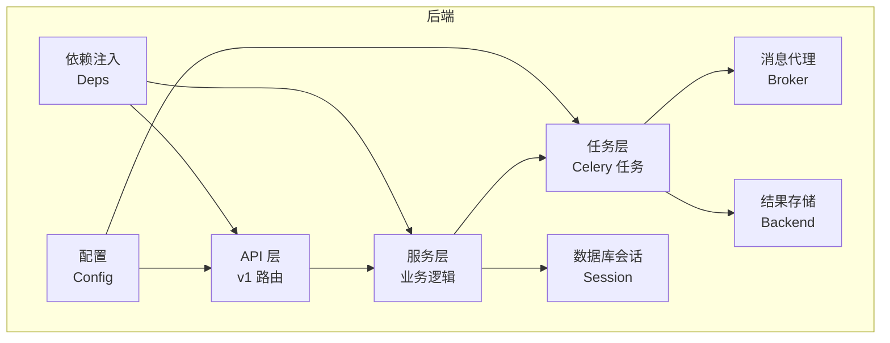
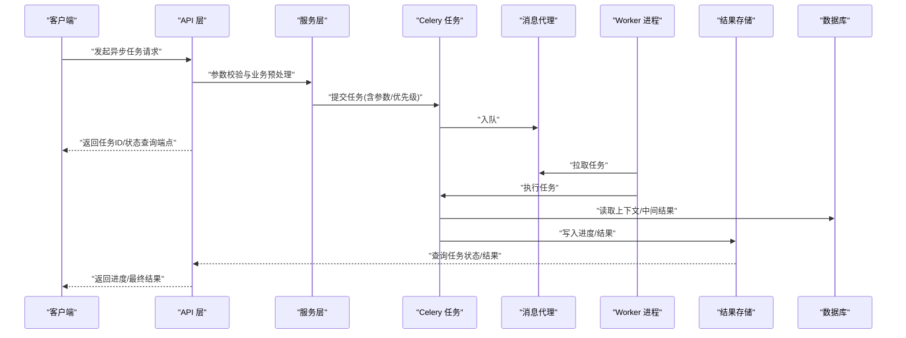
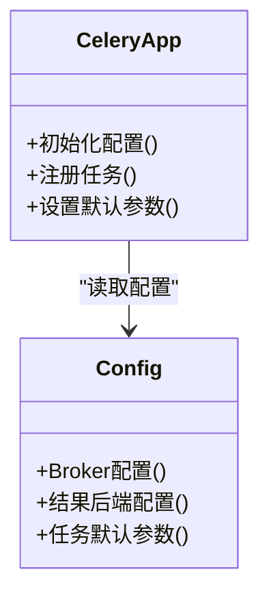
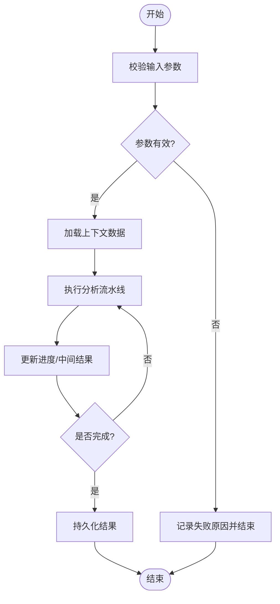
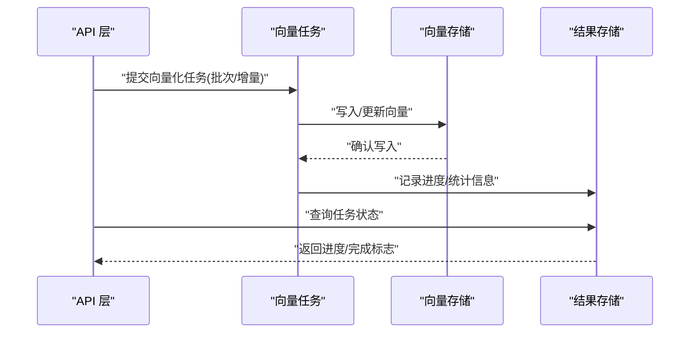
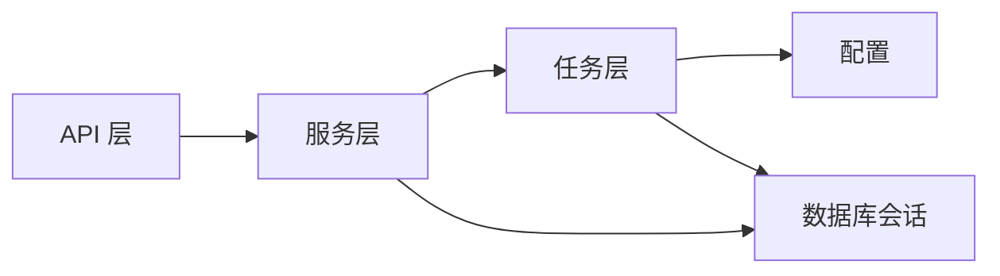

# 异步任务架构

<cite>
**本文引用的文件**   
- [backend/app/tasks/celery_app.py](file://backend/app/tasks/celery_app.py)
- [backend/app/tasks/analysis_tasks.py](file://backend/app/tasks/analysis_tasks.py)
- [backend/app/tasks/vector_tasks.py](file://backend/app/tasks/vector_tasks.py)
- [backend/app/tasks/dev_runner.py](file://backend/app/tasks/dev_runner.py)
- [backend/app/services/analytics_aggregator.py](file://backend/app/services/analytics_aggregator.py)
- [backend/app/services/file_upload.py](file://backend/app/services/file_upload.py)
- [backend/app/api/v1/analytics.py](file://backend/app/api/v1/analytics.py)
- [backend/app/api/v1/assignments.py](file://backend/app/api/v1/assignments.py)
- [backend/app/core/config.py](file://backend/app/core/config.py)
- [backend/app/core/deps.py](file://backend/app/core/deps.py)
- [backend/app/db/session.py](file://backend/app/db/session.py)
- [backend/requirements.txt](file://backend/requirements.txt)
</cite>

## 目录
1. [简介](#简介)
2. [项目结构](#项目结构)
3. [核心组件](#核心组件)
4. [架构总览](#架构总览)
5. [详细组件分析](#详细组件分析)
6. [依赖关系分析](#依赖关系分析)
7. [性能考量](#性能考量)
8. [故障排查指南](#故障排查指南)
9. [结论](#结论)
10. [附录](#附录)

## 简介
本文件面向AI助教系统的异步任务架构，聚焦基于Celery的分布式任务队列系统。文档覆盖任务调度、Worker管理、结果存储、任务重试与错误处理、监控告警、优先级与资源限制、负载均衡、任务编排与工作流、状态跟踪，以及调试、性能分析与故障排查实践。内容以代码仓库中的实际实现为依据，帮助读者快速理解并高效运维该异步子系统。

## 项目结构
后端采用分层组织：API层负责请求接入与参数校验；服务层封装业务逻辑；任务层通过Celery将耗时操作异步化；数据访问层提供数据库会话；配置与依赖注入贯穿各层。

图表来源
- [backend/app/api/v1/analytics.py](file://backend/app/api/v1/analytics.py)
- [backend/app/api/v1/assignments.py](file://backend/app/api/v1/assignments.py)
- [backend/app/services/analytics_aggregator.py](file://backend/app/services/analytics_aggregator.py)
- [backend/app/services/file_upload.py](file://backend/app/services/file_upload.py)
- [backend/app/tasks/celery_app.py](file://backend/app/tasks/celery_app.py)
- [backend/app/tasks/analysis_tasks.py](file://backend/app/tasks/analysis_tasks.py)
- [backend/app/tasks/vector_tasks.py](file://backend/app/tasks/vector_tasks.py)
- [backend/app/core/config.py](file://backend/app/core/config.py)
- [backend/app/core/deps.py](file://backend/app/core/deps.py)
- [backend/app/db/session.py](file://backend/app/db/session.py)

章节来源
- [backend/app/api/v1/analytics.py](file://backend/app/api/v1/analytics.py)
- [backend/app/api/v1/assignments.py](file://backend/app/api/v1/assignments.py)
- [backend/app/services/analytics_aggregator.py](file://backend/app/services/analytics_aggregator.py)
- [backend/app/services/file_upload.py](file://backend/app/services/file_upload.py)
- [backend/app/tasks/celery_app.py](file://backend/app/tasks/celery_app.py)
- [backend/app/tasks/analysis_tasks.py](file://backend/app/tasks/analysis_tasks.py)
- [backend/app/tasks/vector_tasks.py](file://backend/app/tasks/vector_tasks.py)
- [backend/app/core/config.py](file://backend/app/core/config.py)
- [backend/app/core/deps.py](file://backend/app/core/deps.py)
- [backend/app/db/session.py](file://backend/app/db/session.py)

## 核心组件
- Celery应用与配置
  - 应用初始化、Broker与结果后端配置、任务自动发现、并发与超时等关键参数由配置模块集中管理，确保多环境一致性与可观测性。
- 作业分析任务
  - 面向作业批改与分析的长耗时流程，通常包含数据准备、模型推理、结果聚合与持久化。
- 向量数据处理任务
  - 面向文本/文档向量化、索引构建与更新，支持批量与增量模式。
- 开发运行器
  - 本地或测试环境下模拟任务执行，便于联调与回归验证。
- 服务层集成点
  - 在业务服务中触发异步任务，并通过统一接口查询任务状态与结果。

章节来源
- [backend/app/tasks/celery_app.py](file://backend/app/tasks/celery_app.py)
- [backend/app/tasks/analysis_tasks.py](file://backend/app/tasks/analysis_tasks.py)
- [backend/app/tasks/vector_tasks.py](file://backend/app/tasks/vector_tasks.py)
- [backend/app/tasks/dev_runner.py](file://backend/app/tasks/dev_runner.py)
- [backend/app/services/analytics_aggregator.py](file://backend/app/services/analytics_aggregator.py)
- [backend/app/services/file_upload.py](file://backend/app/services/file_upload.py)

## 架构总览
下图展示了从HTTP请求到任务执行与结果落库的整体流程，包括任务提交、Worker消费、结果存储与前端轮询/SSE回调（如使用）。

图表来源
- [backend/app/api/v1/analytics.py](file://backend/app/api/v1/analytics.py)
- [backend/app/api/v1/assignments.py](file://backend/app/api/v1/assignments.py)
- [backend/app/tasks/celery_app.py](file://backend/app/tasks/celery_app.py)
- [backend/app/tasks/analysis_tasks.py](file://backend/app/tasks/analysis_tasks.py)
- [backend/app/tasks/vector_tasks.py](file://backend/app/tasks/vector_tasks.py)
- [backend/app/db/session.py](file://backend/app/db/session.py)

## 详细组件分析

### Celery应用与配置
- 职责
  - 初始化Celery实例，加载Broker与结果后端配置，注册任务模块，设置全局默认参数（如重试策略、超时、序列化格式等）。
- 关键点
  - Broker与Backend选择需与环境匹配（例如Redis/RabbitMQ作为Broker，Redis/数据库作为结果后端）。
  - 任务自动发现路径应包含所有任务模块，避免遗漏。
  - 建议为不同任务类型设置不同的队列与路由键，配合优先级与资源隔离。

图表来源
- [backend/app/tasks/celery_app.py](file://backend/app/tasks/celery_app.py)
- [backend/app/core/config.py](file://backend/app/core/config.py)

章节来源
- [backend/app/tasks/celery_app.py](file://backend/app/tasks/celery_app.py)
- [backend/app/core/config.py](file://backend/app/core/config.py)

### 作业分析任务
- 职责
  - 接收作业相关输入，执行分析流水线（数据清洗、特征提取、模型推理、评分/诊断生成），并将结果持久化。
- 典型流程
  - 参数校验 -> 读取上下文 -> 分阶段计算 -> 写入中间状态 -> 汇总结果 -> 通知调用方。
- 重试与错误处理
  - 对网络/IO/外部服务异常进行指数退避重试；对不可恢复错误记录失败原因并标记任务状态。
- 状态跟踪
  - 通过结果后端或数据库表维护任务进度、阶段、错误信息，供API查询。

图表来源
- [backend/app/tasks/analysis_tasks.py](file://backend/app/tasks/analysis_tasks.py)
- [backend/app/services/analytics_aggregator.py](file://backend/app/services/analytics_aggregator.py)
- [backend/app/db/session.py](file://backend/app/db/session.py)

章节来源
- [backend/app/tasks/analysis_tasks.py](file://backend/app/tasks/analysis_tasks.py)
- [backend/app/services/analytics_aggregator.py](file://backend/app/services/analytics_aggregator.py)
- [backend/app/db/session.py](file://backend/app/db/session.py)

### 向量数据处理任务
- 职责
  - 批量或增量地对文本/文档进行向量化、索引构建与更新，支撑检索增强生成（RAG）能力。
- 关键特性
  - 批大小与并发控制，避免内存峰值过高。
  - 断点续跑与幂等设计，保证重复提交不产生脏数据。
  - 与向量存储/搜索引擎的交互容错与重试。
- 与作业分析任务的协作
  - 作业分析可能依赖最新向量索引，需在索引完成后触发分析任务。

图表来源
- [backend/app/tasks/vector_tasks.py](file://backend/app/tasks/vector_tasks.py)
- [backend/app/db/session.py](file://backend/app/db/session.py)

章节来源
- [backend/app/tasks/vector_tasks.py](file://backend/app/tasks/vector_tasks.py)
- [backend/app/db/session.py](file://backend/app/db/session.py)

### 开发运行器
- 职责
  - 在本地或测试环境中直接执行任务逻辑，绕过Broker，便于快速验证与调试。
- 使用场景
  - 单元测试、联调、回归测试、问题复现。

章节来源
- [backend/app/tasks/dev_runner.py](file://backend/app/tasks/dev_runner.py)

### 服务层集成点
- 文件上传服务
  - 将大文件或批量文件处理拆分为异步任务，避免阻塞HTTP响应。
- 分析聚合服务
  - 聚合多维度指标，适合后台定时或按需触发。

章节来源
- [backend/app/services/file_upload.py](file://backend/app/services/file_upload.py)
- [backend/app/services/analytics_aggregator.py](file://backend/app/services/analytics_aggregator.py)

### API层集成点
- 分析相关API
  - 提供任务提交与状态查询接口，返回任务ID与进度。
- 作业相关API
  - 触发作业分析任务，支持批量提交与优先级控制。

章节来源
- [backend/app/api/v1/analytics.py](file://backend/app/api/v1/analytics.py)
- [backend/app/api/v1/assignments.py](file://backend/app/api/v1/assignments.py)

## 依赖关系分析
- 内部依赖
  - API层依赖服务层；服务层依赖任务层与数据库会话；任务层依赖配置与数据库会话。
- 外部依赖
  - Celery生态（Broker、结果后端）、数据库驱动、可能的向量存储/搜索引擎。
- 耦合与内聚
  - 通过配置与依赖注入降低耦合；任务按领域拆分提升内聚。

图表来源
- [backend/app/api/v1/analytics.py](file://backend/app/api/v1/analytics.py)
- [backend/app/api/v1/assignments.py](file://backend/app/api/v1/assignments.py)
- [backend/app/services/analytics_aggregator.py](file://backend/app/services/analytics_aggregator.py)
- [backend/app/services/file_upload.py](file://backend/app/services/file_upload.py)
- [backend/app/tasks/celery_app.py](file://backend/app/tasks/celery_app.py)
- [backend/app/core/config.py](file://backend/app/core/config.py)
- [backend/app/db/session.py](file://backend/app/db/session.py)

章节来源
- [backend/app/api/v1/analytics.py](file://backend/app/api/v1/analytics.py)
- [backend/app/api/v1/assignments.py](file://backend/app/api/v1/assignments.py)
- [backend/app/services/analytics_aggregator.py](file://backend/app/services/analytics_aggregator.py)
- [backend/app/services/file_upload.py](file://backend/app/services/file_upload.py)
- [backend/app/tasks/celery_app.py](file://backend/app/tasks/celery_app.py)
- [backend/app/core/config.py](file://backend/app/core/config.py)
- [backend/app/db/session.py](file://backend/app/db/session.py)

## 性能考量
- 并发与队列
  - 根据CPU/IO密集型任务类型划分队列，分别调整worker并发数与预取数量。
- 批处理与分页
  - 大数据集处理采用分批与游标式读取，控制内存占用。
- 幂等与去重
  - 任务参数哈希或唯一约束，避免重复执行导致的数据不一致。
- 结果存储
  - 结果过大时考虑对象存储或分片存储，减少数据库压力。
- 监控与限流
  - 结合Broker与结果后端的指标，设置告警阈值与熔断策略。

[本节为通用指导，无需特定文件引用]

## 故障排查指南
- 常见问题定位
  - 任务未执行：检查Broker连接、任务注册、队列路由与Worker启动参数。
  - 任务频繁重试：查看日志中的异常堆栈，区分瞬时错误与业务错误。
  - 结果丢失：核对结果后端配置与权限，确认任务ID是否正确传递。
- 调试技巧
  - 使用开发运行器在本地复现问题；开启详细日志与结构化输出。
  - 针对长时间任务增加阶段性进度上报，便于定位卡点。
- 监控告警
  - 关注队列积压、任务失败率、平均执行时长、Worker健康度等指标。
  - 对关键任务设置超时与最大重试次数，防止雪崩。

章节来源
- [backend/app/tasks/dev_runner.py](file://backend/app/tasks/dev_runner.py)
- [backend/app/tasks/celery_app.py](file://backend/app/tasks/celery_app.py)
- [backend/app/core/config.py](file://backend/app/core/config.py)

## 结论
本异步任务架构以Celery为核心，结合清晰的分层设计与可观测性措施，实现了高吞吐、可扩展的作业处理与数据分析能力。通过合理的队列划分、重试与错误处理、状态跟踪与监控告警，系统在稳定性与可维护性方面具备良好基础。后续可在任务编排、工作流管理与更细粒度的资源治理方面持续演进。

[本节为总结性内容，无需特定文件引用]

## 附录
- 依赖清单
  - 参考后端依赖文件，了解Celery及相关组件的版本与可选扩展。

章节来源
- [backend/requirements.txt](file://backend/requirements.txt)