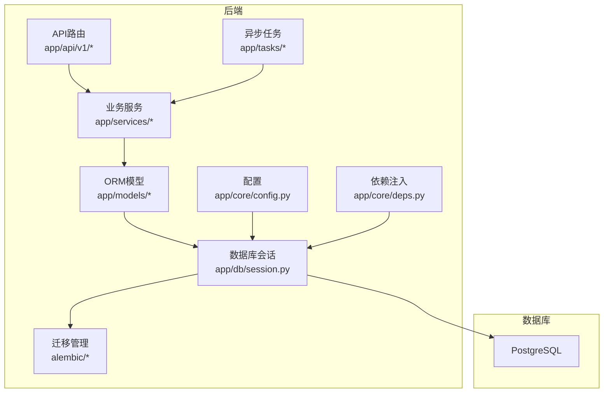
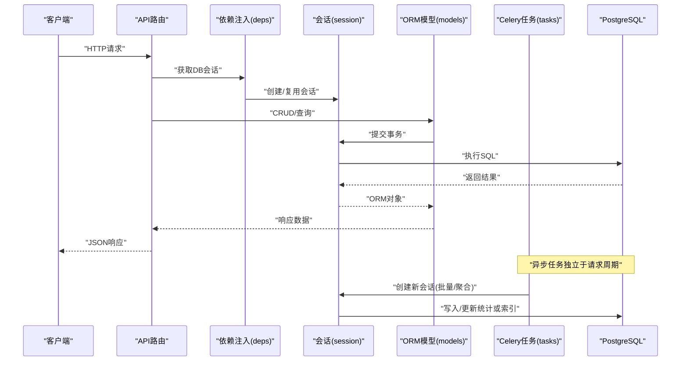
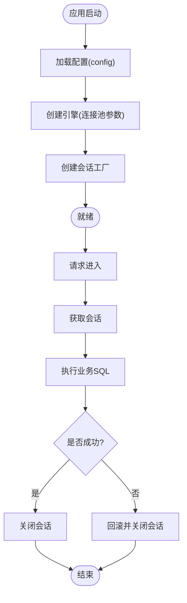
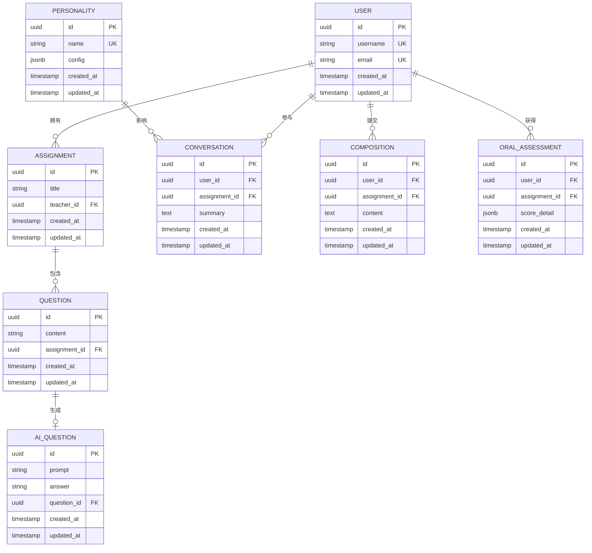
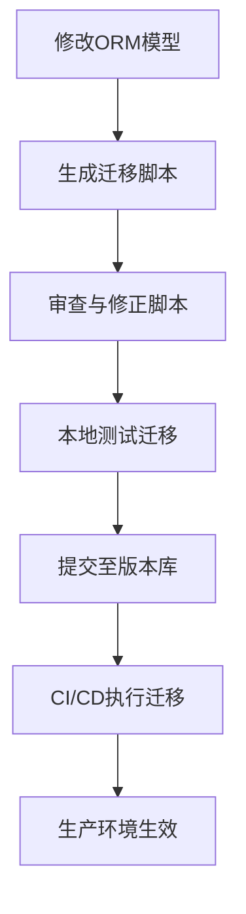
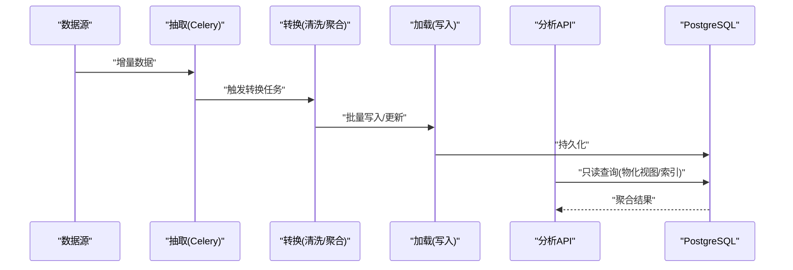
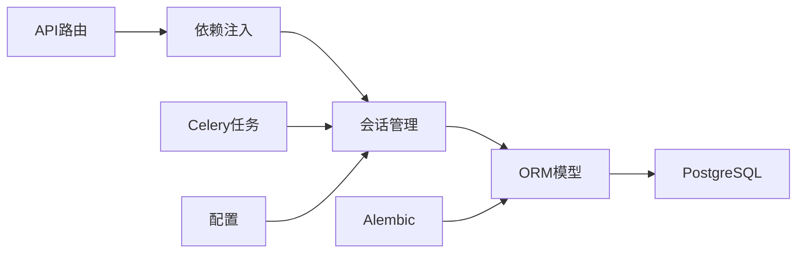

# 数据架构设计

<cite>
**本文引用的文件**   
- [backend/app/db/base.py](file://backend/app/db/base.py)
- [backend/app/db/session.py](file://backend/app/db/session.py)
- [backend/alembic.ini](file://backend/alembic.ini)
- [backend/alembic/env.py](file://backend/alembic/env.py)
- [backend/alembic/script.py.mako](file://backend/alembic/script.py.mako)
- [backend/app/models/__init__.py](file://backend/app/models/__init__.py)
- [backend/app/models/user.py](file://backend/app/models/user.py)
- [backend/app/models/question.py](file://backend/app/models/question.py)
- [backend/app/models/ai_question.py](file://backend/app/models/ai_question.py)
- [backend/app/models/conversation.py](file://backend/app/models/conversation.py)
- [backend/app/models/composition.py](file://backend/app/models/composition.py)
- [backend/app/models/oral_assessment.py](file://backend/app/models/oral_assessment.py)
- [backend/app/models/personality.py](file://backend/app/models/personality.py)
- [backend/app/models/assignment.py](file://backend/app/models/assignment.py)
- [backend/app/core/config.py](file://backend/app/core/config.py)
- [backend/app/core/deps.py](file://backend/app/core/deps.py)
- [backend/app/services/analytics_aggregator.py](file://backend/app/services/analytics_aggregator.py)
- [backend/app/tasks/celery_app.py](file://backend/app/tasks/celery_app.py)
- [backend/app/tasks/analysis_tasks.py](file://backend/app/tasks/analysis_tasks.py)
- [backend/app/tasks/vector_tasks.py](file://backend/app/tasks/vector_tasks.py)
</cite>

## 目录
1. [简介](#简介)
2. [项目结构](#项目结构)
3. [核心组件](#核心组件)
4. [架构总览](#架构总览)
5. [详细组件分析](#详细组件分析)
6. [依赖关系分析](#依赖关系分析)
7. [性能考虑](#性能考虑)
8. [故障排查指南](#故障排查指南)
9. [结论](#结论)
10. [附录](#附录)

## 简介
本文件面向AI助教系统的数据架构，聚焦PostgreSQL数据库设计与SQLAlchemy ORM建模、Alembic迁移与版本控制、数据访问模式与连接池配置、查询优化策略、备份与灾难恢复、监控与可观测性、一致性/事务/并发控制，以及ETL与数据分析接口。文档以仓库中的后端代码为依据，提供从模型到迁移、从服务到任务的全链路说明，并辅以架构图与流程图帮助理解。

## 项目结构
后端采用分层组织：
- 数据层：db（会话与基类）、models（ORM实体）、alembic（迁移）
- 业务层：services（聚合与分析等）、tasks（Celery异步任务）
- 接入层：api（REST路由）、core（配置、依赖注入、安全）
- 前端：页面与服务调用封装（与本数据架构文档关联度较低）

图表来源
- [backend/app/db/session.py](file://backend/app/db/session.py)
- [backend/app/core/config.py](file://backend/app/core/config.py)
- [backend/app/core/deps.py](file://backend/app/core/deps.py)
- [backend/alembic/env.py](file://backend/alembic/env.py)

章节来源
- [backend/app/db/base.py](file://backend/app/db/base.py)
- [backend/app/db/session.py](file://backend/app/db/session.py)
- [backend/app/core/config.py](file://backend/app/core/config.py)
- [backend/app/core/deps.py](file://backend/app/core/deps.py)
- [backend/alembic/env.py](file://backend/alembic/env.py)

## 核心组件
- 数据库会话与连接池：集中管理引擎与会话生命周期，暴露统一的DB会话获取方式，供API与服务使用。
- ORM模型：基于SQLAlchemy声明式模型，定义用户、题目、AI题目、对话、作文、口语评估、人格配置、作业等实体及关系。
- 迁移管理：Alembic驱动，统一读取配置与模型元数据，生成与执行迁移脚本。
- 配置与安全：集中加载数据库URL、连接池参数、加密密钥等；为鉴权与敏感信息提供支撑。
- 依赖注入：在FastAPI中通过依赖项提供DB会话，确保请求级隔离与资源释放。
- 分析与任务：聚合服务与Celery任务负责离线计算、指标汇总与向量索引构建等。

章节来源
- [backend/app/db/base.py](file://backend/app/db/base.py)
- [backend/app/db/session.py](file://backend/app/db/session.py)
- [backend/app/models/__init__.py](file://backend/app/models/__init__.py)
- [backend/app/core/config.py](file://backend/app/core/config.py)
- [backend/app/core/deps.py](file://backend/app/core/deps.py)
- [backend/alembic/env.py](file://backend/alembic/env.py)

## 架构总览
下图展示从API到数据库的完整数据流，包括会话创建、事务边界、迁移入口与异步任务对数据的读写。

图表来源
- [backend/app/core/deps.py](file://backend/app/core/deps.py)
- [backend/app/db/session.py](file://backend/app/db/session.py)
- [backend/app/models/__init__.py](file://backend/app/models/__init__.py)
- [backend/app/tasks/celery_app.py](file://backend/app/tasks/celery_app.py)

## 详细组件分析

### 数据库与连接池
- 连接来源：数据库URL由配置模块集中提供，支持不同环境切换。
- 引擎与会话：通过SQLAlchemy创建引擎与会话工厂，设置连接池大小、超时、回收策略等参数，避免连接泄漏。
- 会话生命周期：在请求开始时创建，结束时关闭；异常路径确保回滚与清理。
- 多租户/分库扩展：当前实现为单库会话，如需多库可在会话工厂中按租户选择引擎。

图表来源
- [backend/app/core/config.py](file://backend/app/core/config.py)
- [backend/app/db/session.py](file://backend/app/db/session.py)

章节来源
- [backend/app/core/config.py](file://backend/app/core/config.py)
- [backend/app/db/session.py](file://backend/app/db/session.py)

### ORM模型与实体关系
- 基础模型：所有实体继承自公共基类，包含通用字段（如主键、时间戳等）。
- 核心实体：
  - 用户(user)
  - 题目(question)
  - AI题目(ai_question)
  - 对话(conversation)
  - 作文(composition)
  - 口语评估(oral_assessment)
  - 人格配置(personality)
  - 作业(assignment)
- 关系与约束：通过外键与relationship建立一对多、多对一等关系；在需要时添加唯一约束与检查约束以保证数据完整性。

图表来源
- [backend/app/models/user.py](file://backend/app/models/user.py)
- [backend/app/models/assignment.py](file://backend/app/models/assignment.py)
- [backend/app/models/question.py](file://backend/app/models/question.py)
- [backend/app/models/ai_question.py](file://backend/app/models/ai_question.py)
- [backend/app/models/conversation.py](file://backend/app/models/conversation.py)
- [backend/app/models/composition.py](file://backend/app/models/composition.py)
- [backend/app/models/oral_assessment.py](file://backend/app/models/oral_assessment.py)
- [backend/app/models/personality.py](file://backend/app/models/personality.py)

章节来源
- [backend/app/models/__init__.py](file://backend/app/models/__init__.py)
- [backend/app/models/user.py](file://backend/app/models/user.py)
- [backend/app/models/assignment.py](file://backend/app/models/assignment.py)
- [backend/app/models/question.py](file://backend/app/models/question.py)
- [backend/app/models/ai_question.py](file://backend/app/models/ai_question.py)
- [backend/app/models/conversation.py](file://backend/app/models/conversation.py)
- [backend/app/models/composition.py](file://backend/app/models/composition.py)
- [backend/app/models/oral_assessment.py](file://backend/app/models/oral_assessment.py)
- [backend/app/models/personality.py](file://backend/app/models/personality.py)

### 迁移管理与版本控制（Alembic）
- 配置文件：alembic.ini指定数据库URL与脚本目录。
- 环境初始化：env.py加载配置与模型元数据，提供up/down上下文。
- 模板：script.py.mako用于生成迁移脚本骨架。
- 工作流：
  - 修改模型后生成迁移脚本
  - 审查并手动调整脚本（必要时）
  - 在目标环境执行升级/降级
  - 将迁移脚本纳入版本控制

图表来源
- [backend/alembic.ini](file://backend/alembic.ini)
- [backend/alembic/env.py](file://backend/alembic/env.py)
- [backend/alembic/script.py.mako](file://backend/alembic/script.py.mako)

章节来源
- [backend/alembic.ini](file://backend/alembic.ini)
- [backend/alembic/env.py](file://backend/alembic/env.py)
- [backend/alembic/script.py.mako](file://backend/alembic/script.py.mako)

### 数据访问模式与查询优化
- 访问模式：
  - 请求内事务：每个请求开启事务，失败回滚，成功提交。
  - 只读副本：报表与导出可通过只读连接提升吞吐。
  - 批量操作：大对象写入使用bulk insert/update减少往返。
- 查询优化：
  - 索引策略：对高频过滤/排序/连接列建立B-tree索引；复合索引覆盖常见查询谓词组合。
  - 分页与投影：仅选取必要列，使用游标或键集分页避免深分页。
  - 物化视图：对复杂聚合结果定期刷新，降低在线查询压力。
  - JSONB索引：对评分详情等半结构化字段建立GIN索引。
- 连接池配置建议：
  - pool_size/max_overflow根据QPS与延迟目标调优
  - 合理设置idle_timeout与recycle，避免长连接失效
  - 启用statement_timeout防止慢查询占用连接

章节来源
- [backend/app/db/session.py](file://backend/app/db/session.py)
- [backend/app/core/config.py](file://backend/app/core/config.py)

### 事务处理、一致性与并发控制
- 事务边界：API层统一包裹事务，保证原子性；长耗时任务拆分为子事务。
- 隔离级别：默认读已提交；热点行更新可使用行级锁或乐观锁（版本号字段）。
- 幂等性：对外部写入接口增加幂等键，避免重复提交导致数据不一致。
- 分布式场景：跨服务写操作采用Saga或补偿事务，结合消息队列保证最终一致。

章节来源
- [backend/app/core/deps.py](file://backend/app/core/deps.py)
- [backend/app/db/session.py](file://backend/app/db/session.py)

### 数据清洗、ETL与数据分析接口
- 数据清洗：
  - 导入前校验：格式、范围、必填项校验
  - 标准化：文本归一化、编码统一、去重
  - 质量规则：空值填充、异常值检测与告警
- ETL流程：
  - 抽取：从源系统或日志拉取增量数据
  - 转换：清洗、映射、聚合
  - 加载：批量写入目标表或物化视图
- 分析接口：
  - 聚合服务：analytics_aggregator负责指标汇总
  - Celery任务：analysis_tasks与vector_tasks承载离线计算与向量索引构建
  - 查询接口：面向报表与大屏的只读API，走只读连接

图表来源
- [backend/app/services/analytics_aggregator.py](file://backend/app/services/analytics_aggregator.py)
- [backend/app/tasks/celery_app.py](file://backend/app/tasks/celery_app.py)
- [backend/app/tasks/analysis_tasks.py](file://backend/app/tasks/analysis_tasks.py)
- [backend/app/tasks/vector_tasks.py](file://backend/app/tasks/vector_tasks.py)

章节来源
- [backend/app/services/analytics_aggregator.py](file://backend/app/services/analytics_aggregator.py)
- [backend/app/tasks/celery_app.py](file://backend/app/tasks/celery_app.py)
- [backend/app/tasks/analysis_tasks.py](file://backend/app/tasks/analysis_tasks.py)
- [backend/app/tasks/vector_tasks.py](file://backend/app/tasks/vector_tasks.py)

### 备份策略、灾难恢复与监控
- 备份策略：
  - 全量+增量：每日全量，每小时增量，保留N天
  - 异地容灾：跨区域复制与快照归档
  - 明文脱敏：导出前对敏感字段脱敏
- 灾难恢复：
  - RPO/RTO目标明确，演练恢复流程
  - 关键表双写或CDC同步，缩短恢复时间
- 监控与可观测性：
  - 连接池指标：活跃连接、等待队列、超时次数
  - 慢查询日志：阈值告警与自动采样
  - 迁移状态：记录每次迁移执行结果与耗时

章节来源
- [backend/app/core/config.py](file://backend/app/core/config.py)
- [backend/app/db/session.py](file://backend/app/db/session.py)

## 依赖关系分析
- 低耦合高内聚：API不直接操作数据库，通过依赖注入获取会话；服务层封装业务逻辑；模型仅关注数据映射。
- 外部依赖：
  - SQLAlchemy与Alembic：ORM与迁移
  - Celery：异步任务调度
  - PostgreSQL：关系型存储

图表来源
- [backend/app/core/deps.py](file://backend/app/core/deps.py)
- [backend/app/db/session.py](file://backend/app/db/session.py)
- [backend/app/models/__init__.py](file://backend/app/models/__init__.py)
- [backend/alembic/env.py](file://backend/alembic/env.py)
- [backend/app/tasks/celery_app.py](file://backend/app/tasks/celery_app.py)

章节来源
- [backend/app/core/deps.py](file://backend/app/core/deps.py)
- [backend/app/db/session.py](file://backend/app/db/session.py)
- [backend/app/models/__init__.py](file://backend/app/models/__init__.py)
- [backend/alembic/env.py](file://backend/alembic/env.py)
- [backend/app/tasks/celery_app.py](file://backend/app/tasks/celery_app.py)

## 性能考虑
- 索引设计：优先为WHERE/JOIN/ORDER BY常用列建索引；复合索引遵循最左前缀原则；对JSONB字段使用GIN索引。
- 查询改写：避免SELECT *，使用投影；拆分复杂查询为多次简单查询；利用窗口函数替代嵌套循环。
- 连接池：根据并发与延迟目标调整pool_size与max_overflow；启用statement_timeout与idle_timeout。
- 批处理：大批量写入使用bulk操作；分片写入避免单条事务过大。
- 缓存与物化：热点数据加缓存层；复杂聚合使用物化视图定时刷新。

[本节为通用指导，无需特定文件引用]

## 故障排查指南
- 连接问题：检查数据库URL、网络连通、认证凭据；查看连接池耗尽与超时日志。
- 迁移失败：核对alembic版本与模型元数据一致性；回滚到上一版本并修复脚本。
- 慢查询：定位慢查询日志，分析执行计划，补充索引或改写SQL。
- 事务冲突：观察死锁与锁等待，优化更新顺序或引入重试与退避。
- 任务堆积：检查Celery消费者数量与队列长度，扩容worker并优化任务粒度。

章节来源
- [backend/app/core/config.py](file://backend/app/core/config.py)
- [backend/app/db/session.py](file://backend/app/db/session.py)
- [backend/alembic/env.py](file://backend/alembic/env.py)
- [backend/app/tasks/celery_app.py](file://backend/app/tasks/celery_app.py)

## 结论
本数据架构以PostgreSQL为核心，结合SQLAlchemy与Alembic形成规范的建模与演进流程；通过会话与依赖注入保障一致的访问模式与资源管理；借助Celery与聚合服务实现离线计算与指标沉淀。配合合理的索引、连接池与监控策略，可满足AI助教系统在交互与学习分析方面的性能与可靠性需求。

## 附录
- 术语
  - RPO：恢复点目标
  - RTO：恢复时间目标
  - CDC：变更数据捕获
- 参考实践
  - 迁移灰度发布与回滚策略
  - 只读副本与读写分离
  - 数据质量门禁与告警

[本节为概念性内容，无需特定文件引用]