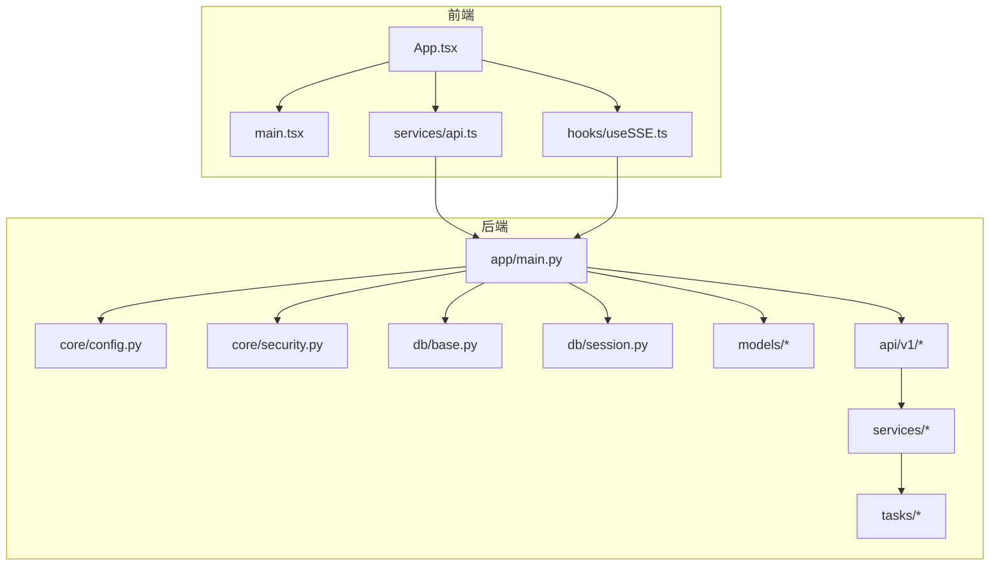
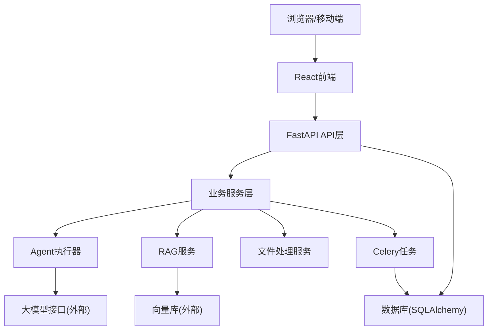
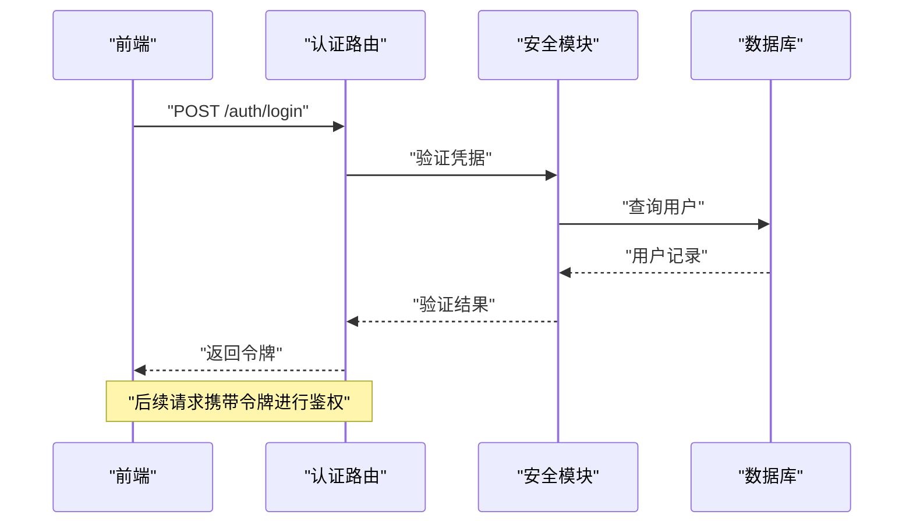
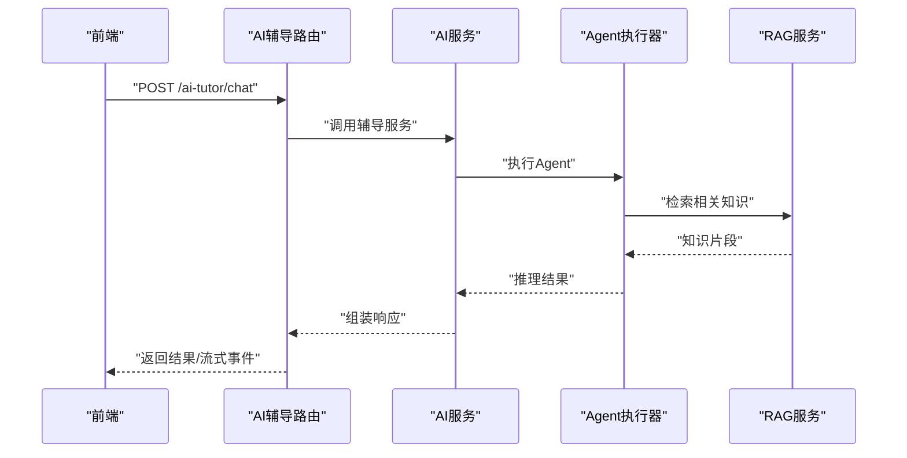
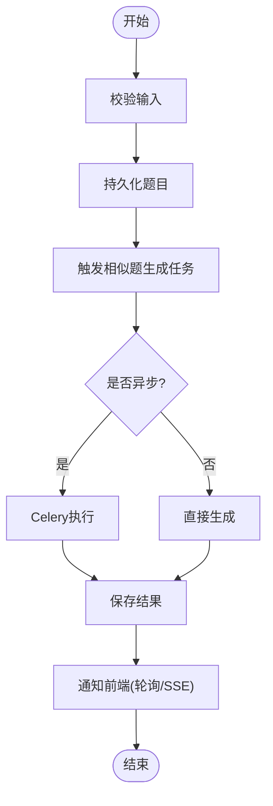
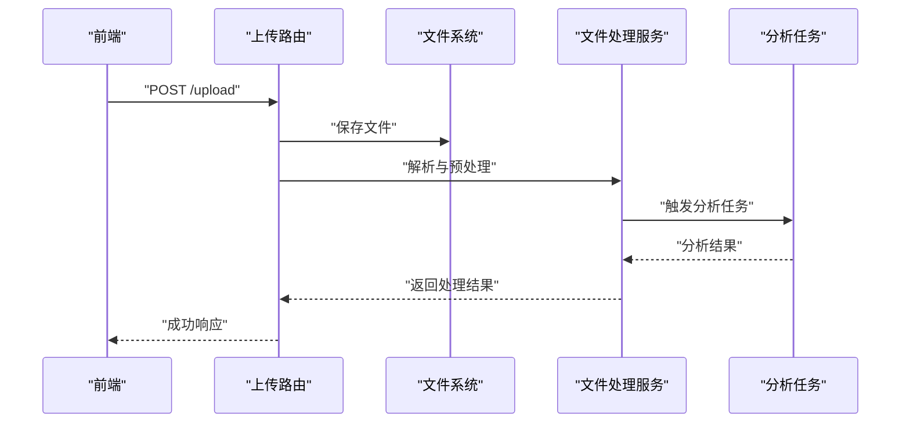
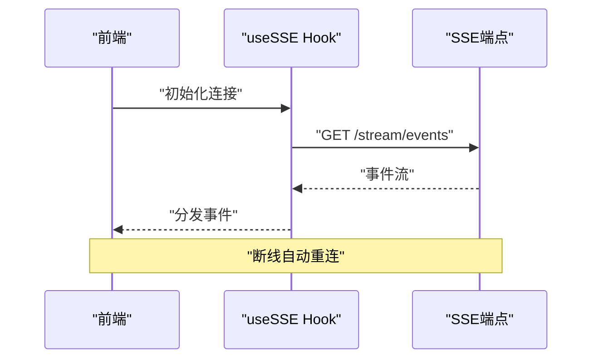
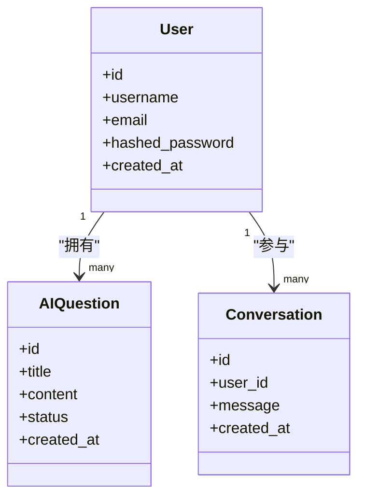
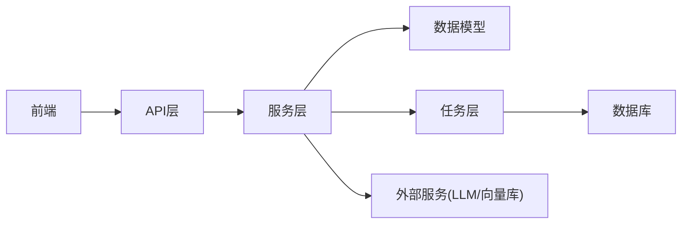

# 系统架构

<cite>
**本文引用的文件**   
- [backend/app/main.py](file://backend/app/main.py)
- [backend/app/core/config.py](file://backend/app/core/config.py)
- [backend/app/core/security.py](file://backend/app/core/security.py)
- [backend/app/db/base.py](file://backend/app/db/base.py)
- [backend/app/db/session.py](file://backend/app/db/session.py)
- [backend/app/models/user.py](file://backend/app/models/user.py)
- [backend/app/models/ai_question.py](file://backend/app/models/ai_question.py)
- [backend/app/models/conversation.py](file://backend/app/models/conversation.py)
- [backend/app/schemas/user.py](file://backend/app/schemas/user.py)
- [backend/app/api/v1/auth.py](file://backend/app/api/v1/auth.py)
- [backend/app/api/v1/ai_tutor.py](file://backend/app/api/v1/ai_tutor.py)
- [backend/app/api/v1/ai_questions.py](file://backend/app/api/v1/ai_questions.py)
- [backend/app/services/agent/agent_executor.py](file://backend/app/services/agent/agent_executor.py)
- [backend/app/services/rag_service.py](file://backend/app/services/rag_service.py)
- [backend/app/services/file_upload.py](file://backend/app/services/file_upload.py)
- [backend/app/tasks/celery_app.py](file://backend/app/tasks/celery_app.py)
- [backend/app/tasks/analysis_tasks.py](file://backend/app/tasks/analysis_tasks.py)
- [backend/app/tasks/vector_tasks.py](file://backend/app/tasks/vector_tasks.py)
- [frontend/src/App.tsx](file://frontend/src/App.tsx)
- [frontend/src/main.tsx](file://frontend/src/main.tsx)
- [frontend/src/hooks/useSSE.ts](file://frontend/src/hooks/useSSE.ts)
- [frontend/src/services/api.ts](file://frontend/src/services/api.ts)
</cite>

## 目录
1. [简介](#简介)
2. [项目结构](#项目结构)
3. [核心组件](#核心组件)
4. [架构总览](#架构总览)
5. [详细组件分析](#详细组件分析)
6. [依赖关系分析](#依赖关系分析)
7. [性能考量](#性能考量)
8. [故障排查指南](#故障排查指南)
9. [结论](#结论)
10. [附录](#附录)

## 简介
本文件为AI助教系统的全面系统架构文档。系统采用前后端分离与微服务风格的模块化设计，结合事件驱动与异步任务处理，提供AI驱动的问答、作业批改、口语评估、学习分析等能力。后端基于FastAPI构建REST API，使用SQLAlchemy进行数据访问，Celery执行异步任务，前端基于React实现交互界面，并通过SSE实现实时通信。整体架构强调可扩展性、可观测性与安全性，便于后续接入更多AI Agent与外部服务。

## 项目结构
仓库采用前后端分离的组织方式：
- 后端（backend）：按领域分层组织，包含API路由、业务服务、数据模型、数据库会话、配置与安全、异步任务等模块。
- 前端（frontend）：基于React+TypeScript，通过服务层封装HTTP请求，使用自定义Hook管理认证、上传、SSE等通用逻辑。

图表来源
- [backend/app/main.py](file://backend/app/main.py)
- [backend/app/core/config.py](file://backend/app/core/config.py)
- [backend/app/core/security.py](file://backend/app/core/security.py)
- [backend/app/db/base.py](file://backend/app/db/base.py)
- [backend/app/db/session.py](file://backend/app/db/session.py)
- [backend/app/api/v1/auth.py](file://backend/app/api/v1/auth.py)
- [backend/app/api/v1/ai_tutor.py](file://backend/app/api/v1/ai_tutor.py)
- [backend/app/api/v1/ai_questions.py](file://backend/app/api/v1/ai_questions.py)
- [backend/app/services/agent/agent_executor.py](file://backend/app/services/agent/agent_executor.py)
- [backend/app/services/rag_service.py](file://backend/app/services/rag_service.py)
- [backend/app/services/file_upload.py](file://backend/app/services/file_upload.py)
- [backend/app/tasks/celery_app.py](file://backend/app/tasks/celery_app.py)
- [backend/app/tasks/analysis_tasks.py](file://backend/app/tasks/analysis_tasks.py)
- [backend/app/tasks/vector_tasks.py](file://backend/app/tasks/vector_tasks.py)
- [frontend/src/App.tsx](file://frontend/src/App.tsx)
- [frontend/src/main.tsx](file://frontend/src/main.tsx)
- [frontend/src/services/api.ts](file://frontend/src/services/api.ts)
- [frontend/src/hooks/useSSE.ts](file://frontend/src/hooks/useSSE.ts)

章节来源
- [backend/app/main.py](file://backend/app/main.py)
- [backend/app/core/config.py](file://backend/app/core/config.py)
- [backend/app/core/security.py](file://backend/app/core/security.py)
- [backend/app/db/base.py](file://backend/app/db/base.py)
- [backend/app/db/session.py](file://backend/app/db/session.py)
- [backend/app/models/user.py](file://backend/app/models/user.py)
- [backend/app/models/ai_question.py](file://backend/app/models/ai_question.py)
- [backend/app/models/conversation.py](file://backend/app/models/conversation.py)
- [backend/app/schemas/user.py](file://backend/app/schemas/user.py)
- [backend/app/api/v1/auth.py](file://backend/app/api/v1/auth.py)
- [backend/app/api/v1/ai_tutor.py](file://backend/app/api/v1/ai_tutor.py)
- [backend/app/api/v1/ai_questions.py](file://backend/app/api/v1/ai_questions.py)
- [backend/app/services/agent/agent_executor.py](file://backend/app/services/agent/agent_executor.py)
- [backend/app/services/rag_service.py](file://backend/app/services/rag_service.py)
- [backend/app/services/file_upload.py](file://backend/app/services/file_upload.py)
- [backend/app/tasks/celery_app.py](file://backend/app/tasks/celery_app.py)
- [backend/app/tasks/analysis_tasks.py](file://backend/app/tasks/analysis_tasks.py)
- [backend/app/tasks/vector_tasks.py](file://backend/app/tasks/vector_tasks.py)
- [frontend/src/App.tsx](file://frontend/src/App.tsx)
- [frontend/src/main.tsx](file://frontend/src/main.tsx)
- [frontend/src/services/api.ts](file://frontend/src/services/api.ts)
- [frontend/src/hooks/useSSE.ts](file://frontend/src/hooks/useSSE.ts)

## 核心组件
- 表现层（React前端）
  - 应用入口与路由组织在应用主文件中，页面与服务层解耦，通过统一API客户端发起请求。
  - 提供认证、上传、SSE等通用Hook，降低页面复杂度并提升复用性。
- API网关层（FastAPI路由）
  - 路由按领域划分，如认证、AI辅导、题目管理等，负责参数校验、鉴权、调用服务层。
- 业务逻辑层（服务模块）
  - 封装领域逻辑，包括Agent执行器、RAG检索增强生成、文件上传处理、口语服务等。
- 数据访问层（SQLAlchemy模型）
  - 定义用户、AI题目、对话等实体，配合数据库会话管理事务与连接。
- AI处理层（Agent执行器）
  - 将自然语言指令转换为工具调用与LLM交互流程，支持多步骤推理与结果聚合。
- 异步任务层（Celery）
  - 将耗时操作（分析、向量化、批量处理）下沉到后台任务队列，提高响应性。
- 实时通信（SSE）
  - 服务端流式推送进度或增量结果，前端通过专用Hook建立与维护连接。

章节来源
- [frontend/src/App.tsx](file://frontend/src/App.tsx)
- [frontend/src/main.tsx](file://frontend/src/main.tsx)
- [frontend/src/services/api.ts](file://frontend/src/services/api.ts)
- [frontend/src/hooks/useSSE.ts](file://frontend/src/hooks/useSSE.ts)
- [backend/app/api/v1/auth.py](file://backend/app/api/v1/auth.py)
- [backend/app/api/v1/ai_tutor.py](file://backend/app/api/v1/ai_tutor.py)
- [backend/app/api/v1/ai_questions.py](file://backend/app/api/v1/ai_questions.py)
- [backend/app/services/agent/agent_executor.py](file://backend/app/services/agent/agent_executor.py)
- [backend/app/services/rag_service.py](file://backend/app/services/rag_service.py)
- [backend/app/services/file_upload.py](file://backend/app/services/file_upload.py)
- [backend/app/tasks/celery_app.py](file://backend/app/tasks/celery_app.py)
- [backend/app/tasks/analysis_tasks.py](file://backend/app/tasks/analysis_tasks.py)
- [backend/app/tasks/vector_tasks.py](file://backend/app/tasks/vector_tasks.py)

## 架构总览
系统采用前后端分离与微服务风格的分层架构，关键职责如下：
- 前端：渲染UI、管理状态、发起HTTP/SSE请求、展示实时结果。
- API层：统一入口、鉴权、参数校验、编排服务调用、返回标准化响应。
- 服务层：领域逻辑、AI Agent编排、RAG检索、文件处理、分析聚合。
- 数据层：ORM模型、会话管理、迁移脚本。
- 任务层：Celery Worker执行耗时任务，持久化中间结果。
- 安全与配置：集中配置、密码哈希、令牌签发与校验。

图表来源
- [backend/app/main.py](file://backend/app/main.py)
- [backend/app/api/v1/auth.py](file://backend/app/api/v1/auth.py)
- [backend/app/api/v1/ai_tutor.py](file://backend/app/api/v1/ai_tutor.py)
- [backend/app/services/agent/agent_executor.py](file://backend/app/services/agent/agent_executor.py)
- [backend/app/services/rag_service.py](file://backend/app/services/rag_service.py)
- [backend/app/services/file_upload.py](file://backend/app/services/file_upload.py)
- [backend/app/tasks/celery_app.py](file://backend/app/tasks/celery_app.py)
- [backend/app/db/session.py](file://backend/app/db/session.py)

## 详细组件分析

### 认证与授权流程
- 前端通过统一API客户端发送登录请求，携带用户名与密码。
- 后端路由接收请求，校验输入，调用安全模块验证凭据并签发令牌。
- 前端保存令牌并在后续请求中附加至头部；受保护路由通过依赖注入校验令牌。

图表来源
- [backend/app/api/v1/auth.py](file://backend/app/api/v1/auth.py)
- [backend/app/core/security.py](file://backend/app/core/security.py)
- [backend/app/models/user.py](file://backend/app/models/user.py)
- [backend/app/schemas/user.py](file://backend/app/schemas/user.py)
- [frontend/src/services/api.ts](file://frontend/src/services/api.ts)

章节来源
- [backend/app/api/v1/auth.py](file://backend/app/api/v1/auth.py)
- [backend/app/core/security.py](file://backend/app/core/security.py)
- [backend/app/models/user.py](file://backend/app/models/user.py)
- [backend/app/schemas/user.py](file://backend/app/schemas/user.py)
- [frontend/src/services/api.ts](file://frontend/src/services/api.ts)

### AI辅导与Agent执行
- 前端调用AI辅导接口，传入问题与上下文。
- 路由层校验参数并调用服务层，服务层编排Agent执行器。
- Agent执行器根据提示词与工具集进行推理，必要时调用RAG服务获取知识片段。
- 结果以流式或一次性返回，前端通过SSE或普通响应展示。

图表来源
- [backend/app/api/v1/ai_tutor.py](file://backend/app/api/v1/ai_tutor.py)
- [backend/app/services/agent/agent_executor.py](file://backend/app/services/agent/agent_executor.py)
- [backend/app/services/rag_service.py](file://backend/app/services/rag_service.py)
- [frontend/src/hooks/useSSE.ts](file://frontend/src/hooks/useSSE.ts)

章节来源
- [backend/app/api/v1/ai_tutor.py](file://backend/app/api/v1/ai_tutor.py)
- [backend/app/services/agent/agent_executor.py](file://backend/app/services/agent/agent_executor.py)
- [backend/app/services/rag_service.py](file://backend/app/services/rag_service.py)
- [frontend/src/hooks/useSSE.ts](file://frontend/src/hooks/useSSE.ts)

### 题目管理与相似题生成
- 前端提交题目内容，路由层校验并持久化到数据库。
- 服务层触发相似题生成任务，可能通过Celery异步执行，避免阻塞请求。
- 生成完成后，前端可通过轮询或SSE获取结果。

图表来源
- [backend/app/api/v1/ai_questions.py](file://backend/app/api/v1/ai_questions.py)
- [backend/app/models/ai_question.py](file://backend/app/models/ai_question.py)
- [backend/app/tasks/analysis_tasks.py](file://backend/app/tasks/analysis_tasks.py)
- [backend/app/tasks/vector_tasks.py](file://backend/app/tasks/vector_tasks.py)

章节来源
- [backend/app/api/v1/ai_questions.py](file://backend/app/api/v1/ai_questions.py)
- [backend/app/models/ai_question.py](file://backend/app/models/ai_question.py)
- [backend/app/tasks/analysis_tasks.py](file://backend/app/tasks/analysis_tasks.py)
- [backend/app/tasks/vector_tasks.py](file://backend/app/tasks/vector_tasks.py)

### 文件上传与处理流程
- 前端选择文件后调用上传接口，后端路由接收文件并保存到存储。
- 服务层对文件进行解析、提取文本或结构化信息，必要时触发分析任务。
- 结果写入数据库或缓存，供后续AI服务使用。

图表来源
- [backend/app/services/file_upload.py](file://backend/app/services/file_upload.py)
- [backend/app/tasks/analysis_tasks.py](file://backend/app/tasks/analysis_tasks.py)

章节来源
- [backend/app/services/file_upload.py](file://backend/app/services/file_upload.py)
- [backend/app/tasks/analysis_tasks.py](file://backend/app/tasks/analysis_tasks.py)

### 实时通信（SSE）
- 前端通过专用Hook建立SSE连接，订阅事件流。
- 后端在服务层或路由层产生事件并推送给客户端，用于进度更新或增量结果。
- 连接断开时自动重连，保证用户体验。

图表来源
- [frontend/src/hooks/useSSE.ts](file://frontend/src/hooks/useSSE.ts)

章节来源
- [frontend/src/hooks/useSSE.ts](file://frontend/src/hooks/useSSE.ts)

### 数据模型与会话管理
- 数据模型定义用户、AI题目、对话等实体及其关系。
- 会话管理提供统一的数据库连接与事务控制，确保一致性。
- 迁移脚本维护数据库版本演进。

图表来源
- [backend/app/models/user.py](file://backend/app/models/user.py)
- [backend/app/models/ai_question.py](file://backend/app/models/ai_question.py)
- [backend/app/models/conversation.py](file://backend/app/models/conversation.py)
- [backend/app/db/base.py](file://backend/app/db/base.py)
- [backend/app/db/session.py](file://backend/app/db/session.py)

章节来源
- [backend/app/models/user.py](file://backend/app/models/user.py)
- [backend/app/models/ai_question.py](file://backend/app/models/ai_question.py)
- [backend/app/models/conversation.py](file://backend/app/models/conversation.py)
- [backend/app/db/base.py](file://backend/app/db/base.py)
- [backend/app/db/session.py](file://backend/app/db/session.py)

### 配置与安全
- 配置模块集中管理环境变量与默认值，便于部署与环境切换。
- 安全模块提供密码哈希、令牌签发与校验、权限检查等能力。
- 所有敏感配置通过环境变量注入，避免硬编码。

章节来源
- [backend/app/core/config.py](file://backend/app/core/config.py)
- [backend/app/core/security.py](file://backend/app/core/security.py)

## 依赖关系分析
- 前端依赖后端API与SSE端点，通过统一客户端封装请求与错误处理。
- 后端API依赖服务层，服务层依赖数据模型与任务队列。
- 任务层独立于Web进程，通过消息队列与Worker执行耗时任务。
- 外部依赖包括大模型接口、向量库、对象存储等。

图表来源
- [backend/app/main.py](file://backend/app/main.py)
- [backend/app/api/v1/auth.py](file://backend/app/api/v1/auth.py)
- [backend/app/api/v1/ai_tutor.py](file://backend/app/api/v1/ai_tutor.py)
- [backend/app/services/agent/agent_executor.py](file://backend/app/services/agent/agent_executor.py)
- [backend/app/tasks/celery_app.py](file://backend/app/tasks/celery_app.py)

章节来源
- [backend/app/main.py](file://backend/app/main.py)
- [backend/app/api/v1/auth.py](file://backend/app/api/v1/auth.py)
- [backend/app/api/v1/ai_tutor.py](file://backend/app/api/v1/ai_tutor.py)
- [backend/app/services/agent/agent_executor.py](file://backend/app/services/agent/agent_executor.py)
- [backend/app/tasks/celery_app.py](file://backend/app/tasks/celery_app.py)

## 性能考量
- 异步任务：将耗时操作（分析、向量化、批量处理）放入Celery队列，避免阻塞HTTP请求。
- 流式输出：对长耗时AI推理使用SSE逐步推送结果，提升用户体验。
- 数据库优化：合理使用索引、分页与只读副本，减少锁竞争。
- 缓存策略：热点数据（如配置、字典表）可引入内存缓存，降低数据库压力。
- 资源隔离：将AI推理与常规业务拆分到不同实例或容器，防止相互影响。

[本节为通用指导，不直接分析具体文件]

## 故障排查指南
- 认证失败：检查令牌签发与校验逻辑、用户凭据是否正确、环境变量配置是否一致。
- SSE连接中断：确认服务端事件源是否正常、网络代理是否允许流式传输、前端重连逻辑是否生效。
- 任务堆积：监控Celery队列长度与Worker健康状态，调整并发度与重试策略。
- 文件上传失败：检查存储路径权限、文件大小限制、MIME类型校验。
- 数据库异常：查看连接池配置、慢查询日志、迁移脚本版本一致性。

章节来源
- [backend/app/core/security.py](file://backend/app/core/security.py)
- [frontend/src/hooks/useSSE.ts](file://frontend/src/hooks/useSSE.ts)
- [backend/app/tasks/celery_app.py](file://backend/app/tasks/celery_app.py)
- [backend/app/services/file_upload.py](file://backend/app/services/file_upload.py)
- [backend/app/db/session.py](file://backend/app/db/session.py)

## 结论
本架构通过前后端分离、微服务风格分层、事件驱动与异步任务处理，实现了高内聚低耦合的AI助教系统。系统在安全性、扩展性与可观测性方面具备良好基础，适合持续迭代与横向扩展。建议在生产环境完善监控告警、限流熔断、灰度发布与容量规划，进一步提升稳定性与可用性。

[本节为总结性内容，不直接分析具体文件]

## 附录
- 扩展点
  - 新增AI Agent：在Agent执行器中注册新工具与提示词模板，服务层按需编排。
  - 新增数据源：在RAG服务中接入新的知识库或向量库，保持接口契约不变。
  - 新增任务类型：在任务模块中定义新任务，并在服务层触发。
- 集成模式
  - 外部LLM：通过HTTP/gRPC调用，增加重试与超时控制。
  - 向量库：提供统一检索接口，屏蔽底层差异。
  - 对象存储：抽象上传与下载接口，支持多后端。

[本节为概念性内容，不直接分析具体文件]