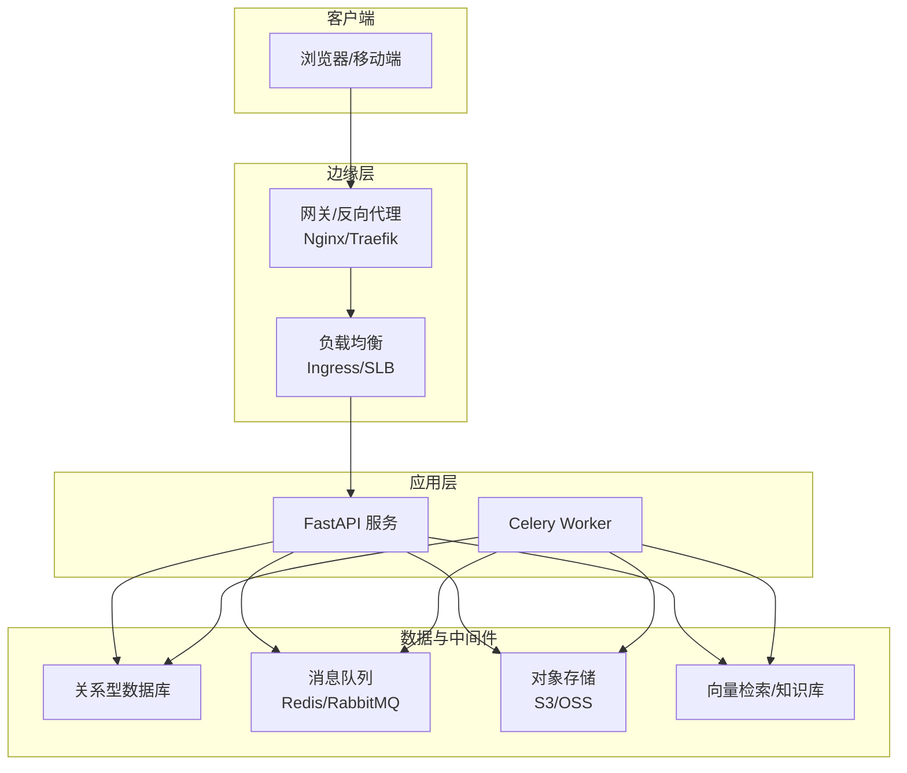
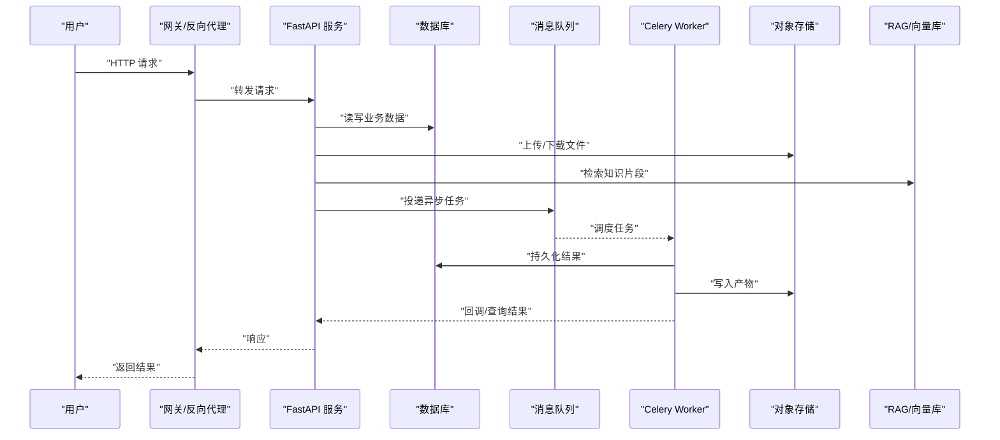

# 部署架构设计

<cite>
**本文引用的文件**   
- [backend/app/main.py](file://backend/app/main.py)
- [backend/app/core/config.py](file://backend/app/core/config.py)
- [backend/app/core/deps.py](file://backend/app/core/deps.py)
- [backend/app/db/session.py](file://backend/app/db/session.py)
- [backend/requirements.txt](file://backend/requirements.txt)
- [backend/alembic.ini](file://backend/alembic.ini)
- [backend/alembic/env.py](file://backend/alembic/env.py)
- [backend/app/tasks/celery_app.py](file://backend/app/tasks/celery_app.py)
- [backend/app/services/file_upload.py](file://backend/app/services/file_upload.py)
- [backend/app/services/pdf_renderer.py](file://backend/app/services/pdf_renderer.py)
- [backend/app/services/rag_service.py](file://backend/app/services/rag_service.py)
- [frontend/package.json](file://frontend/package.json)
- [frontend/vite.config.ts](file://frontend/vite.config.ts)
</cite>

## 目录
1. [简介](#简介)
2. [项目结构](#项目结构)
3. [核心组件](#核心组件)
4. [架构总览](#架构总览)
5. [详细组件分析](#详细组件分析)
6. [依赖关系分析](#依赖关系分析)
7. [性能与容量规划](#性能与容量规划)
8. [CI/CD 流水线与发布策略](#cicd-流水线与发布策略)
9. [监控、日志与追踪](#监控日志与追踪)
10. [故障转移与灾备](#故障转移与灾备)
11. [结论](#结论)
12. [附录：容器化与镜像分层建议](#附录容器化与镜像分层建议)

## 简介
本文件面向AI助教系统的生产级部署，提供从容器化构建到微服务拓扑、环境管理、CI/CD流水线、蓝绿发布、监控告警、日志聚合、性能追踪、扩容与容灾的完整指导。文档以仓库现有后端（FastAPI + Alembic + Celery）与前端（Vite + React）为基础，给出可落地的部署方案与最佳实践。

## 项目结构
系统采用前后端分离的微服务形态：
- 后端：基于 FastAPI 的 REST API，使用 Alembic 进行数据库迁移，Celery 处理异步任务；包含 AI Agent、RAG、评分、口语评测、PDF渲染等能力。
- 前端：基于 Vite 构建的 SPA，静态资源由反向代理或对象存储分发。
- 配置与环境：通过集中配置模块与环境变量注入实现多环境差异化。
- 任务队列：Celery Worker 负责耗时任务（如向量检索、分析聚合、PDF生成等）。

[本图为概念性架构图，不直接映射具体源码文件]

## 核心组件
- Web 服务入口：FastAPI 应用启动与路由挂载。
- 配置中心：统一读取环境变量与配置文件，区分开发/测试/生产。
- 数据库会话：连接池、事务与会话生命周期管理。
- 任务系统：Celery App 定义与任务注册。
- 业务服务：文件上传、PDF渲染、RAG检索、AI评分等。
- 前端构建：Vite 打包产物与静态资源托管。

章节来源
- [backend/app/main.py:1-200](file://backend/app/main.py#L1-L200)
- [backend/app/core/config.py:1-200](file://backend/app/core/config.py#L1-L200)
- [backend/app/db/session.py:1-200](file://backend/app/db/session.py#L1-L200)
- [backend/app/tasks/celery_app.py:1-200](file://backend/app/tasks/celery_app.py#L1-L200)
- [backend/app/services/file_upload.py:1-200](file://backend/app/services/file_upload.py#L1-L200)
- [backend/app/services/pdf_renderer.py:1-200](file://backend/app/services/pdf_renderer.py#L1-L200)
- [backend/app/services/rag_service.py:1-200](file://backend/app/services/rag_service.py#L1-L200)
- [frontend/package.json:1-200](file://frontend/package.json#L1-L200)
- [frontend/vite.config.ts:1-200](file://frontend/vite.config.ts#L1-L200)

## 架构总览
下图展示端到端请求路径与关键外部依赖，适用于生产部署参考。

[本图为概念性序列图，不直接映射具体源码文件]

## 详细组件分析

### 容器化与镜像构建
- 多阶段构建建议
  - 构建阶段：安装 Python 依赖、编译扩展、运行 Alembic 迁移脚本。
  - 运行阶段：仅包含运行时依赖与最小基础镜像，降低攻击面与体积。
- 镜像分层策略
  - 将不变层（基础镜像、系统依赖）与变化层（应用代码、Python 包）拆分，提升缓存命中率。
  - 将 requirements 锁定文件独立一层，减少重建范围。
- 安全加固
  - 使用非 root 用户运行容器。
  - 定期扫描镜像漏洞并更新基础镜像。
- 示例参考路径
  - 后端依赖清单：[backend/requirements.txt](file://backend/requirements.txt)
  - 前端依赖清单：[frontend/package.json](file://frontend/package.json)

章节来源
- [backend/requirements.txt:1-200](file://backend/requirements.txt#L1-L200)
- [frontend/package.json:1-200](file://frontend/package.json#L1-L200)

### 微服务部署拓扑与服务发现
- 推荐拓扑
  - Ingress/网关统一入口，按路径或域名路由至不同服务。
  - 服务间通过内部网络通信，避免暴露端口。
  - 使用 K8s Service 或云厂商 SLB 做服务发现与负载均衡。
- 健康检查与就绪探针
  - 为每个服务暴露健康检查端点，配合编排平台自动剔除异常实例。
- 配置外置
  - 通过 ConfigMap/Secret 注入环境变量，避免硬编码。

[本节为通用部署建议，不直接映射具体源码文件]

### 负载均衡与高可用
- 水平扩展
  - 无状态服务按 CPU/内存/QPS 指标自动扩缩容。
  - 有状态组件（数据库、消息队列）采用主从/集群模式。
- 会话与状态
  - 会话外置至 Redis 或 JWT 无状态令牌。
  - 文件与模型产物存放对象存储，避免本地磁盘绑定。

[本节为通用部署建议，不直接映射具体源码文件]

### 环境管理与差异化配置
- 环境划分
  - 开发：本地调试，最小化资源，开启详细日志。
  - 测试：集成测试，模拟外部依赖，自动化用例执行。
  - 预发：与生产一致的配置与数据规模，灰度验证。
  - 生产：严格权限控制、审计与限流。
- 配置项建议
  - 数据库连接串、消息队列地址、对象存储凭据、RAG 端点、速率限制、日志级别等。
- 配置加载顺序
  - 默认配置 -> 环境覆盖 -> 运行时 Secret 注入。

章节来源
- [backend/app/core/config.py:1-200](file://backend/app/core/config.py#L1-L200)

### 数据库与迁移
- 连接与会话
  - 使用连接池与连接超时参数，确保在高并发下稳定。
- 迁移策略
  - 滚动发布时保证迁移幂等与回滚策略。
  - 在容器启动前执行迁移或在启动钩子中执行。
- 参考路径
  - 会话管理：[backend/app/db/session.py](file://backend/app/db/session.py)
  - Alembic 配置：[backend/alembic.ini](file://backend/alembic.ini)、[backend/alembic/env.py](file://backend/alembic/env.py)

章节来源
- [backend/app/db/session.py:1-200](file://backend/app/db/session.py#L1-L200)
- [backend/alembic.ini:1-200](file://backend/alembic.ini#L1-L200)
- [backend/alembic/env.py:1-200](file://backend/alembic/env.py#L1-L200)

### 任务系统与异步处理
- 任务类型
  - 向量索引构建、作业分析聚合、PDF 渲染、大文件处理等。
- 可靠性
  - 重试策略、死信队列、幂等键、去重表。
- 伸缩策略
  - 根据队列深度与延迟动态调整 Worker 副本数。
- 参考路径
  - Celery 应用：[backend/app/tasks/celery_app.py](file://backend/app/tasks/celery_app.py)

章节来源
- [backend/app/tasks/celery_app.py:1-200](file://backend/app/tasks/celery_app.py#L1-L200)

### 文件上传与对象存储
- 流程
  - 前端直传对象存储，后端仅校验签名与元数据。
  - 大文件分片上传与断点续传。
- 安全
  - 临时访问凭证、白名单、大小限制、病毒扫描。
- 参考路径
  - 上传服务：[backend/app/services/file_upload.py](file://backend/app/services/file_upload.py)

章节来源
- [backend/app/services/file_upload.py:1-200](file://backend/app/services/file_upload.py#L1-L200)

### PDF 渲染与离线处理
- 渲染引擎
  - 使用轻量渲染服务或沙箱隔离进程，防止资源耗尽。
- 输出管理
  - 产物落盘对象存储，URL 带过期时间。
- 参考路径
  - PDF 渲染服务：[backend/app/services/pdf_renderer.py](file://backend/app/services/pdf_renderer.py)

章节来源
- [backend/app/services/pdf_renderer.py:1-200](file://backend/app/services/pdf_renderer.py#L1-L200)

### RAG 检索与向量库
- 检索链路
  - 文本切分 -> 向量化 -> 相似度检索 -> 上下文组装。
- 性能优化
  - 批量写入、索引预热、缓存热点片段。
- 参考路径
  - RAG 服务：[backend/app/services/rag_service.py](file://backend/app/services/rag_service.py)

章节来源
- [backend/app/services/rag_service.py:1-200](file://backend/app/services/rag_service.py#L1-L200)

### 前端构建与静态资源分发
- 构建优化
  - 启用缓存、Tree Shaking、分包与懒加载。
- 分发策略
  - CDN 加速静态资源，设置强缓存与版本化文件名。
- 参考路径
  - 构建配置：[frontend/vite.config.ts](file://frontend/vite.config.ts)
  - 依赖清单：[frontend/package.json](file://frontend/package.json)

章节来源
- [frontend/vite.config.ts:1-200](file://frontend/vite.config.ts#L1-L200)
- [frontend/package.json:1-200](file://frontend/package.json#L1-L200)

## 依赖关系分析
- 运行时依赖
  - Python 包依赖：[backend/requirements.txt](file://backend/requirements.txt)
  - Node 依赖：[frontend/package.json](file://frontend/package.json)
- 服务耦合
  - API 对数据库、对象存储、消息队列、RAG 存在强依赖。
  - Worker 对队列、数据库、对象存储、RAG 存在强依赖。
- 潜在风险
  - 外部依赖不可用导致雪崩，需增加熔断与降级。
  - 大文件与长任务阻塞请求线程，应全部走异步通道。

章节来源
- [backend/requirements.txt:1-200](file://backend/requirements.txt#L1-L200)
- [frontend/package.json:1-200](file://frontend/package.json#L1-L200)

## 性能与容量规划
- 指标与阈值
  - P95/P99 延迟、错误率、CPU/内存利用率、队列堆积长度。
- 水平扩展
  - 无状态服务按 QPS 与延迟弹性伸缩。
  - Worker 按队列深度与任务时长伸缩。
- 缓存策略
  - 热点数据入缓存，RAG 结果短期缓存，静态资源 CDN。
- 资源预留
  - 为峰值预留 30%-50% 缓冲，避免突发流量打满。

[本节为通用性能建议，不直接映射具体源码文件]

## CI/CD 流水线与发布策略
- 流水线阶段
  - 代码检查 -> 单元测试 -> 构建镜像 -> 推送镜像 -> 部署到预发 -> 自动化测试 -> 灰度/蓝绿发布 -> 全量上线。
- 自动化测试
  - 单元/集成/端到端测试并行执行，覆盖率门禁。
- 蓝绿/金丝雀
  - 双环境并行，逐步切换流量，失败一键回滚。
- 制品管理
  - 镜像仓库与前端静态资源版本化，支持快速回滚。

[本节为通用流水线建议，不直接映射具体源码文件]

## 监控、日志与追踪
- 指标采集
  - 应用指标（QPS、延迟、错误）、系统指标（CPU/内存/IO）、业务指标（任务成功率、RAG 命中率）。
- 日志聚合
  - 结构化 JSON 日志，统一收集与检索，保留周期与脱敏策略。
- 分布式追踪
  - 请求 ID 贯穿网关、API、Worker、外部依赖，定位瓶颈。
- 告警规则
  - 错误率突增、延迟飙升、队列积压、资源水位超阈。

[本节为通用监控建议，不直接映射具体源码文件]

## 故障转移与灾备
- 多可用区部署
  - 跨 AZ 部署应用与中间件，避免单点故障。
- 数据备份
  - 数据库定时快照与增量备份，对象存储跨区域复制。
- 演练与恢复
  - 定期演练故障切换与数据恢复，验证 RTO/RPO。
- 降级与熔断
  - 非核心功能降级，外部依赖熔断与重试退避。

[本节为通用容灾建议，不直接映射具体源码文件]

## 结论
通过容器化与多阶段构建、微服务拓扑、环境隔离、CI/CD 与蓝绿发布、完善的监控与日志体系，以及健壮的扩容与灾备策略，AI 助教系统可在生产环境中获得高可用、可扩展与易维护的交付能力。

## 附录：容器化与镜像分层建议
- 后端镜像分层
  - 基础镜像层：操作系统与系统依赖。
  - 依赖层：Python 包与二进制工具。
  - 代码层：应用代码与配置模板。
  - 启动层：健康检查与入口脚本。
- 前端镜像分层
  - 构建镜像：Node 环境与依赖。
  - 运行镜像：Nginx 或轻量 HTTP 服务器与静态资源。
- 安全与合规
  - 最小权限原则、镜像签名与漏洞扫描、供应链安全。

[本节为通用容器化建议，不直接映射具体源码文件]