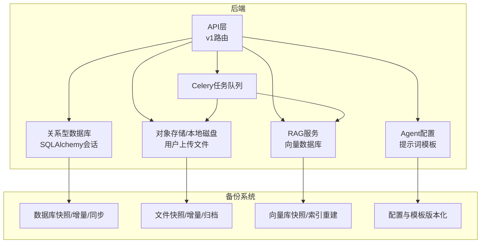
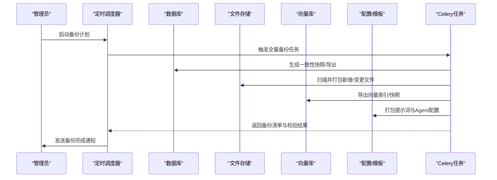
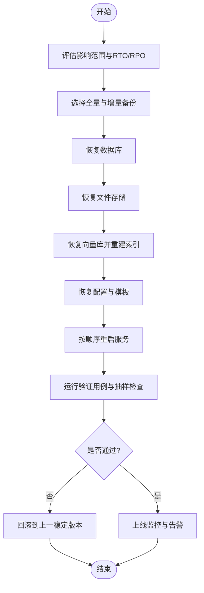
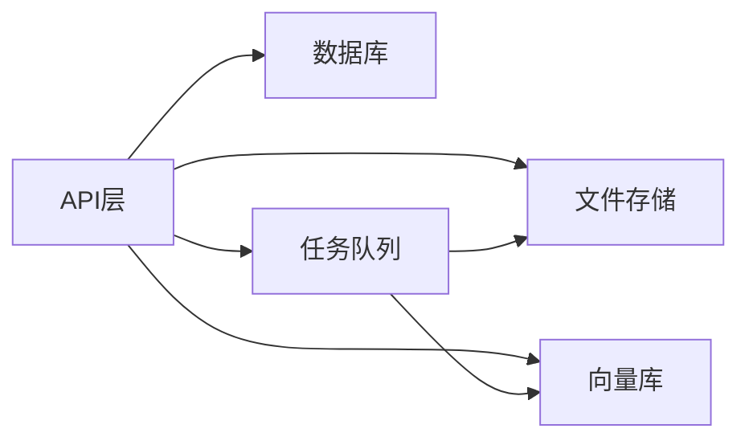

# 备份恢复

<cite>
**本文引用的文件**   
- [backend/app/core/config.py](file://backend/app/core/config.py)
- [backend/app/db/session.py](file://backend/app/db/session.py)
- [backend/app/services/file_upload.py](file://backend/app/services/file_upload.py)
- [backend/app/services/rag_service.py](file://backend/app/services/rag_service.py)
- [backend/app/services/agent/prompts.py](file://backend/app/services/agent/prompts.py)
- [backend/app/tasks/celery_app.py](file://backend/app/tasks/celery_app.py)
- [backend/app/tasks/vector_tasks.py](file://backend/app/tasks/vector_tasks.py)
- [backend/app/api/v1/ai_tutor.py](file://backend/app/api/v1/ai_tutor.py)
- [backend/app/models/user.py](file://backend/app/models/user.py)
- [backend/app/models/conversation.py](file://backend/app/models/conversation.py)
- [backend/app/schemas/user.py](file://backend/app/schemas/user.py)
- [backend/app/schemas/conversation.py](file://backend/app/schemas/conversation.py)
</cite>

## 目录
1. [简介](#简介)
2. [项目结构](#项目结构)
3. [核心组件](#核心组件)
4. [架构总览](#架构总览)
5. [详细组件分析](#详细组件分析)
6. [依赖分析](#依赖分析)
7. [性能考虑](#性能考虑)
8. [故障排查指南](#故障排查指南)
9. [结论](#结论)
10. [附录](#附录)

## 简介
本文件为AI助教系统的“备份与恢复”策略文档，覆盖数据库、对象存储（用户上传文件）、AI知识库（向量库、提示词模板、Agent配置）的备份方案与恢复流程，并提供自动化任务调度、保留策略、验证演练与灾难恢复步骤。目标是确保业务连续性、数据可追溯性与快速恢复能力。

## 项目结构
系统采用前后端分离架构：
- 后端使用FastAPI提供REST API，通过SQLAlchemy访问关系型数据库，使用Celery执行异步任务，RAG服务对接向量数据库，文件上传服务管理用户文件。
- 前端负责交互与展示，不直接参与备份逻辑。

图表来源
- [backend/app/api/v1/ai_tutor.py](file://backend/app/api/v1/ai_tutor.py)
- [backend/app/db/session.py](file://backend/app/db/session.py)
- [backend/app/services/file_upload.py](file://backend/app/services/file_upload.py)
- [backend/app/services/rag_service.py](file://backend/app/services/rag_service.py)
- [backend/app/services/agent/prompts.py](file://backend/app/services/agent/prompts.py)
- [backend/app/tasks/celery_app.py](file://backend/app/tasks/celery_app.py)

章节来源
- [backend/app/core/config.py](file://backend/app/core/config.py)
- [backend/app/db/session.py](file://backend/app/db/session.py)
- [backend/app/services/file_upload.py](file://backend/app/services/file_upload.py)
- [backend/app/services/rag_service.py](file://backend/app/services/rag_service.py)
- [backend/app/services/agent/prompts.py](file://backend/app/services/agent/prompts.py)
- [backend/app/tasks/celery_app.py](file://backend/app/tasks/celery_app.py)
- [backend/app/tasks/vector_tasks.py](file://backend/app/tasks/vector_tasks.py)
- [backend/app/api/v1/ai_tutor.py](file://backend/app/api/v1/ai_tutor.py)

## 核心组件
- 数据库连接与会话：集中管理数据库连接、事务与会话生命周期，是备份一致性的重要基础。
- 文件上传服务：处理用户上传文件的落盘或对象存储写入，需纳入文件级备份。
- RAG服务：封装向量库操作，用于知识检索；其索引与快照需要独立备份。
- Agent提示词与配置：作为关键配置资产，应纳入版本化管理与备份。
- Celery任务：承载耗时任务（如向量索引重建、批量导出），可用于触发备份与校验任务。

章节来源
- [backend/app/db/session.py](file://backend/app/db/session.py)
- [backend/app/services/file_upload.py](file://backend/app/services/file_upload.py)
- [backend/app/services/rag_service.py](file://backend/app/services/rag_service.py)
- [backend/app/services/agent/prompts.py](file://backend/app/services/agent/prompts.py)
- [backend/app/tasks/celery_app.py](file://backend/app/tasks/celery_app.py)

## 架构总览
备份恢复体系围绕四类数据域展开：
- 结构化数据：关系型数据库（用户、对话、题目等）。
- 非结构化数据：用户上传文件、生成的报告与临时文件。
- AI知识库：向量数据库快照、提示词模板、Agent配置。
- 元数据与配置：应用配置、迁移脚本、任务定义。

图表来源
- [backend/app/tasks/celery_app.py](file://backend/app/tasks/celery_app.py)
- [backend/app/tasks/vector_tasks.py](file://backend/app/tasks/vector_tasks.py)
- [backend/app/services/rag_service.py](file://backend/app/services/rag_service.py)
- [backend/app/services/file_upload.py](file://backend/app/services/file_upload.py)
- [backend/app/services/agent/prompts.py](file://backend/app/services/agent/prompts.py)

## 详细组件分析

### 数据库备份策略
- 全量备份
  - 每日一次冷备或热备快照，结合事务一致性导出。
  - 建议包含表结构、数据与索引，附带元数据（迁移版本、时间戳）。
- 增量备份
  - 基于WAL/二进制日志或时间点增量导出，按小时或分钟级频率执行。
  - 增量包需携带基线标识与序列号，便于顺序回放。
- 实时同步
  - 启用主从复制或CDC流式同步，将变更事件持续复制到备用实例。
  - 监控延迟与断点续传，异常时自动告警。

恢复要点
- 选择最近的全量备份，按序回放增量至目标时间点。
- 校验完整性后切换流量，必要时进行数据差异比对。

章节来源
- [backend/app/db/session.py](file://backend/app/db/session.py)
- [backend/app/models/user.py](file://backend/app/models/user.py)
- [backend/app/models/conversation.py](file://backend/app/models/conversation.py)
- [backend/app/schemas/user.py](file://backend/app/schemas/user.py)
- [backend/app/schemas/conversation.py](file://backend/app/schemas/conversation.py)

### 文件存储备份策略
- 备份范围
  - 用户上传文件、生成的报告、中间产物与临时文件。
- 备份方式
  - 全量：首次完整拷贝。
  - 增量：基于文件时间戳/哈希变化检测，仅备份变更。
  - 归档：对历史文件压缩归档，降低长期保留成本。
- 一致性
  - 在写放大窗口内暂停写入或使用快照，避免半写状态。
- 恢复
  - 优先恢复生产所需目录，再回填历史归档。
  - 校验文件哈希与目录树一致性。

章节来源
- [backend/app/services/file_upload.py](file://backend/app/services/file_upload.py)

### AI知识库备份策略
- 向量数据库
  - 定期导出索引快照，记录向量维度、分片信息与映射关系。
  - 支持离线重建索引，以应对索引损坏场景。
- 提示词模板与Agent配置
  - 纳入版本控制（Git），每次变更提交带标签与说明。
  - 发布前进行最小可用集回归测试。
- 恢复
  - 先恢复配置与模板，再导入向量快照，最后重建索引。

章节来源
- [backend/app/services/rag_service.py](file://backend/app/services/rag_service.py)
- [backend/app/services/agent/prompts.py](file://backend/app/services/agent/prompts.py)
- [backend/app/tasks/vector_tasks.py](file://backend/app/tasks/vector_tasks.py)

### 备份验证与演练
- 定期恢复演练
  - 每周在隔离环境执行端到端恢复，验证数据一致性与可用性。
- 数据完整性检查
  - 对数据库执行抽样查询与统计校验；对文件执行哈希校验。
- 备份有效性验证
  - 校验备份清单、大小阈值、时间戳与签名。
- 自动化报告
  - 生成备份健康度报告，推送至运维平台。

章节来源
- [backend/app/tasks/celery_app.py](file://backend/app/tasks/celery_app.py)

### 自动化备份任务与保留策略
- 任务调度
  - 使用Celery Beat或外部调度器编排全量/增量/同步任务。
- 保留策略
  - 全量：保留N天/周/月/年，按合规要求设置。
  - 增量：滚动保留M个周期，超限清理。
  - 归档：冷存储长期保留。
- 空间管理
  - 监控存储空间使用率，自动清理过期备份并告警。
- 失败重试与告警
  - 指数退避重试，失败立即告警并记录上下文。

章节来源
- [backend/app/tasks/celery_app.py](file://backend/app/tasks/celery_app.py)
- [backend/app/tasks/vector_tasks.py](file://backend/app/tasks/vector_tasks.py)

### 灾难恢复流程
- 恢复步骤
  1) 评估影响范围与RTO/RPO目标。
  2) 选择最近全量备份与增量序列。
  3) 恢复数据库至目标时间点。
  4) 恢复文件存储与临时目录。
  5) 恢复向量库快照并重建索引。
  6) 恢复配置与模板，重启服务。
- 服务重启顺序
  - 数据库 → 文件存储 → 向量库 → 应用服务 → 任务队列。
- 业务连续性保障
  - 启用只读降级模式，限制写入接口。
  - 灰度切流，观察错误率与延迟指标。

[此图为概念性流程图，无需图表来源]

## 依赖分析
- 组件耦合
  - API层依赖数据库会话、文件服务、RAG服务与任务队列。
  - 任务层依赖RAG与文件服务，承担重负载与长耗时操作。
- 外部依赖
  - 关系型数据库、对象存储/文件系统、向量数据库、消息队列。
- 潜在风险
  - 单点故障：数据库与对象存储需高可用部署。
  - 锁竞争：备份期间避免大事务与大批量写入。
  - 版本不一致：配置与代码版本需对齐。

图表来源
- [backend/app/api/v1/ai_tutor.py](file://backend/app/api/v1/ai_tutor.py)
- [backend/app/db/session.py](file://backend/app/db/session.py)
- [backend/app/services/file_upload.py](file://backend/app/services/file_upload.py)
- [backend/app/services/rag_service.py](file://backend/app/services/rag_service.py)
- [backend/app/tasks/celery_app.py](file://backend/app/tasks/celery_app.py)

章节来源
- [backend/app/api/v1/ai_tutor.py](file://backend/app/api/v1/ai_tutor.py)
- [backend/app/db/session.py](file://backend/app/db/session.py)
- [backend/app/services/file_upload.py](file://backend/app/services/file_upload.py)
- [backend/app/services/rag_service.py](file://backend/app/services/rag_service.py)
- [backend/app/tasks/celery_app.py](file://backend/app/tasks/celery_app.py)

## 性能考虑
- 备份窗口
  - 全量避开业务高峰，增量在低峰期高频执行。
- I/O优化
  - 并行导出与压缩，使用SSD或高性能对象存储。
- 资源隔离
  - 为备份任务分配独立CPU/内存配额，避免抢占在线资源。
- 网络带宽
  - 跨机房/云区域传输启用去重与增量传输。

## 故障排查指南
- 常见问题
  - 备份失败：检查权限、磁盘空间、网络连通性与依赖服务状态。
  - 恢复不一致：核对迁移版本、时间戳与哈希值。
  - 向量索引损坏：使用快照重建索引并对比召回质量。
- 定位手段
  - 查看任务日志与指标，收集上下文信息。
  - 在隔离环境复现问题，逐步缩小范围。
- 应急措施
  - 切换到只读模式，限制写入。
  - 回滚到上一个稳定备份点。

章节来源
- [backend/app/tasks/celery_app.py](file://backend/app/tasks/celery_app.py)
- [backend/app/tasks/vector_tasks.py](file://backend/app/tasks/vector_tasks.py)

## 结论
通过分层备份（数据库、文件、知识库、配置）、严格的保留与验证策略、以及标准化的灾难恢复流程，AI助教系统可在保证业务连续性的同时，实现快速、可靠的数据恢复。建议持续完善监控告警与演练机制，确保备份体系随业务演进保持有效。

## 附录
- 术语
  - RTO：恢复时间目标
  - RPO：恢复点目标
  - WAL：预写日志
  - CDC：变更数据捕获
- 参考实践
  - 备份清单模板、恢复SOP、演练报告模板（由运维团队维护）