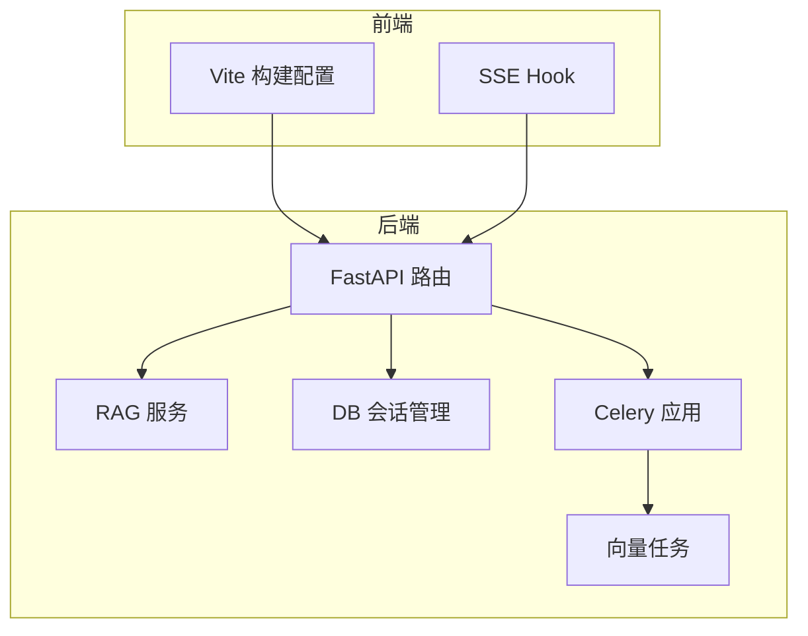
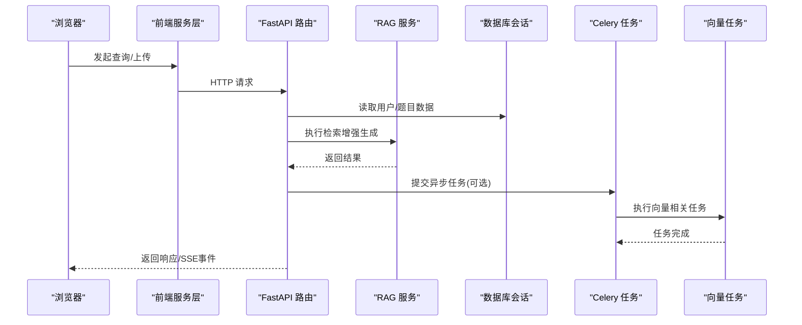
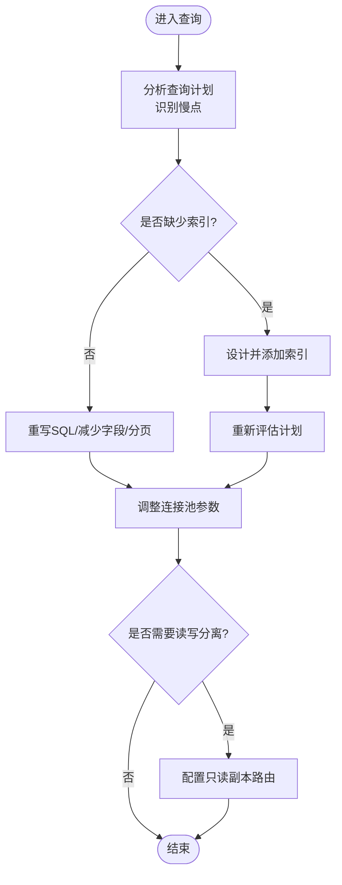
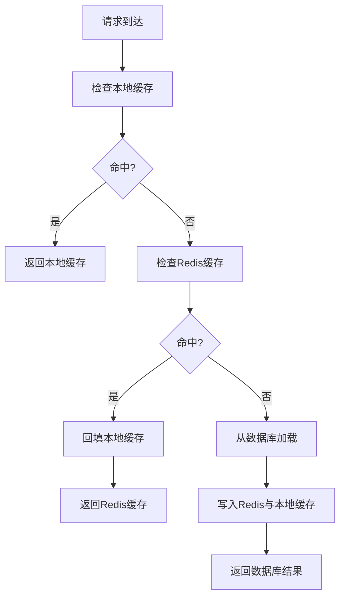
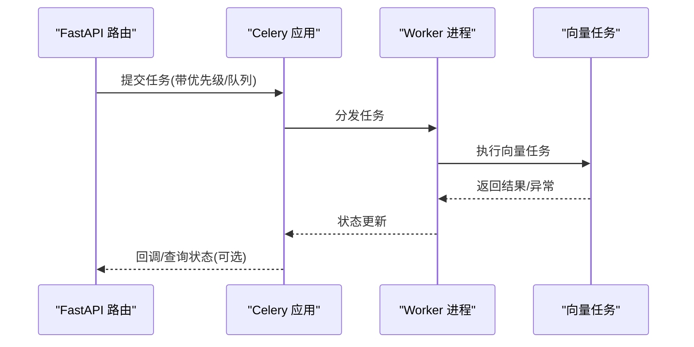
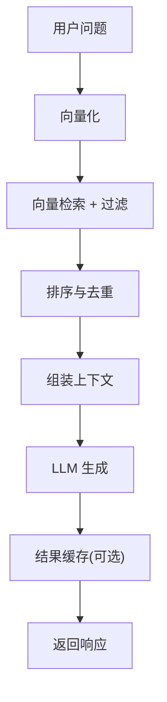
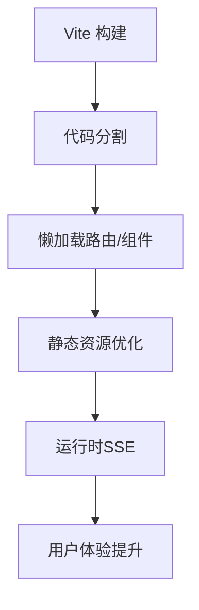
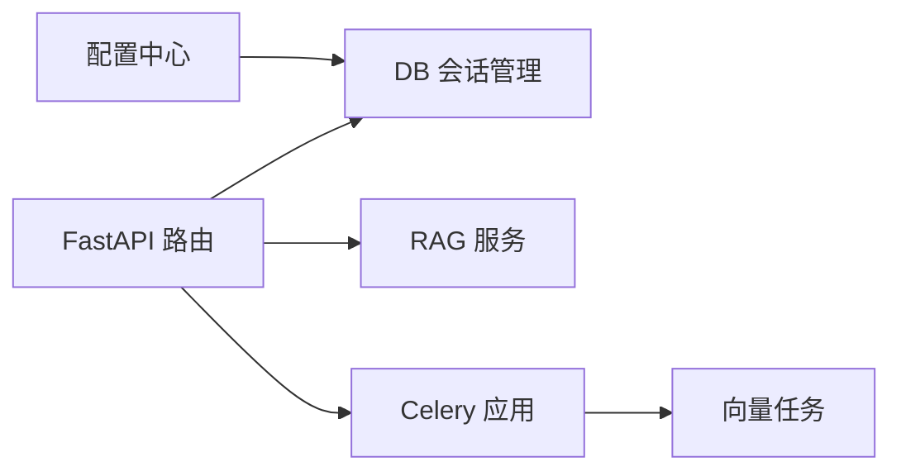

# 性能优化

<cite>
**本文引用的文件**   
- [backend/app/core/config.py](file://backend/app/core/config.py)
- [backend/app/db/session.py](file://backend/app/db/session.py)
- [backend/app/services/rag_service.py](file://backend/app/services/rag_service.py)
- [backend/app/tasks/celery_app.py](file://backend/app/tasks/celery_app.py)
- [backend/app/tasks/vector_tasks.py](file://backend/app/tasks/vector_tasks.py)
- [backend/app/api/v1/ai_tutor.py](file://backend/app/api/v1/ai_tutor.py)
- [frontend/vite.config.ts](file://frontend/vite.config.ts)
- [frontend/src/hooks/useSSE.ts](file://frontend/src/hooks/useSSE.ts)
</cite>

## 目录
1. [简介](#简介)
2. [项目结构](#项目结构)
3. [核心组件](#核心组件)
4. [架构总览](#架构总览)
5. [详细组件分析](#详细组件分析)
6. [依赖关系分析](#依赖关系分析)
7. [性能考量](#性能考量)
8. [故障排查指南](#故障排查指南)
9. [结论](#结论)
10. [附录](#附录)

## 简介
本指南面向AI助教系统的后端与前端，聚焦数据库、缓存、异步任务、AI服务（RAG与LLM）、前端性能以及内存与GC调优等关键维度，提供可落地的优化策略与实践建议。内容基于仓库现有实现进行梳理，并结合通用工程最佳实践给出配置项与流程建议，帮助读者在真实环境中提升系统吞吐、降低延迟并增强稳定性。

## 项目结构
系统采用前后端分离架构：
- 后端使用FastAPI作为Web框架，通过SQLAlchemy管理数据库会话，Celery处理异步任务，RAG服务负责检索增强生成，向量任务用于向量库相关操作。
- 前端基于Vite构建，包含路由、页面、组件与服务层，并通过SSE实现实时交互。

**图表来源**
- [backend/app/api/v1/ai_tutor.py](file://backend/app/api/v1/ai_tutor.py)
- [backend/app/services/rag_service.py](file://backend/app/services/rag_service.py)
- [backend/app/db/session.py](file://backend/app/db/session.py)
- [backend/app/tasks/celery_app.py](file://backend/app/tasks/celery_app.py)
- [backend/app/tasks/vector_tasks.py](file://backend/app/tasks/vector_tasks.py)
- [frontend/vite.config.ts](file://frontend/vite.config.ts)
- [frontend/src/hooks/useSSE.ts](file://frontend/src/hooks/useSSE.ts)

**章节来源**
- [backend/app/api/v1/ai_tutor.py](file://backend/app/api/v1/ai_tutor.py)
- [backend/app/services/rag_service.py](file://backend/app/services/rag_service.py)
- [backend/app/db/session.py](file://backend/app/db/session.py)
- [backend/app/tasks/celery_app.py](file://backend/app/tasks/celery_app.py)
- [backend/app/tasks/vector_tasks.py](file://backend/app/tasks/vector_tasks.py)
- [frontend/vite.config.ts](file://frontend/vite.config.ts)
- [frontend/src/hooks/useSSE.ts](file://frontend/src/hooks/useSSE.ts)

## 核心组件
- 数据库会话管理：集中创建与管理数据库连接与会话生命周期，避免连接泄漏与重复创建开销。
- RAG服务：封装检索增强生成的调用链路，包括向量检索、上下文组装与大模型请求。
- Celery任务：统一调度后台任务，如向量索引更新、批量分析等。
- 前端构建与实时通信：Vite构建优化与SSE流式响应，提升用户体验与资源加载效率。

**章节来源**
- [backend/app/db/session.py](file://backend/app/db/session.py)
- [backend/app/services/rag_service.py](file://backend/app/services/rag_service.py)
- [backend/app/tasks/celery_app.py](file://backend/app/tasks/celery_app.py)
- [frontend/vite.config.ts](file://frontend/vite.config.ts)
- [frontend/src/hooks/useSSE.ts](file://frontend/src/hooks/useSSE.ts)

## 架构总览
下图展示从前端到后端的典型请求路径，包括RAG检索与异步任务的协作关系。

**图表来源**
- [backend/app/api/v1/ai_tutor.py](file://backend/app/api/v1/ai_tutor.py)
- [backend/app/services/rag_service.py](file://backend/app/services/rag_service.py)
- [backend/app/db/session.py](file://backend/app/db/session.py)
- [backend/app/tasks/celery_app.py](file://backend/app/tasks/celery_app.py)
- [backend/app/tasks/vector_tasks.py](file://backend/app/tasks/vector_tasks.py)
- [frontend/src/hooks/useSSE.ts](file://frontend/src/hooks/useSSE.ts)

## 详细组件分析

### 数据库性能优化
- 索引设计
  - 针对高频查询条件字段建立复合索引，优先覆盖过滤、排序与关联键。
  - 对大表进行分区或归档，减少扫描范围。
- 查询优化
  - 避免N+1查询，使用预加载或JOIN合并。
  - 限制返回字段，仅选择必要列；分页查询使用游标或基于主键的偏移。
- 连接池配置
  - 根据并发量与数据库最大连接数设置连接池大小，避免耗尽与频繁创建销毁。
  - 合理设置连接超时与空闲回收时间，防止僵尸连接。
- 读写分离
  - 将读多写少场景拆分至只读副本，降低主库压力。
  - 注意事务边界与一致性要求，必要时回退至主库。

**章节来源**
- [backend/app/db/session.py](file://backend/app/db/session.py)

### 缓存策略优化
- Redis缓存设计
  - 热点数据（如题目元信息、用户画像）入缓存，设置合理TTL。
  - 使用Hash存储结构化对象，减少序列化开销。
- 缓存失效策略
  - 采用“过期+主动失效”双保险，写路径触发失效或更新。
  - 对强一致场景使用短TTL或版本号控制。
- 热点数据缓存
  - 本地二级缓存（进程内）+ Redis分布式缓存组合，降低跨进程访问成本。
  - 防击穿：加互斥锁或布隆过滤器；防雪崩：随机化TTL。

[此图为概念性流程图，不直接映射具体源码文件]

### 异步任务优化（Celery）
- 任务调度
  - 将耗时操作（如向量索引更新、批量分析）放入Celery队列，解耦主请求路径。
- Worker数量调优
  - 根据CPU核数与I/O密集程度设置Worker数量，监控队列长度与任务耗时。
- 任务优先级管理
  - 为高优先级任务分配独立队列或权重，确保关键路径及时响应。
- 幂等性与重试
  - 任务设计需幂等，失败时按指数退避重试，记录错误日志与指标。

**图表来源**
- [backend/app/tasks/celery_app.py](file://backend/app/tasks/celery_app.py)
- [backend/app/tasks/vector_tasks.py](file://backend/app/tasks/vector_tasks.py)
- [backend/app/api/v1/ai_tutor.py](file://backend/app/api/v1/ai_tutor.py)

**章节来源**
- [backend/app/tasks/celery_app.py](file://backend/app/tasks/celery_app.py)
- [backend/app/tasks/vector_tasks.py](file://backend/app/tasks/vector_tasks.py)

### AI服务优化（RAG与LLM）
- RAG检索优化
  - 向量检索增加Top-K与相似度阈值，结合关键词过滤提高召回质量。
  - 对检索片段做去重与截断，控制上下文长度以降低LLM输入成本。
- 向量数据库调优
  - 调整索引类型与参数（如HNSW），平衡召回率与延迟。
  - 定期重建索引与清理碎片，保持检索性能稳定。
- LLM调用批处理
  - 将多个小请求合并为批处理，提高吞吐；注意令牌预算与超时控制。
  - 引入缓存与结果复用，减少重复计算。

**章节来源**
- [backend/app/services/rag_service.py](file://backend/app/services/rag_service.py)

### 前端性能优化
- 代码分割与懒加载
  - 按路由与功能模块拆分包，按需加载，减少首屏体积。
- 静态资源优化
  - 启用压缩与缓存策略，图片与字体使用现代格式与CDN。
- SSE流式交互
  - 使用SSE接收增量输出，提升感知速度；做好断线重连与错误提示。

**章节来源**
- [frontend/vite.config.ts](file://frontend/vite.config.ts)
- [frontend/src/hooks/useSSE.ts](file://frontend/src/hooks/useSSE.ts)

## 依赖关系分析
后端各模块之间的依赖关系如下：

**图表来源**
- [backend/app/core/config.py](file://backend/app/core/config.py)
- [backend/app/db/session.py](file://backend/app/db/session.py)
- [backend/app/api/v1/ai_tutor.py](file://backend/app/api/v1/ai_tutor.py)
- [backend/app/services/rag_service.py](file://backend/app/services/rag_service.py)
- [backend/app/tasks/celery_app.py](file://backend/app/tasks/celery_app.py)
- [backend/app/tasks/vector_tasks.py](file://backend/app/tasks/vector_tasks.py)

**章节来源**
- [backend/app/core/config.py](file://backend/app/core/config.py)
- [backend/app/db/session.py](file://backend/app/db/session.py)
- [backend/app/api/v1/ai_tutor.py](file://backend/app/api/v1/ai_tutor.py)
- [backend/app/services/rag_service.py](file://backend/app/services/rag_service.py)
- [backend/app/tasks/celery_app.py](file://backend/app/tasks/celery_app.py)
- [backend/app/tasks/vector_tasks.py](file://backend/app/tasks/vector_tasks.py)

## 性能考量
- 数据库
  - 关注慢查询日志与执行计划，持续优化索引与SQL。
  - 连接池大小与超时参数需结合压测结果动态调整。
- 缓存
  - 命中率与过期策略直接影响整体延迟，建议埋点统计。
  - 热点数据采用多级缓存，注意一致性权衡。
- 异步任务
  - 监控队列积压与Worker利用率，避免瓶颈。
  - 任务粒度适中，避免过大导致阻塞。
- AI服务
  - RAG检索质量与LLM输入长度共同决定延迟与成本，需联合优化。
  - 批处理与缓存能显著提升吞吐，但需注意公平性与超时。
- 前端
  - 首屏时间与交互延迟是关键指标，结合网络与渲染链路优化。
  - SSE需考虑服务端推送能力与客户端容错。

[本节为通用指导，不直接分析具体文件]

## 故障排查指南
- 数据库连接问题
  - 检查连接池耗尽、超时与死锁，查看会话管理与配置参数。
- 缓存不一致
  - 核对失效策略与版本控制，定位写路径与读路径差异。
- 任务堆积
  - 观察Celery队列长度、Worker健康度与任务耗时，调整并行度与优先级。
- RAG检索低质
  - 检查向量索引参数、Top-K与过滤条件，评估上下文长度与LLM输入。
- 前端卡顿
  - 分析包体积与懒加载策略，确认SSE连接稳定性与重连逻辑。

**章节来源**
- [backend/app/db/session.py](file://backend/app/db/session.py)
- [backend/app/tasks/celery_app.py](file://backend/app/tasks/celery_app.py)
- [backend/app/services/rag_service.py](file://backend/app/services/rag_service.py)
- [frontend/src/hooks/useSSE.ts](file://frontend/src/hooks/useSSE.ts)

## 结论
通过对数据库、缓存、异步任务、AI服务与前端的全链路优化，AI助教系统可在高并发与复杂业务场景下保持稳定与高效。建议以指标驱动的方式持续监控与迭代，结合压测与线上观测不断校准参数与策略。

[本节为总结性内容，不直接分析具体文件]

## 附录
- 配置参考
  - 数据库连接池与超时参数位于配置与会话管理文件中，建议结合部署环境调整。
- 任务与向量库
  - Celery应用与向量任务文件定义了任务入口与执行逻辑，可按需扩展队列与处理器。
- 前端构建
  - Vite配置文件支持代码分割与资源优化，建议开启生产模式压缩与缓存策略。

**章节来源**
- [backend/app/core/config.py](file://backend/app/core/config.py)
- [backend/app/db/session.py](file://backend/app/db/session.py)
- [backend/app/tasks/celery_app.py](file://backend/app/tasks/celery_app.py)
- [backend/app/tasks/vector_tasks.py](file://backend/app/tasks/vector_tasks.py)
- [frontend/vite.config.ts](file://frontend/vite.config.ts)