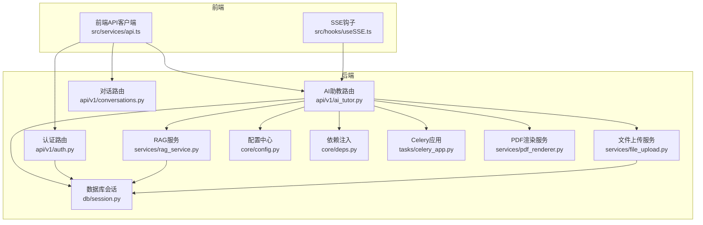
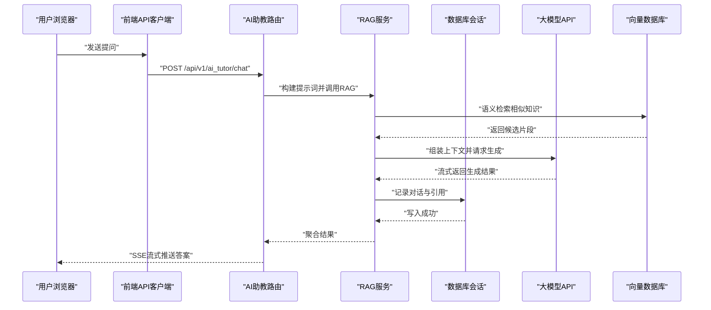
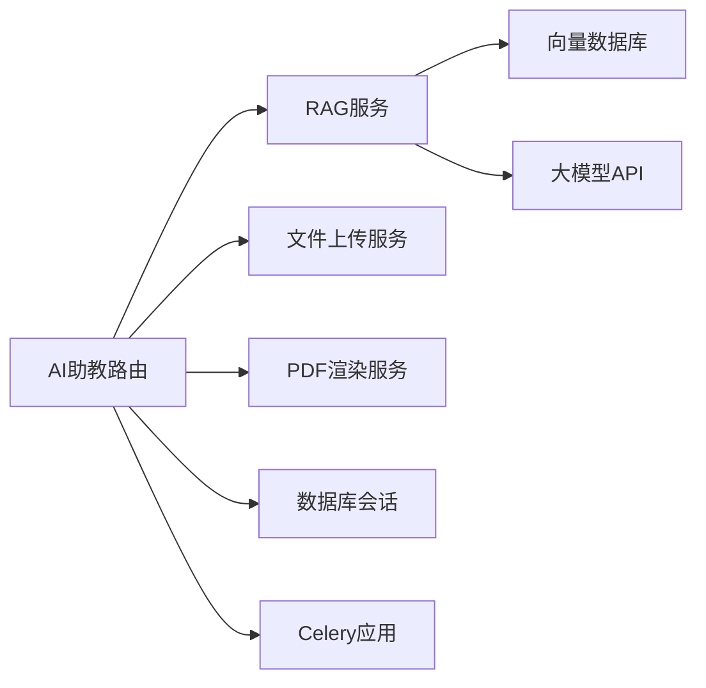
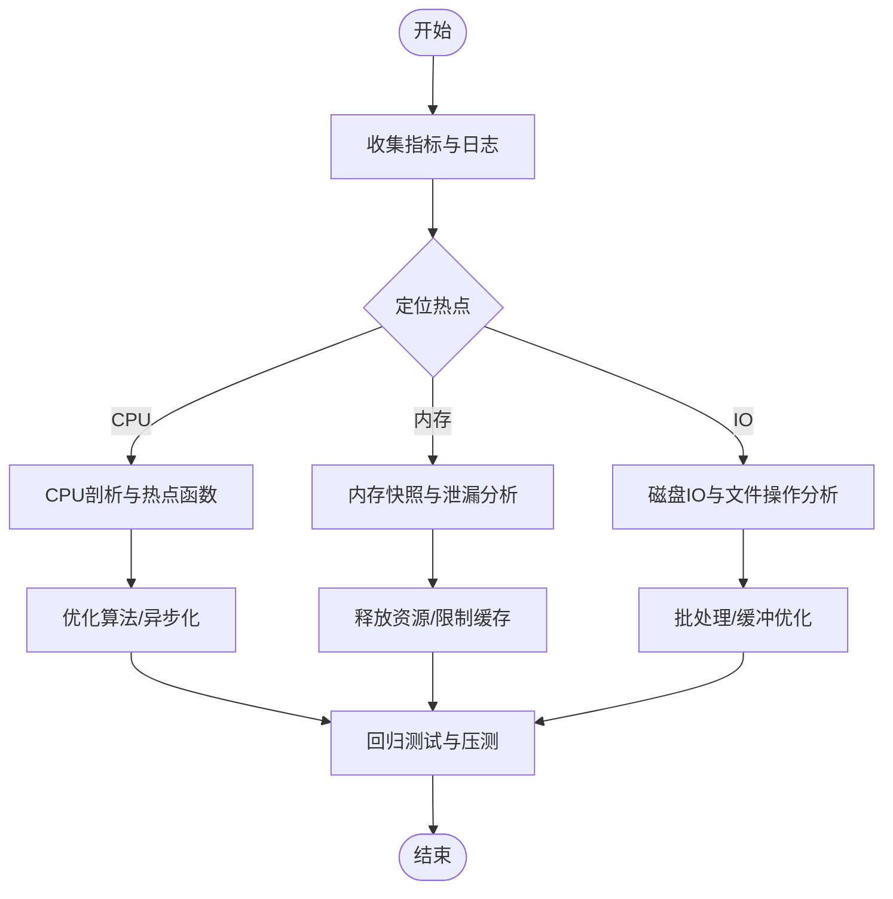

# 故障排查

<cite>
**本文引用的文件**   
- [backend/app/core/config.py](file://backend/app/core/config.py)
- [backend/app/core/deps.py](file://backend/app/core/deps.py)
- [backend/app/db/session.py](file://backend/app/db/session.py)
- [backend/app/api/v1/auth.py](file://backend/app/api/v1/auth.py)
- [backend/app/api/v1/ai_tutor.py](file://backend/app/api/v1/ai_tutor.py)
- [backend/app/api/v1/conversations.py](file://backend/app/api/v1/conversations.py)
- [backend/app/services/rag_service.py](file://backend/app/services/rag_service.py)
- [backend/app/services/file_upload.py](file://backend/app/services/file_upload.py)
- [backend/app/tasks/celery_app.py](file://backend/app/tasks/celery_app.py)
- [backend/app/services/pdf_renderer.py](file://backend/app/services/pdf_renderer.py)
- [frontend/src/services/api.ts](file://frontend/src/services/api.ts)
- [frontend/src/hooks/useSSE.ts](file://frontend/src/hooks/useSSE.ts)
</cite>

## 目录
1. [简介](#简介)
2. [项目结构](#项目结构)
3. [核心组件](#核心组件)
4. [架构总览](#架构总览)
5. [详细组件分析](#详细组件分析)
6. [依赖关系分析](#依赖关系分析)
7. [性能注意事项](#性能注意事项)
8. [故障排查指南](#故障排查指南)
9. [结论](#结论)
10. [附录](#附录)

## 简介
本手册面向AI助教系统的运维与研发人员，聚焦于常见问题的诊断与修复，覆盖API接口异常、数据库连接问题、AI服务调用失败、日志分析方法、调试工具与技巧、系统健康检查、性能问题定位流程，以及第三方服务集成（大模型API、向量数据库、文件存储）的故障处理。文档以“从现象到根因”的方式组织，配合架构图与流程图帮助快速定位问题。

## 项目结构
后端采用FastAPI分层架构：路由层（api）、领域服务（services）、数据访问（db/models/schemas）、任务队列（tasks）、配置与安全（core）。前端基于React+TypeScript，通过统一API客户端与服务模块发起请求，使用SSE进行流式交互。

图表来源
- [backend/app/api/v1/auth.py](file://backend/app/api/v1/auth.py)
- [backend/app/api/v1/ai_tutor.py](file://backend/app/api/v1/ai_tutor.py)
- [backend/app/api/v1/conversations.py](file://backend/app/api/v1/conversations.py)
- [backend/app/services/rag_service.py](file://backend/app/services/rag_service.py)
- [backend/app/services/file_upload.py](file://backend/app/services/file_upload.py)
- [backend/app/db/session.py](file://backend/app/db/session.py)
- [backend/app/core/config.py](file://backend/app/core/config.py)
- [backend/app/core/deps.py](file://backend/app/core/deps.py)
- [backend/app/tasks/celery_app.py](file://backend/app/tasks/celery_app.py)
- [backend/app/services/pdf_renderer.py](file://backend/app/services/pdf_renderer.py)
- [frontend/src/services/api.ts](file://frontend/src/services/api.ts)
- [frontend/src/hooks/useSSE.ts](file://frontend/src/hooks/useSSE.ts)

章节来源
- [backend/app/core/config.py](file://backend/app/core/config.py)
- [backend/app/core/deps.py](file://backend/app/core/deps.py)
- [backend/app/db/session.py](file://backend/app/db/session.py)
- [backend/app/api/v1/auth.py](file://backend/app/api/v1/auth.py)
- [backend/app/api/v1/ai_tutor.py](file://backend/app/api/v1/ai_tutor.py)
- [backend/app/api/v1/conversations.py](file://backend/app/api/v1/conversations.py)
- [backend/app/services/rag_service.py](file://backend/app/services/rag_service.py)
- [backend/app/services/file_upload.py](file://backend/app/services/file_upload.py)
- [backend/app/tasks/celery_app.py](file://backend/app/tasks/celery_app.py)
- [backend/app/services/pdf_renderer.py](file://backend/app/services/pdf_renderer.py)
- [frontend/src/services/api.ts](file://frontend/src/services/api.ts)
- [frontend/src/hooks/useSSE.ts](file://frontend/src/hooks/useSSE.ts)

## 核心组件
- 配置与安全
  - 配置中心集中管理外部服务地址、密钥、超时等参数，便于统一切换环境与健康检查。
  - 安全模块负责鉴权与权限控制，影响登录、令牌刷新与接口访问。
- 数据库会话
  - 提供连接池与会话生命周期管理，是读写操作的基础。
- API路由
  - 认证路由负责用户登录与令牌发放。
  - AI助教路由承载问答、解析、生成等主流程。
  - 对话路由维护会话上下文与历史。
- 领域服务
  - RAG服务负责检索增强生成，涉及向量库与大模型调用。
  - 文件上传服务处理附件上传、校验与持久化。
  - PDF渲染服务将内容转换为可下载或预览格式。
- 任务队列
  - Celery应用用于异步任务（如批量分析、索引构建），避免阻塞主线程。
- 前端
  - 统一API客户端封装请求、重试、错误码映射。
  - SSE钩子用于接收服务端流式响应，提升交互体验。

章节来源
- [backend/app/core/config.py](file://backend/app/core/config.py)
- [backend/app/core/deps.py](file://backend/app/core/deps.py)
- [backend/app/db/session.py](file://backend/app/db/session.py)
- [backend/app/api/v1/auth.py](file://backend/app/api/v1/auth.py)
- [backend/app/api/v1/ai_tutor.py](file://backend/app/api/v1/ai_tutor.py)
- [backend/app/api/v1/conversations.py](file://backend/app/api/v1/conversations.py)
- [backend/app/services/rag_service.py](file://backend/app/services/rag_service.py)
- [backend/app/services/file_upload.py](file://backend/app/services/file_upload.py)
- [backend/app/services/pdf_renderer.py](file://backend/app/services/pdf_renderer.py)
- [backend/app/tasks/celery_app.py](file://backend/app/tasks/celery_app.py)
- [frontend/src/services/api.ts](file://frontend/src/services/api.ts)
- [frontend/src/hooks/useSSE.ts](file://frontend/src/hooks/useSSE.ts)

## 架构总览
下图展示一次典型AI助教问答的端到端流程，包括前端请求、后端路由、RAG服务、数据库与外部AI服务的交互。

图表来源
- [backend/app/api/v1/ai_tutor.py](file://backend/app/api/v1/ai_tutor.py)
- [backend/app/services/rag_service.py](file://backend/app/services/rag_service.py)
- [backend/app/db/session.py](file://backend/app/db/session.py)
- [frontend/src/hooks/useSSE.ts](file://frontend/src/hooks/useSSE.ts)

## 详细组件分析

### 认证与鉴权（auth）
- 常见问题
  - 登录失败：用户名/密码错误、账号锁定、JWT签发失败。
  - 令牌过期：刷新令牌失效、时钟不同步。
  - 权限不足：角色缺失、资源未授权。
- 诊断要点
  - 检查认证路由的请求体与响应码。
  - 核对配置中的密钥、算法与有效期。
  - 查看数据库用户表状态与哈希值。
- 建议步骤
  - 复现最小用例，捕获完整请求与响应。
  - 比对前后端时间戳与时区设置。
  - 在安全模块中增加关键路径的日志埋点。

章节来源
- [backend/app/api/v1/auth.py](file://backend/app/api/v1/auth.py)
- [backend/app/core/config.py](file://backend/app/core/config.py)
- [backend/app/core/deps.py](file://backend/app/core/deps.py)

### AI助教主流程（ai_tutor）
- 常见问题
  - 大模型API超时或限流。
  - 提示词过长导致生成失败。
  - SSE中断或前端未正确消费事件。
- 诊断要点
  - 观察路由层对上游服务的超时与重试策略。
  - 检查RAG服务返回的上下文长度与质量。
  - 确认SSE连接建立与心跳机制。
- 建议步骤
  - 降低并发与上下文规模验证稳定性。
  - 为关键调用添加耗时与错误码统计。
  - 在前端SSE钩子中实现断线重连与幂等处理。

章节来源
- [backend/app/api/v1/ai_tutor.py](file://backend/app/api/v1/ai_tutor.py)
- [backend/app/services/rag_service.py](file://backend/app/services/rag_service.py)
- [frontend/src/hooks/useSSE.ts](file://frontend/src/hooks/useSSE.ts)

### 对话管理（conversations）
- 常见问题
  - 会话上下文丢失、历史消息不完整。
  - 并发写入冲突导致数据不一致。
- 诊断要点
  - 检查会话ID一致性与事务边界。
  - 监控数据库写入延迟与锁等待。
- 建议步骤
  - 引入幂等键与去重逻辑。
  - 对热点会话采用分片或缓存策略。

章节来源
- [backend/app/api/v1/conversations.py](file://backend/app/api/v1/conversations.py)
- [backend/app/db/session.py](file://backend/app/db/session.py)

### RAG服务（rag_service）
- 常见问题
  - 向量检索召回率低或噪声多。
  - 大模型返回空结果或截断。
- 诊断要点
  - 评估嵌入质量与相似度阈值。
  - 检查外部向量库连通性与索引状态。
- 建议步骤
  - 调整检索TopK与过滤条件。
  - 对长文本进行分段与摘要预处理。

章节来源
- [backend/app/services/rag_service.py](file://backend/app/services/rag_service.py)

### 文件上传（file_upload）
- 常见问题
  - 大文件上传失败、超时或磁盘空间不足。
  - 文件格式校验失败、病毒扫描拦截。
- 诊断要点
  - 检查上传大小限制与临时目录配额。
  - 确认存储服务可用性与网络带宽。
- 建议步骤
  - 启用分块上传与断点续传。
  - 增加异步校验与告警。

章节来源
- [backend/app/services/file_upload.py](file://backend/app/services/file_upload.py)

### PDF渲染（pdf_renderer）
- 常见问题
  - 渲染引擎不可用、字体缺失。
  - 内存溢出或渲染超时。
- 诊断要点
  - 检查进程资源上限与依赖库版本。
  - 监控渲染任务的CPU与内存峰值。
- 建议步骤
  - 将渲染任务迁移至独立Worker。
  - 对超大文档进行分页渲染。

章节来源
- [backend/app/services/pdf_renderer.py](file://backend/app/services/pdf_renderer.py)

### 任务队列（celery_app）
- 常见问题
  - Worker未启动或崩溃。
  - 任务堆积、重试风暴。
- 诊断要点
  - 检查Broker与结果后端连通性。
  - 监控队列深度与任务执行时长分布。
- 建议步骤
  - 设置合理的重试次数与退避策略。
  - 引入死信队列与告警。

章节来源
- [backend/app/tasks/celery_app.py](file://backend/app/tasks/celery_app.py)

### 前端API客户端与SSE
- 常见问题
  - 请求被CORS拦截、跨域失败。
  - SSE连接频繁断开、事件乱序。
- 诊断要点
  - 检查代理与网关配置。
  - 验证事件类型与字段一致性。
- 建议步骤
  - 统一错误码映射与用户提示。
  - 实现指数退避与自动重连。

章节来源
- [frontend/src/services/api.ts](file://frontend/src/services/api.ts)
- [frontend/src/hooks/useSSE.ts](file://frontend/src/hooks/useSSE.ts)

## 依赖关系分析
- 耦合关系
  - 路由层依赖服务层，服务层依赖数据库与会话、外部AI与向量库。
  - 任务队列解耦耗时操作，降低主线程压力。
- 外部依赖
  - 大模型API、向量数据库、对象存储、消息中间件。
- 潜在风险
  - 单点故障（数据库、向量库、消息中间件）。
  - 外部服务限流与不稳定。

图表来源
- [backend/app/api/v1/ai_tutor.py](file://backend/app/api/v1/ai_tutor.py)
- [backend/app/services/rag_service.py](file://backend/app/services/rag_service.py)
- [backend/app/services/file_upload.py](file://backend/app/services/file_upload.py)
- [backend/app/services/pdf_renderer.py](file://backend/app/services/pdf_renderer.py)
- [backend/app/db/session.py](file://backend/app/db/session.py)
- [backend/app/tasks/celery_app.py](file://backend/app/tasks/celery_app.py)

## 性能注意事项
- 数据库
  - 关注慢查询、连接池耗尽、锁竞争。
- 外部服务
  - 大模型与向量库的延迟与吞吐，需合理超时与熔断。
- 计算密集型
  - PDF渲染与文本处理应放入异步任务，避免阻塞。
- 前端
  - 减少不必要的全量拉取，采用增量更新与分页。

[本节为通用指导，不直接分析具体文件]

## 故障排查指南

### API接口异常
- 现象
  - 4xx/5xx错误、超时、重复提交、跨域失败。
- 诊断方法
  - 使用浏览器开发者工具的Network面板抓取请求与响应头、状态码、耗时。
  - 在后端路由层增加结构化日志，记录入参、出参、异常堆栈与耗时。
  - 检查网关/代理的超时与重试配置。
- 解决建议
  - 对幂等接口增加唯一键与去重。
  - 对不稳定外部调用实施熔断与降级。
  - 统一错误码与用户提示。

章节来源
- [backend/app/api/v1/ai_tutor.py](file://backend/app/api/v1/ai_tutor.py)
- [frontend/src/services/api.ts](file://frontend/src/services/api.ts)

### 数据库连接问题
- 现象
  - 连接池耗尽、查询超时、事务回滚。
- 诊断方法
  - 检查连接池大小、最大空闲时间与回收策略。
  - 监控活跃连接数、慢查询与锁等待。
  - 验证数据库实例健康与网络连通。
- 解决建议
  - 扩容连接池与数据库实例。
  - 优化SQL与索引，拆分长事务。
  - 引入只读副本分担查询压力。

章节来源
- [backend/app/db/session.py](file://backend/app/db/session.py)

### AI服务调用失败
- 现象
  - 大模型API超时、限流、返回空或截断。
- 诊断方法
  - 记录请求ID、输入长度、输出长度与耗时。
  - 检查限流策略与配额使用情况。
  - 评估提示词与上下文长度是否超限。
- 解决建议
  - 实现重试与退避，必要时走降级通道。
  - 对长上下文进行压缩或分段。
  - 接入备用模型或本地小模型兜底。

章节来源
- [backend/app/services/rag_service.py](file://backend/app/services/rag_service.py)

### 日志分析方法
- 错误日志定位
  - 按时间窗口与错误码筛选，结合TraceID串联上下游。
  - 对关键路径增加结构化日志（JSON），包含业务标识与上下文。
- 性能瓶颈分析
  - 采集P95/P99延迟、QPS、错误率与资源使用。
  - 使用分布式追踪识别热点与慢调用。
- 用户行为追踪
  - 为页面与功能打点，关联会话ID与用户ID。
  - 分析漏斗转化与异常跳出点。

[本节为通用指导，不直接分析具体文件]

### 调试工具与技巧
- Python调试器
  - 使用交互式调试器在关键函数处设置断点，逐步执行并检查变量。
  - 在生产环境谨慎开启，优先使用远程调试或快照。
- 前端开发者工具
  - Network面板查看请求详情与响应；Console面板查看JS错误；Sources面板断点调试。
- 网络请求调试
  - 使用抓包工具捕获HTTP/S流量，检查TLS握手与证书。
  - 验证代理、网关与负载均衡的配置。

[本节为通用指导，不直接分析具体文件]

### 系统健康检查
- 依赖服务状态检测
  - 定期探测数据库、向量库、对象存储与大模型API的连通性与可用性。
- 资源使用监控
  - 监控CPU、内存、磁盘IO、网络带宽与连接池指标。
- 自动恢复机制
  - 实现健康探针与自愈重启，结合熔断与降级策略。
  - 任务队列具备重试与死信队列，防止雪崩。

章节来源
- [backend/app/core/config.py](file://backend/app/core/config.py)
- [backend/app/tasks/celery_app.py](file://backend/app/tasks/celery_app.py)

### 性能问题排查流程
- CPU占用过高
  - 定位热点函数与循环，检查是否存在密集计算或正则回溯。
  - 将计算密集型任务迁移至异步Worker。
- 内存泄漏
  - 监控RSS与GC统计，定位未释放的大对象与缓存膨胀。
  - 审查文件流与临时文件的关闭与清理。
- 磁盘IO瓶颈
  - 监控IOPS与延迟，检查大文件读写与日志轮转。
  - 优化落盘策略与缓冲大小。

[本节为通用指导，不直接分析具体文件]

### 第三方服务集成问题
- 大模型API
  - 限流与配额：监控调用频率与剩余配额，实施退避与排队。
  - 超时与重试：设置合理超时与指数退避，避免级联失败。
- 向量数据库
  - 索引健康：检查索引重建与分区状态。
  - 检索质量：评估TopK与相似度阈值，优化切片与嵌入。
- 文件存储服务
  - 容量与配额：监控存储空间与配额，设置告警。
  - 传输稳定性：启用分块上传与断点续传，校验完整性。

章节来源
- [backend/app/services/rag_service.py](file://backend/app/services/rag_service.py)
- [backend/app/services/file_upload.py](file://backend/app/services/file_upload.py)

## 结论
通过分层化的架构与清晰的职责划分，AI助教系统具备良好的可观测性与可扩展性。故障排查应以“指标先行、日志为辅、追踪贯穿”为原则，结合健康检查与自动恢复机制，快速定位并解决问题。对于外部依赖，务必实施熔断、降级与重试策略，确保整体稳定性。

## 附录
- 常用命令与脚本
  - 启动开发环境与生产环境的差异配置。
  - 日志轮转与归档策略。
- 参考文档
  - 配置项说明与环境变量清单。
  - 错误码字典与用户提示规范。

[本节为通用指导，不直接分析具体文件]