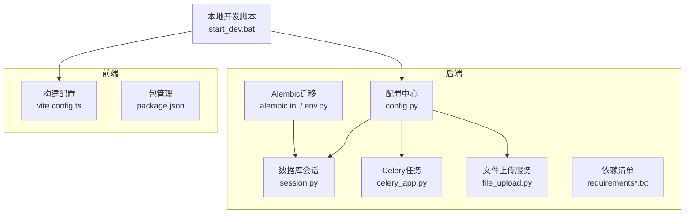
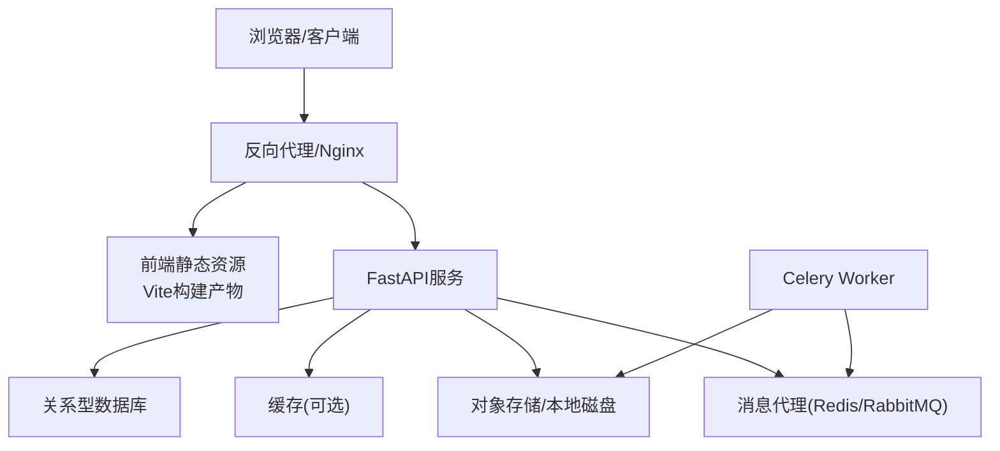

# 环境部署

<cite>
**本文引用的文件**   
- [backend/app/core/config.py](file://backend/app/core/config.py)
- [backend/app/db/session.py](file://backend/app/db/session.py)
- [backend/alembic.ini](file://backend/alembic.ini)
- [backend/alembic/env.py](file://backend/alembic/env.py)
- [backend/requirements.txt](file://backend/requirements.txt)
- [backend/requirements-core.txt](file://backend/requirements-core.txt)
- [backend/app/tasks/celery_app.py](file://backend/app/tasks/celery_app.py)
- [backend/app/services/file_upload.py](file://backend/app/services/file_upload.py)
- [frontend/package.json](file://frontend/package.json)
- [frontend/vite.config.ts](file://frontend/vite.config.ts)
- [start_dev.bat](file://start_dev.bat)
</cite>

## 目录
1. [简介](#简介)
2. [项目结构](#项目结构)
3. [核心组件](#核心组件)
4. [架构总览](#架构总览)
5. [详细组件分析](#详细组件分析)
6. [依赖分析](#依赖分析)
7. [性能考虑](#性能考虑)
8. [故障排查指南](#故障排查指南)
9. [结论](#结论)
10. [附录](#附录) 

## 简介
本指南面向AI助教系统的开发与运维人员，提供从开发、测试到生产环境的完整部署说明。内容涵盖：
- Python与Node.js环境准备
- 数据库初始化与迁移
- Docker容器化与编排（Dockerfile、docker-compose）
- 环境变量管理（数据库、AI服务API密钥、Redis等）
- 文件存储与CDN集成、域名绑定
- 部署脚本与自动化流程，确保一键部署的可靠性

## 项目结构
后端采用FastAPI + SQLAlchemy + Alembic + Celery；前端基于Vite + React + TypeScript。根目录包含前后端工程与本地开发启动脚本。

**图表来源** 
- [backend/app/core/config.py](file://backend/app/core/config.py)
- [backend/app/db/session.py](file://backend/app/db/session.py)
- [backend/alembic.ini](file://backend/alembic.ini)
- [backend/alembic/env.py](file://backend/alembic/env.py)
- [backend/app/tasks/celery_app.py](file://backend/app/tasks/celery_app.py)
- [backend/app/services/file_upload.py](file://backend/app/services/file_upload.py)
- [backend/requirements.txt](file://backend/requirements.txt)
- [backend/requirements-core.txt](file://backend/requirements-core.txt)
- [frontend/vite.config.ts](file://frontend/vite.config.ts)
- [frontend/package.json](file://frontend/package.json)
- [start_dev.bat](file://start_dev.bat)

**章节来源**
- [backend/app/core/config.py](file://backend/app/core/config.py)
- [backend/app/db/session.py](file://backend/app/db/session.py)
- [backend/alembic.ini](file://backend/alembic.ini)
- [backend/alembic/env.py](file://backend/alembic/env.py)
- [backend/app/tasks/celery_app.py](file://backend/app/tasks/celery_app.py)
- [backend/app/services/file_upload.py](file://backend/app/services/file_upload.py)
- [backend/requirements.txt](file://backend/requirements.txt)
- [backend/requirements-core.txt](file://backend/requirements-core.txt)
- [frontend/vite.config.ts](file://frontend/vite.config.ts)
- [frontend/package.json](file://frontend/package.json)
- [start_dev.bat](file://start_dev.bat)

## 核心组件
- 配置中心：集中读取环境变量，统一暴露数据库、缓存、AI服务、文件存储等配置项。
- 数据库会话：基于SQLAlchemy创建引擎与会话，供业务层使用。
- 迁移工具：Alembic负责数据库版本管理与数据演进。
- 异步任务：Celery应用用于离线分析与向量处理等耗时任务。
- 文件服务：封装上传、存储路径与访问策略。
- 前端构建：Vite打包静态资源，配合Nginx或CDN分发。

**章节来源**
- [backend/app/core/config.py](file://backend/app/core/config.py)
- [backend/app/db/session.py](file://backend/app/db/session.py)
- [backend/alembic.ini](file://backend/alembic.ini)
- [backend/alembic/env.py](file://backend/alembic/env.py)
- [backend/app/tasks/celery_app.py](file://backend/app/tasks/celery_app.py)
- [backend/app/services/file_upload.py](file://backend/app/services/file_upload.py)

## 架构总览
系统由“前端静态站点 + FastAPI后端 + 数据库 + 缓存 + 对象存储 + 任务队列”组成。通过环境变量注入不同运行期配置，实现多环境一致部署。

[本图为概念性架构图，不直接映射具体源码文件]

## 详细组件分析

### 环境与配置管理
- 关键变量建议
  - 数据库连接：驱动、主机、端口、库名、用户名、密码、连接池参数
  - AI服务：提供商、模型、API密钥、超时与重试
  - 缓存：地址、端口、DB索引、密码
  - 文件存储：本地路径或云存储桶、访问域名、鉴权信息
  - 任务队列：Broker与结果后端地址
  - 安全：JWT密钥、CORS白名单、日志级别
- 加载顺序与环境隔离
  - 优先读取运行时环境变量，其次回退默认值
  - 通过环境变量前缀区分环境（如DEV/TEST/PROD）
- 校验与告警
  - 启动时校验必填项，缺失则快速失败并输出清晰提示

**章节来源**
- [backend/app/core/config.py](file://backend/app/core/config.py)

### 数据库与迁移
- 连接与会话
  - 使用配置中心的数据库URL创建引擎与会话
  - 支持连接池大小、超时、自动回收等参数
- 迁移流程
  - 生成迁移脚本
  - 在目标环境执行升级/降级
  - 记录版本快照，保证幂等与可回滚
- 注意事项
  - 生产环境禁止自动DDL，需人工审核迁移脚本
  - 大表变更建议使用分步迁移与在线工具

**章节来源**
- [backend/app/db/session.py](file://backend/app/db/session.py)
- [backend/alembic.ini](file://backend/alembic.ini)
- [backend/alembic/env.py](file://backend/alembic/env.py)

### 异步任务与后台作业
- 任务定义与路由
  - 将耗时逻辑拆分为Celery任务，按队列分流
- 并发与限流
  - 根据CPU/IO类型设置worker并发度
  - 对第三方API调用进行限流与重试
- 监控与持久化
  - 任务状态持久化至结果后端
  - 结合日志与指标平台观测吞吐与延迟

**章节来源**
- [backend/app/tasks/celery_app.py](file://backend/app/tasks/celery_app.py)

### 文件存储与CDN
- 存储策略
  - 本地磁盘：适合小规模与内网
  - 对象存储：S3兼容接口，便于扩展与备份
- 访问与缓存
  - 通过CDN加速静态与媒体资源
  - 合理设置缓存头与版本号
- 安全与权限
  - 私有桶签名下载
  - 最小权限原则与审计日志

**章节来源**
- [backend/app/services/file_upload.py](file://backend/app/services/file_upload.py)

### 前端构建与发布
- 构建产物
  - Vite打包为静态HTML/CSS/JS
  - 输出目录由构建配置决定
- 环境变量注入
  - 构建期注入API基础路径、功能开关等
- 部署方式
  - 静态托管于Nginx或CDN
  - 与后端分离部署，跨域由Nginx统一处理

**章节来源**
- [frontend/vite.config.ts](file://frontend/vite.config.ts)
- [frontend/package.json](file://frontend/package.json)

## 依赖分析
- 后端依赖
  - Web框架、ORM、迁移工具、任务队列、HTTP客户端、加密库等
- 前端依赖
  - 构建工具、UI库、网络请求库、类型定义等
- 依赖锁定与镜像优化
  - 使用锁文件与多阶段构建减少镜像体积
  - 分层缓存提升构建速度

**章节来源**
- [backend/requirements.txt](file://backend/requirements.txt)
- [backend/requirements-core.txt](file://backend/requirements-core.txt)
- [frontend/package.json](file://frontend/package.json)

## 性能考虑
- 数据库
  - 合理索引、分页查询、读写分离（可选）
  - 连接池大小与超时调优
- 缓存
  - 热点数据缓存、失效策略、穿透防护
- 任务队列
  - 按优先级与资源类型拆分队列
  - 批量处理与去重
- 静态资源
  - CDN缓存、压缩、按需加载
- 反向代理
  - 开启Gzip/Brotli、Keep-Alive、连接复用

[本节为通用指导，不直接分析具体文件]

## 故障排查指南
- 启动失败
  - 检查环境变量是否齐全且格式正确
  - 查看服务日志定位异常堆栈
- 数据库连接错误
  - 核对连接字符串、网络连通性与防火墙规则
  - 确认迁移版本与期望一致
- 任务堆积
  - 检查Worker数量与队列消费速率
  - 观察下游依赖（AI服务/存储）可用性
- 文件上传失败
  - 校验存储桶权限与签名有效期
  - 检查文件大小限制与超时配置
- 前端无法访问后端
  - 确认Nginx转发与CORS策略
  - 检查构建期注入的API基础路径

**章节来源**
- [backend/app/core/config.py](file://backend/app/core/config.py)
- [backend/app/db/session.py](file://backend/app/db/session.py)
- [backend/app/tasks/celery_app.py](file://backend/app/tasks/celery_app.py)
- [backend/app/services/file_upload.py](file://backend/app/services/file_upload.py)

## 结论
通过统一的环境变量管理、标准化的迁移流程与容器化编排，可实现开发、测试、生产三套环境的一致交付。结合CDN与对象存储，系统具备良好的可扩展性与高可用能力。建议在CI/CD中固化构建、测试与发布步骤，确保一键部署的可靠性与可追溯性。

[本节为总结性内容，不直接分析具体文件]

## 附录

### 一、开发环境搭建
- 前置条件
  - Python 3.x、Node.js LTS、Git
  - 本地数据库与缓存服务（或使用Docker）
- 后端
  - 安装依赖
  - 复制环境变量模板并填写必要项
  - 执行数据库迁移
  - 启动服务与Worker
- 前端
  - 安装依赖
  - 配置API基础路径
  - 启动开发服务器
- 本地一键启动
  - 使用提供的批处理脚本快速拉起前后端

**章节来源**
- [backend/requirements.txt](file://backend/requirements.txt)
- [backend/requirements-core.txt](file://backend/requirements-core.txt)
- [backend/alembic.ini](file://backend/alembic.ini)
- [backend/alembic/env.py](file://backend/alembic/env.py)
- [backend/app/tasks/celery_app.py](file://backend/app/tasks/celery_app.py)
- [frontend/package.json](file://frontend/package.json)
- [frontend/vite.config.ts](file://frontend/vite.config.ts)
- [start_dev.bat](file://start_dev.bat)

### 二、测试环境搭建
- 独立数据库与缓存实例
- 使用只读数据集与Mock外部AI服务
- 启用更严格的日志与告警
- 自动化测试覆盖API与迁移脚本

[本节为通用指导，不直接分析具体文件]

### 三、生产环境搭建
- 基础设施
  - 数据库主备/集群、备份策略
  - 对象存储与CDN
  - 负载均衡与反向代理
- 安全加固
  - 最小权限、密钥管理、HTTPS强制
  - 访问控制与审计日志
- 监控与告警
  - 指标采集、链路追踪、错误聚合
  - 容量规划与弹性伸缩

[本节为通用指导，不直接分析具体文件]

### 四、Docker容器化部署
- 镜像构建
  - 多阶段构建：构建期与运行期分离
  - 仅拷贝必要文件，减小镜像体积
  - 使用非root用户运行
- 容器编排
  - 服务拆分：Web、Worker、Nginx、数据库、缓存
  - 健康检查与重启策略
  - 卷挂载与密钥注入
- 示例要点
  - 构建命令与缓存优化
  - 环境变量与配置文件挂载
  - 日志收集与持久化

[本节为通用指导，不直接分析具体文件]

### 五、环境变量参考清单
- 数据库
  - 连接URL、连接池大小、超时、字符集
- AI服务
  - 提供商、模型、API密钥、重试与超时
- 缓存
  - 地址、端口、DB索引、密码
- 文件存储
  - 存储类型、桶名、访问域名、鉴权信息
- 任务队列
  - Broker与结果后端地址
- 安全与日志
  - JWT密钥、CORS白名单、日志级别

**章节来源**
- [backend/app/core/config.py](file://backend/app/core/config.py)

### 六、文件存储与CDN集成
- 本地存储
  - 指定绝对路径与权限
  - 定期备份与清理策略
- 对象存储
  - S3兼容接口配置
  - 私有桶签名下载与CDN回源
- CDN
  - 域名绑定与证书
  - 缓存策略与预热

**章节来源**
- [backend/app/services/file_upload.py](file://backend/app/services/file_upload.py)

### 七、域名与反向代理
- 域名解析与证书
- Nginx配置要点
  - 静态资源与API转发
  - 压缩与缓存头
  - 安全头与访问控制
- 灰度与蓝绿发布
  - 流量切换与回滚策略

[本节为通用指导，不直接分析具体文件]

### 八、部署脚本与自动化流程
- 本地一键部署
  - 使用批处理脚本完成依赖安装、迁移、构建与启动
- CI/CD流水线
  - 代码拉取、依赖缓存、构建镜像、推送仓库
  - 目标环境滚动更新与健康检查
- 回滚与恢复
  - 镜像版本标记与快速回滚
  - 数据库迁移回退预案

**章节来源**
- [start_dev.bat](file://start_dev.bat)