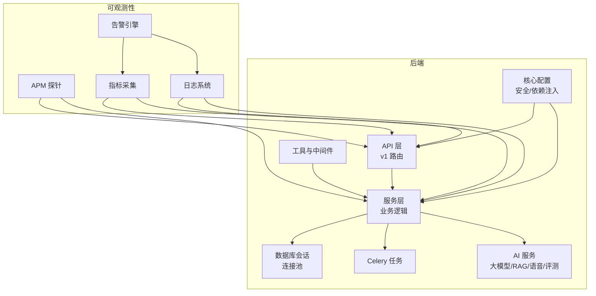
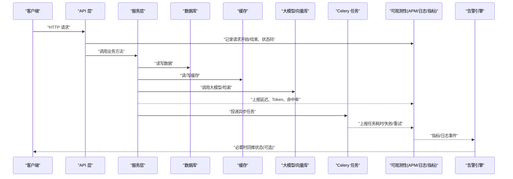
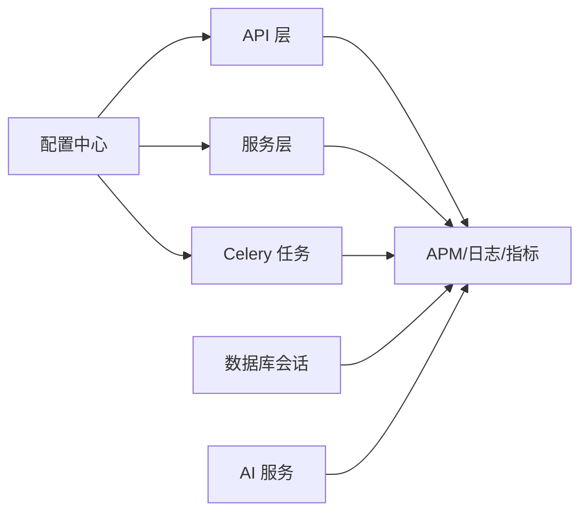

# 监控告警

<cite>
**本文引用的文件**   
- [backend/app/core/config.py](file://backend/app/core/config.py)
- [backend/app/db/session.py](file://backend/app/db/session.py)
- [backend/app/tasks/celery_app.py](file://backend/app/tasks/celery_app.py)
- [backend/app/api/v1/analytics.py](file://backend/app/api/v1/analytics.py)
- [backend/app/services/rag_service.py](file://backend/app/services/rag_service.py)
- [backend/app/services/explain_service.py](file://backend/app/services/explain_service.py)
- [backend/app/services/oral_service.py](file://backend/app/services/oral_service.py)
- [backend/app/services/composition_service.py](file://backend/app/services/composition_service.py)
- [backend/app/services/file_upload.py](file://backend/app/services/file_upload.py)
- [backend/app/services/knowledge_tracker.py](file://backend/app/services/knowledge_tracker.py)
- [backend/app/services/similar_generator.py](file://backend/app/services/similar_generator.py)
- [backend/app/services/ai_grader.py](file://backend/app/services/ai_grader.py)
- [backend/app/services/agent/agent_executor.py](file://backend/app/services/agent/agent_executor.py)
- [backend/app/services/agent/tools.py](file://backend/app/services/agent/tools.py)
- [backend/app/services/agent/prompts.py](file://backend/app/services/agent/prompts.py)
- [backend/app/tasks/analysis_tasks.py](file://backend/app/tasks/analysis_tasks.py)
- [backend/app/tasks/vector_tasks.py](file://backend/app/tasks/vector_tasks.py)
- [backend/app/utils/main.py](file://backend/app/utils/main.py)
</cite>

## 目录
1. [简介](#简介)
2. [项目结构](#项目结构)
3. [核心组件](#核心组件)
4. [架构总览](#架构总览)
5. [详细组件分析](#详细组件分析)
6. [依赖关系分析](#依赖关系分析)
7. [性能考量](#性能考量)
8. [故障排查指南](#故障排查指南)
9. [结论](#结论)
10. [附录](#附录)

## 简介
本文件为AI助教系统的“监控告警”体系文档，覆盖应用性能监控（APM）、数据库监控、AI服务监控、Celery任务队列监控、日志收集与分析、告警规则与通知渠道配置等。目标是帮助运维与研发人员快速建立可观测性闭环：采集关键指标、统一日志、设置阈值告警、实现升级策略与复盘定位。

## 项目结构
后端采用模块化分层：API层暴露接口，Service层封装业务逻辑，Task层处理异步任务，DB层管理会话与连接，Core提供配置与安全能力。监控与告警相关的关键位置包括：
- 配置中心：集中读取环境变量与运行时参数
- 数据库会话：连接池与事务上下文
- Celery应用：任务注册、重试与执行器
- AI服务：大模型调用、RAG检索、语音评测、作文评分等
- 工具与中间件：通用工具、Agent执行器、Prompt与工具集

[无图表来源；该图为概念性架构图]

## 核心组件
本节聚焦与监控告警直接相关的核心模块与职责边界，便于后续细化指标与告警设计。

- 配置中心
  - 负责加载运行期配置项（如数据库连接、缓存、第三方服务密钥、队列参数等），为各组件提供一致的配置访问入口。
  - 建议将监控开关、采样率、上报端点等纳入配置项统一管理。

- 数据库会话
  - 管理数据库连接生命周期与连接池参数，提供统一的会话获取方式。
  - 监控重点：连接池使用率、活跃连接数、等待时间、慢查询。

- Celery 应用
  - 定义任务队列、重试策略、并发度、结果存储等。
  - 监控重点：队列积压、任务耗时、失败率、重试次数、消费者健康状态。

- AI 服务
  - 包含RAG检索、解释生成、口语评测、作文评分、相似题生成、知识追踪、Agent执行器等。
  - 监控重点：大模型调用延迟、Token消耗、缓存命中率、检索召回质量、错误率。

- 工具与中间件
  - 提供通用工具与Agent执行流程编排，适合在入口处埋点统计请求级指标。

章节来源
- [backend/app/core/config.py](file://backend/app/core/config.py)
- [backend/app/db/session.py](file://backend/app/db/session.py)
- [backend/app/tasks/celery_app.py](file://backend/app/tasks/celery_app.py)
- [backend/app/services/rag_service.py](file://backend/app/services/rag_service.py)
- [backend/app/services/explain_service.py](file://backend/app/services/explain_service.py)
- [backend/app/services/oral_service.py](file://backend/app/services/oral_service.py)
- [backend/app/services/composition_service.py](file://backend/app/services/composition_service.py)
- [backend/app/services/file_upload.py](file://backend/app/services/file_upload.py)
- [backend/app/services/knowledge_tracker.py](file://backend/app/services/knowledge_tracker.py)
- [backend/app/services/similar_generator.py](file://backend/app/services/similar_generator.py)
- [backend/app/services/ai_grader.py](file://backend/app/services/ai_grader.py)
- [backend/app/services/agent/agent_executor.py](file://backend/app/services/agent/agent_executor.py)
- [backend/app/services/agent/tools.py](file://backend/app/services/agent/tools.py)
- [backend/app/services/agent/prompts.py](file://backend/app/services/agent/prompts.py)

## 架构总览
下图展示从请求进入、业务处理、外部AI调用到异步任务执行的端到端链路，以及APM、日志、指标、告警的接入点。

图表来源
- [backend/app/api/v1/analytics.py](file://backend/app/api/v1/analytics.py)
- [backend/app/services/rag_service.py](file://backend/app/services/rag_service.py)
- [backend/app/services/explain_service.py](file://backend/app/services/explain_service.py)
- [backend/app/services/oral_service.py](file://backend/app/services/oral_service.py)
- [backend/app/services/composition_service.py](file://backend/app/services/composition_service.py)
- [backend/app/services/file_upload.py](file://backend/app/services/file_upload.py)
- [backend/app/services/knowledge_tracker.py](file://backend/app/services/knowledge_tracker.py)
- [backend/app/services/similar_generator.py](file://backend/app/services/similar_generator.py)
- [backend/app/services/ai_grader.py](file://backend/app/services/ai_grader.py)
- [backend/app/services/agent/agent_executor.py](file://backend/app/services/agent/agent_executor.py)
- [backend/app/tasks/celery_app.py](file://backend/app/tasks/celery_app.py)
- [backend/app/db/session.py](file://backend/app/db/session.py)

## 详细组件分析

### 应用性能监控（APM）
- 目标指标
  - 请求响应时间：P50/P90/P99、QPS、错误率（按状态码分类）
  - 吞吐：每秒请求数、并发数、队列长度
  - 资源：CPU、内存、GC、磁盘IO、网络IO
- 采集方案
  - 在API入口与关键服务方法处埋点，统一上报至APM平台
  - 对长耗时操作（大模型调用、文件上传、批量分析）进行分段计时
- 可视化与基线
  - 建立Dashboard：全局概览、服务维度、接口维度、错误TopN
  - 设定基线与波动阈值，避免误报

章节来源
- [backend/app/api/v1/analytics.py](file://backend/app/api/v1/analytics.py)
- [backend/app/utils/main.py](file://backend/app/utils/main.py)

### 数据库监控
- 目标指标
  - 连接池：最大连接数、活跃连接、空闲连接、等待队列
  - 查询性能：平均/分位耗时、慢查询数量、锁等待
  - 事务：提交/回滚比率、超时次数
- 采集方案
  - 基于数据库会话层统一拦截SQL执行时间与参数摘要
  - 开启慢查询日志并定期聚合分析
- 优化建议
  - 合理设置连接池大小与超时
  - 对热点接口增加索引与分页限制
  - 对批量写入采用批处理与异步化

章节来源
- [backend/app/db/session.py](file://backend/app/db/session.py)

### AI 服务监控
- 目标指标
  - 大模型调用：首字节延迟、总延迟、成功率、错误码分布
  - Token消耗：输入/输出Token计数、成本估算
  - RAG检索：召回条数、相似度阈值命中、缓存命中率
  - 业务场景：口语评测、作文评分、相似题生成的成功率与时延
- 采集方案
  - 在服务层对每次外部调用打点，记录耗时、Token、缓存命中、错误类型
  - 对Agent执行链路与工具调用进行分段统计
- 异常与降级
  - 对上游限流/熔断进行识别与告警
  - 启用本地缓存或降级策略保障可用性

章节来源
- [backend/app/services/rag_service.py](file://backend/app/services/rag_service.py)
- [backend/app/services/explain_service.py](file://backend/app/services/explain_service.py)
- [backend/app/services/oral_service.py](file://backend/app/services/oral_service.py)
- [backend/app/services/composition_service.py](file://backend/app/services/composition_service.py)
- [backend/app/services/file_upload.py](file://backend/app/services/file_upload.py)
- [backend/app/services/knowledge_tracker.py](file://backend/app/services/knowledge_tracker.py)
- [backend/app/services/similar_generator.py](file://backend/app/services/similar_generator.py)
- [backend/app/services/ai_grader.py](file://backend/app/services/ai_grader.py)
- [backend/app/services/agent/agent_executor.py](file://backend/app/services/agent/agent_executor.py)
- [backend/app/services/agent/tools.py](file://backend/app/services/agent/tools.py)
- [backend/app/services/agent/prompts.py](file://backend/app/services/agent/prompts.py)

### Celery 任务队列监控
- 目标指标
  - 队列积压：各队列长度、消费速率、生产速率
  - 任务执行：成功/失败比例、平均耗时、P95/P99
  - 重试：重试次数分布、死信队列长度
- 采集方案
  - 在任务装饰器与回调中上报指标
  - 监控Broker与Worker健康状态
- 优化建议
  - 动态调整并发与队列权重
  - 对长尾任务拆分与幂等设计
  - 失败任务自动重试与人工介入通道

章节来源
- [backend/app/tasks/celery_app.py](file://backend/app/tasks/celery_app.py)
- [backend/app/tasks/analysis_tasks.py](file://backend/app/tasks/analysis_tasks.py)
- [backend/app/tasks/vector_tasks.py](file://backend/app/tasks/vector_tasks.py)

### 日志收集与分析
- 结构化日志格式
  - 字段建议：trace_id、span_id、level、service、method、path、status_code、latency_ms、user_id、request_id、error_code、message
  - 敏感信息脱敏：手机号、身份证、密码、Token等
- 日志轮转与保留
  - 按大小/时间轮转，保留周期与压缩策略
  - 区分应用日志、审计日志、错误日志
- 集中式管理
  - 统一采集、索引、检索、关联分析
  - 与APM/指标联动，支持一键跳转

章节来源
- [backend/app/utils/main.py](file://backend/app/utils/main.py)
- [backend/app/api/v1/analytics.py](file://backend/app/api/v1/analytics.py)

### 告警规则与通知
- 关键指标阈值（示例）
  - 接口错误率 > 5%（5分钟滑动窗口）
  - P99 响应时间 > 2s（持续10分钟）
  - 数据库连接池使用率 > 85%（持续5分钟）
  - 慢查询占比 > 10%（1小时）
  - 大模型调用失败率 > 3%（5分钟）
  - Token消耗突增 > 2倍基线（1小时）
  - 队列积压 > N（持续10分钟）
  - 任务失败率 > 5%（5分钟）
- 通知渠道
  - 即时通讯、邮件、短信、电话
  - 分级通知：警告、严重、致命
- 告警升级策略
  - 首次告警→值班群
  - 未恢复→主管+专家群
  - 持续恶化→电话+应急会议
  - 自动抑制与合并：同因告警合并、静默窗口

章节来源
- [backend/app/core/config.py](file://backend/app/core/config.py)
- [backend/app/api/v1/analytics.py](file://backend/app/api/v1/analytics.py)

## 依赖关系分析
下图展示监控告警与各核心模块的依赖关系，明确埋点与上报位置。

图表来源
- [backend/app/core/config.py](file://backend/app/core/config.py)
- [backend/app/db/session.py](file://backend/app/db/session.py)
- [backend/app/tasks/celery_app.py](file://backend/app/tasks/celery_app.py)
- [backend/app/api/v1/analytics.py](file://backend/app/api/v1/analytics.py)
- [backend/app/services/rag_service.py](file://backend/app/services/rag_service.py)
- [backend/app/services/explain_service.py](file://backend/app/services/explain_service.py)
- [backend/app/services/oral_service.py](file://backend/app/services/oral_service.py)
- [backend/app/services/composition_service.py](file://backend/app/services/composition_service.py)
- [backend/app/services/file_upload.py](file://backend/app/services/file_upload.py)
- [backend/app/services/knowledge_tracker.py](file://backend/app/services/knowledge_tracker.py)
- [backend/app/services/similar_generator.py](file://backend/app/services/similar_generator.py)
- [backend/app/services/ai_grader.py](file://backend/app/services/ai_grader.py)
- [backend/app/services/agent/agent_executor.py](file://backend/app/services/agent/agent_executor.py)

## 性能考量
- 采样与降采样：对高频指标采用自适应采样，降低上报开销
- 批量上报：指标与日志批量发送，减少网络抖动影响
- 异步落盘：日志写入采用异步队列，避免阻塞主流程
- 指标粒度：按服务/接口/用户维度聚合，兼顾精度与体积
- 容量规划：根据峰值QPS与数据增长预估存储与计算资源

[本节为通用指导，无需章节来源]

## 故障排查指南
- 快速定位
  - 通过trace_id串联API、服务、数据库、AI调用全链路
  - 结合错误码与堆栈信息，优先定位上游依赖问题
- 常见问题
  - 大模型限流/超时：检查配额、重试退避、降级策略
  - 数据库慢查询：查看执行计划、索引缺失、锁竞争
  - 队列积压：检查消费者健康、任务耗时、重试风暴
  - 缓存命中率低：评估键空间、过期策略、预热机制
- 复盘与改进
  - 建立故障知识库与演练用例
  - 完善自动化修复与自愈脚本

章节来源
- [backend/app/api/v1/analytics.py](file://backend/app/api/v1/analytics.py)
- [backend/app/db/session.py](file://backend/app/db/session.py)
- [backend/app/tasks/celery_app.py](file://backend/app/tasks/celery_app.py)
- [backend/app/services/rag_service.py](file://backend/app/services/rag_service.py)
- [backend/app/services/agent/agent_executor.py](file://backend/app/services/agent/agent_executor.py)

## 结论
通过统一的APM、结构化日志、指标采集与告警体系，AI助教系统可实现端到端可观测性与快速排障。建议在上线前完成指标基线建立、告警阈值调优与演练，确保在生产环境稳定运行。

[本节为总结，无需章节来源]

## 附录

### 指标字典（节选）
- 请求级
  - 请求总数、成功数、失败数、错误率、P50/P90/P99延迟、QPS
- 数据库
  - 连接池使用率、活跃连接、等待队列、慢查询数、事务超时
- AI服务
  - 大模型调用延迟、成功率、Token消耗、RAG命中率、Agent步骤耗时
- 任务队列
  - 队列长度、消费速率、任务耗时、失败率、重试次数、死信队列

[本节为概念性内容，无需章节来源]