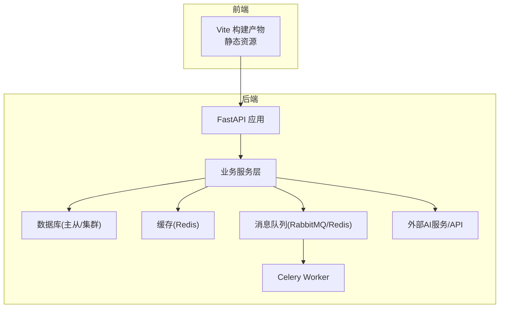
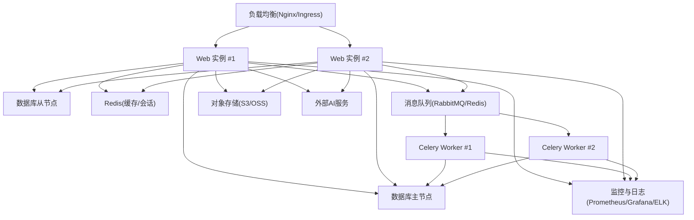
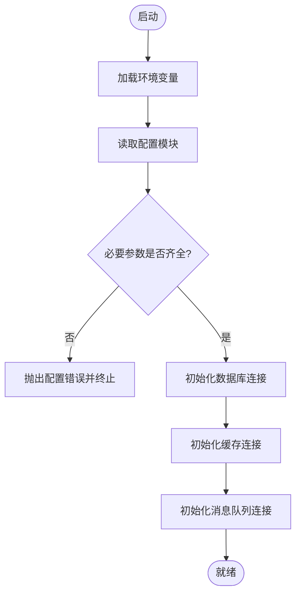
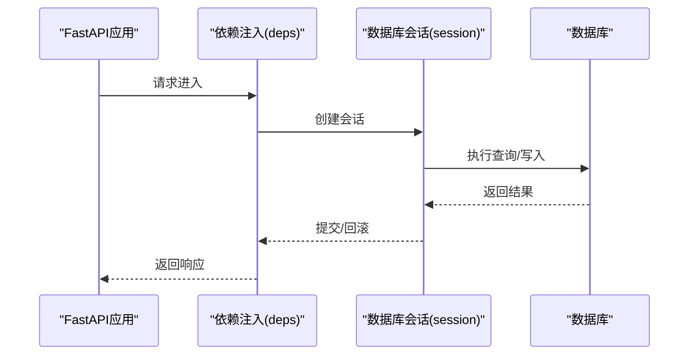
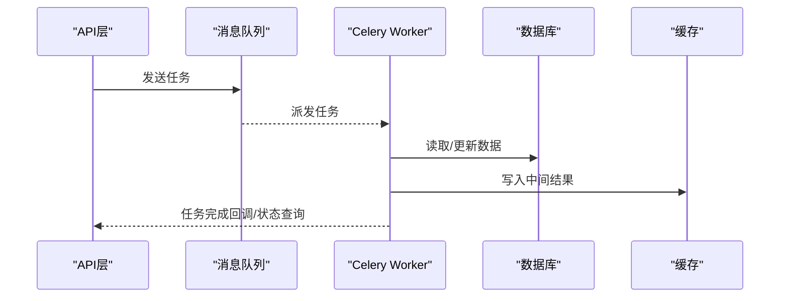
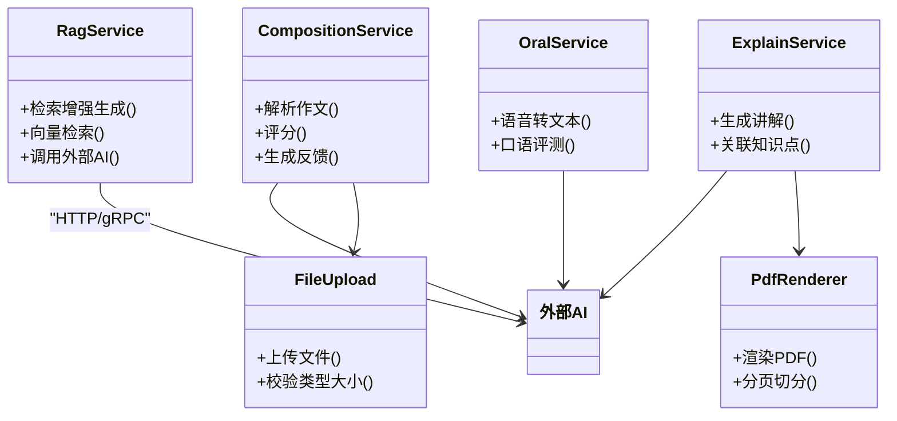
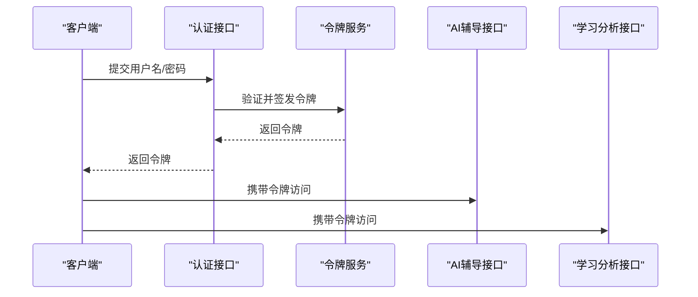
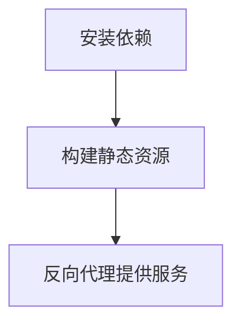
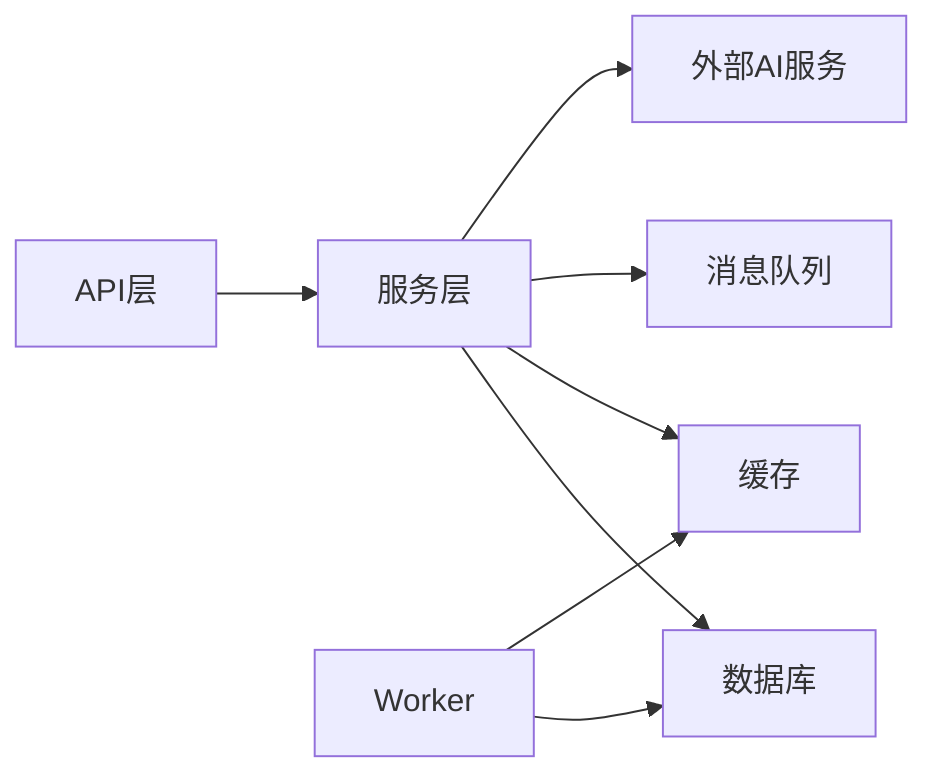

# 部署与运维

<cite>
**本文引用的文件**   
- [backend/app/core/config.py](file://backend/app/core/config.py)
- [backend/app/core/deps.py](file://backend/app/core/deps.py)
- [backend/app/db/base.py](file://backend/app/db/base.py)
- [backend/app/db/session.py](file://backend/app/db/session.py)
- [backend/alembic.ini](file://backend/alembic.ini)
- [backend/alembic/env.py](file://backend/alembic/env.py)
- [backend/app/tasks/celery_app.py](file://backend/app/tasks/celery_app.py)
- [backend/app/services/rag_service.py](file://backend/app/services/rag_service.py)
- [backend/app/api/v1/auth.py](file://backend/app/api/v1/auth.py)
- [backend/app/api/v1/ai_tutor.py](file://backend/app/api/v1/ai_tutor.py)
- [backend/app/api/v1/analytics.py](file://backend/app/api/v1/analytics.py)
- [backend/app/services/composition_service.py](file://backend/app/services/composition_service.py)
- [backend/app/services/explain_service.py](file://backend/app/services/explain_service.py)
- [backend/app/services/oral_service.py](file://backend/app/services/oral_service.py)
- [backend/app/services/file_upload.py](file://backend/app/services/file_upload.py)
- [backend/app/services/pdf_renderer.py](file://backend/app/services/pdf_renderer.py)
- [frontend/package.json](file://frontend/package.json)
- [frontend/vite.config.ts](file://frontend/vite.config.ts)
</cite>

## 目录
1. [简介](#简介)
2. [项目结构](#项目结构)
3. [核心组件](#核心组件)
4. [架构总览](#架构总览)
5. [详细组件分析](#详细组件分析)
6. [依赖关系分析](#依赖关系分析)
7. [性能考虑](#性能考虑)
8. [故障排查指南](#故障排查指南)
9. [结论](#结论)
10. [附录](#附录)

## 简介
本指南面向生产环境的AI助教系统，覆盖容器化部署、负载均衡、数据库集群、CI/CD流水线、自动化测试、灰度发布、监控告警、配置管理、性能调优、备份恢复与灾难恢复等关键运维主题。文档基于仓库现有后端（FastAPI + Alembic + Celery）与前端（Vite + React）工程结构进行说明，并提供可落地的架构图与流程图，帮助团队快速完成高可用、可观测、可扩展的生产部署。

## 项目结构
- 后端采用分层架构：API层、服务层、数据访问层、任务队列；使用Alembic进行数据库迁移；通过Celery执行异步任务。
- 前端为静态资源构建产物，由反向代理统一提供。
- 配置集中于环境变量与配置文件，支持多环境切换。

[本节未直接分析具体文件，故不附“章节来源”]

## 核心组件
- 配置中心与环境变量：集中管理数据库连接、缓存、消息队列、第三方AI服务密钥等。
- 数据库会话与迁移：统一会话生命周期管理，版本化迁移脚本。
- 任务队列：Celery应用定义与任务调度。
- 业务服务：RAG检索增强生成、作文处理、口语评测、PDF渲染、文件上传等。
- API路由：认证、AI辅导、学习分析等接口。

**章节来源**
- [backend/app/core/config.py](file://backend/app/core/config.py)
- [backend/app/db/session.py](file://backend/app/db/session.py)
- [backend/app/db/base.py](file://backend/app/db/base.py)
- [backend/alembic.ini](file://backend/alembic.ini)
- [backend/alembic/env.py](file://backend/alembic/env.py)
- [backend/app/tasks/celery_app.py](file://backend/app/tasks/celery_app.py)
- [backend/app/services/rag_service.py](file://backend/app/services/rag_service.py)
- [backend/app/services/composition_service.py](file://backend/app/services/composition_service.py)
- [backend/app/services/explain_service.py](file://backend/app/services/explain_service.py)
- [backend/app/services/oral_service.py](file://backend/app/services/oral_service.py)
- [backend/app/services/file_upload.py](file://backend/app/services/file_upload.py)
- [backend/app/services/pdf_renderer.py](file://backend/app/services/pdf_renderer.py)
- [backend/app/api/v1/auth.py](file://backend/app/api/v1/auth.py)
- [backend/app/api/v1/ai_tutor.py](file://backend/app/api/v1/ai_tutor.py)
- [backend/app/api/v1/analytics.py](file://backend/app/api/v1/analytics.py)

## 架构总览
生产环境推荐采用“无状态Web节点 + 独立Worker + 共享持久化”的架构模式，结合容器编排实现弹性伸缩与健康检查。

[本节为概念性架构图，未映射到具体源码文件，故不附“图表来源”]

## 详细组件分析

### 配置与环境管理
- 环境变量优先于配置文件，便于在容器与编排平台注入敏感信息。
- 建议将数据库URL、缓存地址、消息队列地址、第三方AI服务密钥等全部外置。
- 迁移配置集中在Alembic配置文件中，确保不同环境使用不同的目标库。

**章节来源**
- [backend/app/core/config.py](file://backend/app/core/config.py)
- [backend/alembic.ini](file://backend/alembic.ini)
- [backend/alembic/env.py](file://backend/alembic/env.py)

### 数据库与会话管理
- 统一会话生命周期，避免连接泄漏。
- 读写分离可通过不同连接字符串或会话工厂实现。
- 迁移工具用于版本控制与回滚。

**图表来源**
- [backend/app/db/session.py](file://backend/app/db/session.py)
- [backend/app/db/base.py](file://backend/app/db/base.py)
- [backend/app/core/deps.py](file://backend/app/core/deps.py)

**章节来源**
- [backend/app/db/session.py](file://backend/app/db/session.py)
- [backend/app/db/base.py](file://backend/app/db/base.py)
- [backend/app/core/deps.py](file://backend/app/core/deps.py)

### 任务队列与异步处理
- Celery应用负责接收来自API的任务，交由Worker执行耗时操作（如向量索引、分析聚合）。
- 建议使用独立的Broker与Result Backend，保证可靠性与可观测性。

**图表来源**
- [backend/app/tasks/celery_app.py](file://backend/app/tasks/celery_app.py)

**章节来源**
- [backend/app/tasks/celery_app.py](file://backend/app/tasks/celery_app.py)

### 业务服务与AI集成
- RAG服务负责检索增强生成，通常涉及向量检索与外部大模型调用。
- 作文、讲解、口语评测等服务封装了各自的外部API或内部算法。
- 文件上传与PDF渲染作为通用能力被多个服务复用。

**图表来源**
- [backend/app/services/rag_service.py](file://backend/app/services/rag_service.py)
- [backend/app/services/composition_service.py](file://backend/app/services/composition_service.py)
- [backend/app/services/explain_service.py](file://backend/app/services/explain_service.py)
- [backend/app/services/oral_service.py](file://backend/app/services/oral_service.py)
- [backend/app/services/file_upload.py](file://backend/app/services/file_upload.py)
- [backend/app/services/pdf_renderer.py](file://backend/app/services/pdf_renderer.py)

**章节来源**
- [backend/app/services/rag_service.py](file://backend/app/services/rag_service.py)
- [backend/app/services/composition_service.py](file://backend/app/services/composition_service.py)
- [backend/app/services/explain_service.py](file://backend/app/services/explain_service.py)
- [backend/app/services/oral_service.py](file://backend/app/services/oral_service.py)
- [backend/app/services/file_upload.py](file://backend/app/services/file_upload.py)
- [backend/app/services/pdf_renderer.py](file://backend/app/services/pdf_renderer.py)

### API路由与认证
- 认证接口负责用户登录与令牌签发，后续请求携带令牌访问受保护资源。
- AI辅导与分析接口依赖认证与权限校验。

**图表来源**
- [backend/app/api/v1/auth.py](file://backend/app/api/v1/auth.py)
- [backend/app/api/v1/ai_tutor.py](file://backend/app/api/v1/ai_tutor.py)
- [backend/app/api/v1/analytics.py](file://backend/app/api/v1/analytics.py)

**章节来源**
- [backend/app/api/v1/auth.py](file://backend/app/api/v1/auth.py)
- [backend/app/api/v1/ai_tutor.py](file://backend/app/api/v1/ai_tutor.py)
- [backend/app/api/v1/analytics.py](file://backend/app/api/v1/analytics.py)

### 前端构建与部署
- 使用包管理器安装依赖并构建静态资源。
- 构建产物由反向代理提供服务，注意跨域与静态资源缓存策略。

**章节来源**
- [frontend/package.json](file://frontend/package.json)
- [frontend/vite.config.ts](file://frontend/vite.config.ts)

## 依赖关系分析
- 后端依赖：数据库、缓存、消息队列、外部AI服务、对象存储。
- 前端依赖：构建工具链与运行时依赖。
- 组件耦合：API层依赖服务层，服务层依赖基础设施（DB/Cache/MQ/AI），任务层通过队列解耦。

[本节为概念性依赖图，未映射到具体源码文件，故不附“图表来源”]

## 性能考虑
- 数据库优化
  - 启用连接池与读写分离，合理设置最大连接数与超时。
  - 对热点查询建立索引，定期分析慢查询日志。
- 缓存策略
  - 热点数据入缓存，设置合理的TTL与失效策略。
  - 使用缓存穿透/雪崩防护（空值缓存、随机过期时间）。
- 异步任务调优
  - 根据CPU与IO特征调整Worker并发度与预取数量。
  - 任务幂等设计，失败重试与死信队列。
- AI服务优化
  - 批量请求与流式输出结合，降低延迟与带宽占用。
  - 引入本地缓存与降级策略，保障可用性。

[本节提供通用指导，未直接分析具体文件，故不附“章节来源”]

## 故障排查指南
- 常见问题定位
  - 配置缺失或错误：检查环境变量与配置文件加载顺序。
  - 数据库连接失败：核对连接串、网络连通性与权限。
  - 任务堆积：查看队列长度、Worker健康状态与日志。
  - AI服务超时：增加重试与熔断，记录下游指标。
- 日志与追踪
  - 统一结构化日志格式，包含请求ID、用户ID、耗时。
  - 接入分布式追踪，串联API→服务→DB/AI链路。
- 健康检查与自愈
  - 暴露健康检查端点，配合编排平台自动重启异常实例。

**章节来源**
- [backend/app/core/config.py](file://backend/app/core/config.py)
- [backend/app/db/session.py](file://backend/app/db/session.py)
- [backend/app/tasks/celery_app.py](file://backend/app/tasks/celery_app.py)

## 结论
通过容器化与编排平台，结合负载均衡、数据库集群、缓存与消息队列，可实现AI助教系统的高可用与弹性伸缩。完善的CI/CD、灰度发布、监控告警与备份恢复流程，将显著提升系统的稳定性与可维护性。持续的性能调优与故障演练是保障生产质量的关键。

[本节为总结性内容，未直接分析具体文件，故不附“章节来源”]

## 附录

### 容器化部署清单
- 镜像构建
  - 后端：基于轻量Python镜像，安装依赖，拷贝代码，暴露端口。
  - 前端：多阶段构建，仅打包静态资源。
- 运行参数
  - 通过环境变量注入数据库、缓存、消息队列与AI服务配置。
  - 限制CPU与内存，设置健康检查与探针。
- 编排示例要点
  - Deployment/StatefulSet分别承载无状态Web与有状态数据库。
  - Service与Ingress/Nginx对外暴露。
  - ConfigMap与Secret管理配置与密钥。

[本节为通用实践，未直接分析具体文件，故不附“章节来源”]

### 负载均衡配置要点
- 四层与七层负载均衡均可，推荐七层以支持HTTPS卸载与路径转发。
- 开启会话保持（如需）或采用无状态设计。
- 健康检查与优雅停机。

[本节为通用实践，未直接分析具体文件，故不附“章节来源”]

### 数据库集群设置
- 主从复制与只读副本，应用层按读写分离路由。
- 连接池与事务隔离级别调优。
- 备份策略：全量+增量，异地容灾。

[本节为通用实践，未直接分析具体文件，故不附“章节来源”]

### CI/CD流水线与灰度发布
- 流水线阶段
  - 拉取代码 → 依赖安装 → 单元测试 → 构建镜像 → 推送镜像 → 部署到预发 → 冒烟测试 → 灰度发布 → 全量发布。
- 灰度策略
  - 基于权重或用户分流的渐进放量，观察核心指标后逐步扩大。
- 自动化测试
  - 单元、集成、端到端测试并行执行，覆盖率阈值门禁。

[本节为通用实践，未直接分析具体文件，故不附“章节来源”]

### 监控与告警方案
- 应用性能监控
  - 采集QPS、延迟、错误率、GC/线程池指标。
- 数据库监控
  - 连接数、慢查询、锁等待、复制延迟。
- AI服务监控
  - 调用成功率、延迟分布、配额与限流。
- 日志收集分析
  - 统一采集、索引与检索，设置关键错误告警。

[本节为通用实践，未直接分析具体文件，故不附“章节来源”]

### 配置管理与密钥管理
- 环境变量优先级高于配置文件，敏感信息使用Secret管理。
- 配置文件版本控制，变更需评审与回滚预案。
- 多环境隔离（开发、测试、预发、生产）。

**章节来源**
- [backend/app/core/config.py](file://backend/app/core/config.py)
- [backend/alembic.ini](file://backend/alembic.ini)

### 备份恢复与灾难恢复
- 备份
  - 数据库定时全量与增量备份，对象存储快照。
- 恢复
  - 制定RTO/RPO目标，演练恢复流程。
- 灾难恢复
  - 多可用区部署，跨区域复制与流量切换。

[本节为通用实践，未直接分析具体文件，故不附“章节来源”]

### 运维自动化脚本与监控告警配置
- 自动化脚本
  - 一键部署、滚动升级、扩缩容、清理旧镜像与日志轮转。
- 告警规则
  - 基于阈值与异常检测，分级通知（短信/邮件/IM）。
- 巡检报告
  - 每日自动生成健康报告与容量趋势。

[本节为通用实践，未直接分析具体文件，故不附“章节来源”]