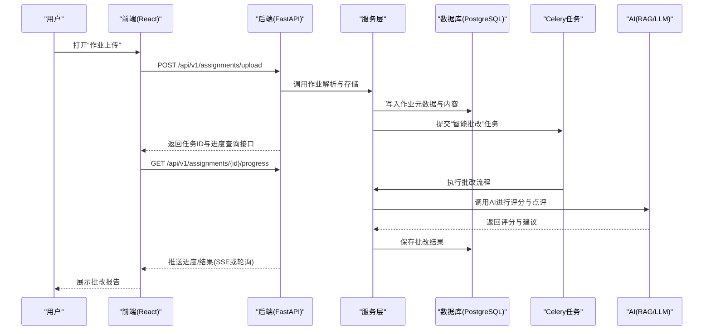
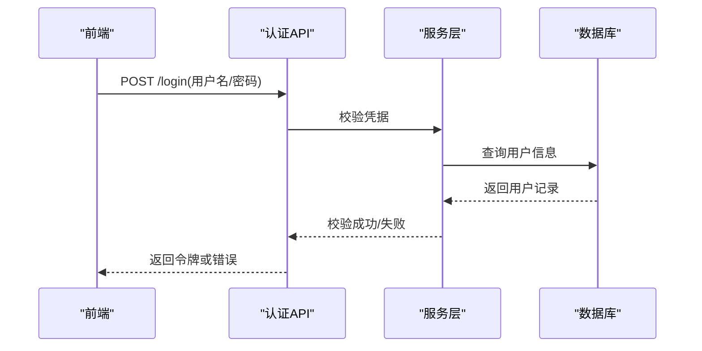
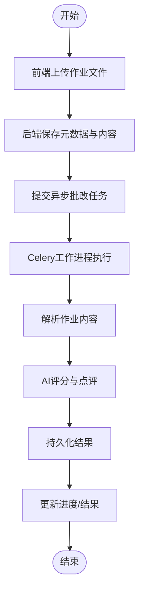
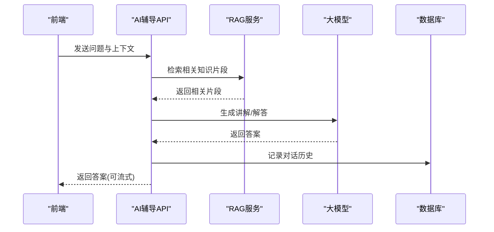
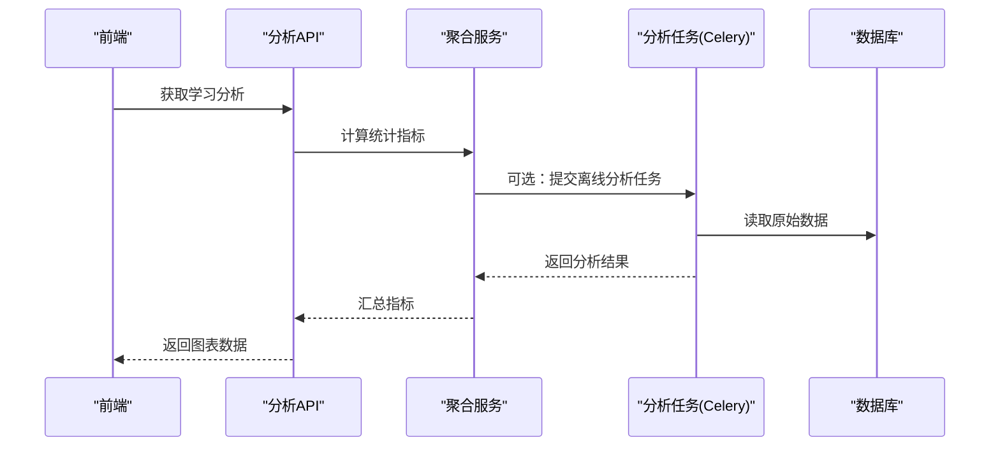
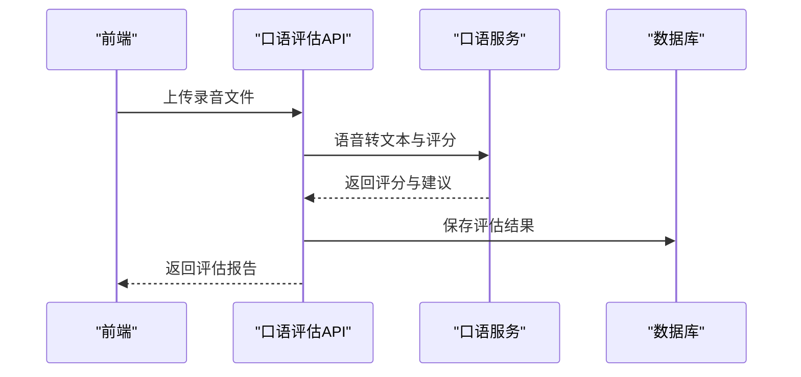
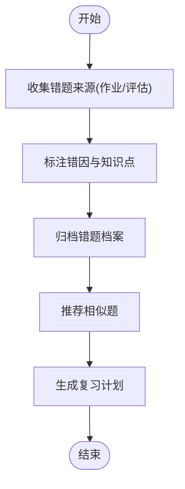
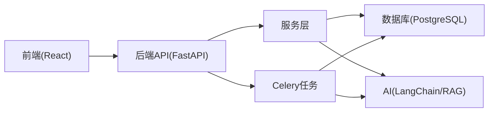

# 项目概述

<cite>
**本文引用的文件**   
- [backend/app/main.py](file://backend/app/main.py)
- [backend/app/core/config.py](file://backend/app/core/config.py)
- [backend/app/core/deps.py](file://backend/app/core/deps.py)
- [backend/app/db/base.py](file://backend/app/db/base.py)
- [backend/app/db/session.py](file://backend/app/db/session.py)
- [backend/app/api/v1/auth.py](file://backend/app/api/v1/auth.py)
- [backend/app/api/v1/assignments.py](file://backend/app/api/v1/assignments.py)
- [backend/app/api/v1/ai_tutor.py](file://backend/app/api/v1/ai_tutor.py)
- [backend/app/api/v1/analytics.py](file://backend/app/api/v1/analytics.py)
- [backend/app/api/v1/oral_assessments.py](file://backend/app/api/v1/oral_assessments.py)
- [backend/app/api/v1/error_questions.py](file://backend/app/api/v1/error_questions.py)
- [backend/app/services/ai_grader.py](file://backend/app/services/ai_grader.py)
- [backend/app/services/composition_service.py](file://backend/app/services/composition_service.py)
- [backend/app/services/explain_service.py](file://backend/app/services/explain_service.py)
- [backend/app/services/oral_service.py](file://backend/app/services/oral_service.py)
- [backend/app/services/rag_service.py](file://backend/app/services/rag_service.py)
- [backend/app/services/knowledge_tracker.py](file://backend/app/services/knowledge_tracker.py)
- [backend/app/services/file_upload.py](file://backend/app/services/file_upload.py)
- [backend/app/tasks/celery_app.py](file://backend/app/tasks/celery_app.py)
- [backend/app/tasks/analysis_tasks.py](file://backend/app/tasks/analysis_tasks.py)
- [backend/app/tasks/vector_tasks.py](file://backend/app/tasks/vector_tasks.py)
- [frontend/src/App.tsx](file://frontend/src/App.tsx)
- [frontend/src/main.tsx](file://frontend/src/main.tsx)
- [frontend/src/pages/Login/index.tsx](file://frontend/src/pages/Login/index.tsx)
- [frontend/src/pages/AssignmentManagement/UploadAssignment/index.tsx](file://frontend/src/pages/AssignmentManagement/UploadAssignment/index.tsx)
- [frontend/src/pages/Composition/index.tsx](file://frontend/src/pages/Composition/index.tsx)
- [frontend/src/pages/OralAssessment/index.tsx](file://frontend/src/pages/OralAssessment/index.tsx)
- [frontend/src/pages/LearningAnalytics/index.tsx](file://frontend/src/pages/LearningAnalytics/index.tsx)
- [frontend/src/services/api.ts](file://frontend/src/services/api.ts)
- [frontend/src/services/authService.ts](file://frontend/src/services/authService.ts)
- [frontend/src/services/assignmentService.ts](file://frontend/src/services/assignmentService.ts)
- [frontend/src/services/aiTutorService.ts](file://frontend/src/services/aiTutorService.ts)
- [frontend/src/services/analyticsService.ts](file://frontend/src/services/analyticsService.ts)
- [frontend/src/services/oralService.ts](file://frontend/src/services/oralService.ts)
- [frontend/src/services/errorQuestionService.ts](file://frontend/src/services/errorQuestionService.ts)
</cite>

## 目录
1. [简介](#简介)
2. [项目结构](#项目结构)
3. [核心组件](#核心组件)
4. [架构总览](#架构总览)
5. [详细组件分析](#详细组件分析)
6. [依赖关系分析](#依赖关系分析)
7. [性能考量](#性能考量)
8. [故障排查指南](#故障排查指南)
9. [结论](#结论)
10. [附录](#附录)

## 简介
本项目为“AI助教系统”，面向教育科技场景，提供智能作业批改、AI辅导助手、学习分析平台、口语评估与错题管理等核心能力。系统采用前后端分离的现代化架构：后端基于Python FastAPI构建REST API，使用PostgreSQL持久化数据，通过Celery执行异步任务；前端基于React与TypeScript，提供交互式教学体验。AI能力由LangChain驱动，结合RAG（检索增强生成）与向量检索，实现高质量、可解释的教学反馈与个性化辅导。

本概述既为初学者提供清晰的概念介绍，也为有经验的开发者给出足够的技术深度与架构图示，帮助快速理解系统设计与数据流向。

## 项目结构
仓库采用前后端分仓组织：
- backend：FastAPI应用、数据库模型、服务层、任务队列、配置与安全等
- frontend：React+TS前端页面、路由、状态与服务封装
- 根目录包含开发脚本与说明文档

```mermaid
graph TB
subgraph "前端"
FE_App["App.tsx"]
FE_Main["main.tsx"]
FE_Login["Login/index.tsx"]
FE_AssignUpload["AssignmentManagement/UploadAssignment/index.tsx"]
FE_Composition["Composition/index.tsx"]
FE_Oral["OralAssessment/index.tsx"]
FE_Analytics["LearningAnalytics/index.tsx"]
FE_API["services/api.ts"]
FE_Auth["services/authService.ts"]
FE_AssignSvc["services/assignmentService.ts"]
FE_AI["services/aiTutorService.ts"]
FE_AnalyticSvc["services/analyticsService.ts"]
FE_OralSvc["services/oralService.ts"]
FE_ErrorSvc["services/errorQuestionService.ts"]
end
subgraph "后端"
BE_Main["app/main.py"]
BE_Config["app/core/config.py"]
BE_Deps["app/core/deps.py"]
BE_DB_Base["app/db/base.py"]
BE_DB_Session["app/db/session.py"]
BE_API_Auth["api/v1/auth.py"]
BE_API_Assign["api/v1/assignments.py"]
BE_API_AI["api/v1/ai_tutor.py"]
BE_API_Analytics["api/v1/analytics.py"]
BE_API_Oral["api/v1/oral_assessments.py"]
BE_API_Error["api/v1/error_questions.py"]
BE_Svc_Grader["services/ai_grader.py"]
BE_Svc_Compose["services/composition_service.py"]
BE_Svc_Explain["services/explain_service.py"]
BE_Svc_Oral["services/oral_service.py"]
BE_Svc_RAG["services/rag_service.py"]
BE_Svc_KT["services/knowledge_tracker.py"]
BE_Svc_File["services/file_upload.py"]
BE_Tasks_Celery["tasks/celery_app.py"]
BE_Tasks_Analysis["tasks/analysis_tasks.py"]
BE_Tasks_Vector["tasks/vector_tasks.py"]
end
FE_App --> FE_Main
FE_App --> FE_Login
FE_App --> FE_AssignUpload
FE_App --> FE_Composition
FE_App --> FE_Oral
FE_App --> FE_Analytics
FE_App --> FE_API
FE_API --> FE_Auth
FE_API --> FE_AssignSvc
FE_API --> FE_AI
FE_API --> FE_AnalyticSvc
FE_API --> FE_OralSvc
FE_API --> FE_ErrorSvc
FE_Auth --> BE_API_Auth
FE_AssignSvc --> BE_API_Assign
FE_AI --> BE_API_AI
FE_AnalyticSvc --> BE_API_Analytics
FE_OralSvc --> BE_API_Oral
FE_ErrorSvc --> BE_API_Error
BE_Main --> BE_Config
BE_Main --> BE_Deps
BE_Main --> BE_DB_Base
BE_Main --> BE_DB_Session
BE_API_Auth --> BE_Svc_File
BE_API_Assign --> BE_Svc_Grader
BE_API_Assign --> BE_Svc_Compose
BE_API_AI --> BE_Svc_Explain
BE_API_AI --> BE_Svc_RAG
BE_API_Oral --> BE_Svc_Oral
BE_API_Analytics --> BE_Svc_KT
BE_API_Analytics --> BE_Tasks_Analysis
BE_Tasks_Analysis --> BE_Tasks_Vector
```

图表来源
- [backend/app/main.py](file://backend/app/main.py)
- [backend/app/core/config.py](file://backend/app/core/config.py)
- [backend/app/core/deps.py](file://backend/app/core/deps.py)
- [backend/app/db/base.py](file://backend/app/db/base.py)
- [backend/app/db/session.py](file://backend/app/db/session.py)
- [backend/app/api/v1/auth.py](file://backend/app/api/v1/auth.py)
- [backend/app/api/v1/assignments.py](file://backend/app/api/v1/assignments.py)
- [backend/app/api/v1/ai_tutor.py](file://backend/app/api/v1/ai_tutor.py)
- [backend/app/api/v1/analytics.py](file://backend/app/api/v1/analytics.py)
- [backend/app/api/v1/oral_assessments.py](file://backend/app/api/v1/oral_assessments.py)
- [backend/app/api/v1/error_questions.py](file://backend/app/api/v1/error_questions.py)
- [backend/app/services/ai_grader.py](file://backend/app/services/ai_grader.py)
- [backend/app/services/composition_service.py](file://backend/app/services/composition_service.py)
- [backend/app/services/explain_service.py](file://backend/app/services/explain_service.py)
- [backend/app/services/oral_service.py](file://backend/app/services/oral_service.py)
- [backend/app/services/rag_service.py](file://backend/app/services/rag_service.py)
- [backend/app/services/knowledge_tracker.py](file://backend/app/services/knowledge_tracker.py)
- [backend/app/services/file_upload.py](file://backend/app/services/file_upload.py)
- [backend/app/tasks/celery_app.py](file://backend/app/tasks/celery_app.py)
- [backend/app/tasks/analysis_tasks.py](file://backend/app/tasks/analysis_tasks.py)
- [backend/app/tasks/vector_tasks.py](file://backend/app/tasks/vector_tasks.py)
- [frontend/src/App.tsx](file://frontend/src/App.tsx)
- [frontend/src/main.tsx](file://frontend/src/main.tsx)
- [frontend/src/pages/Login/index.tsx](file://frontend/src/pages/Login/index.tsx)
- [frontend/src/pages/AssignmentManagement/UploadAssignment/index.tsx](file://frontend/src/pages/AssignmentManagement/UploadAssignment/index.tsx)
- [frontend/src/pages/Composition/index.tsx](file://frontend/src/pages/Composition/index.tsx)
- [frontend/src/pages/OralAssessment/index.tsx](file://frontend/src/pages/OralAssessment/index.tsx)
- [frontend/src/pages/LearningAnalytics/index.tsx](file://frontend/src/pages/LearningAnalytics/index.tsx)
- [frontend/src/services/api.ts](file://frontend/src/services/api.ts)
- [frontend/src/services/authService.ts](file://frontend/src/services/authService.ts)
- [frontend/src/services/assignmentService.ts](file://frontend/src/services/assignmentService.ts)
- [frontend/src/services/aiTutorService.ts](file://frontend/src/services/aiTutorService.ts)
- [frontend/src/services/analyticsService.ts](file://frontend/src/services/analyticsService.ts)
- [frontend/src/services/oralService.ts](file://frontend/src/services/oralService.ts)
- [frontend/src/services/errorQuestionService.ts](file://frontend/src/services/errorQuestionService.ts)

章节来源
- [backend/app/main.py](file://backend/app/main.py)
- [frontend/src/App.tsx](file://frontend/src/App.tsx)
- [frontend/src/main.tsx](file://frontend/src/main.tsx)

## 核心组件
- 认证与授权：提供登录鉴权、会话管理，保护受保护路由与API访问
- 作业管理：支持上传、解析、智能批改与结果展示
- AI辅导助手：基于LangChain与RAG的智能问答与讲解生成
- 学习分析：聚合作业、错题、知识点掌握度，输出可视化看板
- 口语评估：语音转文本、发音与流利度评分与反馈
- 错题管理：错题采集、归因分析与相似题推荐
- 异步任务：使用Celery处理耗时任务（如批量分析、向量化入库）

章节来源
- [backend/app/api/v1/auth.py](file://backend/app/api/v1/auth.py)
- [backend/app/api/v1/assignments.py](file://backend/app/api/v1/assignments.py)
- [backend/app/api/v1/ai_tutor.py](file://backend/app/api/v1/ai_tutor.py)
- [backend/app/api/v1/analytics.py](file://backend/app/api/v1/analytics.py)
- [backend/app/api/v1/oral_assessments.py](file://backend/app/api/v1/oral_assessments.py)
- [backend/app/api/v1/error_questions.py](file://backend/app/api/v1/error_questions.py)
- [backend/app/services/ai_grader.py](file://backend/app/services/ai_grader.py)
- [backend/app/services/composition_service.py](file://backend/app/services/composition_service.py)
- [backend/app/services/explain_service.py](file://backend/app/services/explain_service.py)
- [backend/app/services/oral_service.py](file://backend/app/services/oral_service.py)
- [backend/app/services/rag_service.py](file://backend/app/services/rag_service.py)
- [backend/app/services/knowledge_tracker.py](file://backend/app/services/knowledge_tracker.py)
- [backend/app/tasks/celery_app.py](file://backend/app/tasks/celery_app.py)
- [backend/app/tasks/analysis_tasks.py](file://backend/app/tasks/analysis_tasks.py)
- [backend/app/tasks/vector_tasks.py](file://backend/app/tasks/vector_tasks.py)

## 架构总览
系统采用前后端分离架构：
- 前端：React+TS，通过HTTP/SSE与后端交互，渲染教学界面与可视化看板
- 后端：FastAPI提供REST API，依赖注入与中间件完成鉴权与请求校验，服务层编排业务逻辑，数据库通过SQLAlchemy连接PostgreSQL
- AI能力：LangChain驱动对话与生成，RAG从知识库检索上下文，提升回答质量与可解释性
- 异步任务：Celery消费消息队列，执行分析、向量化等耗时任务，避免阻塞主线程

图表来源
- [backend/app/api/v1/assignments.py](file://backend/app/api/v1/assignments.py)
- [backend/app/services/ai_grader.py](file://backend/app/services/ai_grader.py)
- [backend/app/tasks/analysis_tasks.py](file://backend/app/tasks/analysis_tasks.py)
- [backend/app/services/rag_service.py](file://backend/app/services/rag_service.py)
- [backend/app/db/session.py](file://backend/app/db/session.py)
- [frontend/src/services/assignmentService.ts](file://frontend/src/services/assignmentService.ts)

## 详细组件分析

### 认证与授权
- 功能要点：登录、令牌签发与校验、受保护路由拦截
- 关键路径：前端登录页发起认证请求，后端验证凭据并返回令牌；后续请求携带令牌访问受保护资源
- 安全建议：令牌过期刷新、最小权限原则、敏感配置外置

图表来源
- [backend/app/api/v1/auth.py](file://backend/app/api/v1/auth.py)
- [frontend/src/pages/Login/index.tsx](file://frontend/src/pages/Login/index.tsx)
- [frontend/src/services/authService.ts](file://frontend/src/services/authService.ts)

章节来源
- [backend/app/api/v1/auth.py](file://backend/app/api/v1/auth.py)
- [frontend/src/pages/Login/index.tsx](file://frontend/src/pages/Login/index.tsx)
- [frontend/src/services/authService.ts](file://frontend/src/services/authService.ts)

### 作业管理与智能批改
- 功能要点：作业上传、解析、异步批改、结果展示
- 关键路径：前端上传作业文件，后端落库并触发Celery任务；任务内调用AI服务进行评分与点评，最终写回数据库并通过进度接口返回
- 优化点：大文件分片上传、增量解析、批处理与重试机制

图表来源
- [backend/app/api/v1/assignments.py](file://backend/app/api/v1/assignments.py)
- [backend/app/services/ai_grader.py](file://backend/app/services/ai_grader.py)
- [backend/app/tasks/analysis_tasks.py](file://backend/app/tasks/analysis_tasks.py)
- [frontend/src/pages/AssignmentManagement/UploadAssignment/index.tsx](file://frontend/src/pages/AssignmentManagement/UploadAssignment/index.tsx)
- [frontend/src/services/assignmentService.ts](file://frontend/src/services/assignmentService.ts)

章节来源
- [backend/app/api/v1/assignments.py](file://backend/app/api/v1/assignments.py)
- [backend/app/services/ai_grader.py](file://backend/app/services/ai_grader.py)
- [backend/app/tasks/analysis_tasks.py](file://backend/app/tasks/analysis_tasks.py)
- [frontend/src/pages/AssignmentManagement/UploadAssignment/index.tsx](file://frontend/src/pages/AssignmentManagement/UploadAssignment/index.tsx)
- [frontend/src/services/assignmentService.ts](file://frontend/src/services/assignmentService.ts)

### AI辅导助手
- 功能要点：基于LangChain的对话式辅导，结合RAG检索知识片段，生成个性化讲解
- 关键路径：前端发起提问，后端组装提示词与检索上下文，调用LLM生成答案，必要时流式返回
- 扩展点：多工具编排、记忆与上下文窗口管理、安全过滤

图表来源
- [backend/app/api/v1/ai_tutor.py](file://backend/app/api/v1/ai_tutor.py)
- [backend/app/services/explain_service.py](file://backend/app/services/explain_service.py)
- [backend/app/services/rag_service.py](file://backend/app/services/rag_service.py)
- [frontend/src/services/aiTutorService.ts](file://frontend/src/services/aiTutorService.ts)

章节来源
- [backend/app/api/v1/ai_tutor.py](file://backend/app/api/v1/ai_tutor.py)
- [backend/app/services/explain_service.py](file://backend/app/services/explain_service.py)
- [backend/app/services/rag_service.py](file://backend/app/services/rag_service.py)
- [frontend/src/services/aiTutorService.ts](file://frontend/src/services/aiTutorService.ts)

### 学习分析平台
- 功能要点：聚合作业成绩、错题分布、知识点热力图，生成学生看板
- 关键路径：前端拉取分析数据，后端聚合指标，必要时触发异步分析任务
- 可视化：柱状图、折线图、热力图等

图表来源
- [backend/app/api/v1/analytics.py](file://backend/app/api/v1/analytics.py)
- [backend/app/tasks/analysis_tasks.py](file://backend/app/tasks/analysis_tasks.py)
- [frontend/src/pages/LearningAnalytics/index.tsx](file://frontend/src/pages/LearningAnalytics/index.tsx)
- [frontend/src/services/analyticsService.ts](file://frontend/src/services/analyticsService.ts)

章节来源
- [backend/app/api/v1/analytics.py](file://backend/app/api/v1/analytics.py)
- [backend/app/tasks/analysis_tasks.py](file://backend/app/tasks/analysis_tasks.py)
- [frontend/src/pages/LearningAnalytics/index.tsx](file://frontend/src/pages/LearningAnalytics/index.tsx)
- [frontend/src/services/analyticsService.ts](file://frontend/src/services/analyticsService.ts)

### 口语评估
- 功能要点：录音上传、语音转文本、发音准确度与流利度评分，生成改进建议
- 关键路径：前端录制音频并上传，后端调用语音处理与评分服务，返回结构化反馈
- 用户体验：实时进度条、分段反馈、回放对比

图表来源
- [backend/app/api/v1/oral_assessments.py](file://backend/app/api/v1/oral_assessments.py)
- [backend/app/services/oral_service.py](file://backend/app/services/oral_service.py)
- [frontend/src/pages/OralAssessment/index.tsx](file://frontend/src/pages/OralAssessment/index.tsx)
- [frontend/src/services/oralService.ts](file://frontend/src/services/oralService.ts)

章节来源
- [backend/app/api/v1/oral_assessments.py](file://backend/app/api/v1/oral_assessments.py)
- [backend/app/services/oral_service.py](file://backend/app/services/oral_service.py)
- [frontend/src/pages/OralAssessment/index.tsx](file://frontend/src/pages/OralAssessment/index.tsx)
- [frontend/src/services/oralService.ts](file://frontend/src/services/oralService.ts)

### 错题管理
- 功能要点：错题采集、错因标注、相似题推荐、复习计划
- 关键路径：从作业与评估结果中抽取错题，建立错题档案，基于知识标签匹配相似题
- 价值：精准定位薄弱点，提升复习效率

图表来源
- [backend/app/api/v1/error_questions.py](file://backend/app/api/v1/error_questions.py)
- [backend/app/services/knowledge_tracker.py](file://backend/app/services/knowledge_tracker.py)
- [frontend/src/services/errorQuestionService.ts](file://frontend/src/services/errorQuestionService.ts)

章节来源
- [backend/app/api/v1/error_questions.py](file://backend/app/api/v1/error_questions.py)
- [backend/app/services/knowledge_tracker.py](file://backend/app/services/knowledge_tracker.py)
- [frontend/src/services/errorQuestionService.ts](file://frontend/src/services/errorQuestionService.ts)

### 作文批改
- 功能要点：作文内容解析、结构与语言质量评估、修改建议
- 关键路径：前端提交作文，后端调用作文服务进行多维度评分与点评
- 适用场景：语文/英语写作训练与反馈

章节来源
- [backend/app/services/composition_service.py](file://backend/app/services/composition_service.py)
- [frontend/src/pages/Composition/index.tsx](file://frontend/src/pages/Composition/index.tsx)

## 依赖关系分析
- 模块耦合：API层薄依赖服务层，服务层组合AI与数据库操作，任务层解耦耗时逻辑
- 外部依赖：PostgreSQL用于持久化，Celery用于异步任务，LangChain用于AI编排与RAG
- 潜在风险：AI服务可用性、向量检索延迟、并发写入冲突
- 缓解策略：超时与重试、缓存热点数据、读写分离与索引优化

图表来源
- [backend/app/main.py](file://backend/app/main.py)
- [backend/app/core/deps.py](file://backend/app/core/deps.py)
- [backend/app/db/session.py](file://backend/app/db/session.py)
- [backend/app/tasks/celery_app.py](file://backend/app/tasks/celery_app.py)
- [backend/app/services/rag_service.py](file://backend/app/services/rag_service.py)

章节来源
- [backend/app/main.py](file://backend/app/main.py)
- [backend/app/core/deps.py](file://backend/app/core/deps.py)
- [backend/app/db/session.py](file://backend/app/db/session.py)
- [backend/app/tasks/celery_app.py](file://backend/app/tasks/celery_app.py)
- [backend/app/services/rag_service.py](file://backend/app/services/rag_service.py)

## 性能考量
- 异步化：将AI评分、分析聚合、向量化等耗时操作放入Celery，避免阻塞请求
- 缓存：对热点知识与题目解析结果做缓存，降低重复计算
- 分页与懒加载：前端列表与图表按需加载，减少首屏压力
- 数据库优化：合理索引、批量写入、事务边界控制
- AI推理：批处理请求、流式响应、降级策略（当AI不可用时返回缓存或简化结果）

## 故障排查指南
- 常见问题
  - 登录失败：检查凭据、令牌有效期、跨域配置
  - 作业上传失败：确认文件大小限制、网络超时、存储路径权限
  - 智能批改无结果：查看Celery日志、任务状态、AI服务健康检查
  - 分析数据不一致：核对聚合任务是否执行成功、数据源完整性
- 调试建议
  - 启用详细日志与追踪ID，关联前后端请求
  - 使用本地开发脚本启动前后端与任务队列，复现问题
  - 针对AI服务增加熔断与回退逻辑，保障可用性

章节来源
- [backend/app/tasks/celery_app.py](file://backend/app/tasks/celery_app.py)
- [backend/app/tasks/analysis_tasks.py](file://backend/app/tasks/analysis_tasks.py)
- [backend/app/services/file_upload.py](file://backend/app/services/file_upload.py)
- [frontend/src/services/api.ts](file://frontend/src/services/api.ts)

## 结论
AI助教系统以现代前后端分离架构为基础，融合LangChain与RAG的AI能力，构建了覆盖作业批改、辅导答疑、学习分析与口语评估的一体化教学平台。通过Celery异步任务与PostgreSQL持久化，系统在可扩展性与稳定性方面具备良好基础。未来可在多模态输入、个性化学习路径与更丰富的可视化分析上持续演进。

## 附录
- 技术栈
  - 后端：Python、FastAPI、SQLAlchemy、Alembic、Celery、LangChain
  - 前端：React、TypeScript、Vite
  - 数据库：PostgreSQL
  - 其他：RAG检索、向量存储、SSE/HTTP长连接
- 术语
  - RAG：检索增强生成，结合知识库检索与大模型生成
  - Celery：分布式任务队列，用于异步与定时任务
  - SSE：服务器发送事件，用于服务端主动推送数据到前端